# RDRASpec Phase2 共通コンテキスト

以下は本Phaseの全タスクで共有する背景知識です。
各タスクではこの情報を前提として、指定された出力を行ってください。
（これらのファイルを個別に読み込む必要はありません）

---

## RDRAナレッジ
（元ファイル: RDRA_Knowledge/1_RDRA/RDRA.md）

```
# RDRA構造の説明
- 「アクター」：システムに関わる人の役割を表す
- 「アクター群」：同じような役割を持つ「アクター」をまとめ、組織の役割を示す場合もある
- 「外部システム」：システムと連携する外部のシステムを表す
- 「外部システム群」：同じような関係を持つ「外部システム」をまとめる
- 「コンテキスト」：システムを表すモデル「情報」「状態モデル」「条件」「バリエーション」をまとめる
- 「情報」：システムが扱うビジネス上の情報を表す ビジネス上管理されているID単位に存在する
- 「状態」：情報の変化を状態として扱い、ビジネス上管理する対象となる 状態を遷移させながらビジネスが進む
- 「業務」：最上位の会社の機能（マーケティング、販売や在庫管理...） BUCを構成要素に持つ
- 「BUC」：業務の価値を実現する単位で、業務フローの単位になる 同じ業務内でも関わるアクターや外部システムの違いでBUCが分かれる
- 「アクティビティ」：意味をもったまとまった一つの作業 仕事で関りのあるものを関連させる
- 「UC」：システムを使ってまとまった一つの意味をもつ作業 システムとの接点となり関りのあるものを関連させる
- 「画面」：アクターとシステムとのインターフェースになる
- 「イベント」：外部システムとのインターフェースになる
- 「タイマー」ビジネス上の時間的な区切りを表す　２５日締め　月末　

# モデル間のつながりの規則
- 「業務」は複数の「BUC」を配下にもつ
- 「BUC」は複数の「アクティビティ」を配下にもつ
- 「アクティビティ」(仕事)を行う「アクター」がつながる
- 「アクティビティ」(仕事)でシステムを使う場合は「UC」につながる
- 「UC」は情報を操作する
- 「アクター」は画面を使ってUCを操作する
- 「外部システム」は「イベント」で「UC」と連携する
- 「UC」が定時に活動する場合に「タイマー」につながる
- 「情報」は「情報」とつながることで構造化する
- 「状態モデル」は複数の「状態」を持つ
- 「UC」が「状態」を遷移させる
- 状態遷移は「状態モデル」内で「状態」を変える
- 「コンテキスト」は「情報」、「状態モデル」、「条件」、「バリエーション」を配下に複数持つ
- 「コンテキスト」内の構成要素は同一のIDで管理される
- 「条件」は「バリエーション」と「状態モデル」の組合せで出来ている
- オブジェクトは必ず対応するメタモデルが存在し、オブジェクトのつながりはメタモデル間のつながりの規則に従う

# 定義内容は各モデルのオブジェクトとして定義する
以下に例を示す
「会員」：モデルがアクター、オブジェクトが「会員」になる
「受注」：モデルが情報、オブジェクトが「受注」になる
「受注を登録する」：モデルがUC、オブジェクトが「受注を登録する」になる
```

---

## RDRAGraph
（元ファイル: RDRA_Knowledge/1_RDRA/RDRAGraph.md）

```
# 表形式から関連データへの変換
表形式のRDRASheetからRDRAGraphで表示できる関連データへ変換する

## 関連データの構造
１行目と２行目以降でフォーマットが変わります
### １行目のフォーマット
１カラムでシステム名を表します
### ２行目以降のフォーマット
４カラムから出来ています
A：関係：「#child」「#edge」「#comment」「#arrow」「#stereotype」「#attribute」
B：モデル1：モデル名を表し、右のリストから表す「業務」「BUC」「アクティビティ」「UC」「情報」「状態モデル」「状態」「アクター群」「アクター」「外部システム群」「外部システム」「コンテキスト」「条件」「バリエーション」
C：モデル2：モデル名を表し、右のリストから表す「BUC」「アクティビティ」「UC」「情報」「状態モデル」「状態」「アクター」「外部システム」「条件」「バリエーション」「説明」「値」
D：オブジェクト同士の関連を表す結合された文字列（オブジェクト1@@オブジェクト2//オブジェクト1@@オブジェクト2//～）
#### モデル1とモデル2
RDRASheetのカラム名がモデルになる
#### オブジェクト同士の関連を表す結合された文字列
RDRASheetで定義された１行の定義から複数の関連を作り出し関連データとする
複数のオブジェクト同士の関連を一つの文字列として表現している
##### 文字列の結合ルール
オブジェクト1：モデル1に対応したオブジェクト名
オブジェクト2：モデル2に対応したオブジェクト名
@@：オブジェクト1と2を分離する文字
//：オブジェクトの関連を分離する文字
### 関連データの行はモデル1とモデル2の組合せで行をユニークにする
モデル１とモデル2のペアが同じ場合は「オブジェクト1@@オブジェクト2」のペアを「//」で区切って一つの文字列にして、
モデルの組合せ毎に複数の「オブジェクト1@@オブジェクト2//オブジェクト1@@オブジェクト2~」」をつけてください

## 関連データの例　（関連/モデル1/モデル2/オブジェクト1@@オブジェクト2//オブジェクト1@@オブジェクト2~）
図書館管理システム
#child	業務	BUC	貸出・返却@@貸出//貸出・返却@@Web予約//貸出・返却@@返却//会員管理@@会員登録//会員管理@@期限管理//蔵書管理@@棚卸
#edge	アクティビティ	UC	蔵書を貸出す@@蔵書の貸出を登録する//貸出予約@@貸出本の予約・取消をする//予約図書準備@@予約図書一覧を出力する//予約図書準備@@予約図書を取り置く//予約図書を受け取る@@取置図書を消し込む//予約図書を受け取る@@蔵書の貸出を登録する//貸出図書を返却する@@貸出図書の返却を登録する//会員新規登録@@会員IDを発行する//会員の確認@@会員カードの発行（再）する//会員の確認@@会員を照会する//会員の更新@@会員情報を更新する//貸出期限確認@@貸出期限を確認する//貸出期限確認@@取置期限を確認する//取置図書の返却@@取置を解消する//棚卸を行う@@棚卸登録//新規書籍受け入れ@@蔵書を登録する
#arrow	アクティビティ	アクティビティ	書架から本を探す@@蔵書を貸出す//貸出予約@@予約図書準備//予約図書準備@@予約図書を受け取る//貸出図書を返却する@@返却図書を書架に返す//会員新規登録@@会員の確認//貸出期限確認@@取置図書の返却//棚卸を行う@@書籍発注リストの作成
#comment	アクティビティ	説明	棚卸を行う@@図書館職員が棚を見ながら棚卸を行う//書籍発注リストの作成@@司書は書籍発注リストを手動で作成する//書籍補充発注@@司書は書籍発注リストを元に書籍通販システムの画面で発注する//新規書籍受け入れ@@受け入れた書籍を検品する
#attribute	情報	属性	会員@@会員ID、会員名、入会日
#stereotype	状態	Stereotype	1.start@@start//1.stop@@stop//2.start@@start//3.start@@start//3.stop@@stop

## 「アクター」シートから関連データの２行目以降の変換
### カラムの並び
アクター群/アクター/説明
### 関連データの変換
#child	アクター群	アクター
#comment	アクター	説明

## 「外部システム」シートから関連データの２行目以降の変換
### カラムの並び
外部システム群/外部システム/説明
### 関連データの変換
#child	外部システム群	外部システム
#comment	外部システム	説明

## 階層構造
- 空白セルは一つ上のセルの値を引き継ぐ
- 同じカラムで上下に同じ場合は親の値と見なせる
### シート別の階層構造 シート：親/子
- アクター：アクター群/アクター
- 外部システム：外部システム群/外部システム
- 情報：コンテキスト/情報
- 状態：コンテキスト/状態、遷移先状態
- 条件：コンテキスト/条件
- バリエーション：コンテキスト/バリエーション

## 「BUC」シートから関連データの２行目以降の変換

### カラムの並び
業務/BUC/先/アクティビティ/次/UC/関連モデル1/関連オブジェクト1/関連モデル2/関連オブジェクト2/説明
### 関連データの変換
#child	業務	BUC	オブジェクト1@@オブジェクト2//~
#child	BUC	アクティビティ	オブジェクト1@@オブジェクト2//~
#edge	アクティビティ	アクティビティ	オブジェクト1@@オブジェクト2//~
#edge	アクティビティ	UC	オブジェクト1@@オブジェクト2//~
#edge	アクティビティ	画面	オブジェクト1@@オブジェクト2//~
#edge	アクティビティ	アクター	オブジェクト1@@オブジェクト2//~
#edge	アクティビティ	情報	オブジェクト1@@オブジェクト2//~
#edge	アクティビティ	タイマー	オブジェクト1@@オブジェクト2//~
#comment	アクティビティ	説明	オブジェクト1@@オブジェクト2//~
#edge	UC	画面	オブジェクト1@@オブジェクト2//~
#edge	UC	イベント	オブジェクト1@@オブジェクト2//~
#edge	UC	情報	オブジェクト1@@オブジェクト2//~
#edge	UC	条件	オブジェクト1@@オブジェクト2//~
#edge	UC	タイマー	オブジェクト1@@オブジェクト2//~
#comment	UC	説明	オブジェクト1@@オブジェクト2//~
#edge	画面	アクター	オブジェクト1@@オブジェクト2//~
#edge	画面	外部システム	オブジェクト1@@オブジェクト2//~
#edge	イベント	アクター	オブジェクト1@@オブジェクト2//~
#edge	アクター	情報	オブジェクト1@@オブジェクト2//~
#edge	イベント	外部システム	オブジェクト1@@オブジェクト2//~

## 「情報」シートから関連データの２行目以降の変換
### カラムの並び
コンテキスト/情報/属性/関連情報/状態モデル/バリエーション/説明
### 関連データの変換
#child	コンテキスト	情報	オブジェクト1@@オブジェクト2//~
#attribute	情報	属性	オブジェクト1@@オブジェクト2//~
#edge	情報	情報	オブジェクト1@@オブジェクト2//~
#edge	情報	状態モデル	オブジェクト1@@オブジェクト2//~
#edge	情報	バリエーション	オブジェクト1@@オブジェクト2//~
#comment	情報	説明	オブジェクト1@@オブジェクト2//~

## 「状態」シートから関連データの２行目以降の変換
### カラムの並び
コンテキスト/状態モデル/状態/遷移UC/遷移先状態/状態モデル・状態の説明
・遷移UCは「UC」
・遷移先状態は「状態」
・状態モデル・状態の説明は「説明」
### 関連データの変換
#child	コンテキスト	状態モデル	オブジェクト1@@オブジェクト2//~
#child	状態モデル	状態	オブジェクト1@@オブジェクト2//~
#arrow	状態	UC	オブジェクト1@@オブジェクト2//~
#arrow	UC	状態	オブジェクト1@@オブジェクト2//~
#arrow	状態	状態	オブジェクト1@@オブジェクト2//~
#comment	状態	説明	オブジェクト1@@オブジェクト2//~
#stereotype	状態	Stereotype	オブジェクト1@@オブジェクト2//~
#comment	状態モデル	説明	オブジェクト1@@オブジェクト2//~

## 「条件」シートから関連データの２行目以降の変換
### カラムの並び
コンテキスト/条件/条件の説明/バリエーション/状態モデル
### 関連データの変換
#child	コンテキスト	条件	オブジェクト1@@オブジェクト2//~
#edge	条件	バリエーション	オブジェクト1@@オブジェクト2//~
#edge	条件	状態モデル	オブジェクト1@@オブジェクト2//~
#comment	条件	説明	オブジェクト1@@オブジェクト2//~

## 「バリエーション」シートから関連データの２行目以降の変換
### カラムの並び
コンテキスト/バリエーション/値/説明
### 関連データの変換
#child	コンテキスト	バリエーション	オブジェクト1@@オブジェクト2//~
#attribute	バリエーション	値	オブジェクト1@@オブジェクト2//~
#comment	バリエーション	説明	オブジェクト1@@オブジェクト2//~
```

---

## 関連データ
（元ファイル: 1_RDRA/関連データ.txt）

```
訪問介護システム
#child	アクター群	アクター	介護会員組織@@介護会員//訪問介護事業所@@サービススタッフ//訪問介護事業所@@事業所管理者//訪問介護事業所@@管理事業所//訪問介護事業所@@事務スタッフ
#child	外部システム群	外部システム	請求・決済システム@@介護保険請求システム//請求・決済システム@@決済代行システム//労務管理システム@@給与計算システム//行政連携システム@@介護保険システム//通知システム@@メール配信システム//通知システム@@SMS配信システム//地図・ルート検索@@地図サービス
#child	コンテキスト	バリエーション	施設管理@@介護施設区分//スタッフ管理@@サービススタッフ勤務形態//会員管理@@介護会員状況//スタッフ管理@@サービススタッフスキル//施設管理@@事業所種別//スケジュール管理@@サービス種別//費用管理@@請求状態//会員管理@@介護会員状況分類//スタッフ管理@@働き方分類//スタッフ管理@@スキル分類
#child	状態モデル	状態	介護会員@@1.申込受付中//介護会員@@1.start//介護会員@@1.申込受付中//介護会員@@1.サービス提供中//介護会員@@1.サービス提供中//介護会員@@1.休止中//介護会員@@1.サービス提供中//介護会員@@1.契約終了//介護会員@@1.休止中//介護会員@@1.サービス提供中//介護会員@@1.休止中//介護会員@@1.契約終了//介護会員@@1.契約終了//介護会員@@1.end//訪問介護スケジュール@@2.計画中//訪問介護スケジュール@@2.start//訪問介護スケジュール@@2.計画中//訪問介護スケジュール@@2.確定済//訪問介護スケジュール@@2.計画中//訪問介護スケジュール@@2.キャンセル//訪問介護スケジュール@@2.確定済//訪問介護スケジュール@@2.実施中//訪問介護スケジュール@@2.確定済//訪問介護スケジュール@@2.キャンセル//訪問介護スケジュール@@2.実施中//訪問介護スケジュール@@2.完了//訪問介護スケジュール@@2.完了//訪問介護スケジュール@@2.end//訪問介護スケジュール@@2.キャンセル//訪問介護スケジュール@@2.end//訪問介護実施記録@@3.未記録//訪問介護実施記録@@3.start//訪問介護実施記録@@3.未記録//訪問介護実施記録@@3.記録中//訪問介護実施記録@@3.記録中//訪問介護実施記録@@3.承認待ち//訪問介護実施記録@@3.承認待ち//訪問介護実施記録@@3.承認済//訪問介護実施記録@@3.承認待ち//訪問介護実施記録@@3.記録中//訪問介護実施記録@@3.承認済//訪問介護実施記録@@3.end//介護費用請求@@4.未請求//介護費用請求@@4.start//介護費用請求@@4.未請求//介護費用請求@@4.請求済//介護費用請求@@4.請求済//介護費用請求@@4.入金待ち//介護費用請求@@4.入金待ち//介護費用請求@@4.入金済//介護費用請求@@4.入金待ち//介護費用請求@@4.督促中//介護費用請求@@4.督促中//介護費用請求@@4.入金済//介護費用請求@@4.督促中//介護費用請求@@4.入金待ち//介護費用請求@@4.入金済//介護費用請求@@4.end//サービススタッフ@@5.登録中//サービススタッフ@@5.start//サービススタッフ@@5.登録中//サービススタッフ@@5.稼働可能//サービススタッフ@@5.稼働可能//サービススタッフ@@5.稼働中//サービススタッフ@@5.稼働可能//サービススタッフ@@5.休止中//サービススタッフ@@5.稼働可能//サービススタッフ@@5.退職済//サービススタッフ@@5.稼働中//サービススタッフ@@5.稼働可能//サービススタッフ@@5.稼働中//サービススタッフ@@5.休止中//サービススタッフ@@5.休止中//サービススタッフ@@5.稼働可能//サービススタッフ@@5.休止中//サービススタッフ@@5.退職済//サービススタッフ@@5.退職済//サービススタッフ@@5.end//介護施設@@6.未登録//介護施設@@6.start//介護施設@@6.未登録//介護施設@@6.運営中//介護施設@@6.運営中//介護施設@@6.休止中//介護施設@@6.運営中//介護施設@@6.閉鎖済//介護施設@@6.休止中//介護施設@@6.運営中//介護施設@@6.休止中//介護施設@@6.閉鎖済//介護施設@@6.閉鎖済//介護施設@@6.end
#child	コンテキスト	状態モデル	会員管理@@介護会員//会員管理@@介護会員//会員管理@@介護会員//会員管理@@介護会員//会員管理@@介護会員//会員管理@@介護会員//会員管理@@介護会員//スケジュール管理@@訪問介護スケジュール//スケジュール管理@@訪問介護スケジュール//スケジュール管理@@訪問介護スケジュール//スケジュール管理@@訪問介護スケジュール//スケジュール管理@@訪問介護スケジュール//スケジュール管理@@訪問介護スケジュール//スケジュール管理@@訪問介護スケジュール//スケジュール管理@@訪問介護スケジュール//実施記録管理@@訪問介護実施記録//実施記録管理@@訪問介護実施記録//実施記録管理@@訪問介護実施記録//実施記録管理@@訪問介護実施記録//実施記録管理@@訪問介護実施記録//実施記録管理@@訪問介護実施記録//費用管理@@介護費用請求//費用管理@@介護費用請求//費用管理@@介護費用請求//費用管理@@介護費用請求//費用管理@@介護費用請求//費用管理@@介護費用請求//費用管理@@介護費用請求//費用管理@@介護費用請求//スタッフ管理@@サービススタッフ//スタッフ管理@@サービススタッフ//スタッフ管理@@サービススタッフ//スタッフ管理@@サービススタッフ//スタッフ管理@@サービススタッフ//スタッフ管理@@サービススタッフ//スタッフ管理@@サービススタッフ//スタッフ管理@@サービススタッフ//スタッフ管理@@サービススタッフ//スタッフ管理@@サービススタッフ//施設管理@@介護施設//施設管理@@介護施設//施設管理@@介護施設//施設管理@@介護施設//施設管理@@介護施設//施設管理@@介護施設//施設管理@@介護施設
#child	コンテキスト	条件	訪問介護スケジュール@@スタッフスキル適合条件//訪問介護スケジュール@@スタッフ勤務可能時間条件//訪問介護スケジュール@@介護会員要望充足条件//訪問介護スケジュール@@法規制遵守条件//訪問介護スケジュール@@事業所管轄範囲条件//訪問介護スケジュール@@介護施設分類適合条件//訪問介護スケジュール@@働き方分類適合条件//訪問介護スケジュール@@介護会員状況分類条件//介護費用@@費用計算根拠条件//訪問介護スケジュール@@ビジネスパラメータ組合せ条件
#child	コンテキスト	情報	会員管理@@介護会員//会員管理@@介護会員状況分類//スタッフ管理@@サービススタッフ//スタッフ管理@@事務スタッフ//スタッフ管理@@スキル分類//スタッフ管理@@働き方分類//施設管理@@介護施設//スケジュール管理@@訪問介護スケジュール//実施記録管理@@訪問介護実施記録//費用管理@@介護費用
#child	業務	BUC	介護会員管理業務@@介護会員登録フロー//介護会員管理業務@@介護会員登録フロー//介護会員管理業務@@介護会員登録フロー//介護会員管理業務@@介護会員登録フロー//介護会員管理業務@@介護会員登録フロー//介護会員管理業務@@介護会員登録フロー//介護会員管理業務@@介護会員登録フロー//介護会員管理業務@@介護会員登録フロー//介護会員管理業務@@介護会員登録フロー//介護会員管理業務@@介護会員登録フロー//介護会員管理業務@@介護会員登録フロー//介護会員管理業務@@介護会員登録フロー//介護会員管理業務@@介護会員登録フロー//介護会員管理業務@@介護会員登録フロー//介護会員管理業務@@介護会員登録フロー//介護会員管理業務@@介護会員登録フロー//介護会員管理業務@@介護会員登録フロー//介護会員管理業務@@介護会員情報更新フロー//介護会員管理業務@@介護会員情報更新フロー//介護会員管理業務@@介護会員情報更新フロー//介護会員管理業務@@介護会員情報更新フロー//介護会員管理業務@@介護会員情報更新フロー//介護会員管理業務@@介護会員情報更新フロー//介護会員管理業務@@介護会員情報更新フロー//介護会員管理業務@@介護会員情報更新フロー//介護会員管理業務@@介護会員情報更新フロー//介護会員管理業務@@介護会員情報更新フロー//介護会員管理業務@@介護会員情報更新フロー//介護会員管理業務@@介護会員情報更新フロー//介護会員管理業務@@介護会員情報更新フロー//介護会員管理業務@@介護会員情報更新フロー//介護会員管理業務@@介護会員情報更新フロー//介護会員管理業務@@介護会員情報更新フロー//介護会員管理業務@@介護会員情報更新フロー//介護会員管理業務@@介護会員情報更新フロー//介護会員管理業務@@介護会員情報更新フロー//介護会員管理業務@@介護会員情報更新フロー//介護会員管理業務@@介護会員情報更新フロー//介護会員管理業務@@介護会員情報更新フロー//介護会員管理業務@@介護会員情報更新フロー//介護会員管理業務@@介護会員情報更新フロー//介護会員管理業務@@介護会員情報更新フロー//スケジュール管理業務@@サービススタッフ登録フロー//スケジュール管理業務@@サービススタッフ登録フロー//スケジュール管理業務@@サービススタッフ登録フロー//スケジュール管理業務@@サービススタッフ登録フロー//スケジュール管理業務@@サービススタッフ登録フロー//スケジュール管理業務@@サービススタッフ登録フロー//スケジュール管理業務@@サービススタッフ登録フロー//スケジュール管理業務@@サービススタッフ登録フロー//スケジュール管理業務@@サービススタッフ登録フロー//スケジュール管理業務@@サービススタッフ登録フロー//スケジュール管理業務@@サービススタッフ登録フロー//スケジュール管理業務@@サービススタッフ登録フロー//スケジュール管理業務@@サービススタッフ登録フロー//スケジュール管理業務@@サービススタッフ登録フロー//スケジュール管理業務@@サービススタッフ登録フロー//スケジュール管理業務@@サービススタッフ登録フロー//スケジュール管理業務@@サービススタッフ登録フロー//スケジュール管理業務@@サービススタッフ登録フロー//スケジュール管理業務@@訪問スケジュール作成フロー//スケジュール管理業務@@訪問スケジュール作成フロー//スケジュール管理業務@@訪問スケジュール作成フロー//スケジュール管理業務@@訪問スケジュール作成フロー//スケジュール管理業務@@訪問スケジュール作成フロー//スケジュール管理業務@@訪問スケジュール作成フロー//スケジュール管理業務@@訪問スケジュール作成フロー//スケジュール管理業務@@訪問スケジュール作成フロー//スケジュール管理業務@@訪問スケジュール作成フロー//スケジュール管理業務@@訪問スケジュール作成フロー//スケジュール管理業務@@訪問スケジュール作成フロー//スケジュール管理業務@@訪問スケジュール作成フロー//スケジュール管理業務@@訪問スケジュール作成フロー//スケジュール管理業務@@訪問スケジュール作成フロー//スケジュール管理業務@@訪問スケジュール作成フロー//スケジュール管理業務@@訪問スケジュール作成フロー//スケジュール管理業務@@訪問スケジュール作成フロー//スケジュール管理業務@@訪問スケジュール作成フロー//スケジュール管理業務@@訪問スケジュール作成フロー//スケジュール管理業務@@訪問スケジュール作成フロー//スケジュール管理業務@@訪問スケジュール作成フロー//スケジュール管理業務@@訪問スケジュール作成フロー//スケジュール管理業務@@訪問スケジュール作成フロー//スケジュール管理業務@@訪問スケジュール作成フロー//スケジュール管理業務@@訪問スケジュール作成フロー//スケジュール管理業務@@訪問スケジュール作成フロー//スケジュール管理業務@@訪問スケジュール作成フロー//スケジュール管理業務@@訪問スケジュール作成フロー//スケジュール管理業務@@訪問スケジュール作成フロー//スケジュール管理業務@@訪問スケジュール作成フロー//スケジュール管理業務@@訪問スケジュール作成フロー//スケジュール管理業務@@訪問スケジュール作成フロー//スケジュール管理業務@@訪問スケジュール作成フロー//スケジュール管理業務@@訪問スケジュール作成フロー//スケジュール管理業務@@スケジュール調整フロー//スケジュール管理業務@@スケジュール調整フロー//スケジュール管理業務@@スケジュール調整フロー//スケジュール管理業務@@スケジュール調整フロー//スケジュール管理業務@@スケジュール調整フロー//スケジュール管理業務@@スケジュール調整フロー//スケジュール管理業務@@スケジュール調整フロー//スケジュール管理業務@@スケジュール調整フロー//スケジュール管理業務@@スケジュール調整フロー//スケジュール管理業務@@スケジュール調整フロー//スケジュール管理業務@@スケジュール調整フロー//スケジュール管理業務@@スケジュール調整フロー//スケジュール管理業務@@スケジュール調整フロー//スケジュール管理業務@@スケジュール調整フロー//スケジュール管理業務@@スケジュール調整フロー//スケジュール管理業務@@スケジュール調整フロー//スケジュール管理業務@@スケジュール調整フロー//スケジュール管理業務@@スケジュール調整フロー//スケジュール管理業務@@スケジュール調整フロー//スケジュール管理業務@@スケジュール調整フロー//スケジュール管理業務@@スケジュール調整フロー//スケジュール管理業務@@スケジュール調整フロー//スケジュール管理業務@@スケジュール調整フロー//スケジュール管理業務@@スケジュール調整フロー//スケジュール管理業務@@スケジュール調整フロー//訪問介護実施業務@@訪問介護実施フロー//訪問介護実施業務@@訪問介護実施フロー//訪問介護実施業務@@訪問介護実施フロー//訪問介護実施業務@@訪問介護実施フロー//訪問介護実施業務@@訪問介護実施フロー//訪問介護実施業務@@訪問介護実施フロー//訪問介護実施業務@@訪問介護実施フロー//訪問介護実施業務@@訪問介護実施フロー//訪問介護実施業務@@訪問介護実施フロー//訪問介護実施業務@@訪問介護実施フロー//訪問介護実施業務@@訪問介護実施フロー//訪問介護実施業務@@訪問介護実施フロー//訪問介護実施業務@@訪問介護実施フロー//訪問介護実施業務@@訪問介護実施フロー//訪問介護実施業務@@訪問介護実施フロー//訪問介護実施業務@@訪問介護実施フロー//訪問介護実施業務@@実施記録登録フロー//訪問介護実施業務@@実施記録登録フロー//訪問介護実施業務@@実施記録登録フロー//訪問介護実施業務@@実施記録登録フロー//訪問介護実施業務@@実施記録登録フロー//訪問介護実施業務@@実施記録登録フロー//訪問介護実施業務@@実施記録登録フロー//訪問介護実施業務@@実施記録登録フロー//訪問介護実施業務@@実施記録登録フロー//訪問介護実施業務@@実施記録登録フロー//訪問介護実施業務@@実施記録登録フロー//訪問介護実施業務@@実施記録登録フロー//訪問介護実施業務@@実施記録登録フロー//訪問介護実施業務@@実施記録登録フロー//訪問介護実施業務@@実施記録登録フロー//訪問介護実施業務@@実施記録登録フロー//訪問介護実施業務@@実施記録登録フロー//訪問介護実施業務@@実施記録登録フロー//訪問介護実施業務@@実施記録登録フロー//訪問介護実施業務@@実施記録登録フロー//訪問介護実施業務@@実施記録登録フロー//訪問介護実施業務@@実施記録登録フロー//訪問介護実施業務@@実施記録登録フロー//訪問介護実施業務@@実施記録登録フロー//訪問介護実施業務@@実施記録登録フロー//介護費用管理業務@@介護費用計算フロー//介護費用管理業務@@介護費用計算フロー//介護費用管理業務@@介護費用計算フロー//介護費用管理業務@@介護費用計算フロー//介護費用管理業務@@介護費用計算フロー//介護費用管理業務@@介護費用計算フロー//介護費用管理業務@@介護費用計算フロー//介護費用管理業務@@介護費用計算フロー//介護費用管理業務@@介護費用計算フロー//介護費用管理業務@@介護費用計算フロー//介護費用管理業務@@介護費用計算フロー//介護費用管理業務@@介護費用計算フロー//介護費用管理業務@@費用請求フロー//介護費用管理業務@@費用請求フロー//介護費用管理業務@@費用請求フロー//介護費用管理業務@@費用請求フロー//介護費用管理業務@@費用請求フロー//介護費用管理業務@@費用請求フロー//介護費用管理業務@@費用請求フロー//介護費用管理業務@@費用請求フロー//介護費用管理業務@@費用請求フロー//介護費用管理業務@@費用請求フロー//介護費用管理業務@@費用請求フロー//介護費用管理業務@@費用請求フロー//介護費用管理業務@@費用請求フロー//介護費用管理業務@@費用請求フロー//介護費用管理業務@@費用請求フロー//介護費用管理業務@@費用請求フロー//介護費用管理業務@@費用請求フロー//介護費用管理業務@@費用回収フロー//介護費用管理業務@@費用回収フロー//介護費用管理業務@@費用回収フロー//介護費用管理業務@@費用回収フロー//介護費用管理業務@@費用回収フロー//介護費用管理業務@@費用回収フロー//介護費用管理業務@@費用回収フロー//介護費用管理業務@@費用回収フロー//介護費用管理業務@@費用回収フロー//介護費用管理業務@@費用回収フロー//介護費用管理業務@@費用回収フロー//介護費用管理業務@@費用回収フロー//介護費用管理業務@@費用回収フロー//介護費用管理業務@@費用回収フロー//介護費用管理業務@@費用回収フロー//介護費用管理業務@@費用回収フロー//介護費用管理業務@@費用回収フロー//介護費用管理業務@@費用回収フロー//介護費用管理業務@@費用回収フロー//介護費用管理業務@@費用回収フロー//介護費用管理業務@@費用回収フロー//介護費用管理業務@@費用回収フロー//介護費用管理業務@@費用回収フロー//介護費用管理業務@@費用回収フロー//介護費用管理業務@@費用回収フロー//介護費用管理業務@@費用回収フロー
#child	BUC	アクティビティ	介護会員登録フロー@@介護会員情報収集//介護会員登録フロー@@介護会員情報収集//介護会員登録フロー@@介護会員情報収集//介護会員登録フロー@@介護会員情報収集//介護会員登録フロー@@介護会員情報収集//介護会員登録フロー@@介護会員情報収集//介護会員登録フロー@@介護会員情報収集//介護会員登録フロー@@介護会員情報収集//介護会員登録フロー@@介護会員情報収集//介護会員登録フロー@@介護会員情報収集//介護会員登録フロー@@介護会員情報収集//介護会員登録フロー@@介護会員契約確定//介護会員登録フロー@@介護会員契約確定//介護会員登録フロー@@介護会員契約確定//介護会員登録フロー@@介護会員契約確定//介護会員登録フロー@@介護会員契約確定//介護会員登録フロー@@介護会員契約確定//介護会員情報更新フロー@@介護会員状況確認//介護会員情報更新フロー@@介護会員状況確認//介護会員情報更新フロー@@介護会員状況確認//介護会員情報更新フロー@@介護会員状況確認//介護会員情報更新フロー@@介護会員状況確認//介護会員情報更新フロー@@介護会員状況確認//介護会員情報更新フロー@@介護会員状況確認//介護会員情報更新フロー@@介護会員状況確認//介護会員情報更新フロー@@介護会員情報更新//介護会員情報更新フロー@@介護会員情報更新//介護会員情報更新フロー@@介護会員情報更新//介護会員情報更新フロー@@介護会員情報更新//介護会員情報更新フロー@@介護会員情報更新//介護会員情報更新フロー@@介護会員情報更新//介護会員情報更新フロー@@介護会員状態変更//介護会員情報更新フロー@@介護会員状態変更//介護会員情報更新フロー@@介護会員状態変更//介護会員情報更新フロー@@介護会員状態変更//介護会員情報更新フロー@@介護会員状態変更//介護会員情報更新フロー@@介護会員状態変更//介護会員情報更新フロー@@介護会員状態変更//介護会員情報更新フロー@@介護会員状態変更//介護会員情報更新フロー@@介護会員状態変更//介護会員情報更新フロー@@介護会員状態変更//介護会員情報更新フロー@@介護会員状態変更//サービススタッフ登録フロー@@サービススタッフ情報収集//サービススタッフ登録フロー@@サービススタッフ情報収集//サービススタッフ登録フロー@@サービススタッフ情報収集//サービススタッフ登録フロー@@サービススタッフ情報収集//サービススタッフ登録フロー@@サービススタッフ情報収集//サービススタッフ登録フロー@@サービススタッフ情報収集//サービススタッフ登録フロー@@サービススタッフ情報収集//サービススタッフ登録フロー@@サービススタッフ情報収集//サービススタッフ登録フロー@@サービススタッフ情報収集//サービススタッフ登録フロー@@サービススタッフ情報収集//サービススタッフ登録フロー@@サービススタッフ情報収集//サービススタッフ登録フロー@@サービススタッフ情報収集//サービススタッフ登録フロー@@サービススタッフ情報収集//サービススタッフ登録フロー@@サービススタッフ稼働可能化//サービススタッフ登録フロー@@サービススタッフ稼働可能化//サービススタッフ登録フロー@@サービススタッフ稼働可能化//サービススタッフ登録フロー@@サービススタッフ稼働可能化//サービススタッフ登録フロー@@サービススタッフ稼働可能化//訪問スケジュール作成フロー@@介護会員要望確認//訪問スケジュール作成フロー@@介護会員要望確認//訪問スケジュール作成フロー@@介護会員要望確認//訪問スケジュール作成フロー@@介護会員要望確認//訪問スケジュール作成フロー@@介護会員要望確認//訪問スケジュール作成フロー@@介護会員要望確認//訪問スケジュール作成フロー@@スタッフ空き状況確認//訪問スケジュール作成フロー@@スタッフ空き状況確認//訪問スケジュール作成フロー@@スタッフ空き状況確認//訪問スケジュール作成フロー@@スタッフ空き状況確認//訪問スケジュール作成フロー@@スタッフ空き状況確認//訪問スケジュール作成フロー@@スタッフ空き状況確認//訪問スケジュール作成フロー@@スタッフ空き状況確認//訪問スケジュール作成フロー@@訪問スケジュール計画//訪問スケジュール作成フロー@@訪問スケジュール計画//訪問スケジュール作成フロー@@訪問スケジュール計画//訪問スケジュール作成フロー@@訪問スケジュール計画//訪問スケジュール作成フロー@@訪問スケジュール計画//訪問スケジュール作成フロー@@訪問スケジュール計画//訪問スケジュール作成フロー@@訪問スケジュール計画//訪問スケジュール作成フロー@@訪問スケジュール計画//訪問スケジュール作成フロー@@訪問スケジュール計画//訪問スケジュール作成フロー@@訪問スケジュール計画//訪問スケジュール作成フロー@@訪問スケジュール計画//訪問スケジュール作成フロー@@訪問スケジュール計画//訪問スケジュール作成フロー@@訪問スケジュール計画//訪問スケジュール作成フロー@@訪問スケジュール計画//訪問スケジュール作成フロー@@訪問スケジュール確定//訪問スケジュール作成フロー@@訪問スケジュール確定//訪問スケジュール作成フロー@@訪問スケジュール確定//訪問スケジュール作成フロー@@訪問スケジュール確定//訪問スケジュール作成フロー@@訪問スケジュール確定//訪問スケジュール作成フロー@@訪問スケジュール確定//訪問スケジュール作成フロー@@訪問スケジュール確定//スケジュール調整フロー@@スケジュール変更要望受付//スケジュール調整フロー@@スケジュール変更要望受付//スケジュール調整フロー@@スケジュール変更要望受付//スケジュール調整フロー@@スケジュール変更要望受付//スケジュール調整フロー@@スケジュール変更要望受付//スケジュール調整フロー@@スケジュール変更要望受付//スケジュール調整フロー@@スケジュール変更要望受付//スケジュール調整フロー@@スケジュール調整//スケジュール調整フロー@@スケジュール調整//スケジュール調整フロー@@スケジュール調整//スケジュール調整フロー@@スケジュール調整//スケジュール調整フロー@@スケジュール調整//スケジュール調整フロー@@スケジュール調整//スケジュール調整フロー@@スケジュール調整//スケジュール調整フロー@@スケジュール調整//スケジュール調整フロー@@スケジュール調整//スケジュール調整フロー@@スケジュール調整//スケジュール調整フロー@@スケジュール調整//スケジュール調整フロー@@スケジュールキャンセル//スケジュール調整フロー@@スケジュールキャンセル//スケジュール調整フロー@@スケジュールキャンセル//スケジュール調整フロー@@スケジュールキャンセル//スケジュール調整フロー@@スケジュールキャンセル//スケジュール調整フロー@@スケジュールキャンセル//スケジュール調整フロー@@スケジュールキャンセル//訪問介護実施フロー@@訪問スケジュール確認//訪問介護実施フロー@@訪問スケジュール確認//訪問介護実施フロー@@訪問スケジュール確認//訪問介護実施フロー@@訪問スケジュール確認//訪問介護実施フロー@@訪問スケジュール確認//訪問介護実施フロー@@訪問スケジュール確認//訪問介護実施フロー@@訪問介護開始//訪問介護実施フロー@@訪問介護開始//訪問介護実施フロー@@訪問介護開始//訪問介護実施フロー@@訪問介護開始//訪問介護実施フロー@@訪問介護開始//訪問介護実施フロー@@訪問介護完了//訪問介護実施フロー@@訪問介護完了//訪問介護実施フロー@@訪問介護完了//訪問介護実施フロー@@訪問介護完了//訪問介護実施フロー@@訪問介護完了//実施記録登録フロー@@実施記録作成//実施記録登録フロー@@実施記録作成//実施記録登録フロー@@実施記録作成//実施記録登録フロー@@実施記録作成//実施記録登録フロー@@実施記録作成//実施記録登録フロー@@実施記録作成//実施記録登録フロー@@実施記録作成//実施記録登録フロー@@実施記録作成//実施記録登録フロー@@実施記録作成//実施記録登録フロー@@実施記録作成//実施記録登録フロー@@実施記録作成//実施記録登録フロー@@実施記録提出//実施記録登録フロー@@実施記録提出//実施記録登録フロー@@実施記録提出//実施記録登録フロー@@実施記録承認//実施記録登録フロー@@実施記録承認//実施記録登録フロー@@実施記録承認//実施記録登録フロー@@実施記録承認//実施記録登録フロー@@実施記録承認//実施記録登録フロー@@実施記録承認//実施記録登録フロー@@実施記録承認//実施記録登録フロー@@実施記録承認//実施記録登録フロー@@実施記録承認//実施記録登録フロー@@実施記録承認//実施記録登録フロー@@実施記録承認//介護費用計算フロー@@実施記録取得//介護費用計算フロー@@実施記録取得//介護費用計算フロー@@実施記録取得//介護費用計算フロー@@実施記録取得//介護費用計算フロー@@実施記録取得//介護費用計算フロー@@介護費用計算//介護費用計算フロー@@介護費用計算//介護費用計算フロー@@介護費用計算//介護費用計算フロー@@介護費用計算//介護費用計算フロー@@介護費用計算//介護費用計算フロー@@介護費用計算//介護費用計算フロー@@介護費用計算//費用請求フロー@@請求対象確認//費用請求フロー@@請求対象確認//費用請求フロー@@請求対象確認//費用請求フロー@@請求対象確認//費用請求フロー@@請求対象確認//費用請求フロー@@請求書作成//費用請求フロー@@請求書作成//費用請求フロー@@請求書作成//費用請求フロー@@請求書作成//費用請求フロー@@請求書作成//費用請求フロー@@請求書作成//費用請求フロー@@請求書送付//費用請求フロー@@請求書送付//費用請求フロー@@請求書送付//費用請求フロー@@請求書送付//費用請求フロー@@請求書送付//費用請求フロー@@請求書送付//費用回収フロー@@入金状況確認//費用回収フロー@@入金状況確認//費用回収フロー@@入金状況確認//費用回収フロー@@入金状況確認//費用回収フロー@@入金状況確認//費用回収フロー@@入金状況確認//費用回収フロー@@入金状況確認//費用回収フロー@@入金処理//費用回収フロー@@入金処理//費用回収フロー@@入金処理//費用回収フロー@@入金処理//費用回収フロー@@入金処理//費用回収フロー@@入金処理//費用回収フロー@@督促処理//費用回収フロー@@督促処理//費用回収フロー@@督促処理//費用回収フロー@@督促処理//費用回収フロー@@督促処理//費用回収フロー@@督促処理//費用回収フロー@@督促処理//費用回収フロー@@督促後入金処理//費用回収フロー@@督促後入金処理//費用回収フロー@@督促後入金処理//費用回収フロー@@督促後入金処理//費用回収フロー@@督促後入金処理//費用回収フロー@@督促後入金処理
#comment	アクター	説明	
#comment	外部システム	説明	
#attribute	バリエーション	値	介護施設区分@@在宅、グループホーム、特別養護老人ホーム、有料老人ホーム//サービススタッフ勤務形態@@常勤、非常勤、パートタイム、登録ヘルパー、夜間専門、土日専門//介護会員状況@@要支援1、要支援2、要介護1、要介護2、要介護3、要介護4、要介護5//サービススタッフスキル@@身体介護、生活援助、通院介助、認知症対応、医療的ケア//事業所種別@@小規模事業所、一元管理事業所//サービス種別@@身体介護サービス、生活援助サービス、通院等乗降介助、夜間対応型訪問介護//請求状態@@未請求、請求済、入金済、延滞//介護会員状況分類@@要支援1、要支援2、要介護1、要介護2、要介護3、要介護4、要介護5//働き方分類@@常勤、非常勤、パートタイム、登録ヘルパー、夜間専門、土日専門//スキル分類@@身体介護、生活援助、通院介助、認知症対応、医療的ケア
#comment	バリエーション	説明	介護施設区分@@介護会員とサービススタッフの自由度を保つために介護施設を分類する。サービス提供場所の種別を管理する。//サービススタッフ勤務形態@@サービススタッフの自由度を保つために働き方を細かく分類する。スケジュール調整や勤務管理に活用する。//介護会員状況@@介護会員の状況を細かく分類する。必要なサービス内容やスケジュール調整の基準として活用する。//サービススタッフスキル@@サービススタッフのスキル別に出来る仕事を適切に配分するための分類。介護会員の要望とマッチングさせる。//事業所種別@@訪問介護事業で小規模事業所を複数持ち、それを一元管理する事業所をもつ。管理範囲と責任を区分する。//サービス種別@@提供する介護サービスの種別。介護報酬の計算や介護会員の要望に合わせたサービス提供に活用する。//請求状態@@介護費用の計算と請求及び回収の進捗状態を管理する。請求業務のワークフロー管理に活用する。//介護会員状況分類@@介護会員の状態を細かく管理するための情報。要望に合わせたスケジュール調整に必要。介護会員に従属するバリエーションとして機能する//働き方分類@@サービススタッフの勤務形態を細かく管理するための情報。柔軟な働き方に対応するために必要。サービススタッフに従属するバリエーションとして機能する//スキル分類@@サービススタッフが持つスキルを体系的に管理するための情報。スキル別の仕事配分に必要。サービススタッフに従属するバリエーションとして機能する
#arrow	状態	UC	1.申込受付中@@介護会員をサービス提供中に変更//1.サービス提供中@@介護会員を休止中に変更//1.サービス提供中@@介護会員を契約終了に変更//1.休止中@@介護会員をサービス提供中に変更//1.休止中@@介護会員を契約終了に変更//2.計画中@@訪問スケジュールを確定済に変更//2.計画中@@訪問スケジュールをキャンセルに変更//2.確定済@@訪問スケジュールを実施中に変更//2.確定済@@訪問スケジュールをキャンセルに変更//2.実施中@@訪問スケジュールを完了に変更//3.未記録@@訪問介護実施記録登録//3.記録中@@訪問介護実施記録を承認待ちに変更//3.承認待ち@@訪問介護実施記録を承認済に変更//3.承認待ち@@訪問介護実施記録登録//4.未請求@@介護費用請求書発行//4.請求済@@介護費用を入金待ちに変更//4.入金待ち@@介護費用を入金済に変更//4.入金待ち@@介護費用を督促中に変更//4.督促中@@介護費用を入金済に変更//4.督促中@@介護費用を入金待ちに変更//5.登録中@@サービススタッフを稼働可能に変更//5.稼働可能@@訪問スケジュール計画登録//5.稼働可能@@サービススタッフを休止中に変更//5.稼働可能@@サービススタッフを退職済に変更//5.稼働中@@訪問スケジュールを完了に変更//5.稼働中@@サービススタッフを休止中に変更//5.休止中@@サービススタッフを稼働可能に変更//5.休止中@@サービススタッフを退職済に変更//6.未登録@@介護施設を運営中に変更//6.運営中@@介護施設を休止中に変更//6.運営中@@介護施設を閉鎖済に変更//6.休止中@@介護施設を運営中に変更//6.休止中@@介護施設を閉鎖済に変更
#arrow	UC	状態	介護会員をサービス提供中に変更@@1.サービス提供中//介護会員を休止中に変更@@1.休止中//介護会員を契約終了に変更@@1.契約終了//訪問スケジュールを確定済に変更@@2.確定済//訪問スケジュールをキャンセルに変更@@2.キャンセル//訪問スケジュールを実施中に変更@@2.実施中//訪問スケジュールを完了に変更@@2.完了//訪問介護実施記録登録@@3.記録中//訪問介護実施記録を承認待ちに変更@@3.承認待ち//訪問介護実施記録を承認済に変更@@3.承認済//介護費用請求書発行@@4.請求済//介護費用を入金待ちに変更@@4.入金待ち//介護費用を入金済に変更@@4.入金済//介護費用を督促中に変更@@4.督促中//サービススタッフを稼働可能に変更@@5.稼働可能//訪問スケジュール計画登録@@5.稼働中//サービススタッフを休止中に変更@@5.休止中//サービススタッフを退職済に変更@@5.退職済//訪問スケジュールを完了に変更@@5.稼働可能//介護施設を運営中に変更@@6.運営中//介護施設を休止中に変更@@6.休止中//介護施設を閉鎖済に変更@@6.閉鎖済
#stereotype	状態	Stereotype	1.start@@start//1.end@@end//2.start@@start//2.end@@end//2.end@@end//3.start@@start//3.end@@end//4.start@@start//4.end@@end//5.start@@start//5.end@@end//6.start@@start//6.end@@end
#arrow	状態	状態	1.start@@1.申込受付中//1.申込受付中@@1.サービス提供中//1.サービス提供中@@1.休止中//1.サービス提供中@@1.契約終了//1.休止中@@1.サービス提供中//1.休止中@@1.契約終了//1.契約終了@@1.end//2.start@@2.計画中//2.計画中@@2.確定済//2.計画中@@2.キャンセル//2.確定済@@2.実施中//2.確定済@@2.キャンセル//2.実施中@@2.完了//2.完了@@2.end//2.キャンセル@@2.end//3.start@@3.未記録//3.未記録@@3.記録中//3.記録中@@3.承認待ち//3.承認待ち@@3.承認済//3.承認待ち@@3.記録中//3.承認済@@3.end//4.start@@4.未請求//4.未請求@@4.請求済//4.請求済@@4.入金待ち//4.入金待ち@@4.入金済//4.入金待ち@@4.督促中//4.督促中@@4.入金済//4.督促中@@4.入金待ち//4.入金済@@4.end//5.start@@5.登録中//5.登録中@@5.稼働可能//5.稼働可能@@5.稼働中//5.稼働可能@@5.休止中//5.稼働可能@@5.退職済//5.稼働中@@5.稼働可能//5.稼働中@@5.休止中//5.休止中@@5.稼働可能//5.休止中@@5.退職済//5.退職済@@5.end//6.start@@6.未登録//6.未登録@@6.運営中//6.運営中@@6.休止中//6.運営中@@6.閉鎖済//6.休止中@@6.運営中//6.休止中@@6.閉鎖済//6.閉鎖済@@6.end
#comment	条件	説明	スタッフスキル適合条件@@サービススタッフのスキルレベルと介護業務の要求スキルが一致していること//スタッフ勤務可能時間条件@@サービススタッフの希望勤務時間と勤務形態の制約を満たしていること//介護会員要望充足条件@@介護会員の希望時間帯、希望サービス内容、希望スタッフなどの要望を満たしていること//法規制遵守条件@@介護業界の各種法規制（労働時間、資格要件、サービス提供基準など）を遵守していること//事業所管轄範囲条件@@訪問介護の提供が管轄する小規模事業者の範囲内で行われること//介護施設分類適合条件@@介護会員とサービススタッフの組み合わせが介護施設の分類ルールに適合していること//働き方分類適合条件@@サービススタッフの勤務形態が定義された働き方の分類に該当していること//介護会員状況分類条件@@介護会員の状態が定義された分類基準に該当し、適切なサービスレベルが設定されていること//費用計算根拠条件@@介護サービスの種類、時間、スタッフのスキルレベルに基づいた正確な費用計算が行われること//ビジネスパラメータ組合せ条件@@介護施設分類、働き方分類、会員状況分類などの複数のパラメータの組み合わせが業務ルール上有効であること
#edge	条件	バリエーション	スタッフスキル適合条件@@サービススタッフスキル//スタッフスキル適合条件@@介護会員状況//スタッフスキル適合条件@@サービス種別//スタッフ勤務可能時間条件@@サービススタッフ勤務形態//介護会員要望充足条件@@介護会員状況//介護会員要望充足条件@@サービス種別//法規制遵守条件@@サービススタッフスキル//法規制遵守条件@@サービス種別//法規制遵守条件@@介護会員状況//事業所管轄範囲条件@@事業所種別//介護施設分類適合条件@@介護施設区分//働き方分類適合条件@@サービススタッフ勤務形態//介護会員状況分類条件@@介護会員状況//費用計算根拠条件@@サービス種別//費用計算根拠条件@@サービススタッフスキル//費用計算根拠条件@@介護会員状況//ビジネスパラメータ組合せ条件@@介護施設区分//ビジネスパラメータ組合せ条件@@サービススタッフ勤務形態//ビジネスパラメータ組合せ条件@@介護会員状況//ビジネスパラメータ組合せ条件@@サービス種別
#edge	条件	状態モデル	スタッフスキル適合条件@@サービススタッフ//スタッフ勤務可能時間条件@@サービススタッフ//介護会員要望充足条件@@介護会員//事業所管轄範囲条件@@介護施設//介護施設分類適合条件@@介護施設//働き方分類適合条件@@サービススタッフ//介護会員状況分類条件@@介護会員//費用計算根拠条件@@訪問介護実施記録//費用計算根拠条件@@介護費用請求//ビジネスパラメータ組合せ条件@@訪問介護スケジュール//ビジネスパラメータ組合せ条件@@介護会員//ビジネスパラメータ組合せ条件@@サービススタッフ
#attribute	情報	属性	介護会員@@名前、連絡先、住所、生年月日、性別、要介護度、緊急連絡先、主治医、特記事項//介護会員状況分類@@状況ID、状況名称、要介護度、必要サービス頻度、必要サービス種別、特記事項//サービススタッフ@@名前、連絡先、住所、生年月日、性別、雇用形態、資格情報、希望勤務時間帯、希望勤務日、担当可能エリア//事務スタッフ@@名前、連絡先、所属施設ID、権限レベル//スキル分類@@スキルID、スキル名称、スキル区分、資格要件、説明//働き方分類@@働き方ID、働き方名称、勤務形態、勤務時間帯、週稼働日数、月稼働日数、説明//介護施設@@施設名、住所、連絡先、施設区分、管理事業所フラグ、所属スタッフ数、営業エリア//訪問介護スケジュール@@スケジュールID、訪問日時、訪問場所、サービス内容、所要時間、担当スタッフID、介護会員ID、作成日時、更新日時、状態//訪問介護実施記録@@記録ID、スケジュールID、実施日時、実施内容、実施時間、特記事項、担当スタッフID、介護会員ID、記録日時//介護費用@@費用ID、記録ID、介護会員ID、サービス種別、単価、数量、合計金額、請求先、請求日、入金日、状態
#edge	情報	情報	介護会員状況分類@@介護会員//訪問介護スケジュール@@介護会員//訪問介護実施記録@@介護会員//介護費用@@介護会員//働き方分類@@サービススタッフ//スキル分類@@サービススタッフ//訪問介護スケジュール@@サービススタッフ//訪問介護実施記録@@サービススタッフ//介護施設@@サービススタッフ//介護施設@@事務スタッフ//訪問介護スケジュール@@介護施設//訪問介護実施記録@@訪問介護スケジュール//訪問介護実施記録@@介護費用
#edge	情報	状態モデル	介護会員@@介護会員//サービススタッフ@@サービススタッフ//介護施設@@介護施設//訪問介護スケジュール@@訪問介護スケジュール//訪問介護実施記録@@訪問介護実施記録//介護費用@@介護費用請求
#edge	情報	バリエーション	介護会員@@介護会員状況分類//介護会員状況分類@@介護会員状況分類//サービススタッフ@@働き方分類//サービススタッフ@@スキル分類//スキル分類@@スキル分類//働き方分類@@働き方分類
#comment	情報	説明	介護会員@@訪問介護サービスを受ける顧客を一意に識別し管理するための情報。申込受付中からサービス提供中、休止中、契約終了までのライフサイクルを管理し、適切なサービス提供と費用請求を行う//介護会員状況分類@@介護会員の状態を細かく管理するための情報。要望に合わせたスケジュール調整に必要。介護会員に従属するバリエーションとして機能する//サービススタッフ@@訪問介護サービスを提供する人材を一意に識別し管理するための情報。登録中から稼働可能、稼働中、休止中、退職済までの状態を管理し、適切な人員配置とスケジュール調整を行う//事務スタッフ@@事務処理を行うスタッフの情報。介護会員登録、スケジュール作成、費用計算等の業務を担当する//スキル分類@@サービススタッフが持つスキルを体系的に管理するための情報。スキル別の仕事配分に必要。サービススタッフに従属するバリエーションとして機能する//働き方分類@@サービススタッフの勤務形態を細かく管理するための情報。柔軟な働き方に対応するために必要。サービススタッフに従属するバリエーションとして機能する//介護施設@@訪問介護事業を行う事業所を一意に識別し管理するための情報。小規模事業所と一元管理する事業所の分類を含む。未登録から運営中、休止中、閉鎖済までの状態を管理する//訪問介護スケジュール@@訪問介護の計画を一意に識別し管理するための情報。計画中から確定済、実施中、完了、キャンセルまでの状態を管理し、サービススタッフと介護会員のマッチング、日時、場所などを含む//訪問介護実施記録@@実際に行われた訪問介護の記録を一意に識別し管理するための情報。未記録から記録中、承認待ち、承認済までの状態を管理し、実施内容、時間、担当者などの実績データを保持する//介護費用@@介護サービスに対する費用を一意に識別し管理するための情報。未請求から請求済、入金待ち、督促中、入金済までの状態を管理し、計算結果、請求状況、回収状況を含む
#edge	アクティビティ	UC	介護会員情報収集@@介護会員登録画面表示//介護会員情報収集@@介護会員登録画面表示//介護会員情報収集@@介護会員登録画面表示//介護会員情報収集@@介護会員登録画面表示//介護会員情報収集@@介護会員登録画面表示//介護会員情報収集@@介護会員情報登録//介護会員情報収集@@介護会員情報登録//介護会員情報収集@@介護会員情報登録//介護会員情報収集@@介護会員情報登録//介護会員情報収集@@介護会員情報登録//介護会員情報収集@@介護会員情報登録//介護会員契約確定@@介護会員をサービス提供中に変更//介護会員契約確定@@介護会員をサービス提供中に変更//介護会員契約確定@@介護会員をサービス提供中に変更//介護会員契約確定@@介護会員をサービス提供中に変更//介護会員契約確定@@介護会員をサービス提供中に変更//介護会員契約確定@@介護会員をサービス提供中に変更//介護会員状況確認@@介護会員情報照会//介護会員状況確認@@介護会員情報照会//介護会員状況確認@@介護会員情報照会//介護会員状況確認@@介護会員情報照会//介護会員状況確認@@介護会員情報照会//介護会員状況確認@@介護会員情報照会//介護会員状況確認@@介護会員情報照会//介護会員状況確認@@介護会員情報照会//介護会員情報更新@@介護会員情報更新//介護会員情報更新@@介護会員情報更新//介護会員情報更新@@介護会員情報更新//介護会員情報更新@@介護会員情報更新//介護会員情報更新@@介護会員情報更新//介護会員情報更新@@介護会員情報更新//介護会員状態変更@@介護会員を休止中に変更//介護会員状態変更@@介護会員を休止中に変更//介護会員状態変更@@介護会員を休止中に変更//介護会員状態変更@@介護会員を休止中に変更//介護会員状態変更@@介護会員を休止中に変更//介護会員状態変更@@介護会員を休止中に変更//介護会員状態変更@@介護会員を契約終了に変更//介護会員状態変更@@介護会員を契約終了に変更//介護会員状態変更@@介護会員を契約終了に変更//介護会員状態変更@@介護会員を契約終了に変更//介護会員状態変更@@介護会員を契約終了に変更//サービススタッフ情報収集@@サービススタッフ登録画面表示//サービススタッフ情報収集@@サービススタッフ登録画面表示//サービススタッフ情報収集@@サービススタッフ登録画面表示//サービススタッフ情報収集@@サービススタッフ登録画面表示//サービススタッフ情報収集@@サービススタッフ登録画面表示//サービススタッフ情報収集@@サービススタッフ登録画面表示//サービススタッフ情報収集@@サービススタッフ情報登録//サービススタッフ情報収集@@サービススタッフ情報登録//サービススタッフ情報収集@@サービススタッフ情報登録//サービススタッフ情報収集@@サービススタッフ情報登録//サービススタッフ情報収集@@サービススタッフ情報登録//サービススタッフ情報収集@@サービススタッフ情報登録//サービススタッフ情報収集@@サービススタッフ情報登録//サービススタッフ稼働可能化@@サービススタッフを稼働可能に変更//サービススタッフ稼働可能化@@サービススタッフを稼働可能に変更//サービススタッフ稼働可能化@@サービススタッフを稼働可能に変更//サービススタッフ稼働可能化@@サービススタッフを稼働可能に変更//サービススタッフ稼働可能化@@サービススタッフを稼働可能に変更//介護会員要望確認@@介護会員要望照会//介護会員要望確認@@介護会員要望照会//介護会員要望確認@@介護会員要望照会//介護会員要望確認@@介護会員要望照会//介護会員要望確認@@介護会員要望照会//介護会員要望確認@@介護会員要望照会//スタッフ空き状況確認@@サービススタッフ稼働状況照会//スタッフ空き状況確認@@サービススタッフ稼働状況照会//スタッフ空き状況確認@@サービススタッフ稼働状況照会//スタッフ空き状況確認@@サービススタッフ稼働状況照会//スタッフ空き状況確認@@サービススタッフ稼働状況照会//スタッフ空き状況確認@@サービススタッフ稼働状況照会//スタッフ空き状況確認@@サービススタッフ稼働状況照会//訪問スケジュール計画@@訪問スケジュール計画登録//訪問スケジュール計画@@訪問スケジュール計画登録//訪問スケジュール計画@@訪問スケジュール計画登録//訪問スケジュール計画@@訪問スケジュール計画登録//訪問スケジュール計画@@訪問スケジュール計画登録//訪問スケジュール計画@@訪問スケジュール計画登録//訪問スケジュール計画@@訪問スケジュール計画登録//訪問スケジュール計画@@訪問スケジュール計画登録//訪問スケジュール計画@@訪問スケジュール計画登録//訪問スケジュール計画@@訪問スケジュール計画登録//訪問スケジュール計画@@訪問スケジュール計画登録//訪問スケジュール計画@@訪問スケジュール計画登録//訪問スケジュール計画@@訪問スケジュール計画登録//訪問スケジュール計画@@訪問スケジュール計画登録//訪問スケジュール確定@@訪問スケジュールを確定済に変更//訪問スケジュール確定@@訪問スケジュールを確定済に変更//訪問スケジュール確定@@訪問スケジュールを確定済に変更//訪問スケジュール確定@@訪問スケジュールを確定済に変更//訪問スケジュール確定@@訪問スケジュールを確定済に変更//訪問スケジュール確定@@訪問スケジュールを確定済に変更//訪問スケジュール確定@@訪問スケジュールを確定済に変更//スケジュール変更要望受付@@訪問スケジュール照会//スケジュール変更要望受付@@訪問スケジュール照会//スケジュール変更要望受付@@訪問スケジュール照会//スケジュール変更要望受付@@訪問スケジュール照会//スケジュール変更要望受付@@訪問スケジュール照会//スケジュール変更要望受付@@訪問スケジュール照会//スケジュール変更要望受付@@訪問スケジュール照会//スケジュール調整@@訪問スケジュール変更//スケジュール調整@@訪問スケジュール変更//スケジュール調整@@訪問スケジュール変更//スケジュール調整@@訪問スケジュール変更//スケジュール調整@@訪問スケジュール変更//スケジュール調整@@訪問スケジュール変更//スケジュール調整@@訪問スケジュール変更//スケジュール調整@@訪問スケジュール変更//スケジュール調整@@訪問スケジュール変更//スケジュール調整@@訪問スケジュール変更//スケジュール調整@@訪問スケジュール変更//スケジュールキャンセル@@訪問スケジュールをキャンセルに変更//スケジュールキャンセル@@訪問スケジュールをキャンセルに変更//スケジュールキャンセル@@訪問スケジュールをキャンセルに変更//スケジュールキャンセル@@訪問スケジュールをキャンセルに変更//スケジュールキャンセル@@訪問スケジュールをキャンセルに変更//スケジュールキャンセル@@訪問スケジュールをキャンセルに変更//スケジュールキャンセル@@訪問スケジュールをキャンセルに変更//訪問スケジュール確認@@訪問スケジュール照会//訪問スケジュール確認@@訪問スケジュール照会//訪問スケジュール確認@@訪問スケジュール照会//訪問スケジュール確認@@訪問スケジュール照会//訪問スケジュール確認@@訪問スケジュール照会//訪問スケジュール確認@@訪問スケジュール照会//訪問介護開始@@訪問スケジュールを実施中に変更//訪問介護開始@@訪問スケジュールを実施中に変更//訪問介護開始@@訪問スケジュールを実施中に変更//訪問介護開始@@訪問スケジュールを実施中に変更//訪問介護開始@@訪問スケジュールを実施中に変更//訪問介護完了@@訪問スケジュールを完了に変更//訪問介護完了@@訪問スケジュールを完了に変更//訪問介護完了@@訪問スケジュールを完了に変更//訪問介護完了@@訪問スケジュールを完了に変更//訪問介護完了@@訪問スケジュールを完了に変更//実施記録作成@@実施記録登録画面表示//実施記録作成@@実施記録登録画面表示//実施記録作成@@実施記録登録画面表示//実施記録作成@@実施記録登録画面表示//実施記録作成@@訪問介護実施記録登録//実施記録作成@@訪問介護実施記録登録//実施記録作成@@訪問介護実施記録登録//実施記録作成@@訪問介護実施記録登録//実施記録作成@@訪問介護実施記録登録//実施記録作成@@訪問介護実施記録登録//実施記録作成@@訪問介護実施記録登録//実施記録提出@@訪問介護実施記録を承認待ちに変更//実施記録提出@@訪問介護実施記録を承認待ちに変更//実施記録提出@@訪問介護実施記録を承認待ちに変更//実施記録承認@@訪問介護実施記録照会//実施記録承認@@訪問介護実施記録照会//実施記録承認@@訪問介護実施記録照会//実施記録承認@@訪問介護実施記録照会//実施記録承認@@訪問介護実施記録照会//実施記録承認@@訪問介護実施記録照会//実施記録承認@@訪問介護実施記録照会//実施記録承認@@訪問介護実施記録を承認済に変更//実施記録承認@@訪問介護実施記録を承認済に変更//実施記録承認@@訪問介護実施記録を承認済に変更//実施記録承認@@訪問介護実施記録を承認済に変更//実施記録取得@@訪問介護実施記録照会//実施記録取得@@訪問介護実施記録照会//実施記録取得@@訪問介護実施記録照会//実施記録取得@@訪問介護実施記録照会//実施記録取得@@訪問介護実施記録照会//介護費用計算@@介護費用計算実行//介護費用計算@@介護費用計算実行//介護費用計算@@介護費用計算実行//介護費用計算@@介護費用計算実行//介護費用計算@@介護費用計算実行//介護費用計算@@介護費用計算実行//介護費用計算@@介護費用計算実行//請求対象確認@@介護費用照会//請求対象確認@@介護費用照会//請求対象確認@@介護費用照会//請求対象確認@@介護費用照会//請求対象確認@@介護費用照会//請求書作成@@介護費用請求書発行//請求書作成@@介護費用請求書発行//請求書作成@@介護費用請求書発行//請求書作成@@介護費用請求書発行//請求書作成@@介護費用請求書発行//請求書作成@@介護費用請求書発行//請求書送付@@介護費用を入金待ちに変更//請求書送付@@介護費用を入金待ちに変更//請求書送付@@介護費用を入金待ちに変更//請求書送付@@介護費用を入金待ちに変更//請求書送付@@介護費用を入金待ちに変更//請求書送付@@介護費用を入金待ちに変更//入金状況確認@@介護費用入金状況照会//入金状況確認@@介護費用入金状況照会//入金状況確認@@介護費用入金状況照会//入金状況確認@@介護費用入金状況照会//入金状況確認@@介護費用入金状況照会//入金状況確認@@介護費用入金状況照会//入金状況確認@@介護費用入金状況照会//入金処理@@介護費用を入金済に変更//入金処理@@介護費用を入金済に変更//入金処理@@介護費用を入金済に変更//入金処理@@介護費用を入金済に変更//入金処理@@介護費用を入金済に変更//入金処理@@介護費用を入金済に変更//督促処理@@介護費用を督促中に変更//督促処理@@介護費用を督促中に変更//督促処理@@介護費用を督促中に変更//督促処理@@介護費用を督促中に変更//督促処理@@介護費用を督促中に変更//督促処理@@介護費用を督促中に変更//督促処理@@介護費用を督促中に変更//督促後入金処理@@介護費用を入金済に変更//督促後入金処理@@介護費用を入金済に変更//督促後入金処理@@介護費用を入金済に変更//督促後入金処理@@介護費用を入金済に変更//督促後入金処理@@介護費用を入金済に変更//督促後入金処理@@介護費用を入金済に変更
#edge	アクティビティ	画面	
#edge	アクティビティ	アクター	
#edge	UC	画面	介護会員登録画面表示@@介護会員登録画面//介護会員情報登録@@介護会員登録画面//介護会員をサービス提供中に変更@@介護会員契約確定画面//介護会員情報照会@@介護会員照会画面//介護会員情報更新@@介護会員情報更新画面//介護会員を休止中に変更@@介護会員状態変更画面//介護会員を契約終了に変更@@介護会員状態変更画面//サービススタッフ登録画面表示@@サービススタッフ登録画面//サービススタッフ情報登録@@サービススタッフ登録画面//サービススタッフを稼働可能に変更@@サービススタッフ稼働可能化画面//介護会員要望照会@@介護会員要望照会画面//サービススタッフ稼働状況照会@@サービススタッフ稼働状況照会画面//訪問スケジュール計画登録@@訪問スケジュール計画画面//訪問スケジュールを確定済に変更@@訪問スケジュール確定画面//訪問スケジュール照会@@訪問スケジュール照会画面//訪問スケジュール変更@@訪問スケジュール変更画面//訪問スケジュールをキャンセルに変更@@訪問スケジュールキャンセル画面//訪問スケジュールを実施中に変更@@訪問介護開始画面//訪問スケジュールを完了に変更@@訪問介護完了画面//実施記録登録画面表示@@実施記録登録画面//訪問介護実施記録登録@@実施記録登録画面//訪問介護実施記録を承認待ちに変更@@実施記録提出画面//訪問介護実施記録照会@@実施記録照会画面//訪問介護実施記録を承認済に変更@@実施記録承認画面//介護費用計算実行@@介護費用計算画面//介護費用照会@@介護費用照会画面//介護費用請求書発行@@介護費用請求書発行画面//介護費用を入金待ちに変更@@介護費用送付画面//介護費用入金状況照会@@介護費用入金状況照会画面//介護費用を入金済に変更@@介護費用入金済画面//介護費用を督促中に変更@@介護費用督促画面
#edge	UC	イベント	介護会員登録画面表示@@介護保険システム連携//介護会員情報登録@@介護保険システム連携//介護会員をサービス提供中に変更@@メール配信//介護会員をサービス提供中に変更@@SMS配信//介護会員情報照会@@介護保険システム連携//介護会員情報更新@@介護保険システム連携//介護会員を休止中に変更@@メール配信//介護会員を休止中に変更@@SMS配信//介護会員を契約終了に変更@@メール配信//サービススタッフを稼働可能に変更@@メール配信//訪問スケジュール計画登録@@地図サービス連携//訪問スケジュールを確定済に変更@@メール配信//訪問スケジュールを確定済に変更@@SMS配信//訪問スケジュール変更@@地図サービス連携//訪問スケジュールをキャンセルに変更@@メール配信//訪問スケジュールをキャンセルに変更@@SMS配信//介護費用を入金待ちに変更@@介護保険請求システム連携//介護費用を入金待ちに変更@@メール配信//介護費用入金状況照会@@介護保険請求システム連携//介護費用入金状況照会@@決済代行システム連携//介護費用を入金済に変更@@介護保険請求システム連携//介護費用を入金済に変更@@決済代行システム連携//介護費用を督促中に変更@@メール配信//介護費用を督促中に変更@@SMS配信
#edge	UC	情報	介護会員登録画面表示@@介護会員//介護会員登録画面表示@@介護会員状況分類//介護会員情報登録@@介護会員//介護会員情報登録@@介護会員状況分類//介護会員をサービス提供中に変更@@介護会員//介護会員をサービス提供中に変更@@介護会員状況分類//介護会員情報照会@@介護会員//介護会員情報照会@@介護会員状況分類//介護会員情報照会@@訪問介護スケジュール//介護会員情報照会@@訪問介護実施記録//介護会員情報照会@@介護費用//介護会員情報更新@@介護会員//介護会員情報更新@@介護会員状況分類//介護会員を休止中に変更@@介護会員//介護会員を休止中に変更@@介護会員状況分類//介護会員を契約終了に変更@@介護会員//介護会員を契約終了に変更@@介護会員状況分類//サービススタッフ登録画面表示@@サービススタッフ//サービススタッフ登録画面表示@@スキル分類//サービススタッフ登録画面表示@@働き方分類//サービススタッフ登録画面表示@@介護施設//サービススタッフ情報登録@@サービススタッフ//サービススタッフ情報登録@@スキル分類//サービススタッフ情報登録@@働き方分類//サービススタッフ情報登録@@介護施設//サービススタッフを稼働可能に変更@@サービススタッフ//介護会員要望照会@@介護会員//介護会員要望照会@@介護会員状況分類//介護会員要望照会@@訪問介護スケジュール//サービススタッフ稼働状況照会@@サービススタッフ//サービススタッフ稼働状況照会@@スキル分類//サービススタッフ稼働状況照会@@働き方分類//サービススタッフ稼働状況照会@@訪問介護スケジュール//訪問スケジュール計画登録@@訪問介護スケジュール//訪問スケジュール計画登録@@介護会員//訪問スケジュール計画登録@@サービススタッフ//訪問スケジュール計画登録@@スケジュール状態//訪問スケジュールを確定済に変更@@訪問介護スケジュール//訪問スケジュールを確定済に変更@@スケジュール状態//訪問スケジュール照会@@訪問介護スケジュール//訪問スケジュール照会@@介護会員//訪問スケジュール照会@@サービススタッフ//訪問スケジュール照会@@スケジュール状態//訪問スケジュール変更@@訪問介護スケジュール//訪問スケジュール変更@@スケジュール状態//訪問スケジュール変更@@介護会員//訪問スケジュール変更@@サービススタッフ//訪問スケジュールをキャンセルに変更@@訪問介護スケジュール//訪問スケジュールをキャンセルに変更@@スケジュール状態//訪問スケジュールを実施中に変更@@訪問介護スケジュール//訪問スケジュールを実施中に変更@@スケジュール状態//訪問スケジュールを完了に変更@@訪問介護スケジュール//訪問スケジュールを完了に変更@@スケジュール状態//実施記録登録画面表示@@訪問介護実施記録//実施記録登録画面表示@@訪問介護スケジュール//訪問介護実施記録登録@@訪問介護実施記録//訪問介護実施記録登録@@訪問介護スケジュール//訪問介護実施記録登録@@介護会員//訪問介護実施記録登録@@サービススタッフ//訪問介護実施記録を承認待ちに変更@@訪問介護実施記録//訪問介護実施記録照会@@訪問介護実施記録//訪問介護実施記録照会@@訪問介護スケジュール//訪問介護実施記録照会@@介護会員//訪問介護実施記録照会@@サービススタッフ//訪問介護実施記録を承認済に変更@@訪問介護実施記録//介護費用計算実行@@介護費用//介護費用計算実行@@訪問介護実施記録//介護費用計算実行@@費用状態//介護費用照会@@介護費用//介護費用照会@@介護会員//介護費用照会@@費用状態//介護費用請求書発行@@介護費用//介護費用請求書発行@@介護会員//介護費用請求書発行@@費用状態//介護費用を入金待ちに変更@@介護費用//介護費用を入金待ちに変更@@費用状態//介護費用入金状況照会@@介護費用//介護費用入金状況照会@@介護会員//介護費用入金状況照会@@費用状態//介護費用を入金済に変更@@介護費用//介護費用を入金済に変更@@費用状態//介護費用を督促中に変更@@介護費用//介護費用を督促中に変更@@介護会員//介護費用を督促中に変更@@費用状態
#edge	UC	条件	介護会員情報登録@@介護会員状況分類条件//介護会員情報更新@@介護会員状況分類条件//サービススタッフ情報登録@@働き方分類適合条件//サービススタッフを稼働可能に変更@@法規制遵守条件//訪問スケジュール計画登録@@介護会員要望充足条件//訪問スケジュール計画登録@@スタッフスキル適合条件//訪問スケジュール計画登録@@スタッフ勤務可能時間条件//訪問スケジュール計画登録@@事業所管轄範囲条件//訪問スケジュール計画登録@@介護施設分類適合条件//訪問スケジュール計画登録@@ビジネスパラメータ組合せ条件//訪問スケジュール変更@@介護会員要望充足条件//訪問スケジュール変更@@スタッフスキル適合条件//訪問スケジュール変更@@スタッフ勤務可能時間条件//訪問スケジュールを実施中に変更@@法規制遵守条件//訪問スケジュールを完了に変更@@法規制遵守条件//訪問介護実施記録登録@@法規制遵守条件//訪問介護実施記録照会@@法規制遵守条件//訪問介護実施記録を承認済に変更@@法規制遵守条件//介護費用計算実行@@費用計算根拠条件//介護費用計算実行@@法規制遵守条件//介護費用請求書発行@@法規制遵守条件
#edge	UC	タイマー	
#comment	UC	説明	介護会員登録画面表示@@介護会員の名前、連絡先などの基本情報を入力する画面を表示する//介護会員情報登録@@入力された介護会員の基本情報を登録し、状態を「申込受付中」にする//介護会員をサービス提供中に変更@@契約が成立した介護会員の状態を「申込受付中」から「サービス提供中」に変更する//介護会員情報照会@@介護会員の現在の状況と属性情報を照会する//介護会員情報更新@@介護会員の状況変化に応じて属性情報を更新する//介護会員を休止中に変更@@介護会員の状態を「サービス提供中」から「休止中」に変更する//介護会員を契約終了に変更@@介護会員の状態を「サービス提供中」または「休止中」から「契約終了」に変更する//サービススタッフ登録画面表示@@サービススタッフの基本情報、スキル、働き方の希望を入力する画面を表示する//サービススタッフ情報登録@@サービススタッフの属性、スキル、働き方の希望を登録し、状態を「登録中」にする//サービススタッフを稼働可能に変更@@登録が完了したサービススタッフの状態を「登録中」から「稼働可能」に変更する//介護会員要望照会@@介護会員のスケジュール要望を照会する//サービススタッフ稼働状況照会@@サービススタッフの空き状況とスキルを照会する//訪問スケジュール計画登録@@介護会員の要望とサービススタッフのスキル・希望を考慮して訪問スケジュールを作成し、状態を「計画中」にする//訪問スケジュールを確定済に変更@@計画された訪問スケジュールを確認し、状態を「計画中」から「確定済」に変更する//訪問スケジュール照会@@現在のスケジュール状況を照会する//訪問スケジュール変更@@サービススタッフの都合や介護会員の要望変更に応じてスケジュールを調整する//訪問スケジュールをキャンセルに変更@@訪問スケジュールをキャンセルし、状態を「確定済」から「キャンセル」に変更する//訪問スケジュール照会@@当日の訪問スケジュールを確認する//訪問スケジュールを実施中に変更@@訪問介護を開始し、スケジュールの状態を「確定済」から「実施中」に変更する//訪問スケジュールを完了に変更@@訪問介護を完了し、スケジュールの状態を「実施中」から「完了」に変更する//実施記録登録画面表示@@訪問介護の実施内容、時間、特記事項などを入力する画面を表示する//訪問介護実施記録登録@@訪問介護の実施内容を記録し、状態を「未記録」から「記録中」に変更する//訪問介護実施記録を承認待ちに変更@@実施記録を提出し、状態を「記録中」から「承認待ち」に変更する//訪問介護実施記録照会@@提出された実施記録を照会する//訪問介護実施記録を承認済に変更@@実施記録を承認し、状態を「承認待ち」から「承認済」に変更する//訪問介護実施記録照会@@承認済の実施記録を照会する//介護費用計算実行@@実施記録に基づいて介護費用を計算し、状態を「未請求」にする//介護費用照会@@計算された未請求の介護費用を照会する//介護費用請求書発行@@介護会員や保険者への請求書を発行し、状態を「未請求」から「請求済」に変更する//介護費用を入金待ちに変更@@請求書を送付し、状態を「請求済」から「入金待ち」に変更する//介護費用入金状況照会@@請求した介護費用の入金状況を照会する//介護費用を入金済に変更@@入金を確認し、状態を「入金待ち」から「入金済」に変更する//介護費用を督促中に変更@@入金が遅延している場合、督促を行い状態を「入金待ち」から「督促中」に変更する//介護費用を入金済に変更@@督促後に入金を確認し、状態を「督促中」から「入金済」に変更する
#edge	画面	アクター	介護会員登録画面@@管理事業所//介護会員登録画面@@事務スタッフ//介護会員契約確定画面@@管理事業所//介護会員契約確定画面@@事務スタッフ//介護会員照会画面@@管理事業所//介護会員照会画面@@事務スタッフ//介護会員情報更新画面@@管理事業所//介護会員情報更新画面@@事務スタッフ//介護会員状態変更画面@@管理事業所//介護会員状態変更画面@@事務スタッフ//サービススタッフ登録画面@@管理事業所//サービススタッフ登録画面@@事務スタッフ//サービススタッフ稼働可能化画面@@管理事業所//サービススタッフ稼働可能化画面@@事務スタッフ//介護会員要望照会画面@@管理事業所//介護会員要望照会画面@@事務スタッフ//介護会員要望照会画面@@サービススタッフ//サービススタッフ稼働状況照会画面@@管理事業所//サービススタッフ稼働状況照会画面@@事務スタッフ//サービススタッフ稼働状況照会画面@@サービススタッフ//訪問スケジュール計画画面@@管理事業所//訪問スケジュール計画画面@@事務スタッフ//訪問スケジュール計画画面@@サービススタッフ//訪問スケジュール確定画面@@管理事業所//訪問スケジュール確定画面@@事務スタッフ//訪問スケジュール確定画面@@サービススタッフ//訪問スケジュール照会画面@@サービススタッフ//訪問スケジュール照会画面@@事務スタッフ//訪問スケジュール変更画面@@サービススタッフ//訪問スケジュール変更画面@@事務スタッフ//訪問スケジュールキャンセル画面@@サービススタッフ//訪問スケジュールキャンセル画面@@事務スタッフ//訪問スケジュール照会画面@@介護会員//訪問介護開始画面@@介護会員//訪問介護開始画面@@サービススタッフ//訪問介護完了画面@@介護会員//訪問介護完了画面@@サービススタッフ//実施記録登録画面@@管理事業所//実施記録登録画面@@サービススタッフ//実施記録提出画面@@管理事業所//実施記録提出画面@@サービススタッフ//実施記録照会画面@@管理事業所//実施記録照会画面@@事務スタッフ//実施記録承認画面@@管理事業所//実施記録承認画面@@事務スタッフ//介護費用計算画面@@管理事業所//介護費用計算画面@@事務スタッフ//介護費用照会画面@@管理事業所//介護費用照会画面@@事務スタッフ//介護費用請求書発行画面@@管理事業所//介護費用請求書発行画面@@事務スタッフ//介護費用送付画面@@管理事業所//介護費用送付画面@@事務スタッフ//介護費用入金状況照会画面@@管理事業所//介護費用入金状況照会画面@@事務スタッフ//介護費用入金済画面@@管理事業所//介護費用入金済画面@@事務スタッフ//介護費用督促画面@@管理事業所//介護費用督促画面@@事務スタッフ
#edge	イベント	外部システム	介護保険システム連携@@介護保険システム//メール配信@@メール配信システム//SMS配信@@SMS配信システム//地図サービス連携@@地図サービス//介護保険請求システム連携@@介護保険請求システム//決済代行システム連携@@決済代行システム
#edge	画面	外部システム
```

---

## 論理データモデル
（元ファイル: 2_RDRASpec/論理データモデル.md）

```
# 論理データモデル

## 概要
本ドキュメントは、訪問介護サービス管理システムの論理データモデルを定義します。
RDRA定義の情報、バリエーション、状態モデルから導出した正規化されたデータ構造を示します。

## ER図

```mermaid
erDiagram
    介護会員 ||--o{ 訪問介護スケジュール : "利用する"
    介護会員 ||--o{ 訪問介護実施記録 : "受ける"
    介護会員 ||--o{ 介護費用 : "支払う"
    介護会員 ||--|| 個人情報 : "持つ"
    介護会員 ||--|| 介護会員状態 : "持つ"

    サービススタッフ ||--o{ 訪問介護スケジュール : "担当する"
    サービススタッフ ||--o{ 訪問介護実施記録 : "実施する"
    サービススタッフ ||--|| 個人情報 : "持つ"
    サービススタッフ ||--|| サービススタッフ状態 : "持つ"
    サービススタッフ }o--|| 介護施設 : "所属する"

    事務スタッフ }o--|| 介護施設 : "所属する"

    介護施設 ||--o{ 訪問介護スケジュール : "管理する"
    介護施設 ||--|| 介護施設状態 : "持つ"

    訪問介護スケジュール ||--o| 訪問介護実施記録 : "実施される"
    訪問介護スケジュール ||--|| 訪問介護スケジュール状態 : "持つ"

    訪問介護実施記録 ||--|| 介護費用 : "計算される"
    訪問介護実施記録 ||--|| 訪問介護実施記録状態 : "持つ"

    介護費用 ||--|| 介護費用請求状態 : "持つ"

    介護会員 ||--|| 介護会員状況分類 : "分類される"
    サービススタッフ ||--o{ サービススタッフスキル : "持つ"
    サービススタッフ ||--|| 働き方分類 : "分類される"

    個人情報 ||--|| 住所 : "持つ"
    個人情報 ||--|| 緊急連絡先 : "持つ"

    介護会員 {
        number 介護会員_ID PK "主キー"
        number 個人情報_ID FK "個人情報への参照"
        number 介護会員状況分類_ID FK "状況分類への参照"
        number 介護会員状態_ID FK "状態への参照"
        string 要介護度 "要支援1〜要介護5"
        string 主治医 "主治医名"
        string 特記事項 "その他特記事項"
    }

    介護会員状態 {
        number 介護会員状態_ID PK "主キー"
        enum 状態 "申込受付中/サービス提供中/休止中/契約終了"
    }

    介護会員状況分類 {
        number 介護会員状況分類_ID PK "主キー"
        enum 状況名称 "要支援1/要支援2/要介護1/要介護2/要介護3/要介護4/要介護5"
        enum 必要サービス頻度 "週単位の頻度"
        string 必要サービス種別 "必要なサービスの種類"
        string 特記事項 "その他特記事項"
    }

    サービススタッフ {
        number サービススタッフ_ID PK "主キー"
        number 個人情報_ID FK "個人情報への参照"
        number 介護施設_ID FK "所属施設への参照"
        number 働き方分類_ID FK "働き方分類への参照"
        number サービススタッフ状態_ID FK "状態への参照"
        string 雇用形態 "雇用形態"
        string 資格情報 "保有資格"
        string 希望勤務時間帯 "希望する勤務時間"
        string 希望勤務日 "希望する勤務日"
        string 担当可能エリア "担当可能な地域"
    }

    サービススタッフ状態 {
        number サービススタッフ状態_ID PK "主キー"
        enum 状態 "登録中/稼働可能/稼働中/休止中/退職済"
    }

    働き方分類 {
        number 働き方分類_ID PK "主キー"
        enum 働き方名称 "常勤/非常勤/パートタイム/登録ヘルパー/夜間専門/土日専門"
        string 勤務形態 "勤務形態詳細"
        string 勤務時間帯 "勤務時間帯"
        number 週稼働日数 "週あたりの稼働日数"
        number 月稼働日数 "月あたりの稼働日数"
        string 説明 "働き方の説明"
    }

    サービススタッフスキル {
        number サービススタッフスキル_ID PK "主キー"
        number サービススタッフ_ID FK "スタッフへの参照"
        number スキル分類_ID FK "スキル分類への参照"
    }

    スキル分類 {
        number スキル分類_ID PK "主キー"
        enum スキル名称 "身体介護/生活援助/通院介助/認知症対応/医療的ケア"
        string スキル区分 "スキルの区分"
        string 資格要件 "必要な資格"
        string 説明 "スキルの説明"
    }

    事務スタッフ {
        number 事務スタッフ_ID PK "主キー"
        string 名前 "スタッフ名"
        string 連絡先 "連絡先"
        number 介護施設_ID FK "所属施設への参照"
        string 権限レベル "システム権限レベル"
    }

    個人情報 {
        number 個人情報_ID PK "主キー"
        string 名前 "氏名"
        string 連絡先 "電話番号等"
        number 住所_ID FK "住所への参照"
        string 生年月日 "生年月日"
        enum 性別 "男性/女性/その他"
        number 緊急連絡先_ID FK "緊急連絡先への参照"
    }

    住所 {
        number 住所_ID PK "主キー"
        string 郵便番号 "郵便番号"
        string 都道府県 "都道府県"
        string 市区町村 "市区町村"
        string 町名番地 "町名番地"
        string 建物名 "建物名・部屋番号"
    }

    緊急連絡先 {
        number 緊急連絡先_ID PK "主キー"
        string 緊急連絡先名 "連絡先名"
        string 続柄 "本人との関係"
        string 電話番号 "電話番号"
    }

    介護施設 {
        number 介護施設_ID PK "主キー"
        string 施設名 "施設名称"
        number 住所_ID FK "住所への参照"
        string 連絡先 "電話番号等"
        enum 施設区分 "在宅/グループホーム/特別養護老人ホーム/有料老人ホーム"
        enum 事業所種別 "小規模事業所/一元管理事業所"
        boolean 管理事業所フラグ "管理事業所か否か"
        number 所属スタッフ数 "所属スタッフ数"
        string 営業エリア "営業エリア"
        number 介護施設状態_ID FK "状態への参照"
    }

    介護施設状態 {
        number 介護施設状態_ID PK "主キー"
        enum 状態 "未登録/運営中/休止中/閉鎖済"
    }

    訪問介護スケジュール {
        number 訪問介護スケジュール_ID PK "主キー"
        number 介護会員_ID FK "介護会員への参照"
        number サービススタッフ_ID FK "担当スタッフへの参照"
        number 介護施設_ID FK "管理施設への参照"
        string 訪問日時 "訪問予定日時"
        string 訪問場所 "訪問場所"
        enum サービス種別 "身体介護サービス/生活援助サービス/通院等乗降介助/夜間対応型訪問介護"
        string サービス内容 "サービス内容詳細"
        number 所要時間 "所要時間（分）"
        string 作成日時 "作成日時"
        string 更新日時 "更新日時"
        number 訪問介護スケジュール状態_ID FK "状態への参照"
    }

    訪問介護スケジュール状態 {
        number 訪問介護スケジュール状態_ID PK "主キー"
        enum 状態 "計画中/確定済/実施中/完了/キャンセル"
    }

    訪問介護実施記録 {
        number 訪問介護実施記録_ID PK "主キー"
        number 訪問介護スケジュール_ID FK "スケジュールへの参照"
        number 介護会員_ID FK "介護会員への参照"
        number サービススタッフ_ID FK "担当スタッフへの参照"
        string 実施日時 "実際の実施日時"
        string 実施内容 "実際に行った内容"
        number 実施時間 "実際の実施時間（分）"
        string 特記事項 "特記事項"
        string 記録日時 "記録作成日時"
        number 訪問介護実施記録状態_ID FK "状態への参照"
    }

    訪問介護実施記録状態 {
        number 訪問介護実施記録状態_ID PK "主キー"
        enum 状態 "未記録/記録中/承認待ち/承認済"
    }

    介護費用 {
        number 介護費用_ID PK "主キー"
        number 訪問介護実施記録_ID FK "実施記録への参照"
        number 介護会員_ID FK "介護会員への参照"
        enum サービス種別 "身体介護サービス/生活援助サービス/通院等乗降介助/夜間対応型訪問介護"
        number 単価 "サービス単価"
        number 数量 "数量"
        number 合計金額 "合計金額"
        string 請求先 "請求先"
        string 請求日 "請求日"
        string 入金日 "入金日"
        number 介護費用請求状態_ID FK "状態への参照"
    }

    介護費用請求状態 {
        number 介護費用請求状態_ID PK "主キー"
        enum 状態 "未請求/請求済/入金待ち/督促中/入金済"
    }
```



## データ構造説明

### 1. 介護会員関連

#### 介護会員
訪問介護サービスを受ける顧客を管理するエンティティ。
- 主キー：介護会員_ID
- 外部キー：個人情報_ID、介護会員状況分類_ID、介護会員状態_ID
- 特記事項：要介護度、主治医情報などの介護固有情報を保持

#### 介護会員状態
介護会員のライフサイクルを管理する状態モデル。
- 状態：申込受付中 → サービス提供中 → 休止中 → 契約終了

#### 介護会員状況分類
介護会員の介護度による分類を管理するバリエーション。
- 値：要支援1、要支援2、要介護1〜5

### 2. サービススタッフ関連

#### サービススタッフ
訪問介護サービスを提供する人材を管理するエンティティ。
- 主キー：サービススタッフ_ID
- 外部キー：個人情報_ID、介護施設_ID、働き方分類_ID、サービススタッフ状態_ID
- 特記事項：雇用形態、資格、希望勤務条件などを保持

#### サービススタッフ状態
サービススタッフの稼働状態を管理する状態モデル。
- 状態：登録中 → 稼働可能 → 稼働中 ⇄ 休止中 → 退職済

#### 働き方分類
サービススタッフの勤務形態を管理するバリエーション。
- 値：常勤、非常勤、パートタイム、登録ヘルパー、夜間専門、土日専門

#### サービススタッフスキル（多対多の関連テーブル）
サービススタッフとスキル分類を関連付ける中間テーブル。
一人のスタッフが複数のスキルを持つことができる。

#### スキル分類
サービススタッフが保有するスキルを管理するバリエーション。
- 値：身体介護、生活援助、通院介助、認知症対応、医療的ケア

#### 事務スタッフ
事務処理を行うスタッフを管理するエンティティ。
- 主キー：事務スタッフ_ID
- 外部キー：介護施設_ID

### 3. 共通個人情報

#### 個人情報
介護会員とサービススタッフで共通する個人情報を管理。
- 主キー：個人情報_ID
- 外部キー：住所_ID、緊急連絡先_ID
- 正規化により重複を排除

#### 住所
住所情報を正規化して管理。
- 郵便番号、都道府県、市区町村、町名番地、建物名に分割

#### 緊急連絡先
緊急時の連絡先情報を管理。

### 4. 介護施設関連

#### 介護施設
訪問介護事業所を管理するエンティティ。
- 主キー：介護施設_ID
- 外部キー：住所_ID、介護施設状態_ID
- 特記事項：小規模事業所と一元管理事業所を区分

#### 介護施設状態
介護施設の運営状態を管理する状態モデル。
- 状態：未登録 → 運営中 ⇄ 休止中 → 閉鎖済

### 5. スケジュール・実施記録関連

#### 訪問介護スケジュール
訪問介護の計画を管理するエンティティ。
- 主キー：訪問介護スケジュール_ID
- 外部キー：介護会員_ID、サービススタッフ_ID、介護施設_ID、訪問介護スケジュール状態_ID
- 特記事項：訪問日時、場所、サービス内容、所要時間を保持

#### 訪問介護スケジュール状態
スケジュールの進捗状態を管理する状態モデル。
- 状態：計画中 → 確定済 → 実施中 → 完了（または計画中/確定済 → キャンセル）

#### 訪問介護実施記録
実際に行われた訪問介護の実績を管理するエンティティ。
- 主キー：訪問介護実施記録_ID
- 外部キー：訪問介護スケジュール_ID、介護会員_ID、サービススタッフ_ID、訪問介護実施記録状態_ID
- 特記事項：実施日時、実施内容、実施時間などの実績データ

#### 訪問介護実施記録状態
実施記録の作成・承認状態を管理する状態モデル。
- 状態：未記録 → 記録中 → 承認待ち → 承認済（承認待ち → 記録中への差戻しも可能）

### 6. 費用管理関連

#### 介護費用
介護サービスに対する費用を管理するエンティティ。
- 主キー：介護費用_ID
- 外部キー：訪問介護実施記録_ID、介護会員_ID、介護費用請求状態_ID
- 特記事項：サービス種別、単価、数量、合計金額、請求・入金情報

#### 介護費用請求状態
費用の請求・回収状態を管理する状態モデル。
- 状態：未請求 → 請求済 → 入金待ち → 入金済（入金待ち → 督促中 ⇄ 入金待ち → 入金済も可能）

## データ設計のポイント

### 正規化
1. **第1正規形**：すべての属性が原子値
2. **第2正規形**：部分関数従属を排除（複合キーに依存する属性を分離）
3. **第3正規形**：推移的関数従属を排除（非キー属性間の依存を分離）

### 親子関係の実装
- 子エンティティが親エンティティのIDを外部キーとして保持
- 例：訪問介護実施記録は訪問介護スケジュール_IDを保持

### 状態管理
- すべての主要エンティティは状態を管理する専用エンティティと関連
- 状態遷移はRDRA状態モデルに基づく

### バリエーション管理
- enumタイプを使用して定義された値のみを許可
- マスタデータとして管理し、拡張性を確保

### 多対多関係の解決
- サービススタッフとスキルの関係は中間テーブル（サービススタッフスキル）で実装

### 共通化
- 個人情報、住所、緊急連絡先を共通エンティティとして抽出
- データ重複を防ぎ、一貫性を保つ
```

---

## BUC画面
（元ファイル: 2_RDRASpec/phase1/BUC画面.json）

```
{
  "businesses": [
    {
      "business_name": "スケジュール管理業務",
      "BUCs": [
        {
          "buc_name": "サービススタッフ登録フロー",
          "actors": [
            {
              "actor_name": "管理事業所",
              "screen_names": [
                "サービススタッフ登録画面",
                "サービススタッフ稼働可能化画面"
              ]
            },
            {
              "actor_name": "事務スタッフ",
              "screen_names": [
                "サービススタッフ登録画面",
                "サービススタッフ稼働可能化画面"
              ]
            }
          ]
        },
        {
          "buc_name": "スケジュール調整フロー",
          "actors": [
            {
              "actor_name": "サービススタッフ",
              "screen_names": [
                "訪問スケジュールキャンセル画面",
                "訪問スケジュール変更画面",
                "訪問スケジュール照会画面"
              ]
            },
            {
              "actor_name": "介護会員",
              "screen_names": [
                "訪問スケジュール照会画面"
              ]
            },
            {
              "actor_name": "事務スタッフ",
              "screen_names": [
                "訪問スケジュールキャンセル画面",
                "訪問スケジュール変更画面",
                "訪問スケジュール照会画面"
              ]
            }
          ]
        },
        {
          "buc_name": "訪問スケジュール作成フロー",
          "actors": [
            {
              "actor_name": "サービススタッフ",
              "screen_names": [
                "サービススタッフ稼働状況照会画面",
                "介護会員要望照会画面",
                "訪問スケジュール確定画面",
                "訪問スケジュール計画画面"
              ]
            },
            {
              "actor_name": "管理事業所",
              "screen_names": [
                "サービススタッフ稼働状況照会画面",
                "介護会員要望照会画面",
                "訪問スケジュール確定画面",
                "訪問スケジュール計画画面"
              ]
            },
            {
              "actor_name": "事務スタッフ",
              "screen_names": [
                "サービススタッフ稼働状況照会画面",
                "介護会員要望照会画面",
                "訪問スケジュール確定画面",
                "訪問スケジュール計画画面"
              ]
            }
          ]
        }
      ]
    },
    {
      "business_name": "介護会員管理業務",
      "BUCs": [
        {
          "buc_name": "介護会員情報更新フロー",
          "actors": [
            {
              "actor_name": "管理事業所",
              "screen_names": [
                "介護会員情報更新画面",
                "介護会員照会画面",
                "介護会員状態変更画面"
              ]
            },
            {
              "actor_name": "事務スタッフ",
              "screen_names": [
                "介護会員情報更新画面",
                "介護会員照会画面",
                "介護会員状態変更画面"
              ]
            }
          ]
        },
        {
          "buc_name": "介護会員登録フロー",
          "actors": [
            {
              "actor_name": "管理事業所",
              "screen_names": [
                "介護会員契約確定画面",
                "介護会員登録画面"
              ]
            },
            {
              "actor_name": "事務スタッフ",
              "screen_names": [
                "介護会員契約確定画面",
                "介護会員登録画面"
              ]
            }
          ]
        }
      ]
    },
    {
      "business_name": "介護費用管理業務",
      "BUCs": [
        {
          "buc_name": "介護費用計算フロー",
          "actors": [
            {
              "actor_name": "管理事業所",
              "screen_names": [
                "介護費用計算画面",
                "実施記録照会画面"
              ]
            },
            {
              "actor_name": "事務スタッフ",
              "screen_names": [
                "介護費用計算画面",
                "実施記録照会画面"
              ]
            }
          ]
        },
        {
          "buc_name": "費用回収フロー",
          "actors": [
            {
              "actor_name": "管理事業所",
              "screen_names": [
                "介護費用入金済画面",
                "介護費用入金状況照会画面",
                "介護費用督促画面"
              ]
            },
            {
              "actor_name": "事務スタッフ",
              "screen_names": [
                "介護費用入金済画面",
                "介護費用入金状況照会画面",
                "介護費用督促画面"
              ]
            }
          ]
        },
        {
          "buc_name": "費用請求フロー",
          "actors": [
            {
              "actor_name": "管理事業所",
              "screen_names": [
                "介護費用照会画面",
                "介護費用請求書発行画面",
                "介護費用送付画面"
              ]
            },
            {
              "actor_name": "事務スタッフ",
              "screen_names": [
                "介護費用照会画面",
                "介護費用請求書発行画面",
                "介護費用送付画面"
              ]
            }
          ]
        }
      ]
    },
    {
      "business_name": "訪問介護実施業務",
      "BUCs": [
        {
          "buc_name": "実施記録登録フロー",
          "actors": [
            {
              "actor_name": "サービススタッフ",
              "screen_names": [
                "実施記録提出画面",
                "実施記録登録画面"
              ]
            },
            {
              "actor_name": "管理事業所",
              "screen_names": [
                "実施記録承認画面",
                "実施記録提出画面",
                "実施記録照会画面",
                "実施記録登録画面"
              ]
            },
            {
              "actor_name": "事務スタッフ",
              "screen_names": [
                "実施記録承認画面",
                "実施記録照会画面"
              ]
            }
          ]
        },
        {
          "buc_name": "訪問介護実施フロー",
          "actors": [
            {
              "actor_name": "サービススタッフ",
              "screen_names": [
                "訪問スケジュール照会画面",
                "訪問介護完了画面",
                "訪問介護開始画面"
              ]
            },
            {
              "actor_name": "介護会員",
              "screen_names": [
                "訪問スケジュール照会画面",
                "訪問介護完了画面",
                "訪問介護開始画面"
              ]
            },
            {
              "actor_name": "事務スタッフ",
              "screen_names": [
                "訪問スケジュール照会画面"
              ]
            }
          ]
        }
      ]
    }
  ]
}
```

---

## アクター画面
（元ファイル: 2_RDRASpec/phase1/アクター画面.json）

```
{
  "actorGroups": [
    {
      "group_name": "介護会員組織",
      "actors": [
        {
          "actor_name": "介護会員",
          "screen_names": [
            "訪問スケジュール照会画面",
            "訪問介護開始画面",
            "訪問介護完了画面"
          ]
        }
      ]
    },
    {
      "group_name": "訪問介護事業所",
      "actors": [
        {
          "actor_name": "サービススタッフ",
          "screen_names": [
            "介護会員要望照会画面",
            "サービススタッフ稼働状況照会画面",
            "訪問スケジュール計画画面",
            "訪問スケジュール確定画面",
            "訪問スケジュール照会画面",
            "訪問スケジュール変更画面",
            "訪問スケジュールキャンセル画面",
            "訪問介護開始画面",
            "訪問介護完了画面",
            "実施記録登録画面",
            "実施記録提出画面"
          ]
        },
        {
          "actor_name": "事業所管理者",
          "screen_names": []
        },
        {
          "actor_name": "管理事業所",
          "screen_names": [
            "介護会員登録画面",
            "介護会員契約確定画面",
            "介護会員照会画面",
            "介護会員情報更新画面",
            "介護会員状態変更画面",
            "サービススタッフ登録画面",
            "サービススタッフ稼働可能化画面",
            "介護会員要望照会画面",
            "サービススタッフ稼働状況照会画面",
            "訪問スケジュール計画画面",
            "訪問スケジュール確定画面",
            "実施記録登録画面",
            "実施記録提出画面",
            "実施記録照会画面",
            "実施記録承認画面",
            "介護費用計算画面",
            "介護費用照会画面",
            "介護費用請求書発行画面",
            "介護費用送付画面",
            "介護費用入金状況照会画面",
            "介護費用入金済画面",
            "介護費用督促画面"
          ]
        },
        {
          "actor_name": "事務スタッフ",
          "screen_names": [
            "介護会員登録画面",
            "介護会員契約確定画面",
            "介護会員照会画面",
            "介護会員情報更新画面",
            "介護会員状態変更画面",
            "サービススタッフ登録画面",
            "サービススタッフ稼働可能化画面",
            "介護会員要望照会画面",
            "サービススタッフ稼働状況照会画面",
            "訪問スケジュール計画画面",
            "訪問スケジュール確定画面",
            "訪問スケジュール照会画面",
            "訪問スケジュール変更画面",
            "訪問スケジュールキャンセル画面",
            "実施記録照会画面",
            "実施記録承認画面",
            "介護費用計算画面",
            "介護費用照会画面",
            "介護費用請求書発行画面",
            "介護費用送付画面",
            "介護費用入金状況照会画面",
            "介護費用入金済画面",
            "介護費用督促画面"
          ]
        }
      ]
    }
  ]
}
```

---

## 画面一覧
（元ファイル: 2_RDRASpec/phase1/画面一覧.json）

```
{
  "screens": [
    {
      "screen_name": "介護会員登録画面",
      "fields": [
        {
          "field_name": "会員ID",
          "type": "string",
          "tooltip": "介護会員を一意に識別するID"
        },
        {
          "field_name": "名前",
          "type": "string",
          "tooltip": "介護会員の氏名"
        },
        {
          "field_name": "連絡先",
          "type": "string",
          "tooltip": "電話番号またはメールアドレス"
        },
        {
          "field_name": "住所",
          "type": "string",
          "tooltip": "介護会員の居住住所"
        },
        {
          "field_name": "生年月日",
          "type": "string",
          "tooltip": "生年月日（YYYY-MM-DD形式）"
        },
        {
          "field_name": "性別",
          "type": "enum",
          "tooltip": "男性,女性,その他"
        },
        {
          "field_name": "要介護度",
          "type": "enum",
          "tooltip": "要支援1,要支援2,要介護1,要介護2,要介護3,要介護4,要介護5"
        },
        {
          "field_name": "緊急連絡先",
          "type": "string",
          "tooltip": "緊急時の連絡先電話番号"
        },
        {
          "field_name": "主治医",
          "type": "string",
          "tooltip": "主治医の氏名と連絡先"
        },
        {
          "field_name": "特記事項",
          "type": "string",
          "tooltip": "介護に関する特別な注意事項"
        }
      ],
      "screen_datas": [
        {
          "display_name": "田中太郎",
          "dummy_data": [
            {"field_name": "会員ID", "value": "M001"},
            {"field_name": "名前", "value": "田中太郎"},
            {"field_name": "連絡先", "value": "03-1234-5678"},
            {"field_name": "住所", "value": "東京都渋谷区1-2-3"},
            {"field_name": "生年月日", "value": "1945-04-15"},
            {"field_name": "性別", "value": "男性"},
            {"field_name": "要介護度", "value": "要介護2"},
            {"field_name": "緊急連絡先", "value": "090-1111-2222"},
            {"field_name": "主治医", "value": "山田医院 山田先生 03-9999-8888"},
            {"field_name": "特記事項", "value": "膝が悪いため階段の上り下りに注意"}
          ]
        },
        {
          "display_name": "佐藤花子",
          "dummy_data": [
            {"field_name": "会員ID", "value": "M002"},
            {"field_name": "名前", "value": "佐藤花子"},
            {"field_name": "連絡先", "value": "044-5678-9012"},
            {"field_name": "住所", "value": "神奈川県川崎市中原区4-5-6"},
            {"field_name": "生年月日", "value": "1938-11-20"},
            {"field_name": "性別", "value": "女性"},
            {"field_name": "要介護度", "value": "要介護4"},
            {"field_name": "緊急連絡先", "value": "080-3333-4444"},
            {"field_name": "主治医", "value": "川崎総合病院 鈴木先生 044-1111-2222"},
            {"field_name": "特記事項", "value": "認知症があり見守りが必要"}
          ]
        },
        {
          "display_name": "鈴木一郎",
          "dummy_data": [
            {"field_name": "会員ID", "value": "M003"},
            {"field_name": "名前", "value": "鈴木一郎"},
            {"field_name": "連絡先", "value": "045-2345-6789"},
            {"field_name": "住所", "value": "神奈川県横浜市港北区7-8-9"},
            {"field_name": "生年月日", "value": "1950-07-03"},
            {"field_name": "性別", "value": "男性"},
            {"field_name": "要介護度", "value": "要支援1"},
            {"field_name": "緊急連絡先", "value": "090-5555-6666"},
            {"field_name": "主治医", "value": "横浜クリニック 佐々木先生 045-7777-8888"},
            {"field_name": "特記事項", "value": "糖尿病のため食事管理が必要"}
          ]
        }
      ],
      "operation": "登録"
    },
    {
      "screen_name": "介護会員契約確定画面",
      "fields": [
        {
          "field_name": "会員ID",
          "type": "string",
          "tooltip": "介護会員を一意に識別するID"
        },
        {
          "field_name": "名前",
          "type": "string",
          "tooltip": "介護会員の氏名"
        },
        {
          "field_name": "契約開始日",
          "type": "string",
          "tooltip": "サービス提供開始日"
        },
        {
          "field_name": "要介護度",
          "type": "enum",
          "tooltip": "要支援1,要支援2,要介護1,要介護2,要介護3,要介護4,要介護5"
        },
        {
          "field_name": "状態",
          "type": "enum",
          "tooltip": "申込受付中,サービス提供中,休止中,契約終了"
        },
        {
          "field_name": "契約内容確認",
          "type": "string",
          "tooltip": "契約内容の確認事項"
        }
      ],
      "screen_datas": [
        {
          "display_name": "田中太郎契約確定",
          "dummy_data": [
            {"field_name": "会員ID", "value": "M001"},
            {"field_name": "名前", "value": "田中太郎"},
            {"field_name": "契約開始日", "value": "2025-02-01"},
            {"field_name": "要介護度", "value": "要介護2"},
            {"field_name": "状態", "value": "サービス提供中"},
            {"field_name": "契約内容確認", "value": "週3回の訪問介護サービス"}
          ]
        },
        {
          "display_name": "佐藤花子契約確定",
          "dummy_data": [
            {"field_name": "会員ID", "value": "M002"},
            {"field_name": "名前", "value": "佐藤花子"},
            {"field_name": "契約開始日", "value": "2025-02-05"},
            {"field_name": "要介護度", "value": "要介護4"},
            {"field_name": "状態", "value": "サービス提供中"},
            {"field_name": "契約内容確認", "value": "毎日の身体介護と生活援助"}
          ]
        },
        {
          "display_name": "鈴木一郎契約確定",
          "dummy_data": [
            {"field_name": "会員ID", "value": "M003"},
            {"field_name": "名前", "value": "鈴木一郎"},
            {"field_name": "契約開始日", "value": "2025-02-10"},
            {"field_name": "要介護度", "value": "要支援1"},
            {"field_name": "状態", "value": "サービス提供中"},
            {"field_name": "契約内容確認", "value": "週1回の生活援助サービス"}
          ]
        }
      ],
      "operation": "申請"
    },
    {
      "screen_name": "介護会員照会画面",
      "fields": [
        {
          "field_name": "会員ID",
          "type": "string",
          "tooltip": "介護会員を一意に識別するID"
        },
        {
          "field_name": "名前",
          "type": "string",
          "tooltip": "介護会員の氏名"
        },
        {
          "field_name": "連絡先",
          "type": "string",
          "tooltip": "電話番号またはメールアドレス"
        },
        {
          "field_name": "住所",
          "type": "string",
          "tooltip": "介護会員の居住住所"
        },
        {
          "field_name": "要介護度",
          "type": "enum",
          "tooltip": "要支援1,要支援2,要介護1,要介護2,要介護3,要介護4,要介護5"
        },
        {
          "field_name": "状態",
          "type": "enum",
          "tooltip": "申込受付中,サービス提供中,休止中,契約終了"
        },
        {
          "field_name": "直近のスケジュール",
          "type": "string",
          "tooltip": "次回訪問予定"
        },
        {
          "field_name": "実施記録件数",
          "type": "number",
          "tooltip": "これまでの実施記録の数"
        },
        {
          "field_name": "未払い費用",
          "type": "number",
          "tooltip": "未払いの介護費用"
        }
      ],
      "screen_datas": [
        {
          "display_name": "田中太郎照会",
          "dummy_data": [
            {"field_name": "会員ID", "value": "M001"},
            {"field_name": "名前", "value": "田中太郎"},
            {"field_name": "連絡先", "value": "03-1234-5678"},
            {"field_name": "住所", "value": "東京都渋谷区1-2-3"},
            {"field_name": "要介護度", "value": "要介護2"},
            {"field_name": "状態", "value": "サービス提供中"},
            {"field_name": "直近のスケジュール", "value": "2025-01-20 10:00 身体介護"},
            {"field_name": "実施記録件数", "value": "48"},
            {"field_name": "未払い費用", "value": "0"}
          ]
        },
        {
          "display_name": "佐藤花子照会",
          "dummy_data": [
            {"field_name": "会員ID", "value": "M002"},
            {"field_name": "名前", "value": "佐藤花子"},
            {"field_name": "連絡先", "value": "044-5678-9012"},
            {"field_name": "住所", "value": "神奈川県川崎市中原区4-5-6"},
            {"field_name": "要介護度", "value": "要介護4"},
            {"field_name": "状態", "value": "サービス提供中"},
            {"field_name": "直近のスケジュール", "value": "2025-01-18 14:00 生活援助"},
            {"field_name": "実施記録件数", "value": "156"},
            {"field_name": "未払い費用", "value": "35000"}
          ]
        },
        {
          "display_name": "鈴木一郎照会",
          "dummy_data": [
            {"field_name": "会員ID", "value": "M003"},
            {"field_name": "名前", "value": "鈴木一郎"},
            {"field_name": "連絡先", "value": "045-2345-6789"},
            {"field_name": "住所", "value": "神奈川県横浜市港北区7-8-9"},
            {"field_name": "要介護度", "value": "要支援1"},
            {"field_name": "状態", "value": "サービス提供中"},
            {"field_name": "直近のスケジュール", "value": "2025-01-22 09:00 生活援助"},
            {"field_name": "実施記録件数", "value": "12"},
            {"field_name": "未払い費用", "value": "0"}
          ]
        }
      ],
      "operation": "照会"
    },
    {
      "screen_name": "介護会員情報更新画面",
      "fields": [
        {
          "field_name": "会員ID",
          "type": "string",
          "tooltip": "介護会員を一意に識別するID"
        },
        {
          "field_name": "名前",
          "type": "string",
          "tooltip": "介護会員の氏名"
        },
        {
          "field_name": "連絡先",
          "type": "string",
          "tooltip": "電話番号またはメールアドレス"
        },
        {
          "field_name": "住所",
          "type": "string",
          "tooltip": "介護会員の居住住所"
        },
        {
          "field_name": "要介護度",
          "type": "enum",
          "tooltip": "要支援1,要支援2,要介護1,要介護2,要介護3,要介護4,要介護5"
        },
        {
          "field_name": "緊急連絡先",
          "type": "string",
          "tooltip": "緊急時の連絡先電話番号"
        },
        {
          "field_name": "主治医",
          "type": "string",
          "tooltip": "主治医の氏名と連絡先"
        },
        {
          "field_name": "特記事項",
          "type": "string",
          "tooltip": "介護に関する特別な注意事項"
        }
      ],
      "screen_datas": [
        {
          "display_name": "田中太郎更新",
          "dummy_data": [
            {"field_name": "会員ID", "value": "M001"},
            {"field_name": "名前", "value": "田中太郎"},
            {"field_name": "連絡先", "value": "03-1234-5679"},
            {"field_name": "住所", "value": "東京都渋谷区1-2-3"},
            {"field_name": "要介護度", "value": "要介護3"},
            {"field_name": "緊急連絡先", "value": "090-1111-3333"},
            {"field_name": "主治医", "value": "山田医院 山田先生 03-9999-8888"},
            {"field_name": "特記事項", "value": "膝の状態悪化、車椅子必要"}
          ]
        },
        {
          "display_name": "佐藤花子更新",
          "dummy_data": [
            {"field_name": "会員ID", "value": "M002"},
            {"field_name": "名前", "value": "佐藤花子"},
            {"field_name": "連絡先", "value": "044-5678-9012"},
            {"field_name": "住所", "value": "神奈川県川崎市中原区4-5-6"},
            {"field_name": "要介護度", "value": "要介護5"},
            {"field_name": "緊急連絡先", "value": "080-3333-5555"},
            {"field_name": "主治医", "value": "川崎総合病院 鈴木先生 044-1111-2222"},
            {"field_name": "特記事項", "value": "認知症進行、24時間見守り必要"}
          ]
        },
        {
          "display_name": "鈴木一郎更新",
          "dummy_data": [
            {"field_name": "会員ID", "value": "M003"},
            {"field_name": "名前", "value": "鈴木一郎"},
            {"field_name": "連絡先", "value": "045-2345-6789"},
            {"field_name": "住所", "value": "神奈川県横浜市港北区7-8-9-101"},
            {"field_name": "要介護度", "value": "要支援2"},
            {"field_name": "緊急連絡先", "value": "090-5555-7777"},
            {"field_name": "主治医", "value": "横浜クリニック 佐々木先生 045-7777-8888"},
            {"field_name": "特記事項", "value": "糖尿病のため食事管理、転居により部屋番号変更"}
          ]
        }
      ],
      "operation": "登録"
    },
    {
      "screen_name": "介護会員状態変更画面",
      "fields": [
        {
          "field_name": "会員ID",
          "type": "string",
          "tooltip": "介護会員を一意に識別するID"
        },
        {
          "field_name": "名前",
          "type": "string",
          "tooltip": "介護会員の氏名"
        },
        {
          "field_name": "現在の状態",
          "type": "enum",
          "tooltip": "申込受付中,サービス提供中,休止中,契約終了"
        },
        {
          "field_name": "変更後の状態",
          "type": "enum",
          "tooltip": "サービス提供中,休止中,契約終了"
        },
        {
          "field_name": "変更理由",
          "type": "string",
          "tooltip": "状態変更の理由"
        },
        {
          "field_name": "変更日",
          "type": "string",
          "tooltip": "状態変更の適用日"
        }
      ],
      "screen_datas": [
        {
          "display_name": "田中太郎休止",
          "dummy_data": [
            {"field_name": "会員ID", "value": "M001"},
            {"field_name": "名前", "value": "田中太郎"},
            {"field_name": "現在の状態", "value": "サービス提供中"},
            {"field_name": "変更後の状態", "value": "休止中"},
            {"field_name": "変更理由", "value": "入院のため一時休止"},
            {"field_name": "変更日", "value": "2025-02-01"}
          ]
        },
        {
          "display_name": "佐藤花子契約終了",
          "dummy_data": [
            {"field_name": "会員ID", "value": "M002"},
            {"field_name": "名前", "value": "佐藤花子"},
            {"field_name": "現在の状態", "value": "サービス提供中"},
            {"field_name": "変更後の状態", "value": "契約終了"},
            {"field_name": "変更理由", "value": "施設入所のため契約終了"},
            {"field_name": "変更日", "value": "2025-03-31"}
          ]
        },
        {
          "display_name": "鈴木一郎再開",
          "dummy_data": [
            {"field_name": "会員ID", "value": "M003"},
            {"field_name": "名前", "value": "鈴木一郎"},
            {"field_name": "現在の状態", "value": "休止中"},
            {"field_name": "変更後の状態", "value": "サービス提供中"},
            {"field_name": "変更理由", "value": "退院によりサービス再開"},
            {"field_name": "変更日", "value": "2025-02-15"}
          ]
        }
      ],
      "operation": "登録"
    },
    {
      "screen_name": "サービススタッフ登録画面",
      "fields": [
        {
          "field_name": "スタッフID",
          "type": "string",
          "tooltip": "サービススタッフを一意に識別するID"
        },
        {
          "field_name": "名前",
          "type": "string",
          "tooltip": "スタッフの氏名"
        },
        {
          "field_name": "連絡先",
          "type": "string",
          "tooltip": "電話番号またはメールアドレス"
        },
        {
          "field_name": "住所",
          "type": "string",
          "tooltip": "スタッフの居住住所"
        },
        {
          "field_name": "生年月日",
          "type": "string",
          "tooltip": "生年月日（YYYY-MM-DD形式）"
        },
        {
          "field_name": "性別",
          "type": "enum",
          "tooltip": "男性,女性,その他"
        },
        {
          "field_name": "雇用形態",
          "type": "enum",
          "tooltip": "常勤,非常勤,パートタイム,登録ヘルパー,夜間専門,土日専門"
        },
        {
          "field_name": "資格情報",
          "type": "string",
          "tooltip": "保有資格（介護福祉士、ヘルパー等）"
        },
        {
          "field_name": "スキル",
          "type": "enum",
          "tooltip": "身体介護,生活援助,通院介助,認知症対応,医療的ケア"
        },
        {
          "field_name": "希望勤務時間帯",
          "type": "string",
          "tooltip": "勤務可能な時間帯"
        },
        {
          "field_name": "担当可能エリア",
          "type": "string",
          "tooltip": "訪問可能な地域"
        }
      ],
      "screen_datas": [
        {
          "display_name": "高橋美咲",
          "dummy_data": [
            {"field_name": "スタッフID", "value": "S001"},
            {"field_name": "名前", "value": "高橋美咲"},
            {"field_name": "連絡先", "value": "090-1111-2222"},
            {"field_name": "住所", "value": "東京都世田谷区1-1-1"},
            {"field_name": "生年月日", "value": "1985-05-20"},
            {"field_name": "性別", "value": "女性"},
            {"field_name": "雇用形態", "value": "常勤"},
            {"field_name": "資格情報", "value": "介護福祉士"},
            {"field_name": "スキル", "value": "身体介護"},
            {"field_name": "希望勤務時間帯", "value": "9:00-18:00"},
            {"field_name": "担当可能エリア", "value": "東京都渋谷区、世田谷区"}
          ]
        },
        {
          "display_name": "渡辺健二",
          "dummy_data": [
            {"field_name": "スタッフID", "value": "S002"},
            {"field_name": "名前", "value": "渡辺健二"},
            {"field_name": "連絡先", "value": "080-3333-4444"},
            {"field_name": "住所", "value": "神奈川県川崎市高津区2-2-2"},
            {"field_name": "生年月日", "value": "1990-08-12"},
            {"field_name": "性別", "value": "男性"},
            {"field_name": "雇用形態", "value": "非常勤"},
            {"field_name": "資格情報", "value": "ヘルパー2級"},
            {"field_name": "スキル", "value": "生活援助"},
            {"field_name": "希望勤務時間帯", "value": "14:00-20:00"},
            {"field_name": "担当可能エリア", "value": "神奈川県川崎市"}
          ]
        },
        {
          "display_name": "中村さゆり",
          "dummy_data": [
            {"field_name": "スタッフID", "value": "S003"},
            {"field_name": "名前", "value": "中村さゆり"},
            {"field_name": "連絡先", "value": "070-5555-6666"},
            {"field_name": "住所", "value": "神奈川県横浜市青葉区3-3-3"},
            {"field_name": "生年月日", "value": "1978-03-05"},
            {"field_name": "性別", "value": "女性"},
            {"field_name": "雇用形態", "value": "登録ヘルパー"},
            {"field_name": "資格情報", "value": "介護福祉士、認知症ケア専門士"},
            {"field_name": "スキル", "value": "認知症対応"},
            {"field_name": "希望勤務時間帯", "value": "10:00-16:00"},
            {"field_name": "担当可能エリア", "value": "神奈川県横浜市"}
          ]
        }
      ],
      "operation": "登録"
    },
    {
      "screen_name": "サービススタッフ稼働可能化画面",
      "fields": [
        {
          "field_name": "スタッフID",
          "type": "string",
          "tooltip": "サービススタッフを一意に識別するID"
        },
        {
          "field_name": "名前",
          "type": "string",
          "tooltip": "スタッフの氏名"
        },
        {
          "field_name": "現在の状態",
          "type": "enum",
          "tooltip": "登録中,稼働可能,稼働中,休止中,退職済"
        },
        {
          "field_name": "変更後の状態",
          "type": "enum",
          "tooltip": "稼働可能,稼働中,休止中,退職済"
        },
        {
          "field_name": "資格確認",
          "type": "string",
          "tooltip": "資格の確認状況"
        },
        {
          "field_name": "研修完了",
          "type": "string",
          "tooltip": "必要な研修の完了状況"
        }
      ],
      "screen_datas": [
        {
          "display_name": "高橋美咲稼働可能",
          "dummy_data": [
            {"field_name": "スタッフID", "value": "S001"},
            {"field_name": "名前", "value": "高橋美咲"},
            {"field_name": "現在の状態", "value": "登録中"},
            {"field_name": "変更後の状態", "value": "稼働可能"},
            {"field_name": "資格確認", "value": "介護福祉士資格確認済"},
            {"field_name": "研修完了", "value": "新人研修完了 2025-01-15"}
          ]
        },
        {
          "display_name": "渡辺健二稼働可能",
          "dummy_data": [
            {"field_name": "スタッフID", "value": "S002"},
            {"field_name": "名前", "value": "渡辺健二"},
            {"field_name": "現在の状態", "value": "登録中"},
            {"field_name": "変更後の状態", "value": "稼働可能"},
            {"field_name": "資格確認", "value": "ヘルパー2級確認済"},
            {"field_name": "研修完了", "value": "新人研修完了 2025-01-10"}
          ]
        },
        {
          "display_name": "中村さゆり稼働可能",
          "dummy_data": [
            {"field_name": "スタッフID", "value": "S003"},
            {"field_name": "名前", "value": "中村さゆり"},
            {"field_name": "現在の状態", "value": "登録中"},
            {"field_name": "変更後の状態", "value": "稼働可能"},
            {"field_name": "資格確認", "value": "介護福祉士、認知症ケア専門士確認済"},
            {"field_name": "研修完了", "value": "新人研修完了 2025-01-08"}
          ]
        }
      ],
      "operation": "承認"
    },
    {
      "screen_name": "介護会員要望照会画面",
      "fields": [
        {
          "field_name": "会員ID",
          "type": "string",
          "tooltip": "介護会員を一意に識別するID"
        },
        {
          "field_name": "名前",
          "type": "string",
          "tooltip": "介護会員の氏名"
        },
        {
          "field_name": "要介護度",
          "type": "enum",
          "tooltip": "要支援1,要支援2,要介護1,要介護2,要介護3,要介護4,要介護5"
        },
        {
          "field_name": "希望サービス種別",
          "type": "enum",
          "tooltip": "身体介護サービス,生活援助サービス,通院等乗降介助,夜間対応型訪問介護"
        },
        {
          "field_name": "希望時間帯",
          "type": "string",
          "tooltip": "希望する訪問時間帯"
        },
        {
          "field_name": "希望頻度",
          "type": "string",
          "tooltip": "週あたりの希望訪問回数"
        },
        {
          "field_name": "希望スタッフ",
          "type": "string",
          "tooltip": "希望するスタッフ名"
        },
        {
          "field_name": "特別要望",
          "type": "string",
          "tooltip": "その他の要望事項"
        }
      ],
      "screen_datas": [
        {
          "display_name": "田中太郎要望",
          "dummy_data": [
            {"field_name": "会員ID", "value": "M001"},
            {"field_name": "名前", "value": "田中太郎"},
            {"field_name": "要介護度", "value": "要介護2"},
            {"field_name": "希望サービス種別", "value": "身体介護サービス"},
            {"field_name": "希望時間帯", "value": "午前10:00-12:00"},
            {"field_name": "希望頻度", "value": "週3回（月・水・金）"},
            {"field_name": "希望スタッフ", "value": "高橋美咲さん"},
            {"field_name": "特別要望", "value": "階段の上り下りの介助をお願いします"}
          ]
        },
        {
          "display_name": "佐藤花子要望",
          "dummy_data": [
            {"field_name": "会員ID", "value": "M002"},
            {"field_name": "名前", "value": "佐藤花子"},
            {"field_name": "要介護度", "value": "要介護4"},
            {"field_name": "希望サービス種別", "value": "身体介護サービス"},
            {"field_name": "希望時間帯", "value": "午後14:00-16:00"},
            {"field_name": "希望頻度", "value": "毎日"},
            {"field_name": "希望スタッフ", "value": "中村さゆりさん（認知症対応可能な方）"},
            {"field_name": "特別要望", "value": "認知症のため同じスタッフでお願いします"}
          ]
        },
        {
          "display_name": "鈴木一郎要望",
          "dummy_data": [
            {"field_name": "会員ID", "value": "M003"},
            {"field_name": "名前", "value": "鈴木一郎"},
            {"field_name": "要介護度", "value": "要支援1"},
            {"field_name": "希望サービス種別", "value": "生活援助サービス"},
            {"field_name": "希望時間帯", "value": "午前9:00-11:00"},
            {"field_name": "希望頻度", "value": "週1回（火曜日）"},
            {"field_name": "希望スタッフ", "value": "特になし"},
            {"field_name": "特別要望", "value": "掃除と買い物の援助をお願いします"}
          ]
        }
      ],
      "operation": "照会"
    },
    {
      "screen_name": "サービススタッフ稼働状況照会画面",
      "fields": [
        {
          "field_name": "スタッフID",
          "type": "string",
          "tooltip": "サービススタッフを一意に識別するID"
        },
        {
          "field_name": "名前",
          "type": "string",
          "tooltip": "スタッフの氏名"
        },
        {
          "field_name": "状態",
          "type": "enum",
          "tooltip": "稼働可能,稼働中,休止中"
        },
        {
          "field_name": "スキル",
          "type": "enum",
          "tooltip": "身体介護,生活援助,通院介助,認知症対応,医療的ケア"
        },
        {
          "field_name": "雇用形態",
          "type": "enum",
          "tooltip": "常勤,非常勤,パートタイム,登録ヘルパー,夜間専門,土日専門"
        },
        {
          "field_name": "本日のスケジュール",
          "type": "string",
          "tooltip": "本日の訪問予定"
        },
        {
          "field_name": "今週の稼働時間",
          "type": "number",
          "tooltip": "今週の累計稼働時間"
        },
        {
          "field_name": "担当可能エリア",
          "type": "string",
          "tooltip": "訪問可能な地域"
        }
      ],
      "screen_datas": [
        {
          "display_name": "高橋美咲稼働状況",
          "dummy_data": [
            {"field_name": "スタッフID", "value": "S001"},
            {"field_name": "名前", "value": "高橋美咲"},
            {"field_name": "状態", "value": "稼働中"},
            {"field_name": "スキル", "value": "身体介護"},
            {"field_name": "雇用形態", "value": "常勤"},
            {"field_name": "本日のスケジュール", "value": "10:00-12:00 田中太郎様, 14:00-16:00 山田様"},
            {"field_name": "今週の稼働時間", "value": "32"},
            {"field_name": "担当可能エリア", "value": "東京都渋谷区、世田谷区"}
          ]
        },
        {
          "display_name": "渡辺健二稼働状況",
          "dummy_data": [
            {"field_name": "スタッフID", "value": "S002"},
            {"field_name": "名前", "value": "渡辺健二"},
            {"field_name": "状態", "value": "稼働可能"},
            {"field_name": "スキル", "value": "生活援助"},
            {"field_name": "雇用形態", "value": "非常勤"},
            {"field_name": "本日のスケジュール", "value": "予定なし"},
            {"field_name": "今週の稼働時間", "value": "18"},
            {"field_name": "担当可能エリア", "value": "神奈川県川崎市"}
          ]
        },
        {
          "display_name": "中村さゆり稼働状況",
          "dummy_data": [
            {"field_name": "スタッフID", "value": "S003"},
            {"field_name": "名前", "value": "中村さゆり"},
            {"field_name": "状態", "value": "稼働中"},
            {"field_name": "スキル", "value": "認知症対応"},
            {"field_name": "雇用形態", "value": "登録ヘルパー"},
            {"field_name": "本日のスケジュール", "value": "14:00-16:00 佐藤花子様"},
            {"field_name": "今週の稼働時間", "value": "24"},
            {"field_name": "担当可能エリア", "value": "神奈川県横浜市"}
          ]
        }
      ],
      "operation": "照会"
    },
    {
      "screen_name": "訪問スケジュール計画画面",
      "fields": [
        {
          "field_name": "スケジュールID",
          "type": "string",
          "tooltip": "訪問スケジュールを一意に識別するID"
        },
        {
          "field_name": "訪問日時",
          "type": "string",
          "tooltip": "訪問予定日時"
        },
        {
          "field_name": "会員名",
          "type": "string",
          "tooltip": "訪問先の介護会員名"
        },
        {
          "field_name": "訪問場所",
          "type": "string",
          "tooltip": "訪問先住所"
        },
        {
          "field_name": "担当スタッフ",
          "type": "string",
          "tooltip": "担当するサービススタッフ名"
        },
        {
          "field_name": "サービス内容",
          "type": "enum",
          "tooltip": "身体介護サービス,生活援助サービス,通院等乗降介助,夜間対応型訪問介護"
        },
        {
          "field_name": "所要時間",
          "type": "number",
          "tooltip": "予定時間（分）"
        },
        {
          "field_name": "状態",
          "type": "enum",
          "tooltip": "計画中,確定済,実施中,完了,キャンセル"
        }
      ],
      "screen_datas": [
        {
          "display_name": "田中太郎訪問計画",
          "dummy_data": [
            {"field_name": "スケジュールID", "value": "SCH001"},
            {"field_name": "訪問日時", "value": "2025-01-20 10:00"},
            {"field_name": "会員名", "value": "田中太郎"},
            {"field_name": "訪問場所", "value": "東京都渋谷区1-2-3"},
            {"field_name": "担当スタッフ", "value": "高橋美咲"},
            {"field_name": "サービス内容", "value": "身体介護サービス"},
            {"field_name": "所要時間", "value": "120"},
            {"field_name": "状態", "value": "計画中"}
          ]
        },
        {
          "display_name": "佐藤花子訪問計画",
          "dummy_data": [
            {"field_name": "スケジュールID", "value": "SCH002"},
            {"field_name": "訪問日時", "value": "2025-01-18 14:00"},
            {"field_name": "会員名", "value": "佐藤花子"},
            {"field_name": "訪問場所", "value": "神奈川県川崎市中原区4-5-6"},
            {"field_name": "担当スタッフ", "value": "中村さゆり"},
            {"field_name": "サービス内容", "value": "身体介護サービス"},
            {"field_name": "所要時間", "value": "120"},
            {"field_name": "状態", "value": "計画中"}
          ]
        },
        {
          "display_name": "鈴木一郎訪問計画",
          "dummy_data": [
            {"field_name": "スケジュールID", "value": "SCH003"},
            {"field_name": "訪問日時", "value": "2025-01-22 09:00"},
            {"field_name": "会員名", "value": "鈴木一郎"},
            {"field_name": "訪問場所", "value": "神奈川県横浜市港北区7-8-9"},
            {"field_name": "担当スタッフ", "value": "渡辺健二"},
            {"field_name": "サービス内容", "value": "生活援助サービス"},
            {"field_name": "所要時間", "value": "90"},
            {"field_name": "状態", "value": "計画中"}
          ]
        }
      ],
      "operation": "登録"
    },
    {
      "screen_name": "訪問スケジュール確定画面",
      "fields": [
        {
          "field_name": "スケジュールID",
          "type": "string",
          "tooltip": "訪問スケジュールを一意に識別するID"
        },
        {
          "field_name": "訪問日時",
          "type": "string",
          "tooltip": "訪問予定日時"
        },
        {
          "field_name": "会員名",
          "type": "string",
          "tooltip": "訪問先の介護会員名"
        },
        {
          "field_name": "担当スタッフ",
          "type": "string",
          "tooltip": "担当するサービススタッフ名"
        },
        {
          "field_name": "サービス内容",
          "type": "enum",
          "tooltip": "身体介護サービス,生活援助サービス,通院等乗降介助,夜間対応型訪問介護"
        },
        {
          "field_name": "確認事項",
          "type": "string",
          "tooltip": "スケジュール確定前の確認事項"
        },
        {
          "field_name": "状態",
          "type": "enum",
          "tooltip": "計画中,確定済"
        }
      ],
      "screen_datas": [
        {
          "display_name": "田中太郎スケジュール確定",
          "dummy_data": [
            {"field_name": "スケジュールID", "value": "SCH001"},
            {"field_name": "訪問日時", "value": "2025-01-20 10:00"},
            {"field_name": "会員名", "value": "田中太郎"},
            {"field_name": "担当スタッフ", "value": "高橋美咲"},
            {"field_name": "サービス内容", "value": "身体介護サービス"},
            {"field_name": "確認事項", "value": "スタッフ・会員双方に通知済"},
            {"field_name": "状態", "value": "確定済"}
          ]
        },
        {
          "display_name": "佐藤花子スケジュール確定",
          "dummy_data": [
            {"field_name": "スケジュールID", "value": "SCH002"},
            {"field_name": "訪問日時", "value": "2025-01-18 14:00"},
            {"field_name": "会員名", "value": "佐藤花子"},
            {"field_name": "担当スタッフ", "value": "中村さゆり"},
            {"field_name": "サービス内容", "value": "身体介護サービス"},
            {"field_name": "確認事項", "value": "スタッフ・会員双方に通知済、認知症対応スタッフ配置確認"},
            {"field_name": "状態", "value": "確定済"}
          ]
        },
        {
          "display_name": "鈴木一郎スケジュール確定",
          "dummy_data": [
            {"field_name": "スケジュールID", "value": "SCH003"},
            {"field_name": "訪問日時", "value": "2025-01-22 09:00"},
            {"field_name": "会員名", "value": "鈴木一郎"},
            {"field_name": "担当スタッフ", "value": "渡辺健二"},
            {"field_name": "サービス内容", "value": "生活援助サービス"},
            {"field_name": "確認事項", "value": "スタッフ・会員双方に通知済"},
            {"field_name": "状態", "value": "確定済"}
          ]
        }
      ],
      "operation": "承認"
    },
    {
      "screen_name": "訪問スケジュール照会画面",
      "fields": [
        {
          "field_name": "スケジュールID",
          "type": "string",
          "tooltip": "訪問スケジュールを一意に識別するID"
        },
        {
          "field_name": "訪問日時",
          "type": "string",
          "tooltip": "訪問予定日時"
        },
        {
          "field_name": "会員名",
          "type": "string",
          "tooltip": "訪問先の介護会員名"
        },
        {
          "field_name": "訪問場所",
          "type": "string",
          "tooltip": "訪問先住所"
        },
        {
          "field_name": "担当スタッフ",
          "type": "string",
          "tooltip": "担当するサービススタッフ名"
        },
        {
          "field_name": "サービス内容",
          "type": "enum",
          "tooltip": "身体介護サービス,生活援助サービス,通院等乗降介助,夜間対応型訪問介護"
        },
        {
          "field_name": "所要時間",
          "type": "number",
          "tooltip": "予定時間（分）"
        },
        {
          "field_name": "状態",
          "type": "enum",
          "tooltip": "計画中,確定済,実施中,完了,キャンセル"
        }
      ],
      "screen_datas": [
        {
          "display_name": "本日のスケジュール1",
          "dummy_data": [
            {"field_name": "スケジュールID", "value": "SCH001"},
            {"field_name": "訪問日時", "value": "2025-01-20 10:00"},
            {"field_name": "会員名", "value": "田中太郎"},
            {"field_name": "訪問場所", "value": "東京都渋谷区1-2-3"},
            {"field_name": "担当スタッフ", "value": "高橋美咲"},
            {"field_name": "サービス内容", "value": "身体介護サービス"},
            {"field_name": "所要時間", "value": "120"},
            {"field_name": "状態", "value": "確定済"}
          ]
        },
        {
          "display_name": "本日のスケジュール2",
          "dummy_data": [
            {"field_name": "スケジュールID", "value": "SCH002"},
            {"field_name": "訪問日時", "value": "2025-01-20 14:00"},
            {"field_name": "会員名", "value": "佐藤花子"},
            {"field_name": "訪問場所", "value": "神奈川県川崎市中原区4-5-6"},
            {"field_name": "担当スタッフ", "value": "中村さゆり"},
            {"field_name": "サービス内容", "value": "身体介護サービス"},
            {"field_name": "所要時間", "value": "120"},
            {"field_name": "状態", "value": "確定済"}
          ]
        },
        {
          "display_name": "完了したスケジュール",
          "dummy_data": [
            {"field_name": "スケジュールID", "value": "SCH100"},
            {"field_name": "訪問日時", "value": "2025-01-19 09:00"},
            {"field_name": "会員名", "value": "鈴木一郎"},
            {"field_name": "訪問場所", "value": "神奈川県横浜市港北区7-8-9"},
            {"field_name": "担当スタッフ", "value": "渡辺健二"},
            {"field_name": "サービス内容", "value": "生活援助サービス"},
            {"field_name": "所要時間", "value": "90"},
            {"field_name": "状態", "value": "完了"}
          ]
        }
      ],
      "operation": "照会"
    },
    {
      "screen_name": "訪問スケジュール変更画面",
      "fields": [
        {
          "field_name": "スケジュールID",
          "type": "string",
          "tooltip": "訪問スケジュールを一意に識別するID"
        },
        {
          "field_name": "現在の訪問日時",
          "type": "string",
          "tooltip": "現在の訪問予定日時"
        },
        {
          "field_name": "変更後の訪問日時",
          "type": "string",
          "tooltip": "変更後の訪問予定日時"
        },
        {
          "field_name": "会員名",
          "type": "string",
          "tooltip": "訪問先の介護会員名"
        },
        {
          "field_name": "現在の担当スタッフ",
          "type": "string",
          "tooltip": "現在の担当スタッフ名"
        },
        {
          "field_name": "変更後の担当スタッフ",
          "type": "string",
          "tooltip": "変更後の担当スタッフ名"
        },
        {
          "field_name": "変更理由",
          "type": "string",
          "tooltip": "スケジュール変更の理由"
        }
      ],
      "screen_datas": [
        {
          "display_name": "田中太郎時間変更",
          "dummy_data": [
            {"field_name": "スケジュールID", "value": "SCH001"},
            {"field_name": "現在の訪問日時", "value": "2025-01-20 10:00"},
            {"field_name": "変更後の訪問日時", "value": "2025-01-20 14:00"},
            {"field_name": "会員名", "value": "田中太郎"},
            {"field_name": "現在の担当スタッフ", "value": "高橋美咲"},
            {"field_name": "変更後の担当スタッフ", "value": "高橋美咲"},
            {"field_name": "変更理由", "value": "会員からの時間変更希望"}
          ]
        },
        {
          "display_name": "佐藤花子スタッフ変更",
          "dummy_data": [
            {"field_name": "スケジュールID", "value": "SCH002"},
            {"field_name": "現在の訪問日時", "value": "2025-01-18 14:00"},
            {"field_name": "変更後の訪問日時", "value": "2025-01-18 14:00"},
            {"field_name": "会員名", "value": "佐藤花子"},
            {"field_name": "現在の担当スタッフ", "value": "中村さゆり"},
            {"field_name": "変更後の担当スタッフ", "value": "高橋美咲"},
            {"field_name": "変更理由", "value": "スタッフ体調不良による代替"}
          ]
        },
        {
          "display_name": "鈴木一郎日時変更",
          "dummy_data": [
            {"field_name": "スケジュールID", "value": "SCH003"},
            {"field_name": "現在の訪問日時", "value": "2025-01-22 09:00"},
            {"field_name": "変更後の訪問日時", "value": "2025-01-23 09:00"},
            {"field_name": "会員名", "value": "鈴木一郎"},
            {"field_name": "現在の担当スタッフ", "value": "渡辺健二"},
            {"field_name": "変更後の担当スタッフ", "value": "渡辺健二"},
            {"field_name": "変更理由", "value": "会員の通院予定との調整"}
          ]
        }
      ],
      "operation": "登録"
    },
    {
      "screen_name": "訪問スケジュールキャンセル画面",
      "fields": [
        {
          "field_name": "スケジュールID",
          "type": "string",
          "tooltip": "訪問スケジュールを一意に識別するID"
        },
        {
          "field_name": "訪問日時",
          "type": "string",
          "tooltip": "訪問予定日時"
        },
        {
          "field_name": "会員名",
          "type": "string",
          "tooltip": "訪問先の介護会員名"
        },
        {
          "field_name": "担当スタッフ",
          "type": "string",
          "tooltip": "担当するサービススタッフ名"
        },
        {
          "field_name": "キャンセル理由",
          "type": "string",
          "tooltip": "キャンセルの理由"
        },
        {
          "field_name": "状態",
          "type": "enum",
          "tooltip": "確定済,キャンセル"
        }
      ],
      "screen_datas": [
        {
          "display_name": "会員都合キャンセル",
          "dummy_data": [
            {"field_name": "スケジュールID", "value": "SCH010"},
            {"field_name": "訪問日時", "value": "2025-01-21 10:00"},
            {"field_name": "会員名", "value": "田中太郎"},
            {"field_name": "担当スタッフ", "value": "高橋美咲"},
            {"field_name": "キャンセル理由", "value": "会員の急な外出予定"},
            {"field_name": "状態", "value": "キャンセル"}
          ]
        },
        {
          "display_name": "スタッフ都合キャンセル",
          "dummy_data": [
            {"field_name": "スケジュールID", "value": "SCH011"},
            {"field_name": "訪問日時", "value": "2025-01-22 14:00"},
            {"field_name": "会員名", "value": "佐藤花子"},
            {"field_name": "担当スタッフ", "value": "中村さゆり"},
            {"field_name": "キャンセル理由", "value": "スタッフの急病"},
            {"field_name": "状態", "value": "キャンセル"}
          ]
        },
        {
          "display_name": "天候によるキャンセル",
          "dummy_data": [
            {"field_name": "スケジュールID", "value": "SCH012"},
            {"field_name": "訪問日時", "value": "2025-01-23 09:00"},
            {"field_name": "会員名", "value": "鈴木一郎"},
            {"field_name": "担当スタッフ", "value": "渡辺健二"},
            {"field_name": "キャンセル理由", "value": "悪天候による訪問中止"},
            {"field_name": "状態", "value": "キャンセル"}
          ]
        }
      ],
      "operation": "登録"
    },
    {
      "screen_name": "訪問介護開始画面",
      "fields": [
        {
          "field_name": "スケジュールID",
          "type": "string",
          "tooltip": "訪問スケジュールを一意に識別するID"
        },
        {
          "field_name": "訪問日時",
          "type": "string",
          "tooltip": "訪問予定日時"
        },
        {
          "field_name": "会員名",
          "type": "string",
          "tooltip": "訪問先の介護会員名"
        },
        {
          "field_name": "担当スタッフ",
          "type": "string",
          "tooltip": "担当するサービススタッフ名"
        },
        {
          "field_name": "開始時刻",
          "type": "string",
          "tooltip": "実際の訪問開始時刻"
        },
        {
          "field_name": "状態",
          "type": "enum",
          "tooltip": "確定済,実施中"
        }
      ],
      "screen_datas": [
        {
          "display_name": "田中太郎訪問開始",
          "dummy_data": [
            {"field_name": "スケジュールID", "value": "SCH001"},
            {"field_name": "訪問日時", "value": "2025-01-20 10:00"},
            {"field_name": "会員名", "value": "田中太郎"},
            {"field_name": "担当スタッフ", "value": "高橋美咲"},
            {"field_name": "開始時刻", "value": "2025-01-20 10:05"},
            {"field_name": "状態", "value": "実施中"}
          ]
        },
        {
          "display_name": "佐藤花子訪問開始",
          "dummy_data": [
            {"field_name": "スケジュールID", "value": "SCH002"},
            {"field_name": "訪問日時", "value": "2025-01-18 14:00"},
            {"field_name": "会員名", "value": "佐藤花子"},
            {"field_name": "担当スタッフ", "value": "中村さゆり"},
            {"field_name": "開始時刻", "value": "2025-01-18 14:00"},
            {"field_name": "状態", "value": "実施中"}
          ]
        },
        {
          "display_name": "鈴木一郎訪問開始",
          "dummy_data": [
            {"field_name": "スケジュールID", "value": "SCH003"},
            {"field_name": "訪問日時", "value": "2025-01-22 09:00"},
            {"field_name": "会員名", "value": "鈴木一郎"},
            {"field_name": "担当スタッフ", "value": "渡辺健二"},
            {"field_name": "開始時刻", "value": "2025-01-22 08:58"},
            {"field_name": "状態", "value": "実施中"}
          ]
        }
      ],
      "operation": "登録"
    },
    {
      "screen_name": "訪問介護完了画面",
      "fields": [
        {
          "field_name": "スケジュールID",
          "type": "string",
          "tooltip": "訪問スケジュールを一意に識別するID"
        },
        {
          "field_name": "会員名",
          "type": "string",
          "tooltip": "訪問先の介護会員名"
        },
        {
          "field_name": "担当スタッフ",
          "type": "string",
          "tooltip": "担当するサービススタッフ名"
        },
        {
          "field_name": "開始時刻",
          "type": "string",
          "tooltip": "実際の訪問開始時刻"
        },
        {
          "field_name": "完了時刻",
          "type": "string",
          "tooltip": "実際の訪問完了時刻"
        },
        {
          "field_name": "実施時間",
          "type": "number",
          "tooltip": "実際の実施時間（分）"
        },
        {
          "field_name": "状態",
          "type": "enum",
          "tooltip": "実施中,完了"
        }
      ],
      "screen_datas": [
        {
          "display_name": "田中太郎訪問完了",
          "dummy_data": [
            {"field_name": "スケジュールID", "value": "SCH001"},
            {"field_name": "会員名", "value": "田中太郎"},
            {"field_name": "担当スタッフ", "value": "高橋美咲"},
            {"field_name": "開始時刻", "value": "2025-01-20 10:05"},
            {"field_name": "完了時刻", "value": "2025-01-20 12:00"},
            {"field_name": "実施時間", "value": "115"},
            {"field_name": "状態", "value": "完了"}
          ]
        },
        {
          "display_name": "佐藤花子訪問完了",
          "dummy_data": [
            {"field_name": "スケジュールID", "value": "SCH002"},
            {"field_name": "会員名", "value": "佐藤花子"},
            {"field_name": "担当スタッフ", "value": "中村さゆり"},
            {"field_name": "開始時刻", "value": "2025-01-18 14:00"},
            {"field_name": "完了時刻", "value": "2025-01-18 16:05"},
            {"field_name": "実施時間", "value": "125"},
            {"field_name": "状態", "value": "完了"}
          ]
        },
        {
          "display_name": "鈴木一郎訪問完了",
          "dummy_data": [
            {"field_name": "スケジュールID", "value": "SCH003"},
            {"field_name": "会員名", "value": "鈴木一郎"},
            {"field_name": "担当スタッフ", "value": "渡辺健二"},
            {"field_name": "開始時刻", "value": "2025-01-22 08:58"},
            {"field_name": "完了時刻", "value": "2025-01-22 10:30"},
            {"field_name": "実施時間", "value": "92"},
            {"field_name": "状態", "value": "完了"}
          ]
        }
      ],
      "operation": "登録"
    },
    {
      "screen_name": "実施記録登録画面",
      "fields": [
        {
          "field_name": "記録ID",
          "type": "string",
          "tooltip": "実施記録を一意に識別するID"
        },
        {
          "field_name": "スケジュールID",
          "type": "string",
          "tooltip": "対応する訪問スケジュールID"
        },
        {
          "field_name": "会員名",
          "type": "string",
          "tooltip": "訪問先の介護会員名"
        },
        {
          "field_name": "担当スタッフ",
          "type": "string",
          "tooltip": "担当したサービススタッフ名"
        },
        {
          "field_name": "実施日時",
          "type": "string",
          "tooltip": "実際の実施日時"
        },
        {
          "field_name": "実施時間",
          "type": "number",
          "tooltip": "実際の実施時間（分）"
        },
        {
          "field_name": "実施内容",
          "type": "string",
          "tooltip": "実施した介護サービスの詳細内容"
        },
        {
          "field_name": "特記事項",
          "type": "string",
          "tooltip": "特別な出来事や注意事項"
        },
        {
          "field_name": "状態",
          "type": "enum",
          "tooltip": "未記録,記録中,承認待ち,承認済"
        }
      ],
      "screen_datas": [
        {
          "display_name": "田中太郎実施記録",
          "dummy_data": [
            {"field_name": "記録ID", "value": "REC001"},
            {"field_name": "スケジュールID", "value": "SCH001"},
            {"field_name": "会員名", "value": "田中太郎"},
            {"field_name": "担当スタッフ", "value": "高橋美咲"},
            {"field_name": "実施日時", "value": "2025-01-20 10:05-12:00"},
            {"field_name": "実施時間", "value": "115"},
            {"field_name": "実施内容", "value": "入浴介助、食事介助、服薬確認"},
            {"field_name": "特記事項", "value": "体調良好。食事量も通常通り"},
            {"field_name": "状態", "value": "記録中"}
          ]
        },
        {
          "display_name": "佐藤花子実施記録",
          "dummy_data": [
            {"field_name": "記録ID", "value": "REC002"},
            {"field_name": "スケジュールID", "value": "SCH002"},
            {"field_name": "会員名", "value": "佐藤花子"},
            {"field_name": "担当スタッフ", "value": "中村さゆり"},
            {"field_name": "実施日時", "value": "2025-01-18 14:00-16:05"},
            {"field_name": "実施時間", "value": "125"},
            {"field_name": "実施内容", "value": "排泄介助、清拭、水分補給介助"},
            {"field_name": "特記事項", "value": "落ち着いた様子。家族との会話あり"},
            {"field_name": "状態", "value": "記録中"}
          ]
        },
        {
          "display_name": "鈴木一郎実施記録",
          "dummy_data": [
            {"field_name": "記録ID", "value": "REC003"},
            {"field_name": "スケジュールID", "value": "SCH003"},
            {"field_name": "会員名", "value": "鈴木一郎"},
            {"field_name": "担当スタッフ", "value": "渡辺健二"},
            {"field_name": "実施日時", "value": "2025-01-22 08:58-10:30"},
            {"field_name": "実施時間", "value": "92"},
            {"field_name": "実施内容", "value": "掃除（居室、トイレ）、買い物代行、ゴミ出し"},
            {"field_name": "特記事項", "value": "血糖値測定を確認。数値良好"},
            {"field_name": "状態", "value": "記録中"}
          ]
        }
      ],
      "operation": "登録"
    },
    {
      "screen_name": "実施記録提出画面",
      "fields": [
        {
          "field_name": "記録ID",
          "type": "string",
          "tooltip": "実施記録を一意に識別するID"
        },
        {
          "field_name": "会員名",
          "type": "string",
          "tooltip": "訪問先の介護会員名"
        },
        {
          "field_name": "担当スタッフ",
          "type": "string",
          "tooltip": "担当したサービススタッフ名"
        },
        {
          "field_name": "実施日時",
          "type": "string",
          "tooltip": "実際の実施日時"
        },
        {
          "field_name": "実施内容",
          "type": "string",
          "tooltip": "実施した介護サービスの詳細内容"
        },
        {
          "field_name": "提出日時",
          "type": "string",
          "tooltip": "記録の提出日時"
        },
        {
          "field_name": "状態",
          "type": "enum",
          "tooltip": "記録中,承認待ち"
        }
      ],
      "screen_datas": [
        {
          "display_name": "田中太郎記録提出",
          "dummy_data": [
            {"field_name": "記録ID", "value": "REC001"},
            {"field_name": "会員名", "value": "田中太郎"},
            {"field_name": "担当スタッフ", "value": "高橋美咲"},
            {"field_name": "実施日時", "value": "2025-01-20 10:05-12:00"},
            {"field_name": "実施内容", "value": "入浴介助、食事介助、服薬確認"},
            {"field_name": "提出日時", "value": "2025-01-20 13:00"},
            {"field_name": "状態", "value": "承認待ち"}
          ]
        },
        {
          "display_name": "佐藤花子記録提出",
          "dummy_data": [
            {"field_name": "記録ID", "value": "REC002"},
            {"field_name": "会員名", "value": "佐藤花子"},
            {"field_name": "担当スタッフ", "value": "中村さゆり"},
            {"field_name": "実施日時", "value": "2025-01-18 14:00-16:05"},
            {"field_name": "実施内容", "value": "排泄介助、清拭、水分補給介助"},
            {"field_name": "提出日時", "value": "2025-01-18 17:00"},
            {"field_name": "状態", "value": "承認待ち"}
          ]
        },
        {
          "display_name": "鈴木一郎記録提出",
          "dummy_data": [
            {"field_name": "記録ID", "value": "REC003"},
            {"field_name": "会員名", "value": "鈴木一郎"},
            {"field_name": "担当スタッフ", "value": "渡辺健二"},
            {"field_name": "実施日時", "value": "2025-01-22 08:58-10:30"},
            {"field_name": "実施内容", "value": "掃除（居室、トイレ）、買い物代行、ゴミ出し"},
            {"field_name": "提出日時", "value": "2025-01-22 11:00"},
            {"field_name": "状態", "value": "承認待ち"}
          ]
        }
      ],
      "operation": "申請"
    },
    {
      "screen_name": "実施記録照会画面",
      "fields": [
        {
          "field_name": "記録ID",
          "type": "string",
          "tooltip": "実施記録を一意に識別するID"
        },
        {
          "field_name": "スケジュールID",
          "type": "string",
          "tooltip": "対応する訪問スケジュールID"
        },
        {
          "field_name": "会員名",
          "type": "string",
          "tooltip": "訪問先の介護会員名"
        },
        {
          "field_name": "担当スタッフ",
          "type": "string",
          "tooltip": "担当したサービススタッフ名"
        },
        {
          "field_name": "実施日時",
          "type": "string",
          "tooltip": "実際の実施日時"
        },
        {
          "field_name": "実施時間",
          "type": "number",
          "tooltip": "実際の実施時間（分）"
        },
        {
          "field_name": "実施内容",
          "type": "string",
          "tooltip": "実施した介護サービスの詳細内容"
        },
        {
          "field_name": "特記事項",
          "type": "string",
          "tooltip": "特別な出来事や注意事項"
        },
        {
          "field_name": "状態",
          "type": "enum",
          "tooltip": "承認待ち,承認済"
        }
      ],
      "screen_datas": [
        {
          "display_name": "承認待ち記録1",
          "dummy_data": [
            {"field_name": "記録ID", "value": "REC001"},
            {"field_name": "スケジュールID", "value": "SCH001"},
            {"field_name": "会員名", "value": "田中太郎"},
            {"field_name": "担当スタッフ", "value": "高橋美咲"},
            {"field_name": "実施日時", "value": "2025-01-20 10:05-12:00"},
            {"field_name": "実施時間", "value": "115"},
            {"field_name": "実施内容", "value": "入浴介助、食事介助、服薬確認"},
            {"field_name": "特記事項", "value": "体調良好。食事量も通常通り"},
            {"field_name": "状態", "value": "承認待ち"}
          ]
        },
        {
          "display_name": "承認済記録1",
          "dummy_data": [
            {"field_name": "記録ID", "value": "REC100"},
            {"field_name": "スケジュールID", "value": "SCH100"},
            {"field_name": "会員名", "value": "佐藤花子"},
            {"field_name": "担当スタッフ", "value": "中村さゆり"},
            {"field_name": "実施日時", "value": "2025-01-15 14:00-16:00"},
            {"field_name": "実施時間", "value": "120"},
            {"field_name": "実施内容", "value": "排泄介助、清拭、水分補給介助"},
            {"field_name": "特記事項", "value": "落ち着いた様子"},
            {"field_name": "状態", "value": "承認済"}
          ]
        },
        {
          "display_name": "承認済記録2",
          "dummy_data": [
            {"field_name": "記録ID", "value": "REC101"},
            {"field_name": "スケジュールID", "value": "SCH101"},
            {"field_name": "会員名", "value": "鈴木一郎"},
            {"field_name": "担当スタッフ", "value": "渡辺健二"},
            {"field_name": "実施日時", "value": "2025-01-16 09:00-10:30"},
            {"field_name": "実施時間", "value": "90"},
            {"field_name": "実施内容", "value": "掃除、買い物代行"},
            {"field_name": "特記事項", "value": "血糖値良好"},
            {"field_name": "状態", "value": "承認済"}
          ]
        }
      ],
      "operation": "照会"
    },
    {
      "screen_name": "実施記録承認画面",
      "fields": [
        {
          "field_name": "記録ID",
          "type": "string",
          "tooltip": "実施記録を一意に識別するID"
        },
        {
          "field_name": "会員名",
          "type": "string",
          "tooltip": "訪問先の介護会員名"
        },
        {
          "field_name": "担当スタッフ",
          "type": "string",
          "tooltip": "担当したサービススタッフ名"
        },
        {
          "field_name": "実施日時",
          "type": "string",
          "tooltip": "実際の実施日時"
        },
        {
          "field_name": "実施内容",
          "type": "string",
          "tooltip": "実施した介護サービスの詳細内容"
        },
        {
          "field_name": "承認者",
          "type": "string",
          "tooltip": "記録を承認する事業所管理者名"
        },
        {
          "field_name": "承認日時",
          "type": "string",
          "tooltip": "承認した日時"
        },
        {
          "field_name": "状態",
          "type": "enum",
          "tooltip": "承認待ち,承認済"
        }
      ],
      "screen_datas": [
        {
          "display_name": "田中太郎記録承認",
          "dummy_data": [
            {"field_name": "記録ID", "value": "REC001"},
            {"field_name": "会員名", "value": "田中太郎"},
            {"field_name": "担当スタッフ", "value": "高橋美咲"},
            {"field_name": "実施日時", "value": "2025-01-20 10:05-12:00"},
            {"field_name": "実施内容", "value": "入浴介助、食事介助、服薬確認"},
            {"field_name": "承認者", "value": "管理者 山本"},
            {"field_name": "承認日時", "value": "2025-01-20 15:00"},
            {"field_name": "状態", "value": "承認済"}
          ]
        },
        {
          "display_name": "佐藤花子記録承認",
          "dummy_data": [
            {"field_name": "記録ID", "value": "REC002"},
            {"field_name": "会員名", "value": "佐藤花子"},
            {"field_name": "担当スタッフ", "value": "中村さゆり"},
            {"field_name": "実施日時", "value": "2025-01-18 14:00-16:05"},
            {"field_name": "実施内容", "value": "排泄介助、清拭、水分補給介助"},
            {"field_name": "承認者", "value": "管理者 山本"},
            {"field_name": "承認日時", "value": "2025-01-18 18:00"},
            {"field_name": "状態", "value": "承認済"}
          ]
        },
        {
          "display_name": "鈴木一郎記録承認",
          "dummy_data": [
            {"field_name": "記録ID", "value": "REC003"},
            {"field_name": "会員名", "value": "鈴木一郎"},
            {"field_name": "担当スタッフ", "value": "渡辺健二"},
            {"field_name": "実施日時", "value": "2025-01-22 08:58-10:30"},
            {"field_name": "実施内容", "value": "掃除（居室、トイレ）、買い物代行、ゴミ出し"},
            {"field_name": "承認者", "value": "管理者 山本"},
            {"field_name": "承認日時", "value": "2025-01-22 12:00"},
            {"field_name": "状態", "value": "承認済"}
          ]
        }
      ],
      "operation": "承認"
    },
    {
      "screen_name": "介護費用計算画面",
      "fields": [
        {
          "field_name": "費用ID",
          "type": "string",
          "tooltip": "介護費用を一意に識別するID"
        },
        {
          "field_name": "記録ID",
          "type": "string",
          "tooltip": "対応する実施記録ID"
        },
        {
          "field_name": "会員名",
          "type": "string",
          "tooltip": "介護会員名"
        },
        {
          "field_name": "サービス種別",
          "type": "enum",
          "tooltip": "身体介護サービス,生活援助サービス,通院等乗降介助,夜間対応型訪問介護"
        },
        {
          "field_name": "単価",
          "type": "number",
          "tooltip": "サービスの単価（円/分）"
        },
        {
          "field_name": "実施時間",
          "type": "number",
          "tooltip": "実際の実施時間（分）"
        },
        {
          "field_name": "合計金額",
          "type": "number",
          "tooltip": "計算された合計金額"
        },
        {
          "field_name": "請求先",
          "type": "string",
          "tooltip": "請求先（介護保険/自己負担）"
        },
        {
          "field_name": "状態",
          "type": "enum",
          "tooltip": "未請求,請求済,入金待ち,入金済"
        }
      ],
      "screen_datas": [
        {
          "display_name": "田中太郎費用計算",
          "dummy_data": [
            {"field_name": "費用ID", "value": "FEE001"},
            {"field_name": "記録ID", "value": "REC001"},
            {"field_name": "会員名", "value": "田中太郎"},
            {"field_name": "サービス種別", "value": "身体介護サービス"},
            {"field_name": "単価", "value": "250"},
            {"field_name": "実施時間", "value": "115"},
            {"field_name": "合計金額", "value": "28750"},
            {"field_name": "請求先", "value": "介護保険8割、自己負担2割"},
            {"field_name": "状態", "value": "未請求"}
          ]
        },
        {
          "display_name": "佐藤花子費用計算",
          "dummy_data": [
            {"field_name": "費用ID", "value": "FEE002"},
            {"field_name": "記録ID", "value": "REC002"},
            {"field_name": "会員名", "value": "佐藤花子"},
            {"field_name": "サービス種別", "value": "身体介護サービス"},
            {"field_name": "単価", "value": "250"},
            {"field_name": "実施時間", "value": "125"},
            {"field_name": "合計金額", "value": "31250"},
            {"field_name": "請求先", "value": "介護保険8割、自己負担2割"},
            {"field_name": "状態", "value": "未請求"}
          ]
        },
        {
          "display_name": "鈴木一郎費用計算",
          "dummy_data": [
            {"field_name": "費用ID", "value": "FEE003"},
            {"field_name": "記録ID", "value": "REC003"},
            {"field_name": "会員名", "value": "鈴木一郎"},
            {"field_name": "サービス種別", "value": "生活援助サービス"},
            {"field_name": "単価", "value": "180"},
            {"field_name": "実施時間", "value": "92"},
            {"field_name": "合計金額", "value": "16560"},
            {"field_name": "請求先", "value": "介護保険9割、自己負担1割"},
            {"field_name": "状態", "value": "未請求"}
          ]
        }
      ],
      "operation": "登録"
    },
    {
      "screen_name": "介護費用照会画面",
      "fields": [
        {
          "field_name": "費用ID",
          "type": "string",
          "tooltip": "介護費用を一意に識別するID"
        },
        {
          "field_name": "会員名",
          "type": "string",
          "tooltip": "介護会員名"
        },
        {
          "field_name": "サービス種別",
          "type": "enum",
          "tooltip": "身体介護サービス,生活援助サービス,通院等乗降介助,夜間対応型訪問介護"
        },
        {
          "field_name": "実施日",
          "type": "string",
          "tooltip": "サービス実施日"
        },
        {
          "field_name": "合計金額",
          "type": "number",
          "tooltip": "計算された合計金額"
        },
        {
          "field_name": "請求先",
          "type": "string",
          "tooltip": "請求先（介護保険/自己負担）"
        },
        {
          "field_name": "請求日",
          "type": "string",
          "tooltip": "請求書発行日"
        },
        {
          "field_name": "状態",
          "type": "enum",
          "tooltip": "未請求,請求済,入金待ち,督促中,入金済"
        }
      ],
      "screen_datas": [
        {
          "display_name": "未請求費用一覧",
          "dummy_data": [
            {"field_name": "費用ID", "value": "FEE001"},
            {"field_name": "会員名", "value": "田中太郎"},
            {"field_name": "サービス種別", "value": "身体介護サービス"},
            {"field_name": "実施日", "value": "2025-01-20"},
            {"field_name": "合計金額", "value": "28750"},
            {"field_name": "請求先", "value": "介護保険8割、自己負担2割"},
            {"field_name": "請求日", "value": ""},
            {"field_name": "状態", "value": "未請求"}
          ]
        },
        {
          "display_name": "入金待ち費用",
          "dummy_data": [
            {"field_name": "費用ID", "value": "FEE100"},
            {"field_name": "会員名", "value": "佐藤花子"},
            {"field_name": "サービス種別", "value": "身体介護サービス"},
            {"field_name": "実施日", "value": "2024-12-15"},
            {"field_name": "合計金額", "value": "35000"},
            {"field_name": "請求先", "value": "介護保険8割、自己負担2割"},
            {"field_name": "請求日", "value": "2025-01-05"},
            {"field_name": "状態", "value": "入金待ち"}
          ]
        },
        {
          "display_name": "入金済費用",
          "dummy_data": [
            {"field_name": "費用ID", "value": "FEE101"},
            {"field_name": "会員名", "value": "鈴木一郎"},
            {"field_name": "サービス種別", "value": "生活援助サービス"},
            {"field_name": "実施日", "value": "2024-12-20"},
            {"field_name": "合計金額", "value": "16560"},
            {"field_name": "請求先", "value": "介護保険9割、自己負担1割"},
            {"field_name": "請求日", "value": "2025-01-10"},
            {"field_name": "状態", "value": "入金済"}
          ]
        }
      ],
      "operation": "照会"
    },
    {
      "screen_name": "介護費用請求書発行画面",
      "fields": [
        {
          "field_name": "費用ID",
          "type": "string",
          "tooltip": "介護費用を一意に識別するID"
        },
        {
          "field_name": "会員名",
          "type": "string",
          "tooltip": "介護会員名"
        },
        {
          "field_name": "対象月",
          "type": "string",
          "tooltip": "請求対象月"
        },
        {
          "field_name": "サービス回数",
          "type": "number",
          "tooltip": "当月のサービス提供回数"
        },
        {
          "field_name": "合計金額",
          "type": "number",
          "tooltip": "請求合計金額"
        },
        {
          "field_name": "介護保険負担額",
          "type": "number",
          "tooltip": "介護保険による負担額"
        },
        {
          "field_name": "自己負担額",
          "type": "number",
          "tooltip": "会員の自己負担額"
        },
        {
          "field_name": "請求日",
          "type": "string",
          "tooltip": "請求書発行日"
        },
        {
          "field_name": "状態",
          "type": "enum",
          "tooltip": "未請求,請求済"
        }
      ],
      "screen_datas": [
        {
          "display_name": "田中太郎1月請求",
          "dummy_data": [
            {"field_name": "費用ID", "value": "FEE_M001_202501"},
            {"field_name": "会員名", "value": "田中太郎"},
            {"field_name": "対象月", "value": "2025年1月"},
            {"field_name": "サービス回数", "value": "12"},
            {"field_name": "合計金額", "value": "345000"},
            {"field_name": "介護保険負担額", "value": "276000"},
            {"field_name": "自己負担額", "value": "69000"},
            {"field_name": "請求日", "value": "2025-02-01"},
            {"field_name": "状態", "value": "請求済"}
          ]
        },
        {
          "display_name": "佐藤花子1月請求",
          "dummy_data": [
            {"field_name": "費用ID", "value": "FEE_M002_202501"},
            {"field_name": "会員名", "value": "佐藤花子"},
            {"field_name": "対象月", "value": "2025年1月"},
            {"field_name": "サービス回数", "value": "28"},
            {"field_name": "サービス回数", "value": "28"},
            {"field_name": "合計金額", "value": "875000"},
            {"field_name": "介護保険負担額", "value": "700000"},
            {"field_name": "自己負担額", "value": "175000"},
            {"field_name": "請求日", "value": "2025-02-01"},
            {"field_name": "状態", "value": "請求済"}
          ]
        },
        {
          "display_name": "鈴木一郎1月請求",
          "dummy_data": [
            {"field_name": "費用ID", "value": "FEE_M003_202501"},
            {"field_name": "会員名", "value": "鈴木一郎"},
            {"field_name": "対象月", "value": "2025年1月"},
            {"field_name": "サービス回数", "value": "4"},
            {"field_name": "合計金額", "value": "66240"},
            {"field_name": "介護保険負担額", "value": "59616"},
            {"field_name": "自己負担額", "value": "6624"},
            {"field_name": "請求日", "value": "2025-02-01"},
            {"field_name": "状態", "value": "請求済"}
          ]
        }
      ],
      "operation": "登録"
    },
    {
      "screen_name": "介護費用送付画面",
      "fields": [
        {
          "field_name": "費用ID",
          "type": "string",
          "tooltip": "介護費用を一意に識別するID"
        },
        {
          "field_name": "会員名",
          "type": "string",
          "tooltip": "介護会員名"
        },
        {
          "field_name": "対象月",
          "type": "string",
          "tooltip": "請求対象月"
        },
        {
          "field_name": "自己負担額",
          "type": "number",
          "tooltip": "会員の自己負担額"
        },
        {
          "field_name": "請求日",
          "type": "string",
          "tooltip": "請求書発行日"
        },
        {
          "field_name": "送付方法",
          "type": "enum",
          "tooltip": "郵送,メール,両方"
        },
        {
          "field_name": "送付日",
          "type": "string",
          "tooltip": "請求書送付日"
        },
        {
          "field_name": "状態",
          "type": "enum",
          "tooltip": "請求済,入金待ち"
        }
      ],
      "screen_datas": [
        {
          "display_name": "田中太郎請求書送付",
          "dummy_data": [
            {"field_name": "費用ID", "value": "FEE_M001_202501"},
            {"field_name": "会員名", "value": "田中太郎"},
            {"field_name": "対象月", "value": "2025年1月"},
            {"field_name": "自己負担額", "value": "69000"},
            {"field_name": "請求日", "value": "2025-02-01"},
            {"field_name": "送付方法", "value": "郵送"},
            {"field_name": "送付日", "value": "2025-02-02"},
            {"field_name": "状態", "value": "入金待ち"}
          ]
        },
        {
          "display_name": "佐藤花子請求書送付",
          "dummy_data": [
            {"field_name": "費用ID", "value": "FEE_M002_202501"},
            {"field_name": "会員名", "value": "佐藤花子"},
            {"field_name": "対象月", "value": "2025年1月"},
            {"field_name": "自己負担額", "value": "175000"},
            {"field_name": "請求日", "value": "2025-02-01"},
            {"field_name": "送付方法", "value": "郵送"},
            {"field_name": "送付日", "value": "2025-02-02"},
            {"field_name": "状態", "value": "入金待ち"}
          ]
        },
        {
          "display_name": "鈴木一郎請求書送付",
          "dummy_data": [
            {"field_name": "費用ID", "value": "FEE_M003_202501"},
            {"field_name": "会員名", "value": "鈴木一郎"},
            {"field_name": "対象月", "value": "2025年1月"},
            {"field_name": "自己負担額", "value": "6624"},
            {"field_name": "請求日", "value": "2025-02-01"},
            {"field_name": "送付方法", "value": "メール"},
            {"field_name": "送付日", "value": "2025-02-01"},
            {"field_name": "状態", "value": "入金待ち"}
          ]
        }
      ],
      "operation": "登録"
    },
    {
      "screen_name": "介護費用入金状況照会画面",
      "fields": [
        {
          "field_name": "費用ID",
          "type": "string",
          "tooltip": "介護費用を一意に識別するID"
        },
        {
          "field_name": "会員名",
          "type": "string",
          "tooltip": "介護会員名"
        },
        {
          "field_name": "対象月",
          "type": "string",
          "tooltip": "請求対象月"
        },
        {
          "field_name": "自己負担額",
          "type": "number",
          "tooltip": "会員の自己負担額"
        },
        {
          "field_name": "請求日",
          "type": "string",
          "tooltip": "請求書発行日"
        },
        {
          "field_name": "入金予定日",
          "type": "string",
          "tooltip": "入金予定日"
        },
        {
          "field_name": "入金日",
          "type": "string",
          "tooltip": "実際の入金日"
        },
        {
          "field_name": "状態",
          "type": "enum",
          "tooltip": "入金待ち,督促中,入金済"
        }
      ],
      "screen_datas": [
        {
          "display_name": "入金待ち1",
          "dummy_data": [
            {"field_name": "費用ID", "value": "FEE_M001_202501"},
            {"field_name": "会員名", "value": "田中太郎"},
            {"field_name": "対象月", "value": "2025年1月"},
            {"field_name": "自己負担額", "value": "69000"},
            {"field_name": "請求日", "value": "2025-02-01"},
            {"field_name": "入金予定日", "value": "2025-02-28"},
            {"field_name": "入金日", "value": ""},
            {"field_name": "状態", "value": "入金待ち"}
          ]
        },
        {
          "display_name": "督促中",
          "dummy_data": [
            {"field_name": "費用ID", "value": "FEE_M002_202412"},
            {"field_name": "会員名", "value": "佐藤花子"},
            {"field_name": "対象月", "value": "2024年12月"},
            {"field_name": "自己負担額", "value": "35000"},
            {"field_name": "請求日", "value": "2025-01-05"},
            {"field_name": "入金予定日", "value": "2025-01-31"},
            {"field_name": "入金日", "value": ""},
            {"field_name": "状態", "value": "督促中"}
          ]
        },
        {
          "display_name": "入金済",
          "dummy_data": [
            {"field_name": "費用ID", "value": "FEE_M003_202412"},
            {"field_name": "会員名", "value": "鈴木一郎"},
            {"field_name": "対象月", "value": "2024年12月"},
            {"field_name": "自己負担額", "value": "6624"},
            {"field_name": "請求日", "value": "2025-01-05"},
            {"field_name": "入金予定日", "value": "2025-01-31"},
            {"field_name": "入金日", "value": "2025-01-25"},
            {"field_name": "状態", "value": "入金済"}
          ]
        }
      ],
      "operation": "照会"
    },
    {
      "screen_name": "介護費用入金済画面",
      "fields": [
        {
          "field_name": "費用ID",
          "type": "string",
          "tooltip": "介護費用を一意に識別するID"
        },
        {
          "field_name": "会員名",
          "type": "string",
          "tooltip": "介護会員名"
        },
        {
          "field_name": "対象月",
          "type": "string",
          "tooltip": "請求対象月"
        },
        {
          "field_name": "自己負担額",
          "type": "number",
          "tooltip": "会員の自己負担額"
        },
        {
          "field_name": "入金日",
          "type": "string",
          "tooltip": "実際の入金日"
        },
        {
          "field_name": "入金額",
          "type": "number",
          "tooltip": "実際に入金された金額"
        },
        {
          "field_name": "入金確認者",
          "type": "string",
          "tooltip": "入金を確認した事務スタッフ名"
        },
        {
          "field_name": "状態",
          "type": "enum",
          "tooltip": "入金待ち,入金済"
        }
      ],
      "screen_datas": [
        {
          "display_name": "田中太郎入金確認",
          "dummy_data": [
            {"field_name": "費用ID", "value": "FEE_M001_202501"},
            {"field_name": "会員名", "value": "田中太郎"},
            {"field_name": "対象月", "value": "2025年1月"},
            {"field_name": "自己負担額", "value": "69000"},
            {"field_name": "入金日", "value": "2025-02-25"},
            {"field_name": "入金額", "value": "69000"},
            {"field_name": "入金確認者", "value": "事務スタッフ 吉田"},
            {"field_name": "状態", "value": "入金済"}
          ]
        },
        {
          "display_name": "佐藤花子入金確認",
          "dummy_data": [
            {"field_name": "費用ID", "value": "FEE_M002_202412"},
            {"field_name": "会員名", "value": "佐藤花子"},
            {"field_name": "対象月", "value": "2024年12月"},
            {"field_name": "自己負担額", "value": "35000"},
            {"field_name": "入金日", "value": "2025-02-15"},
            {"field_name": "入金額", "value": "35000"},
            {"field_name": "入金確認者", "value": "事務スタッフ 吉田"},
            {"field_name": "状態", "value": "入金済"}
          ]
        },
        {
          "display_name": "鈴木一郎入金確認",
          "dummy_data": [
            {"field_name": "費用ID", "value": "FEE_M003_202412"},
            {"field_name": "会員名", "value": "鈴木一郎"},
            {"field_name": "対象月", "value": "2024年12月"},
            {"field_name": "自己負担額", "value": "6624"},
            {"field_name": "入金日", "value": "2025-01-25"},
            {"field_name": "入金額", "value": "6624"},
            {"field_name": "入金確認者", "value": "事務スタッフ 吉田"},
            {"field_name": "状態", "value": "入金済"}
          ]
        }
      ],
      "operation": "登録"
    },
    {
      "screen_name": "介護費用督促画面",
      "fields": [
        {
          "field_name": "費用ID",
          "type": "string",
          "tooltip": "介護費用を一意に識別するID"
        },
        {
          "field_name": "会員名",
          "type": "string",
          "tooltip": "介護会員名"
        },
        {
          "field_name": "対象月",
          "type": "string",
          "tooltip": "請求対象月"
        },
        {
          "field_name": "自己負担額",
          "type": "number",
          "tooltip": "会員の自己負担額"
        },
        {
          "field_name": "請求日",
          "type": "string",
          "tooltip": "請求書発行日"
        },
        {
          "field_name": "入金予定日",
          "type": "string",
          "tooltip": "入金予定日"
        },
        {
          "field_name": "督促方法",
          "type": "enum",
          "tooltip": "電話,メール,郵送,訪問"
        },
        {
          "field_name": "督促日",
          "type": "string",
          "tooltip": "督促実施日"
        },
        {
          "field_name": "状態",
          "type": "enum",
          "tooltip": "入金待ち,督促中"
        }
      ],
      "screen_datas": [
        {
          "display_name": "佐藤花子督促1回目",
          "dummy_data": [
            {"field_name": "費用ID", "value": "FEE_M002_202412"},
            {"field_name": "会員名", "value": "佐藤花子"},
            {"field_name": "対象月", "value": "2024年12月"},
            {"field_name": "自己負担額", "value": "35000"},
            {"field_name": "請求日", "value": "2025-01-05"},
            {"field_name": "入金予定日", "value": "2025-01-31"},
            {"field_name": "督促方法", "value": "電話"},
            {"field_name": "督促日", "value": "2025-02-05"},
            {"field_name": "状態", "value": "督促中"}
          ]
        },
        {
          "display_name": "山田次郎督促2回目",
          "dummy_data": [
            {"field_name": "費用ID", "value": "FEE_M010_202411"},
            {"field_name": "会員名", "value": "山田次郎"},
            {"field_name": "対象月", "value": "2024年11月"},
            {"field_name": "自己負担額", "value": "45000"},
            {"field_name": "請求日", "value": "2024-12-05"},
            {"field_name": "入金予定日", "value": "2024-12-31"},
            {"field_name": "督促方法", "value": "郵送"},
            {"field_name": "督促日", "value": "2025-01-20"},
            {"field_name": "状態", "value": "督促中"}
          ]
        },
        {
          "display_name": "伊藤三郎督促3回目",
          "dummy_data": [
            {"field_name": "費用ID", "value": "FEE_M011_202410"},
            {"field_name": "会員名", "value": "伊藤三郎"},
            {"field_name": "対象月", "value": "2024年10月"},
            {"field_name": "自己負担額", "value": "52000"},
            {"field_name": "請求日", "value": "2024-11-05"},
            {"field_name": "入金予定日", "value": "2024-11-30"},
            {"field_name": "督促方法", "value": "訪問"},
            {"field_name": "督促日", "value": "2025-01-25"},
            {"field_name": "状態", "value": "督促中"}
          ]
        }
      ],
      "operation": "登録"
    }
  ]
}
```

---
