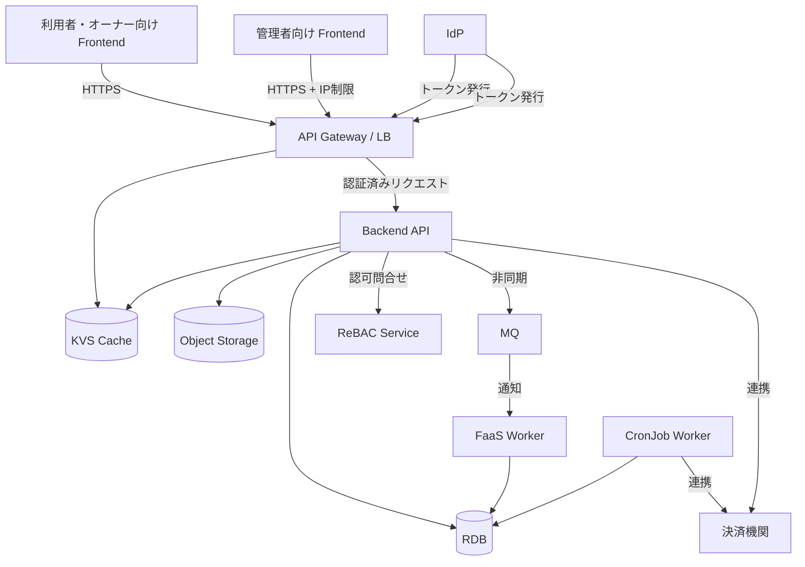
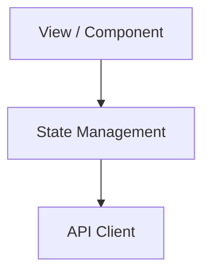
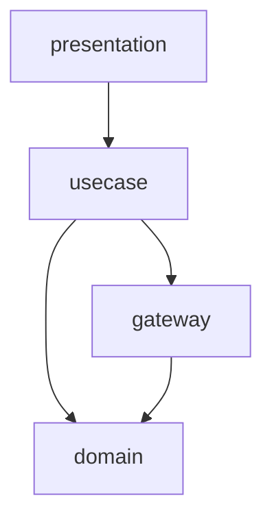
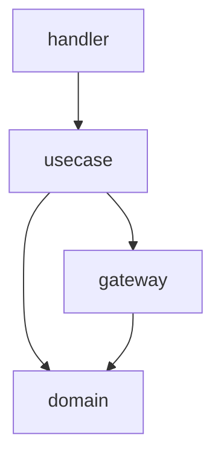
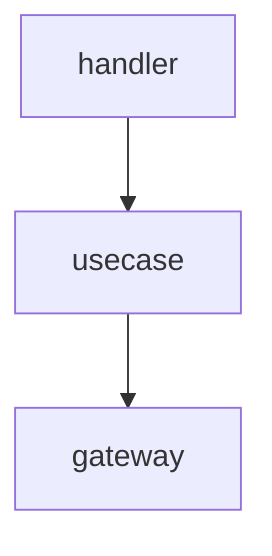
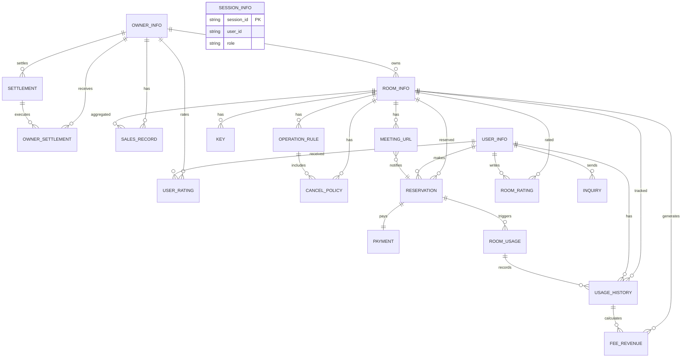

# アーキテクチャ設計書

## 概要

| 項目 | 内容 |
|------|------|
| イベントID | 20260328_213000_arch_infra_feedback_20260328_210000_infra_product_design |
| 作成日時 | 2026-03-28T21:30:00 |
| ソース | インフラ設計 20260328_210000_infra_product_design に基づくアーキテクチャフィードバック |
| 言語 | Go, TypeScript |
| フレームワーク | Echo / Gin / Chi（Go Web Framework）, React / Next.js（TypeScript SPA） |
| 技術的制約 | RDB 接続プール上限 200（マネージド RDB 共通制約）, FaaS 実行時間上限 300秒（サーバーレスランタイム共通制約）, MQ メッセージ可視性タイムアウトは FaaS タイムアウトと一致させること（300秒） |

## システムアーキテクチャ

### システム構成図

### ティア構成

| ID | ティア名 | 説明 | テクノロジー候補 |
|-----|---------|------|----------------|
| tier-frontend-user | 利用者・オーナー向けフロントエンド | 外部アクター「利用者」「会議室オーナー」向け Web UI。会議室検索・予約・管理・評価・精算確認等の機能を提供する | SPA, レスポンシブデザイン |
| tier-frontend-admin | 管理者向けフロントエンド | 社内アクター「サービス運営担当者」向け管理画面。オーナー審査・利用状況分析・手数料売上分析・精算管理・問合せ対応の機能を提供する | SPA |
| tier-api-gateway | API Gateway | 全フロントエンドからのリクエストを受け付け、認証・認可・レート制限・TLS 終端を一元的に処理するリバースプロキシ | API Gateway, リバースプロキシ |
| tier-idp | IdP（アイデンティティプロバイダー） | 利用者・会議室オーナー・サービス運営担当者の認証基盤。トークン発行・ユーザー登録・パスワードリセット・MFA 管理を担う | マネージド IdP |
| tier-authz-service | 認可サービス | リソースレベルのアクセス制御を担う ReBAC 外部サービス。オーナー→会議室、利用者→予約等の所有権関係を管理し、Backend API からの認可問い合わせに応答する | ReBAC サービス（OpenFGA / SpiceDB） |
| tier-backend-api | バックエンド API | 6業務（オーナー管理・会議室管理・会議室貸出・会議室利用・サービス運営・精算）のビジネスロジックを提供する REST API サーバー | CaaS(k8s) |
| tier-cronjob-worker | CronJob ワーカー | タイマートリガー（バーチャル会議室利用開始/終了）およびバッチ処理（月末精算額計算・精算実行）を定期実行するワーカー。Backend API と同一コードベースで CaaS(k8s) 上に動作し、長時間処理にも対応する | CronJob(k8s) |
| tier-faas-worker | FaaS ワーカー | MQ メッセージをトリガーに通知処理（会議URL通知等）を実行するサーバーレスワーカー。短時間・低頻度の処理に特化し、FaaS 実行時間上限の制約を受ける | FaaS, MQ |
| tier-datastore-rdb | データストア（RDB） | 予約・決済・精算等の金銭取引を含む18エンティティのトランザクション整合性を保証するリレーショナルデータベース | RDB |
| tier-datastore-objectstorage | データストア（Object Storage） | 会議室画像ファイルを保管するオブジェクトストレージ | Object Storage |
| tier-datastore-kvs | データストア（KVS） | 会議室検索結果キャッシュ、セッション管理、トークン管理に使用するキーバリューストア | KVS |
| tier-external-integration | 外部連携 | 決済機関との連携を担うアダプタ層。精算実行時の支払処理および利用料の引き落とし処理を仲介する | アダプタパターン |

### 利用者・オーナー向けフロントエンド (tier-frontend-user) の方針・ルール

#### 方針

| ID | 方針名 | 内容 | 根拠 | RDRA/NFR 要素 | 確信度 |
|-----|---------|------|------|--------------|:------:|
| SP-001 | レスポンシブデザイン | モバイル・デスクトップ両対応のレスポンシブ UI を提供する | NFR F.1.1.2 主要ブラウザ全対応+モバイルブラウザ(Lv3)、F.1.1.3 PC+スマートフォン(Lv2) | NFR F.1.1.1, NFR F.1.1.2, NFR F.1.1.3 | 高 |

#### ルール

| ID | ルール名 | 内容 | 根拠 | RDRA/NFR 要素 | 確信度 |
|-----|---------|------|------|--------------|:------:|
| SR-001 | API 経由のデータアクセス | フロントエンドからデータストアへの直接アクセスを禁止し、必ず API Gateway 経由で Backend API にアクセスする | セキュリティとデータ整合性の確保 | なし | デフォルト |

### 管理者向けフロントエンド (tier-frontend-admin) の方針・ルール

#### 方針

| ID | 方針名 | 内容 | 根拠 | RDRA/NFR 要素 | 確信度 |
|-----|---------|------|------|--------------|:------:|
| SP-002 | IP 制限アクセス | 管理画面は社内ネットワークからのみアクセス可能とする | NFR E.5.3.1 IPアドレス制限（管理画面のみ）(Lv1) | NFR E.5.3.1, アクター: サービス運営担当者（社内） | 中 |

#### ルール

| ID | ルール名 | 内容 | 根拠 | RDRA/NFR 要素 | 確信度 |
|-----|---------|------|------|--------------|:------:|
| SR-002 | API 経由のデータアクセス | 管理画面からデータストアへの直接アクセスを禁止し、必ず API Gateway 経由で Backend API にアクセスする | セキュリティとデータ整合性の確保 | なし | デフォルト |

### API Gateway (tier-api-gateway) の方針・ルール

#### 方針

| ID | 方針名 | 内容 | 根拠 | RDRA/NFR 要素 | 確信度 |
|-----|---------|------|------|--------------|:------:|
| SP-003 | OAuth2/OIDC トークン検証 | 全リクエストに対して OAuth2/OIDC トークンを検証し、無効なトークンは Backend API に到達させない | ユーザー指定: 認証・認可・セッション管理を API Gateway に集約 | アクター: 利用者, 会議室オーナー（社外）, NFR E.5.1.1 | ユーザー指定 |
| SP-004 | 粗粒度 RBAC | パスベースのロール制御により、管理者 API は運営ロールのみアクセス可能とする（ReBAC 外部サービスとは独立して API Gateway で実施） | ユーザー指定: オーナー/利用者/運営の3ロールを Gateway で粗粒度制御 | アクター: 3種, NFR E.5.2.1 RBAC(Lv2) | ユーザー指定 |
| SP-005 | レート制限 | API 呼出しのレート制限を一元管理し、過剰なリクエストを抑制する | ユーザー指定: 外部公開 Web サービスの保護 | アクター: 利用者, 会議室オーナー（社外） | ユーザー指定 |

#### ルール

| ID | ルール名 | 内容 | 根拠 | RDRA/NFR 要素 | 確信度 |
|-----|---------|------|------|--------------|:------:|
| SR-003 | TLS 終端 | API Gateway で TLS を終端し、内部通信は平文または mTLS とする | NFR E.6.1.2 全通信暗号化(Lv2) | NFR E.6.1.2 | 高 |
| SR-004 | 管理画面 IP 制限 | 管理者向けエンドポイントへのアクセスを許可 IP アドレスに限定する | NFR E.5.3.1 IPアドレス制限（管理画面のみ）(Lv1) | NFR E.5.3.1, アクター: サービス運営担当者（社内） | 中 |
| SR-011 | ファイアウォール | API Gateway の前段にファイアウォールを配置し、不正なトラフィックをブロックする | NFR E.8.1.1 ファイアウォール(Lv2) への対応 | NFR E.8.1.1 | 中 |
| SR-012 | WAF | Web Application Firewall を API Gateway の前段に配置し、OWASP Top 10 等の一般的な Web 攻撃を防御する | NFR E.10.1.1 WAF(Lv2) への対応 | NFR E.10.1.1 | 中 |

### IdP（アイデンティティプロバイダー） (tier-idp) の方針・ルール

#### 方針

| ID | 方針名 | 内容 | 根拠 | RDRA/NFR 要素 | 確信度 |
|-----|---------|------|------|--------------|:------:|
| SP-017 | MFA 対応 | 管理操作（オーナー登録審査、精算実行等）を行うサービス運営担当者に MFA を必須とする | NFR E.5.1.1 認証方式(Lv2) への対応。管理権限の不正利用防止 | アクター: サービス運営担当者, NFR E.5.1.1 | 中 |
| SP-018 | ユーザープロビジョニング | オーナー登録審査の承認をトリガーに IdP ユーザーを自動作成する。退会時は IdP ユーザーを無効化する | BUC「オーナー登録管理フロー」の審査承認・退会に連動したアカウントライフサイクル管理 | BUC: オーナー登録管理フロー, 状態: オーナー | 中 |

#### ルール

| ID | ルール名 | 内容 | 根拠 | RDRA/NFR 要素 | 確信度 |
|-----|---------|------|------|--------------|:------:|
| SR-013 | トークン仕様 | アクセストークンは JWT 形式、有効期限15分。リフレッシュトークンはローテーション方式で発行する | NFR E.5.1.1 認証方式(Lv2) への対応。セッションハイジャック防止 | NFR E.5.1.1 | 中 |

### 認可サービス (tier-authz-service) の方針・ルール

#### 方針

| ID | 方針名 | 内容 | 根拠 | RDRA/NFR 要素 | 確信度 |
|-----|---------|------|------|--------------|:------:|
| SP-019 | 関係性モデル定義 | RDRA の情報モデルに基づき、owner→room, user→reservation, owner→settlement 等の関係性タプルを定義する | 情報.tsv のエンティティ間関連（オーナー情報→会議室情報、利用者情報→予約情報等）を認可モデルに反映 | 情報: オーナー情報, 会議室情報, 予約情報, 利用者情報, 精算情報, NFR E.5.2.1 | ユーザー指定 |
| SP-020 | 認可判定のレイテンシ目標 | 認可判定のレスポンスタイムを 10ms 以内に維持する。キャッシュ層の活用を検討する | 全 API リクエストで認可判定が発生するため、NFR B.2.1.1 レスポンスタイム 5秒以内への影響を最小化 | NFR B.2.1.1 | 中 |

#### ルール

| ID | ルール名 | 内容 | 根拠 | RDRA/NFR 要素 | 確信度 |
|-----|---------|------|------|--------------|:------:|
| SR-014 | 関係性タプルの同期 | Backend API でのリソース作成・削除時に認可サービスの関係性タプルを同期更新する。トランザクションとの整合性を確保する | データストアと認可サービスの関係性データの一貫性確保 | なし | デフォルト |

### バックエンド API (tier-backend-api) の方針・ルール

#### 方針

| ID | 方針名 | 内容 | 根拠 | RDRA/NFR 要素 | 確信度 |
|-----|---------|------|------|--------------|:------:|
| SP-006 | モジュール分割 | 6業務ドメインに基づくモジュール分割（オーナー管理・会議室管理・会議室貸出・会議室利用・サービス運営・精算） | BUC 6業務・UC 40件超で単一モジュールでは複雑化するため | BUC: 6業務 | 中 |
| SP-007 | 細粒度認可 | リソースレベルのアクセス制御を認可サービスティア（tier-authz-service）への問い合わせで実施する（例: Check('user:123', 'editor', 'room:456')）。条件ベースの認可（使用許諾条件等）は Domain 層で判定する | 所有権ベースの認可パターンが多く、ReBAC で関係性を一元管理することで Backend の作り込みを最小化 | 条件: 使用許諾条件, オーナー登録審査条件, NFR E.5.2.1 | ユーザー指定 |
| SP-014 | 24時間運用 | Backend API は24時間365日の連続運用に対応する。CaaS(k8s) のローリングアップデートによりダウンタイムを最小化する | NFR A.1.1.1 運用時間（通常）24h運用(Lv4) への対応 | NFR A.1.1.1 | 中 |
| SP-015 | スケーラビリティ | 同時アクセス数 ~10,000、ピーク時2倍、オンラインリクエスト ~100,000/日 に対応するため、CaaS(k8s) の水平スケーラビリティ（Pod オートスケーリング）を活用する | NFR B.1.1.1 同時アクセス数(Lv3)、B.1.1.3 オンラインリクエスト件数(Lv3)、B.1.2.1 ピーク時同時アクセス数(Lv2)、B.3.1.1 CPU拡張性(Lv2) への対応 | NFR B.1.1.1, NFR B.1.1.3, NFR B.1.2.1, NFR B.3.1.1 | 中 |

#### ルール

| ID | ルール名 | 内容 | 根拠 | RDRA/NFR 要素 | 確信度 |
|-----|---------|------|------|--------------|:------:|
| SR-005 | API バージョニング | URL パスベースのバージョニング（例: /v1/rooms）で後方互換性を維持する | 一般的なベストプラクティスとして適用 | なし | デフォルト |
| SR-010 | スループット目標 | Backend API は ~100 TPS のスループットを達成する。負荷テストにより継続的に計測する | NFR B.2.1.2 スループット ~100 TPS(Lv3) への対応 | NFR B.2.1.2 | 中 |

### CronJob ワーカー (tier-cronjob-worker) の方針・ルール

#### 方針

| ID | 方針名 | 内容 | 根拠 | RDRA/NFR 要素 | 確信度 |
|-----|---------|------|------|--------------|:------:|
| SP-016 | バッチ処理時間制約 | 月末精算額計算等のバッチ処理は8時間以内に完了させる。処理時間が超過しないようジョブの並列度とタイムアウトを管理する | NFR B.2.2.1 バッチ処理時間 8時間以内(Lv2) への対応 | NFR B.2.2.1 | 中 |

### FaaS ワーカー (tier-faas-worker) の方針・ルール

#### 方針

| ID | 方針名 | 内容 | 根拠 | RDRA/NFR 要素 | 確信度 |
|-----|---------|------|------|--------------|:------:|
| SP-021 | FaaS 通知処理方針 | MQ トリガーの通知処理（会議URL通知等）は FaaS で実行する。短時間・低頻度の処理に特化し、コスト効率と運用負荷の軽減を図る。FaaS 実行時間上限（technology_context.constraints 参照）内で完了する処理のみを対象とする | インフラ設計（MCL product-design）の結果に基づく: 通知処理は短時間・低頻度で FaaS のメリットが大きい | infra: product-impl-aws.yaml → comp-lambda-event-worker | 中 |
| SP-008 | リトライ・デッドレターキュー | MQ メッセージ処理の失敗時はリトライし、上限超過時はデッドレターキューに退避する | 非同期処理の信頼性確保。通知処理の失敗時に確実に再送するため | BUC: 会議室貸出管理フロー（会議URL通知） | 中 |

### データストア（RDB） (tier-datastore-rdb) の方針・ルール

#### 方針

| ID | 方針名 | 内容 | 根拠 | RDRA/NFR 要素 | 確信度 |
|-----|---------|------|------|--------------|:------:|
| SP-009 | ポイントインタイムリカバリ | 継続的バックアップによるポイントインタイムリカバリを実施する | NFR C.1.2.1 継続的バックアップ(Lv3)、NFR A.4.1.1 RPO 障害直前(Lv3) | NFR C.1.2.1, NFR A.4.1.1, NFR A.4.1.2 | 高 |
| SP-010 | 機密データ暗号化 | 個人情報（オーナー情報・利用者情報）および決済情報を保管時に暗号化する | NFR E.6.1.1 機密データのみ暗号化(Lv1) | NFR E.6.1.1, 情報: オーナー情報, 利用者情報, 決済情報 | 高 |

#### ルール

| ID | ルール名 | 内容 | 根拠 | RDRA/NFR 要素 | 確信度 |
|-----|---------|------|------|--------------|:------:|
| SR-007 | Multi-AZ 冗長構成 | RDB は Multi-AZ 構成で同期レプリケーションを行い、自動フェイルオーバーを実現する | NFR A.2.1.1 N+1冗長自動切替(Lv4)、NFR A.2.5.1 ミラーリング以上(Lv3) | NFR A.1.2.1, NFR A.2.1.1, NFR A.2.5.1, NFR A.3.1.1 | 高 |

### データストア（Object Storage） (tier-datastore-objectstorage) の方針・ルール

#### ルール

| ID | ルール名 | 内容 | 根拠 | RDRA/NFR 要素 | 確信度 |
|-----|---------|------|------|--------------|:------:|
| SR-008 | CDN 配信 | 会議室画像は CDN 経由で配信し、フロントエンドの表示速度を向上させる | NFR B.2.1.1 レスポンスタイム 5秒以内(Lv3)。画像ファイルの配信最適化 | NFR B.2.1.1, 情報: 会議室情報（画像属性） | 中 |

### データストア（KVS） (tier-datastore-kvs) の方針・ルール

#### 方針

| ID | 方針名 | 内容 | 根拠 | RDRA/NFR 要素 | 確信度 |
|-----|---------|------|------|--------------|:------:|
| SP-011 | キャッシュ TTL 管理 | キャッシュデータに適切な TTL を設定し、データ鮮度を確保する | NFR B.2.1.1 レスポンスタイム 5秒以内(Lv3)。会議室検索結果のキャッシュ | NFR B.2.1.1, BUC: 会議室予約フロー（会議室検索） | 中 |

### 外部連携 (tier-external-integration) の方針・ルール

#### 方針

| ID | 方針名 | 内容 | 根拠 | RDRA/NFR 要素 | 確信度 |
|-----|---------|------|------|--------------|:------:|
| SP-012 | 冪等性確保 | 決済機関への支払リクエストに冪等キーを付与し、重複支払を防止する | 外部システム「決済機関」が決済系であり、二重支払の防止が必須 | 外部システム: 決済機関, BUC: オーナー精算フロー（精算実行） | 高 |
| SP-013 | サーキットブレーカー | 決済機関との通信障害時にサーキットブレーカーを適用し、障害の連鎖を防止する | 外部システム障害時のシステム全体への影響を局所化する | 外部システム: 決済機関 | 中 |

#### ルール

| ID | ルール名 | 内容 | 根拠 | RDRA/NFR 要素 | 確信度 |
|-----|---------|------|------|--------------|:------:|
| SR-009 | 通信ログ記録 | 決済機関との全通信をリクエスト/レスポンス含めてログに記録する | NFR E.7.1.1 監査ログ+データアクセスログ(Lv2)。金銭取引の追跡 | NFR E.7.1.1, 外部システム: 決済機関 | 高 |

### ティア共通の方針

| ID | 方針名 | 内容 | 根拠 | RDRA/NFR 要素 | 確信度 |
|-----|---------|------|------|--------------|:------:|
| CTP-001 | 認証方式 | OAuth2/OIDC ベースの認証を採用し、API Gateway でトークン検証を一元実施する。Backend API は細粒度認可に集中する | 外部アクター「利用者」「会議室オーナー」が利用するため標準的な認証プロトコルが必要。NFR E.5.1.1 Lv2 | アクター: 利用者, 会議室オーナー（社外）, NFR E.5.1.1 | 高 |
| CTP-002 | 認可方式 | 粗粒度ロール制御は API Gateway で RBAC、リソースレベルのアクセス制御は ReBAC 外部サービス（OpenFGA/SpiceDB 等）で実施する。状態ベースの認可は Domain 層のビジネスルールとして実装する | ユーザー指定: 所有権ベースの認可パターンが多い（オーナー→会議室、利用者→予約、オーナー→精算）ため ReBAC が適合。Backend の作り込みを最小化し、認可ポリシーを一元管理する | アクター: 会議室オーナー, 利用者, サービス運営担当者, NFR E.5.2.1, 条件: 使用許諾条件 | ユーザー指定 |
| CTP-003 | API スタイル | REST + キャッシュヘッダを採用し、レスポンス改善を図る | NFR B.2.1.1 レスポンスタイム 5秒以内(Lv3) | NFR B.2.1.1 | 中 |
| CTP-004 | 構造化ログと相関ID | 全ティアで JSON 形式の構造化ログを出力する。フロントエンドでリクエストごとに trace_id を生成し、全ティアに伝播して横断的なトレーサビリティを確保する。trace_id は冪等キー（CTP-012 参照）と共にリクエストヘッダーに含め、ログ・監査証跡から特定リクエストの全処理経路を追跡可能にする | NFR C.1.3.1 アプリケーション監視(Lv3)、NFR C.6.1.1 ログ保管1年(Lv4) | NFR C.1.3.1, NFR C.6.1.1 | 中 |
| CTP-005 | ヘルスチェック | 全ティアにヘルスチェックエンドポイントを実装し、LB/オーケストレーターからの死活監視に対応する | NFR A.2.1.1 N+1冗長自動切替(Lv4)。自動フェイルオーバーの基盤 | NFR A.2.1.1, NFR C.1.1.1, NFR C.3.1.1 | 中 |
| CTP-006 | 業務継続計画 | 災害・大規模障害時に24時間以内の業務復旧を目標とする。Multi-AZ 自動フェイルオーバーおよびバックアップからのリストア手順を整備する | NFR A.3.1.2 業務継続の要否 24時間以内に復旧(Lv1) への対応 | NFR A.3.1.2 | 中 |
| CTP-007 | サポート体制 | 24時間365日のサポート体制を構築する。オンコール対応と障害エスカレーションフローを整備する | NFR C.5.1.1 サポート時間 24時間365日(Lv4) への対応 | NFR C.5.1.1 | 中 |
| CTP-008 | セキュリティポリシー準拠 | 組織のセキュリティポリシーに準拠し、定期的なセキュリティレビューを実施する | NFR E.1.1.1 セキュリティポリシー 組織ポリシー準拠(Lv2) への対応 | NFR E.1.1.1 | 中 |
| CTP-009 | IdP 方式 | IdP ティアを認証基盤として採用し、API Gateway と連携してトークン検証を行う。IdP の具体的な方針は tier-idp を参照 | 外部アクター2種が利用する商用SaaSのため、ソーシャルログイン対応・運用負荷軽減の観点からマネージド IdP が適切。NFR E.5.1.1 認証方式(Lv2) | アクター: 利用者, 会議室オーナー（社外）, サービス運営担当者, NFR E.5.1.1 | 中 |
| CTP-010 | SLI/SLO ベースのオブザーバビリティ方針 | API 可用性 SLO 99.9%（30日ローリング）、p99 レイテンシ SLO 500ms、エラーレート SLO 0.1% 以下を定義し、エラーバジェットで運用判断（リリース可否・障害対応優先度）を行う | インフラ設計（MCL product-design）の結果に基づく: SLI/SLO を明示的に定義しエラーバジェットで運用を制御する | infra: product-observability.yaml → sli_slo | 中 |
| CTP-011 | コスト最適化方針 | balanced コストポスチャに基づき、コミット割引（6ヶ月運用実績後に検討）、ノードライトサイジング（arm64 優先）、非本番環境縮小構成（Single-AZ、小型インスタンス、開発環境は夜間停止）を適用する | インフラ設計（MCL product-design）の結果に基づく: コスト最適化戦略をアーキテクチャ方針として明示 | infra: product-cost-hints.yaml → optimization_strategies | 中 |
| CTP-012 | 冪等性方針 | 全ティアで冪等性を確保する。(1) フロントエンド: リクエストごとに冪等キー（UUID）を生成しリクエストヘッダー X-Idempotency-Key に付与する。UI でのダブルクリック防止（ボタン無効化）も併用する。(2) Backend API: 冪等キーを KVS で管理し、重複リクエストを検知して前回レスポンスを返却する。状態変更を伴う操作（POST/PUT/DELETE）が対象。(3) データストア（RDB）: 冪等キーカラムに UNIQUE 制約を設定し、ON CONFLICT（UPSERT）で重複挿入を防止する。(4) CronJob ワーカー: ジョブ実行 ID で重複実行を検知する。(5) FaaS ワーカー: MQ の MessageId で重複メッセージを検知する | 予約・決済・精算など金銭に関わる操作が多く、ネットワーク障害やリトライによる重複処理が深刻な影響を及ぼすため、全ティアで一貫した冪等性保証が必要 | BUC: 会議室予約フロー, オーナー精算フロー, 外部システム: 決済機関, infra: product-impl-aws.yaml | 中 |

### ティア共通のルール

| ID | ルール名 | 内容 | 根拠 | RDRA/NFR 要素 | 確信度 |
|-----|---------|------|------|--------------|:------:|
| CTR-001 | 通信暗号化 | 全ティア間の通信を TLS で暗号化する。API Gateway で TLS 終端し、内部通信も暗号化する | NFR E.6.1.2 全通信暗号化（内部通信含む）(Lv2) | NFR E.6.1.2 | 高 |
| CTR-002 | 監査ログ | 金銭取引（決済・精算）および個人情報アクセスの操作ログを記録し、1年間保管する | NFR E.7.1.1 監査ログ+データアクセスログ(Lv2)、NFR C.6.1.1 ログ保管1年(Lv4) | NFR E.7.1.1, NFR C.6.1.1, 情報: 決済情報, 精算情報, オーナー情報, 利用者情報 | 中 |
| CTR-003 | API バージョニング | URL パスベースのバージョニング方式を全 API に適用する | 一般的なベストプラクティスとして適用 | なし | デフォルト |
| CTR-004 | 計画停止ルール | 計画停止を実施する場合は3日前までに利用者へ事前通知する。メンテナンスウィンドウを設定し影響を最小化する | NFR A.1.1.3 計画停止の有無 事前通知3日前(Lv3) への対応 | NFR A.1.1.3 | 中 |
| CTR-005 | ネットワーク冗長化 | ネットワーク機器はマネージドサービスの冗長化機能を活用し、単一障害点を排除する | NFR A.2.3.1 ネットワーク機器の冗長化 マネージド冗長(Lv3) への対応 | NFR A.2.3.1 | 中 |
| CTR-006 | 電源冗長化 | インフラ層の電源冗長化はクラウドベンダーのデータセンター設備（UPS 等）に依拠する | NFR A.2.6.2 電源の冗長化 UPS(Lv2) への対応 | NFR A.2.6.2 | 中 |
| CTR-007 | 負荷テスト実施 | 本番リリース前およびスケール変更時に負荷テストを実施し、性能目標（レスポンスタイム・スループット・同時接続数）の達成を検証する | NFR B.4.1.1 性能テスト 負荷テスト(Lv3) への対応 | NFR B.4.1.1 | 中 |
| CTR-008 | パッチ適用方針 | OS・ミドルウェア・ライブラリのセキュリティパッチを四半期ごとに評価・適用する。緊急パッチは随時対応する | NFR C.2.1.2 パッチ適用方針 四半期(Lv2) への対応 | NFR C.2.1.2 | 中 |
| CTR-009 | テスト環境方針 | 本番環境の縮小構成でテスト環境を構築し、リリース前の検証に使用する | NFR C.4.1.1 テスト環境 本番縮小構成(Lv2) への対応 | NFR C.4.1.1 | 中 |
| CTR-010 | 初期データ投入方針 | 新規構築のため一括移行方式を採用する。データ移行量は ~100GB を想定し、初期データ投入スクリプトを整備する。移行リハーサルは不要 | NFR D.2.1.1 移行方式 一括移行(Lv1)、D.4.1.1 データ移行量 ~100GB(Lv1)、D.5.1.1 移行リハーサル 不要(Lv0) への対応 | NFR D.2.1.1, NFR D.4.1.1, NFR D.5.1.1 | 中 |
| CTR-011 | セキュリティリスク分析 | 設計・開発フェーズでセキュリティリスク分析を実施し、脅威モデリングにより対策を導出する | NFR E.2.1.1 セキュリティリスク分析(Lv2) への対応 | NFR E.2.1.1 | 中 |
| CTR-012 | セキュリティ診断 | 本番リリース前にセキュリティ診断（脆弱性スキャン・ペネトレーションテスト）を実施する | NFR E.3.1.1 セキュリティ診断(Lv2) への対応 | NFR E.3.1.1 | 中 |
| CTR-013 | マルウェア対策 | コンテナイメージのスキャンおよびランタイム保護により、マルウェアの混入・実行を防止する | NFR E.9.1.1 マルウェア対策(Lv2) への対応 | NFR E.9.1.1 | 中 |
| CTR-014 | インシデント対応計画 | セキュリティインシデント発生時の対応手順（検知・封じ込め・復旧・報告）を策定し、定期的に訓練する | NFR E.11.1.1 インシデント対応計画(Lv2) への対応 | NFR E.11.1.1 | 中 |

## アプリケーションアーキテクチャ

### tier-frontend-user のレイヤー構成

#### レイヤー依存図

| ID | レイヤー名 | 責務 | 依存許可先 |
|-----|---------|------|----------|
| L-frontend-user-view | View / Component 層 | UI 描画、ユーザー操作のハンドリング、レスポンシブレイアウト | L-frontend-user-state |
| L-frontend-user-state | State Management 層 | アプリケーション状態管理、画面間の状態共有、ビジネスロジック | L-frontend-user-api |
| L-frontend-user-api | API Client 層 | Backend API との通信、認証トークン管理、レスポンスキャッシュ | - |

#### レイヤー共通の方針

| ID | 方針名 | 内容 | 根拠 | RDRA/NFR 要素 | 確信度 |
|-----|---------|------|------|--------------|:------:|
| CLP-001 | コンポーネント分割 | 業務ドメインごとにコンポーネントを分割し、再利用性を高める | UC 数 30件超のため、コンポーネントの整理が必要 | BUC: 6業務 | 中 |

### tier-frontend-admin のレイヤー構成

#### レイヤー依存図

| ID | レイヤー名 | 責務 | 依存許可先 |
|-----|---------|------|----------|
| L-frontend-admin-view | View / Component 層 | 管理画面の UI 描画、分析・集計の可視化 | L-frontend-admin-state |
| L-frontend-admin-state | State Management 層 | 管理画面の状態管理、フィルタ・集計ロジック | L-frontend-admin-api |
| L-frontend-admin-api | API Client 層 | Backend API との通信、認証トークン管理 | - |

### tier-backend-api のレイヤー構成

#### レイヤー依存図

| ID | レイヤー名 | 責務 | 依存許可先 |
|-----|---------|------|----------|
| L-backend-api-presentation | プレゼンテーション層 | HTTP リクエスト/レスポンスの変換、入力バリデーション、レスポンスフォーマット | L-backend-api-usecase |
| L-backend-api-usecase | ユースケース層 | ビジネスフロー制御、トランザクション境界の管理、ドメインサービスの協調 | L-backend-api-domain, L-backend-api-gateway |
| L-backend-api-domain | ドメイン層 | ビジネスルール、エンティティ、値オブジェクト、ドメインイベント、状態遷移の整合性保証 | - |
| L-backend-api-gateway | ゲートウェイ層 | Driven Side の入出力。データストアアクセス（RDB/KVS/Object Storage）、外部システム連携（決済機関アダプタ）、ReBAC サービス連携、MQ 発行 | L-backend-api-domain |

#### プレゼンテーション層 (L-backend-api-presentation) の方針・ルール

**方針**

| ID | 方針名 | 内容 | 根拠 | RDRA/NFR 要素 | 確信度 |
|-----|---------|------|------|--------------|:------:|
| LP-001 | 入力バリデーション | API 境界で全入力をバリデーションする。条件モデル（キャンセルポリシー・精算ルール等10件）に基づくビジネスバリデーションも実施 | 外部入力の安全性確保。条件 10件がバリデーションルールの根拠 | 条件: キャンセルポリシー, 精算ルール, 支払精算ポリシー, 会議室利用ポリシー, オーナー登録審査条件, 使用許諾条件, 会議室公開条件, 会議室種別別登録条件, バーチャル会議室利用ポリシー | 高 |
| LP-005 | アクセスログ出力 | HTTP リクエスト/レスポンスのメタデータ（メソッド、パス、ステータスコード、処理時間）を構造化ログで出力する。trace_id を発行し後続レイヤーに伝播する | NFR C.1.3.1 アプリケーション監視(Lv3) への対応。アクセスパターンの把握と異常検知 | NFR C.1.3.1, アクター: 利用者, 会議室オーナー（社外） | 中 |

#### ユースケース層 (L-backend-api-usecase) の方針・ルール

**方針**

| ID | 方針名 | 内容 | 根拠 | RDRA/NFR 要素 | 確信度 |
|-----|---------|------|------|--------------|:------:|
| LP-002 | トランザクション整合性 | 金銭処理（決済・精算）のトランザクション整合性をユースケース層で保証する | 情報「決済情報」「精算情報」「オーナー精算」に金銭取引があるため | 情報: 決済情報, 精算情報, オーナー精算 | 高 |
| LP-006 | 監査ログ出力 | 状態遷移を伴うビジネスイベント（予約申請、決済実行、精算実行等）を監査ログとして構造化ログで記録する。誰が、何を、どうしたかを含める | NFR E.7.1.1 監査ログ(Lv2) への対応。8種の状態遷移に対する監査証跡 | NFR E.7.1.1, 状態: オーナー, 会議室, 予約, 会議室利用, 問合せ, 精算, 鍵, 決済 | 高 |

#### ドメイン層 (L-backend-api-domain) の方針・ルール

**方針**

| ID | 方針名 | 内容 | 根拠 | RDRA/NFR 要素 | 確信度 |
|-----|---------|------|------|--------------|:------:|
| LP-003 | 状態遷移の整合性 | 8状態モデル（オーナー・会議室・予約・会議室利用・問合せ・精算・鍵・決済）の状態遷移をドメインモデル内で保証する | 状態遷移が8種・遷移パスが30以上あり、ドメイン層での一元管理が必要 | 状態: オーナー, 会議室, 予約, 会議室利用, 問合せ, 精算, 鍵, 決済 | 高 |

**ルール**

| ID | ルール名 | 内容 | 根拠 | RDRA/NFR 要素 | 確信度 |
|-----|---------|------|------|--------------|:------:|
| LR-001 | ログ出力禁止 | domain 層は直接的なロギングを行わない。状態変化はドメインイベントの発行または例外のスローで上位レイヤーに通知する | domain 層をロギングライブラリから独立させ、ビジネスロジックの純粋性を維持する | なし | デフォルト |

#### ゲートウェイ層 (L-backend-api-gateway) の方針・ルール

**方針**

| ID | 方針名 | 内容 | 根拠 | RDRA/NFR 要素 | 確信度 |
|-----|---------|------|------|--------------|:------:|
| LP-004 | 外部連携の冪等性 | 決済機関への外部呼出しの冪等性を gateway 層で保証する | 外部システム「決済機関」との連携で二重処理を防止する必要があるため | 外部システム: 決済機関, BUC: オーナー精算フロー（精算実行） | 高 |
| LP-007 | 依存関係ログ出力 | 外部 DB/API 呼び出しの開始・終了、処理時間、成否ステータスを構造化ログで出力する。DEBUG レベルで SQL クエリやリクエスト/レスポンス本文を出力可能にする | NFR C.1.3.1 アプリケーション監視(Lv3) への対応。外部システム連携のボトルネック特定 | NFR C.1.3.1, 外部システム: 決済機関 | 中 |

#### レイヤー共通の方針

| ID | 方針名 | 内容 | 根拠 | RDRA/NFR 要素 | 確信度 |
|-----|---------|------|------|--------------|:------:|
| CLP-002 | IF なし（直接依存） | レイヤー間は直接依存とし、開発スピードを優先する。外部サービス API 変更や DB 製品乗り換え時に凹型（IF 導入）で依存を内側に向ける | 新規構築のため IF による疎結合化は過剰。前提条件（外部サービスのそうそう乗り換えない等）が崩れた場合に凹型へ移行 | なし | デフォルト |
| CLP-003 | ロギング方針 | レイヤーごとに責務に応じたログカテゴリを出力する。presentation=アクセスログ、usecase=監査ログ、domain=ログ出力禁止（イベント/例外で通知）、gateway=依存関係ログ。全ログは JSON 構造化形式で trace_id を含める | NFR C.1.3.1 アプリケーション監視(Lv3)、NFR E.7.1.1 監査ログ(Lv2)。レイヤーの責務に応じたログ分離で可観測性を確保 | NFR C.1.3.1, NFR E.7.1.1 | 中 |

#### レイヤー共通のルール

| ID | ルール名 | 内容 | 根拠 | RDRA/NFR 要素 | 確信度 |
|-----|---------|------|------|--------------|:------:|
| CLR-001 | エラーハンドリング方針 | domain の例外は usecase でキャッチし、presentation で HTTP ステータスに変換する | レイヤー責務の分離 | なし | デフォルト |

### tier-cronjob-worker のレイヤー構成

#### レイヤー依存図

| ID | レイヤー名 | 責務 | 依存許可先 |
|-----|---------|------|----------|
| L-cronjob-worker-handler | ハンドラー層 | CronJob エントリポイント、ジョブパラメータの解析 | L-cronjob-worker-usecase |
| L-cronjob-worker-usecase | ユースケース層 | バッチ処理のビジネスフロー制御、トランザクション境界。精算額計算・精算実行・バーチャル会議室利用開始/終了 | L-cronjob-worker-domain, L-cronjob-worker-gateway |
| L-cronjob-worker-domain | ドメイン層 | 状態遷移（会議室利用・精算・決済）、精算ルール等のビジネスルール。Backend API と共有 | - |
| L-cronjob-worker-gateway | ゲートウェイ層 | Driven Side の入出力。データストアアクセス、決済機関連携。Backend API と共有 | L-cronjob-worker-domain |

#### レイヤー共通の方針

| ID | 方針名 | 内容 | 根拠 | RDRA/NFR 要素 | 確信度 |
|-----|---------|------|------|--------------|:------:|
| CLP-004 | IF なし（直接依存） | レイヤー間は直接依存とし、開発スピードを優先する。外部サービス API 変更や DB 製品乗り換え時に凹型（IF 導入）で依存を内側に向ける | 新規構築のため IF による疎結合化は過剰。前提条件（外部サービスのそうそう乗り換えない等）が崩れた場合に凹型へ移行 | なし | デフォルト |
| CLP-005 | ロギング方針 | レイヤーごとに責務に応じたログカテゴリを出力する。handler=診断ログ（ジョブ起動/終了）、usecase=監査ログ+診断ログ（処理件数サマリー）、domain=ログ出力禁止、gateway=依存関係ログ+診断ログ（エラーアイテム、ハートビート） | NFR C.1.3.1 アプリケーション監視(Lv3)。バッチ処理の可観測性確保 | NFR C.1.3.1 | 中 |

### tier-faas-worker のレイヤー構成

#### レイヤー依存図

| ID | レイヤー名 | 責務 | 依存許可先 |
|-----|---------|------|----------|
| L-faas-worker-handler | ハンドラー層 | MQ メッセージ受信、メッセージデシリアライズ、FaaS エントリポイント | L-faas-worker-usecase |
| L-faas-worker-usecase | ユースケース層 | 通知処理のビジネスフロー制御。会議URL通知・予約確認通知等 | L-faas-worker-gateway |
| L-faas-worker-gateway | ゲートウェイ層 | Driven Side の入出力。データストア読み取り、通知送信（メール/プッシュ） | - |

#### レイヤー共通の方針

| ID | 方針名 | 内容 | 根拠 | RDRA/NFR 要素 | 確信度 |
|-----|---------|------|------|--------------|:------:|
| CLP-006 | ロギング方針 | handler=診断ログ（メッセージ受信/処理完了）、usecase=監査ログ（通知送信記録）、gateway=依存関係ログ（外部通知サービス呼び出し）。全ログは JSON 構造化形式で trace_id を含める | NFR C.1.3.1 アプリケーション監視(Lv3)。FaaS ワーカーの可観測性確保 | NFR C.1.3.1 | 中 |

## データアーキテクチャ

### ER 図

### エンティティ一覧

#### E-001: オーナー情報

- **参照元**: 情報: オーナー情報
- **モデル種別**: イベント+スナップショット

| 属性名 | 型 | 説明 | NULL | PK |
|--------|-----|------|:----:|:--:|
| owner_id | string | オーナーID | No | Yes |
| name | string | 氏名 | No |  |
| contact | string | 連絡先 | No |  |
| email | string | メールアドレス | No |  |
| registered_at | datetime | 登録日 | No |  |
| review_status | string | 審査状態（状態モデル「オーナー」: 審査待ち/登録済み/却下/退会） | No |  |

**リレーション**

| 対象エンティティ | カーディナリティ | 説明 |
|-----------------|:---------------:|------|
| E-002 | 1:N | オーナーが複数の会議室を所有 |
| E-017 | 1:N | オーナーが複数のオーナー精算を受領 |
| E-014 | 1:N | オーナーの売上実績 |
| E-011 | 1:N | オーナーが利用者を評価 |

#### E-002: 会議室情報

- **参照元**: 情報: 会議室情報
- **モデル種別**: イベント+スナップショット

| 属性名 | 型 | 説明 | NULL | PK |
|--------|-----|------|:----:|:--:|
| room_id | string | 会議室ID | No | Yes |
| room_name | string | 会議室名 | No |  |
| room_type | string | 会議室種別（物理/バーチャル） | No |  |
| location | string | 所在地 | Yes |  |
| area | decimal | 広さ | Yes |  |
| capacity | integer | 収容人数 | Yes |  |
| price | decimal | 価格 | No |  |
| facilities | text | 設備・機能 | Yes |  |
| image_url | string | 画像（Object Storage URI） | Yes |  |
| publish_status | string | 公開状態（状態モデル「会議室」: 非公開/公開可能/公開中） | No |  |
| meeting_tool_type | string | 会議ツール種別（バーチャル会議室用） | Yes |  |
| max_connections | integer | 同時接続数（バーチャル会議室用） | Yes |  |
| recording_enabled | boolean | 録画可否（バーチャル会議室用） | Yes |  |

**リレーション**

| 対象エンティティ | カーディナリティ | 説明 |
|-----------------|:---------------:|------|
| E-001 | N:1 | 会議室はオーナーに属する |
| E-003 | 1:N | 会議室に複数の運用ルール |
| E-004 | 1:N | 会議室に複数のキャンセルポリシー |
| E-005 | 1:N | 会議室に複数の鍵 |
| E-006 | 1:N | 会議室に複数の予約 |
| E-010 | 1:N | 会議室に複数の評価 |
| E-018 | 1:N | 会議室に複数の会議URL |

#### E-003: 運用ルール

- **参照元**: 情報: 運用ルール
- **モデル種別**: リソース

| 属性名 | 型 | 説明 | NULL | PK |
|--------|-----|------|:----:|:--:|
| rule_id | string | ルールID | No | Yes |
| room_id | string | 会議室ID | No |  |
| available_hours | string | 利用可能時間帯 | No |  |
| min_usage_time | integer | 最低利用時間 | No |  |
| max_usage_time | integer | 最大利用時間 | No |  |
| rental_available | boolean | 貸出可否 | No |  |

**リレーション**

| 対象エンティティ | カーディナリティ | 説明 |
|-----------------|:---------------:|------|
| E-002 | N:1 | 運用ルールは会議室に属する |
| E-004 | 1:N | 運用ルールにキャンセルポリシーが紐づく |

#### E-004: キャンセルポリシー

- **参照元**: 情報: キャンセルポリシー
- **モデル種別**: リソース

| 属性名 | 型 | 説明 | NULL | PK |
|--------|-----|------|:----:|:--:|
| policy_id | string | ポリシーID | No | Yes |
| room_id | string | 会議室ID | No |  |
| cancel_deadline | datetime | キャンセル期限 | No |  |
| cancel_rate | decimal | キャンセル料率 | No |  |
| refund_rule | text | 返金ルール | No |  |

**リレーション**

| 対象エンティティ | カーディナリティ | 説明 |
|-----------------|:---------------:|------|
| E-003 | N:1 | キャンセルポリシーは運用ルールに紐づく |

#### E-005: 鍵

- **参照元**: 情報: 鍵
- **モデル種別**: イベント+スナップショット

| 属性名 | 型 | 説明 | NULL | PK |
|--------|-----|------|:----:|:--:|
| key_id | string | 鍵ID | No | Yes |
| room_id | string | 会議室ID | No |  |
| rental_status | string | 貸出状態（状態モデル「鍵」: 保管中/貸出中） | No |  |

**リレーション**

| 対象エンティティ | カーディナリティ | 説明 |
|-----------------|:---------------:|------|
| E-002 | N:1 | 鍵は会議室に属する |

#### E-006: 予約情報

- **参照元**: 情報: 予約情報
- **モデル種別**: イベント+スナップショット

| 属性名 | 型 | 説明 | NULL | PK |
|--------|-----|------|:----:|:--:|
| reservation_id | string | 予約ID | No | Yes |
| user_id | string | 利用者ID | No |  |
| room_id | string | 会議室ID | No |  |
| room_type | string | 会議室種別 | No |  |
| reserved_at | datetime | 予約日時 | No |  |
| usage_start_at | datetime | 利用開始日時 | No |  |
| usage_end_at | datetime | 利用終了日時 | No |  |
| reservation_status | string | 予約状態（状態モデル「予約」: 申請/確定/変更/取消） | No |  |
| payment_method | string | 決済方法 | No |  |

**リレーション**

| 対象エンティティ | カーディナリティ | 説明 |
|-----------------|:---------------:|------|
| E-007 | N:1 | 予約は利用者が行う |
| E-002 | N:1 | 予約は会議室に対して行う |
| E-008 | 1:1 | 予約に決済情報が紐づく |
| E-009 | 1:N | 予約から会議室利用が発生 |

#### E-007: 利用者情報

- **参照元**: 情報: 利用者情報
- **モデル種別**: イベント+スナップショット

| 属性名 | 型 | 説明 | NULL | PK |
|--------|-----|------|:----:|:--:|
| user_id | string | 利用者ID | No | Yes |
| name | string | 氏名 | No |  |
| contact | string | 連絡先 | No |  |
| email | string | メールアドレス | No |  |
| registered_at | datetime | 登録日 | No |  |
| version | integer | 楽観ロック用バージョン | No |  |
| updated_at | datetime | 最終更新日時 | No |  |

**リレーション**

| 対象エンティティ | カーディナリティ | 説明 |
|-----------------|:---------------:|------|
| E-006 | 1:N | 利用者が複数の予約を行う |
| E-010 | 1:N | 利用者が会議室を評価 |
| E-011 | 1:N | 利用者がオーナーから評価される |
| E-012 | 1:N | 利用者が問合せを送信 |
| E-013 | 1:N | 利用者の利用履歴 |

#### E-008: 決済情報

- **参照元**: 情報: 決済情報
- **モデル種別**: イベント+スナップショット

| 属性名 | 型 | 説明 | NULL | PK |
|--------|-----|------|:----:|:--:|
| payment_id | string | 決済ID | No | Yes |
| reservation_id | string | 予約ID | No |  |
| payment_method | string | 決済方法（クレジットカード/電子マネー） | No |  |
| payment_status | string | 決済状態（状態モデル「決済」: 未登録/決済手段登録済み/引き落とし済み） | No |  |
| payment_amount | decimal | 決済金額 | No |  |

**リレーション**

| 対象エンティティ | カーディナリティ | 説明 |
|-----------------|:---------------:|------|
| E-006 | N:1 | 決済は予約に紐づく |

#### E-009: 会議室利用

- **参照元**: 情報: 会議室利用
- **モデル種別**: イベント+スナップショット

| 属性名 | 型 | 説明 | NULL | PK |
|--------|-----|------|:----:|:--:|
| usage_id | string | 利用ID | No | Yes |
| reservation_id | string | 予約ID | No |  |
| room_id | string | 会議室ID | No |  |
| user_id | string | 利用者ID | No |  |
| usage_start_at | datetime | 利用開始日時 | No |  |
| usage_end_at | datetime | 利用終了日時 | Yes |  |
| usage_status | string | 利用状態（状態モデル「会議室利用」: 利用開始/利用中/利用終了） | No |  |

**リレーション**

| 対象エンティティ | カーディナリティ | 説明 |
|-----------------|:---------------:|------|
| E-006 | N:1 | 会議室利用は予約から発生 |
| E-013 | 1:N | 会議室利用から利用履歴を記録 |

#### E-010: 会議室評価

- **参照元**: 情報: 会議室評価
- **モデル種別**: イベント

| 属性名 | 型 | 説明 | NULL | PK |
|--------|-----|------|:----:|:--:|
| rating_id | string | 評価ID | No | Yes |
| user_id | string | 利用者ID | No |  |
| room_id | string | 会議室ID | No |  |
| owner_id | string | オーナーID | No |  |
| room_type | string | 会議室種別 | No |  |
| rating_score | decimal | 評価スコア | No |  |
| comment | text | コメント | Yes |  |
| rated_at | datetime | 評価日時 | No |  |

**リレーション**

| 対象エンティティ | カーディナリティ | 説明 |
|-----------------|:---------------:|------|
| E-007 | N:1 | 利用者が評価を登録 |
| E-002 | N:1 | 会議室に対する評価 |

#### E-011: 利用者評価

- **参照元**: 情報: 利用者評価
- **モデル種別**: イベント

| 属性名 | 型 | 説明 | NULL | PK |
|--------|-----|------|:----:|:--:|
| rating_id | string | 評価ID | No | Yes |
| owner_id | string | オーナーID | No |  |
| user_id | string | 利用者ID | No |  |
| rating_score | decimal | 評価スコア | No |  |
| comment | text | コメント | Yes |  |
| rated_at | datetime | 評価日時 | No |  |

**リレーション**

| 対象エンティティ | カーディナリティ | 説明 |
|-----------------|:---------------:|------|
| E-001 | N:1 | オーナーが利用者を評価 |
| E-007 | N:1 | 評価対象の利用者 |

#### E-012: 問合せ

- **参照元**: 情報: 問合せ
- **モデル種別**: イベント+スナップショット

| 属性名 | 型 | 説明 | NULL | PK |
|--------|-----|------|:----:|:--:|
| inquiry_id | string | 問合せID | No | Yes |
| user_id | string | 利用者ID | No |  |
| inquiry_target_type | string | 問合せ先区分（オーナー宛/サービス運営宛） | No |  |
| inquiry_target_id | string | 問合せ先ID | No |  |
| inquiry_content | text | 問合せ内容 | No |  |
| response_content | text | 回答内容 | Yes |  |
| inquiry_status | string | 問合せ状態（状態モデル「問合せ」: 未対応/回答済み/対応済み） | No |  |
| inquired_at | datetime | 問合せ日時 | No |  |

**リレーション**

| 対象エンティティ | カーディナリティ | 説明 |
|-----------------|:---------------:|------|
| E-007 | N:1 | 利用者が問合せを送信 |

#### E-013: 利用履歴

- **参照元**: 情報: 利用履歴
- **モデル種別**: イベント

| 属性名 | 型 | 説明 | NULL | PK |
|--------|-----|------|:----:|:--:|
| history_id | string | 履歴ID | No | Yes |
| user_id | string | 利用者ID | No |  |
| room_id | string | 会議室ID | No |  |
| used_at | datetime | 利用日時 | No |  |
| usage_duration | integer | 利用時間 | No |  |
| usage_fee | decimal | 利用料金 | No |  |

**リレーション**

| 対象エンティティ | カーディナリティ | 説明 |
|-----------------|:---------------:|------|
| E-007 | N:1 | 利用者の利用履歴 |
| E-002 | N:1 | 会議室の利用履歴 |
| E-009 | N:1 | 会議室利用から記録 |

#### E-014: 売上実績

- **参照元**: 情報: 売上実績
- **モデル種別**: リソース

| 属性名 | 型 | 説明 | NULL | PK |
|--------|-----|------|:----:|:--:|
| record_id | string | 実績ID | No | Yes |
| room_id | string | 会議室ID | No |  |
| owner_id | string | オーナーID | No |  |
| period | string | 集計期間 | No |  |
| usage_count | integer | 利用回数 | No |  |
| sales_amount | decimal | 売上金額 | No |  |

**リレーション**

| 対象エンティティ | カーディナリティ | 説明 |
|-----------------|:---------------:|------|
| E-002 | N:1 | 会議室ごとの売上実績 |
| E-001 | N:1 | オーナーの売上実績 |

#### E-015: 手数料売上

- **参照元**: 情報: 手数料売上
- **モデル種別**: イベント

| 属性名 | 型 | 説明 | NULL | PK |
|--------|-----|------|:----:|:--:|
| fee_id | string | 手数料ID | No | Yes |
| room_id | string | 会議室ID | No |  |
| rental_id | string | 貸出ID | No |  |
| fee_rate | decimal | 手数料率 | No |  |
| fee_amount | decimal | 手数料金額 | No |  |
| recorded_at | date | 計上日 | No |  |

**リレーション**

| 対象エンティティ | カーディナリティ | 説明 |
|-----------------|:---------------:|------|
| E-002 | N:1 | 会議室ごとの手数料 |
| E-013 | N:1 | 利用履歴に基づく手数料計算 |

#### E-016: 精算情報

- **参照元**: 情報: 精算情報
- **モデル種別**: イベント+スナップショット

| 属性名 | 型 | 説明 | NULL | PK |
|--------|-----|------|:----:|:--:|
| settlement_id | string | 精算ID | No | Yes |
| owner_id | string | オーナーID | No |  |
| target_month | string | 精算対象月 | No |  |
| total_usage_fee | decimal | 利用料合計 | No |  |
| total_commission | decimal | 手数料合計 | No |  |
| settlement_amount | decimal | 精算額 | No |  |
| settlement_status | string | 精算状態（状態モデル「精算」: 未精算/精算計算済み/支払済み） | No |  |

**リレーション**

| 対象エンティティ | カーディナリティ | 説明 |
|-----------------|:---------------:|------|
| E-001 | N:1 | オーナーへの精算 |
| E-017 | 1:N | 精算実行の記録 |

#### E-017: オーナー精算

- **参照元**: 情報: オーナー精算
- **モデル種別**: イベント

| 属性名 | 型 | 説明 | NULL | PK |
|--------|-----|------|:----:|:--:|
| execution_id | string | 精算実行ID | No | Yes |
| settlement_id | string | 精算ID | No |  |
| payment_gateway_ref | string | 決済機関連携ID | No |  |
| payment_amount | decimal | 支払金額 | No |  |
| payment_status | string | 支払状態 | No |  |

**リレーション**

| 対象エンティティ | カーディナリティ | 説明 |
|-----------------|:---------------:|------|
| E-016 | N:1 | 精算情報に基づく支払実行 |
| E-001 | N:1 | オーナーへの支払 |

#### E-018: 会議URL

- **参照元**: 情報: 会議URL
- **モデル種別**: リソース

| 属性名 | 型 | 説明 | NULL | PK |
|--------|-----|------|:----:|:--:|
| meeting_url_id | string | 会議URL_ID | No | Yes |
| room_id | string | 会議室ID | No |  |
| meeting_tool_type | string | 会議ツール種別 | No |  |
| meeting_url | string | 会議URL | No |  |
| expires_at | datetime | 有効期限 | No |  |

**リレーション**

| 対象エンティティ | カーディナリティ | 説明 |
|-----------------|:---------------:|------|
| E-002 | N:1 | 会議URLは会議室に紐づく |
| E-006 | N:1 | 会議URLは予約時に利用者へ通知 |

#### E-019: セッション情報

- **参照元**: アーキテクチャ設計: API Gateway セッション管理
- **モデル種別**: リソース

| 属性名 | 型 | 説明 | NULL | PK |
|--------|-----|------|:----:|:--:|
| session_id | string | セッションID | No | Yes |
| user_id | string | 利用者/オーナーID | No |  |
| access_token | string | アクセストークン | No |  |
| refresh_token | string | リフレッシュトークン | No |  |
| role | string | ロール（利用者/オーナー/運営） | No |  |
| expires_at | datetime | 有効期限 | No |  |

### ストレージマッピング

| エンティティID | ストレージ種別 | 根拠 | 確信度 |
|---------------|:------------:|------|:------:|
| E-001 | RDB | 状態モデル「オーナー」を持ち、個人情報を含むためトランザクション管理が必要 | 高 |
| E-002 | RDB | 状態モデル「会議室」を持ち、予約・評価等の複数エンティティとの外部キー関係がある | 高 |
| E-003 | RDB | 会議室情報との外部キー関係。会議室公開条件の判定に使用 | 高 |
| E-004 | RDB | 金銭関連（キャンセル料率・返金ルール）。予約取消時の精算処理に使用 | 高 |
| E-005 | RDB | 状態モデル「鍵」を持つ。会議室利用の開始・終了を制御 | 高 |
| E-006 | RDB | 状態モデル「予約」を持ち、金銭取引（決済）と直結 | 高 |
| E-007 | RDB | 個人情報を含み、予約・評価・問合せ等の複数エンティティとの外部キー関係がある | 高 |
| E-008 | RDB | 状態モデル「決済」を持ち、金銭取引のトランザクション整合性が必要 | 高 |
| E-009 | RDB | 状態モデル「会議室利用」を持つ | 高 |
| E-010 | RDB | 複数エンティティ（利用者・会議室・オーナー）との外部キー関係 | 中 |
| E-011 | RDB | 使用許諾条件の判定に使用。オーナー・利用者との外部キー関係 | 中 |
| E-012 | RDB | 状態モデル「問合せ」を持つ | 高 |
| E-013 | RDB | 精算計算の基礎データ。金銭関連（利用料金） | 高 |
| E-014 | RDB | 集計データ。会議室・オーナーとの外部キー関係 | 中 |
| E-015 | RDB | 金銭取引（手数料）。精算の基礎データ | 高 |
| E-016 | RDB | 状態モデル「精算」を持ち、金銭取引のトランザクション整合性が必要 | 高 |
| E-017 | RDB | 決済機関連携。金銭取引のトランザクション整合性が必要 | 高 |
| E-018 | RDB | 会議室・予約との外部キー関係 | 中 |
| E-019 | キャッシュ | API Gateway でのセッション管理・トークン検証。低レイテンシが求められるため KVS に保管 | ユーザー指定 |
| E-002 | キャッシュ | 会議室検索結果のキャッシュ。NFR B.2.1.1 レスポンスタイム 5秒以内(Lv3) 対応 | 中 |
| E-003 | キャッシュ | 運用ルール（利用可能時間帯等）のキャッシュ。会議室検索・予約時に頻繁に参照 | 中 |

## 凡例

### 確信度

| 確信度 | 意味 |
|:------:|------|
| 高 | RDRA/NFR モデルから明確に推論 |
| 中 | RDRA/NFR モデルから間接推論 |
| 低 | 弱い根拠での推論 |
| デフォルト | 一般的なベストプラクティスを適用 |
| ユーザー指定 | 対話でユーザーが指定 |
