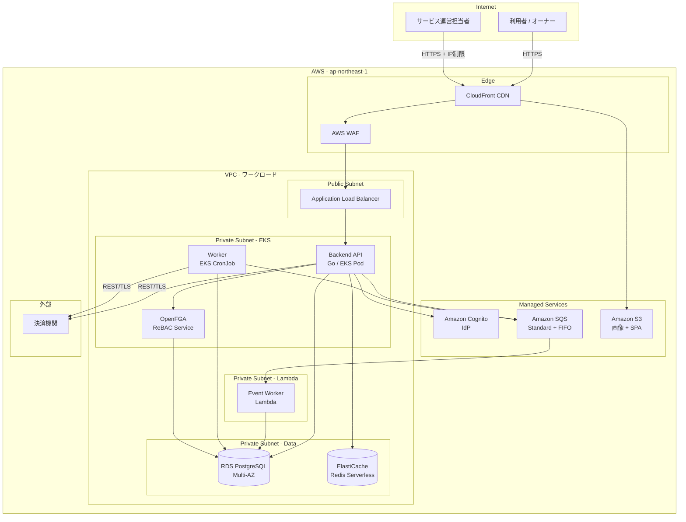
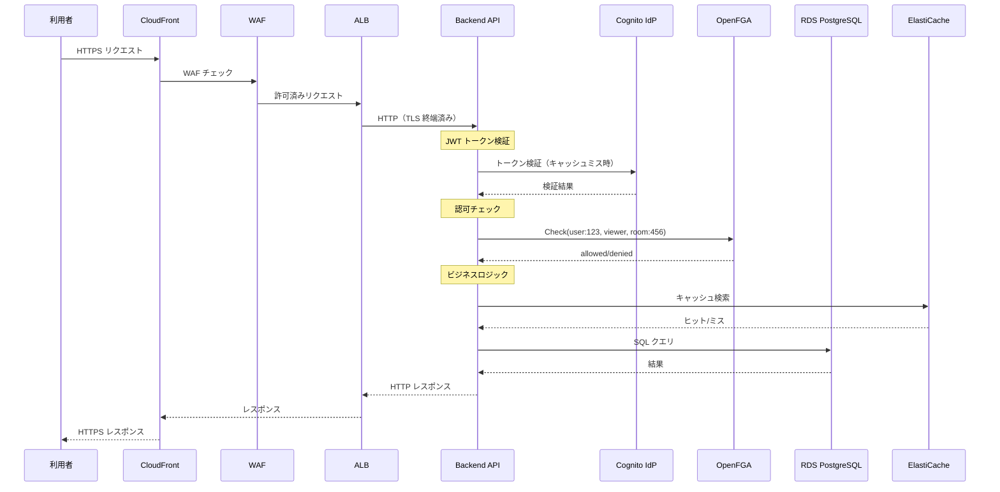
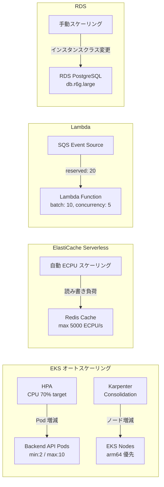

# 貸し会議室SaaS ターゲットアーキテクチャ（AWS）

## 概要

貸し会議室マッチングサービスの AWS インフラアーキテクチャ。共有プラットフォーム（EKS / Lambda / オブザーバビリティ / CI/CD）を活用し、Foundation ガードレール（リージョン制限・タグ強制・暗号化）に準拠する。

| 項目 | 値 |
|------|-----|
| ワークロードタイプ | Web アプリ |
| SLA | 99.9% |
| p99 レイテンシ | 500ms |
| トラフィック | steady（50 RPS baseline、spike 2x） |
| データ機密性 | restricted（PII） |
| 整合性 | 強整合性 |
| コスト月額（本番） | $1,500 - $2,500 |

## ワークロード全体構成図

## リクエストフロー図

## オートスケーリング構成図

## 主要サービスマッピング

| アーキテクチャティア | AWS サービス | 備考 |
|---|---|---|
| フロントエンド（利用者） | S3 + CloudFront | SPA 配信 |
| フロントエンド（管理者） | S3 + CloudFront + WAF IP制限 | 社内 IP のみ |
| API Gateway | ALB + WAF | TLS 終端、レート制限 |
| IdP | Amazon Cognito | OIDC、MFA |
| 認可サービス | OpenFGA on EKS | ReBAC |
| バックエンド API | EKS (Go) | 共有ランタイム |
| バックエンドワーカー | EKS CronJob + Lambda | タイマー系 + イベント駆動 |
| RDB | RDS PostgreSQL Multi-AZ | PITR 35日 |
| キャッシュ | ElastiCache Serverless | Redis 7.1 |
| オブジェクトストレージ | S3 | 画像保管 |
| メッセージキュー | SQS (Standard + FIFO) | DLQ 付き |
| オブザーバビリティ | Managed Prometheus + Grafana + X-Ray | 共有プラットフォーム |
| CI/CD | GitHub Actions + ArgoCD | GitOps |
| シークレット | Secrets Manager + ESO | 共有プラットフォーム |

## セキュリティ要件の対応

| 要件 | 対応 |
|------|------|
| TLS 暗号化 | ALB で TLS 終端、ACM 証明書自動更新 |
| 保管時暗号化 | RDS: KMS CMK、S3: SSE-KMS、ElastiCache: at-rest |
| WAF | AWS WAF マネージドルール 3 セット |
| IP 制限（管理画面） | WAF IP セットルール |
| MFA | Cognito TOTP（管理者必須） |
| 監査ログ | 構造化 JSON、1年保管、S3 アーカイブ |
| 決済機関連携 | 決済処理は外部委託のため PCI DSS 対象外。通信ログ記録、機密情報マスク |
