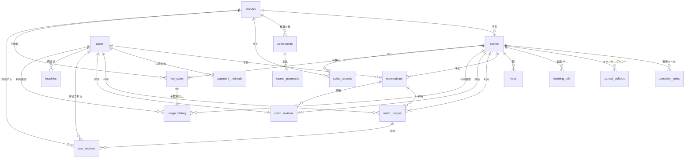

# データストアスキーマ

## サマリー

| データストア | 項目数 |
|------------|:------:|
| RDB テーブル | 18 |
| RDB インデックス | 45 |
| RDB 外部キー | 26 |
| KVS キーパターン | 11 |
| Object Storage バケット | 4 |

## RDB

全46UC の _model-summary.yaml を統合した RDB スキーマ定義。RDRA 情報.tsv の属性からカラム型を導出。

### テーブル一覧

| テーブル名 | RDRA 情報 | 説明 | カラム数 | インデックス数 | 利用 UC 数 |
|-----------|----------|------|:-------:|:----------:|:--------:|
| owners | オーナー情報 | 会議室を貸し出すオーナーのプロフィール・登録情報。審査・退会フローを管理する。 | 9 | 3 | 5 |
| rooms | 会議室情報 | 物理・バーチャル両方の会議室物件情報。公開状態・バーチャル属性を含む。 | 16 | 5 | 12 |
| operation_rules | 運用ルール | 会議室ごとの利用可能時間帯・最低/最大利用時間・貸出可否などの運用条件。 | 7 | 1 | 5 |
| cancel_policies | キャンセルポリシー | 予約取消時に適用されるキャンセル料の発生条件・返金ルール。 | 6 | 1 | 3 |
| meeting_urls | 会議URL | バーチャル会議室の予約確定時に利用者へ通知する会議URL。 | 6 | 1 | 2 |
| users | 利用者情報 | 会議室を利用する利用者の基本情報。予約・利用・評価の主体として各情報と紐づく。 | 5 | 0 | 2 |
| payment_methods | 決済情報 | 利用者が登録した決済手段（クレジットカード・電子マネー）。PCI DSS 準拠でトークン管理。 | 7 | 1 | 1 |
| reservations | 予約情報 | 利用者の会議室予約内容。物理・バーチャル両方の予約に対応。申請→確定→利用→取消の状態遷移を管理。 | 13 | 5 | 10 |
| keys | 鍵 | 物理会議室の鍵の貸出・返却状態。利用開始・終了を制御する物理インターフェース。 | 5 | 1 | 2 |
| room_usages | 会議室利用 | 会議室の実際の利用状態。鍵の受け渡し（物理）またはCronJob（バーチャル）をトリガーとして利用開始・終了を記録。 | 9 | 3 | 8 |
| room_reviews | 会議室評価 | 利用者が会議室またはオーナーに対して登録した評価（review_type で区別）。avg_rating 更新のトリガー。 | 10 | 6 | 6 |
| user_reviews | 利用者評価 | オーナーが利用者に対して登録した評価。次回以降の使用許諾判断の参考情報。 | 8 | 3 | 4 |
| inquiries | 問合せ | 利用者からオーナーまたはサービス運営担当者への問合せ・回答。inquiry_type で区別。 | 13 | 5 | 5 |
| usage_history | 利用履歴 | 会員別・物件別の会議室利用履歴。利用状況分析・精算計算の基礎データ。 | 7 | 2 | 4 |
| sales_records | 売上実績 | 会議室ごとの利用回数・売上金額の実績集計。オーナー運営改善・サービス収益把握に利用。 | 7 | 1 | 3 |
| fee_sales | 手数料売上 | サービス運営側の手数料売上を会議室別・貸出別に管理。サービス収益分析に利用。 | 8 | 2 | 2 |
| settlements | 精算情報 | 会議室利用料からサービス手数料を差し引いたオーナーへの精算額を管理。月末の精算処理に利用。 | 8 | 3 | 3 |
| owner_payments | オーナー精算 | 精算額を決済機関を通じてオーナーへ支払う処理結果。冪等キーによる二重支払防止。 | 7 | 2 | 2 |

### owners

**RDRA 情報**: オーナー情報
**説明**: 会議室を貸し出すオーナーのプロフィール・登録情報。審査・退会フローを管理する。

#### カラム

| カラム名 | 型 | NULL | 説明 |
|---------|---|:----:|------|
| owner_id | uuid | NO | オーナーID（PK） |
| name | string | NO | 氏名 |
| phone | string | YES | 連絡先電話番号 |
| email | string | NO | メールアドレス（一意） |
| status | string | NO | 審査状態 (審査待ち / 登録済み / 却下 / 退会) |
| applied_at | datetime | NO | 登録申請日時 |
| reviewed_at | datetime | YES | 審査完了日時 |
| withdrawn_at | datetime | YES | 退会日時 |
| updated_at | datetime | YES | 最終更新日時 |

#### インデックス

| 名前 | カラム | UNIQUE | 理由 | 利用 UC |
|------|-------|:------:|------|--------|
| idx_owners_email | ["email"] | YES | メールアドレス重複チェック（オーナー登録申請時） | ["オーナー登録申請を行う"] |
| idx_owners_status | ["status"] | NO | 審査待ち一覧取得・状態別フィルタリング | ["オーナー登録を審査する", "オーナー登録審査一覧を確認する"] |
| idx_owners_status_applied_at | ["status", "applied_at"] | NO | 審査状態フィルタ + 申請日時ソート | ["オーナー登録審査一覧を確認する"] |

#### 利用 UC

| UC | 操作 |
|---|------|
| オーナー登録申請を行う | ["INSERT", "SELECT"] |
| オーナー情報を変更する | ["SELECT", "UPDATE"] |
| オーナー登録を審査する | ["SELECT", "UPDATE"] |
| 退会を申請する | ["SELECT", "UPDATE"] |
| オーナー登録審査一覧を確認する | ["SELECT"] |

### rooms

**RDRA 情報**: 会議室情報
**説明**: 物理・バーチャル両方の会議室物件情報。公開状態・バーチャル属性を含む。

#### カラム

| カラム名 | 型 | NULL | 説明 |
|---------|---|:----:|------|
| room_id | uuid | NO | 会議室ID（PK） |
| owner_id | uuid | NO | オーナーID（FK → owners） |
| room_name | string | NO | 会議室名 |
| room_type | string | NO | 会議室種別 (physical / virtual) |
| location | string | YES | 所在地（物理会議室のみ） |
| area | string | YES | エリア区分（検索絞り込み用） |
| capacity | integer | YES | 収容人数 |
| price | decimal | NO | 時間単価（利用料金） |
| facilities | text | YES | 設備・機能（JSON または CSV 形式） |
| tool_type | string | YES | 会議ツール種別（バーチャルのみ: Zoom/Teams/Google Meet） |
| max_connections | integer | YES | 同時接続数（バーチャルのみ） |
| recording_enabled | boolean | YES | 録画可否（バーチャルのみ） |
| status | string | NO | 公開状態 (非公開 / 公開中) |
| avg_rating | decimal | YES | 平均評価スコア（評価登録時に更新） |
| created_at | datetime | NO | 登録日時 |
| updated_at | datetime | YES | 最終更新日時 |

#### 外部キー

| カラム | 参照先テーブル | 参照先カラム | ON DELETE |
|-------|-------------|------------|----------|
| ["owner_id"] | owners | ["owner_id"] | RESTRICT |

#### インデックス

| 名前 | カラム | UNIQUE | 理由 | 利用 UC |
|------|-------|:------:|------|--------|
| idx_rooms_owner_id_status | ["owner_id", "status"] | NO | オーナーの会議室一覧と公開状態フィルタ | ["会議室を登録する", "会議室の公開状態を変更する", "退会を申請する"] |
| idx_rooms_status_type_area | ["status", "room_type", "area"] | NO | 公開中の会議室を種別・エリアで絞り込み検索 | ["会議室を検索する"] |
| idx_rooms_status_capacity | ["status", "capacity"] | NO | 収容人数フィルタリング | ["会議室を検索する"] |
| idx_rooms_status_avg_rating | ["status", "avg_rating"] | NO | 評価スコアフィルタリング | ["会議室を検索する"] |
| idx_rooms_owner_id | ["owner_id"] | NO | オーナーの全会議室を取得（退会時一括非公開等） | ["バーチャル会議室を登録する", "退会を申請する"] |

#### 利用 UC

| UC | 操作 |
|---|------|
| 会議室を登録する | ["INSERT"] |
| バーチャル会議室を登録する | ["INSERT"] |
| 会議室情報を変更する | ["SELECT", "UPDATE"] |
| 会議室の公開状態を変更する | ["SELECT", "UPDATE"] |
| キャンセルポリシーを設定する | ["UPDATE"] |
| 運用ルールを設定する | ["UPDATE"] |
| 会議室を検索する | ["SELECT"] |
| 会議室の詳細を確認する | ["SELECT"] |
| 退会を申請する | ["UPDATE"] |
| 会議室を評価する | ["UPDATE"] |
| バーチャル会議室を評価する | ["UPDATE"] |
| 利用履歴を管理する | ["SELECT"] |

### operation_rules

**RDRA 情報**: 運用ルール
**説明**: 会議室ごとの利用可能時間帯・最低/最大利用時間・貸出可否などの運用条件。

#### カラム

| カラム名 | 型 | NULL | 説明 |
|---------|---|:----:|------|
| rule_id | uuid | NO | ルールID（PK） |
| room_id | uuid | NO | 会議室ID（FK → rooms） |
| available_hours | string | YES | 利用可能時間帯（例: 09:00-22:00） |
| min_usage_time | integer | YES | 最低利用時間（分） |
| max_usage_time | integer | YES | 最大利用時間（分） |
| can_rent | boolean | NO | 貸出可否 |
| created_at | datetime | NO | 設定日時 |

#### 外部キー

| カラム | 参照先テーブル | 参照先カラム | ON DELETE |
|-------|-------------|------------|----------|
| ["room_id"] | rooms | ["room_id"] | CASCADE |

#### インデックス

| 名前 | カラム | UNIQUE | 理由 | 利用 UC |
|------|-------|:------:|------|--------|
| idx_operation_rules_room_id | ["room_id"] | NO | 会議室IDに紐づく運用ルールの取得 | ["運用ルールを設定する", "予約を申請する", "予約を変更する", "会議室の詳細を確認する", "キャンセルポリシーを設定する"] |

#### 利用 UC

| UC | 操作 |
|---|------|
| 運用ルールを設定する | ["SELECT", "INSERT"] |
| キャンセルポリシーを設定する | ["SELECT"] |
| 予約を申請する | ["SELECT"] |
| 予約を変更する | ["SELECT"] |
| 会議室の詳細を確認する | ["SELECT"] |

### cancel_policies

**RDRA 情報**: キャンセルポリシー
**説明**: 予約取消時に適用されるキャンセル料の発生条件・返金ルール。

#### カラム

| カラム名 | 型 | NULL | 説明 |
|---------|---|:----:|------|
| policy_id | uuid | NO | ポリシーID（PK） |
| room_id | uuid | NO | 会議室ID（FK → rooms） |
| cancel_deadline | integer | YES | キャンセル期限（利用開始何時間前まで無料か） |
| cancel_rate | decimal | YES | キャンセル料率（%） |
| refund_rule | text | YES | 返金ルール（テキスト説明） |
| created_at | datetime | NO | 設定日時 |

#### 外部キー

| カラム | 参照先テーブル | 参照先カラム | ON DELETE |
|-------|-------------|------------|----------|
| ["room_id"] | rooms | ["room_id"] | CASCADE |

#### インデックス

| 名前 | カラム | UNIQUE | 理由 | 利用 UC |
|------|-------|:------:|------|--------|
| idx_cancel_policies_room_id | ["room_id"] | NO | 会議室IDに紐づくキャンセルポリシー取得（予約取消時のキャンセル料計算） | ["キャンセルポリシーを設定する", "予約を取り消す", "運用ルールを設定する"] |

#### 利用 UC

| UC | 操作 |
|---|------|
| キャンセルポリシーを設定する | ["SELECT", "INSERT"] |
| 運用ルールを設定する | ["SELECT"] |
| 予約を取り消す | ["SELECT"] |

### meeting_urls

**RDRA 情報**: 会議URL
**説明**: バーチャル会議室の予約確定時に利用者へ通知する会議URL。

#### カラム

| カラム名 | 型 | NULL | 説明 |
|---------|---|:----:|------|
| meeting_url_id | uuid | NO | 会議URL_ID（PK） |
| room_id | uuid | NO | 会議室ID（FK → rooms） |
| tool_type | string | NO | 会議ツール種別（Zoom/Teams/Google Meet） |
| meeting_url | string | NO | 会議URL |
| expired_at | datetime | YES | 有効期限 |
| created_at | datetime | NO | 登録日時 |

#### 外部キー

| カラム | 参照先テーブル | 参照先カラム | ON DELETE |
|-------|-------------|------------|----------|
| ["room_id"] | rooms | ["room_id"] | CASCADE |

#### インデックス

| 名前 | カラム | UNIQUE | 理由 | 利用 UC |
|------|-------|:------:|------|--------|
| idx_meeting_urls_room_id | ["room_id"] | NO | 予約確定時の会議URL取得（FaaS 会議URL通知処理） | ["バーチャル会議室を登録する", "会議URLを通知する"] |

#### 利用 UC

| UC | 操作 |
|---|------|
| バーチャル会議室を登録する | ["INSERT"] |
| 会議URLを通知する | ["SELECT"] |

### users

**RDRA 情報**: 利用者情報
**説明**: 会議室を利用する利用者の基本情報。予約・利用・評価の主体として各情報と紐づく。

#### カラム

| カラム名 | 型 | NULL | 説明 |
|---------|---|:----:|------|
| user_id | uuid | NO | 利用者ID（PK） |
| name | string | NO | 氏名 |
| phone | string | YES | 連絡先電話番号 |
| email | string | NO | メールアドレス（一意） |
| registered_at | datetime | NO | 登録日時 |

#### 利用 UC

| UC | 操作 |
|---|------|
| 会議URLを通知する | ["SELECT"] |
| 利用履歴を管理する | ["SELECT"] |

### payment_methods

**RDRA 情報**: 決済情報
**説明**: 利用者が登録した決済手段（クレジットカード・電子マネー）。PCI DSS 準拠でトークン管理。

#### カラム

| カラム名 | 型 | NULL | 説明 |
|---------|---|:----:|------|
| payment_method_id | uuid | NO | 決済方法ID（PK） |
| user_id | uuid | NO | 利用者ID（FK → users） |
| method_type | string | NO | 決済方法 (クレジットカード / 電子マネー) |
| token | string | NO | 暗号化済み決済トークン（PCI DSS 準拠） |
| last_four | string | YES | カード番号末尾4桁（表示用） |
| status | string | NO | 決済手段状態 (決済手段登録済み / 無効) |
| created_at | datetime | NO | 登録日時 |

#### 外部キー

| カラム | 参照先テーブル | 参照先カラム | ON DELETE |
|-------|-------------|------------|----------|
| ["user_id"] | users | ["user_id"] | RESTRICT |

#### インデックス

| 名前 | カラム | UNIQUE | 理由 | 利用 UC |
|------|-------|:------:|------|--------|
| idx_payment_methods_user_id_status | ["user_id", "status"] | NO | 利用者の有効な決済方法一覧取得（予約申請時） | ["決済方法を設定する"] |

#### 利用 UC

| UC | 操作 |
|---|------|
| 決済方法を設定する | ["INSERT"] |

### reservations

**RDRA 情報**: 予約情報
**説明**: 利用者の会議室予約内容。物理・バーチャル両方の予約に対応。申請→確定→利用→取消の状態遷移を管理。

#### カラム

| カラム名 | 型 | NULL | 説明 |
|---------|---|:----:|------|
| reservation_id | uuid | NO | 予約ID（PK） |
| user_id | uuid | NO | 利用者ID（FK → users） |
| room_id | uuid | NO | 会議室ID（FK → rooms） |
| room_type | string | NO | 会議室種別スナップショット (physical / virtual) |
| start_at | datetime | NO | 利用開始日時 |
| end_at | datetime | NO | 利用終了日時 |
| status | string | NO | 予約状態 (申請 / 確定 / 変更 / 取消) |
| fee | decimal | NO | 利用料金 |
| payment_method_id | uuid | YES | 決済方法ID（FK → payment_methods） |
| cancel_fee | decimal | YES | キャンセル料（取消時のみ） |
| rejection_reason | text | YES | 拒否理由（審査拒否時のみ） |
| created_at | datetime | NO | 申請日時 |
| updated_at | datetime | YES | 最終更新日時 |

#### 外部キー

| カラム | 参照先テーブル | 参照先カラム | ON DELETE |
|-------|-------------|------------|----------|
| ["user_id"] | users | ["user_id"] | RESTRICT |
| ["room_id"] | rooms | ["room_id"] | RESTRICT |
| ["payment_method_id"] | payment_methods | ["payment_method_id"] | SET NULL |

#### インデックス

| 名前 | カラム | UNIQUE | 理由 | 利用 UC |
|------|-------|:------:|------|--------|
| idx_reservations_room_id_start_end_status | ["room_id", "start_at", "end_at", "status"] | NO | 重複予約チェック（物理・バーチャル共通） | ["予約を申請する", "バーチャル会議室を予約する", "予約を変更する"] |
| idx_reservations_user_id_status | ["user_id", "status"] | NO | 利用者が自身の予約一覧を状態でフィルタリング | ["予約を申請する", "予約を取り消す"] |
| idx_reservations_room_id_status | ["room_id", "status"] | NO | オーナーが自身の会議室への申請一覧を取得 | ["予約を許諾する", "予約を審査する"] |
| idx_reservations_status_room_type_start_at | ["status", "room_type", "start_at"] | NO | CronJob による利用開始対象の確定済みバーチャル予約取得 | ["バーチャル会議室利用を開始する"] |
| idx_reservations_status_room_type_end_at | ["status", "room_type", "end_at"] | NO | CronJob による利用終了対象の確定済みバーチャル予約取得 | ["バーチャル会議室利用を終了する"] |

#### 利用 UC

| UC | 操作 |
|---|------|
| 予約を申請する | ["SELECT", "INSERT"] |
| バーチャル会議室を予約する | ["SELECT", "INSERT"] |
| 予約を変更する | ["SELECT", "UPDATE"] |
| 予約を取り消す | ["SELECT", "UPDATE"] |
| 予約を許諾する | ["SELECT", "UPDATE"] |
| 予約を審査する | ["SELECT", "UPDATE"] |
| 鍵の貸出を記録する | ["SELECT"] |
| 会議URLを通知する | ["SELECT"] |
| バーチャル会議室利用を開始する | ["SELECT"] |
| バーチャル会議室利用を終了する | ["SELECT"] |

### keys

**RDRA 情報**: 鍵
**説明**: 物理会議室の鍵の貸出・返却状態。利用開始・終了を制御する物理インターフェース。

#### カラム

| カラム名 | 型 | NULL | 説明 |
|---------|---|:----:|------|
| key_id | uuid | NO | 鍵ID（PK） |
| room_id | uuid | NO | 会議室ID（FK → rooms） |
| status | string | NO | 貸出状態 (保管中 / 貸出中) |
| lent_at | datetime | YES | 貸出日時 |
| returned_at | datetime | YES | 返却日時 |

#### 外部キー

| カラム | 参照先テーブル | 参照先カラム | ON DELETE |
|-------|-------------|------------|----------|
| ["room_id"] | rooms | ["room_id"] | RESTRICT |

#### インデックス

| 名前 | カラム | UNIQUE | 理由 | 利用 UC |
|------|-------|:------:|------|--------|
| idx_keys_room_id_status | ["room_id", "status"] | NO | 会議室の鍵の貸出状態確認・貸出中鍵の特定（悲観ロック対象） | ["鍵の貸出を記録する", "鍵の返却を記録する"] |

#### 利用 UC

| UC | 操作 |
|---|------|
| 鍵の貸出を記録する | ["SELECT", "UPDATE"] |
| 鍵の返却を記録する | ["SELECT", "UPDATE"] |

### room_usages

**RDRA 情報**: 会議室利用
**説明**: 会議室の実際の利用状態。鍵の受け渡し（物理）またはCronJob（バーチャル）をトリガーとして利用開始・終了を記録。

#### カラム

| カラム名 | 型 | NULL | 説明 |
|---------|---|:----:|------|
| usage_id | uuid | NO | 利用ID（PK） |
| reservation_id | uuid | NO | 予約ID（FK → reservations） |
| room_id | uuid | NO | 会議室ID（FK → rooms） |
| user_id | uuid | NO | 利用者ID（FK → users） |
| status | string | NO | 利用状態 (利用開始 / 利用中 / 利用終了) |
| started_at | datetime | YES | 利用開始日時 |
| ended_at | datetime | YES | 利用終了日時 |
| usage_minutes | integer | YES | 実利用時間（分） |
| used_at | datetime | YES | 利用日時（集計用スナップショット） |

#### 外部キー

| カラム | 参照先テーブル | 参照先カラム | ON DELETE |
|-------|-------------|------------|----------|
| ["reservation_id"] | reservations | ["reservation_id"] | RESTRICT |
| ["room_id"] | rooms | ["room_id"] | RESTRICT |
| ["user_id"] | users | ["user_id"] | RESTRICT |

#### インデックス

| 名前 | カラム | UNIQUE | 理由 | 利用 UC |
|------|-------|:------:|------|--------|
| idx_room_usages_reservation_id | ["reservation_id"] | NO | 冪等チェック（既に開始済みか確認） | ["バーチャル会議室利用を開始する"] |
| idx_room_usages_reservation_id_status | ["reservation_id", "status"] | NO | 利用中レコードの冪等チェック・利用終了対象の特定 | ["バーチャル会議室利用を終了する", "鍵の返却を記録する"] |
| idx_room_usages_room_id_used_at | ["room_id", "used_at"] | NO | 会議室別利用回数集計 | ["利用回数を確認する"] |

#### 利用 UC

| UC | 操作 |
|---|------|
| 鍵の貸出を記録する | ["INSERT"] |
| 鍵の返却を記録する | ["SELECT", "UPDATE"] |
| バーチャル会議室利用を開始する | ["SELECT", "INSERT"] |
| バーチャル会議室利用を終了する | ["SELECT", "UPDATE"] |
| 会議室を評価する | ["SELECT"] |
| オーナーを評価する | ["SELECT"] |
| 利用者を評価する | ["SELECT"] |
| 利用回数を確認する | ["SELECT"] |

### room_reviews

**RDRA 情報**: 会議室評価
**説明**: 利用者が会議室またはオーナーに対して登録した評価（review_type で区別）。avg_rating 更新のトリガー。

#### カラム

| カラム名 | 型 | NULL | 説明 |
|---------|---|:----:|------|
| review_id | uuid | NO | 評価ID（PK） |
| review_type | string | NO | 評価種別 (room / owner) |
| room_type | string | YES | 会議室種別スナップショット (physical / virtual) |
| user_id | uuid | NO | 評価した利用者ID（FK → users） |
| room_id | uuid | YES | 評価対象会議室ID（review_type=room 時） |
| owner_id | uuid | YES | 評価対象オーナーID（review_type=owner 時） |
| reservation_id | uuid | NO | 紐づく予約ID（FK → reservations） |
| score | decimal | NO | 評価スコア（1.0〜5.0） |
| comment | text | YES | 評価コメント |
| created_at | datetime | NO | 評価登録日時 |

#### 外部キー

| カラム | 参照先テーブル | 参照先カラム | ON DELETE |
|-------|-------------|------------|----------|
| ["user_id"] | users | ["user_id"] | RESTRICT |
| ["reservation_id"] | reservations | ["reservation_id"] | RESTRICT |

#### インデックス

| 名前 | カラム | UNIQUE | 理由 | 利用 UC |
|------|-------|:------:|------|--------|
| idx_room_reviews_user_id_room_id_review_type | ["user_id", "room_id", "review_type"] | NO | 重複評価チェック（利用者・会議室・評価種別） | ["会議室を評価する"] |
| idx_room_reviews_reservation_id_review_type | ["reservation_id", "review_type"] | NO | 重複チェック（予約IDと評価種別） | ["オーナーを評価する"] |
| idx_room_reviews_reservation_id_review_type_room_type | ["reservation_id", "review_type", "room_type"] | NO | バーチャル評価の重複チェック | ["バーチャル会議室を評価する", "バーチャル会議室オーナーを評価する"] |
| idx_room_reviews_room_id_review_type | ["room_id", "review_type"] | NO | avg_rating 計算のため会議室ID・評価種別で集計 | ["バーチャル会議室を評価する"] |
| idx_room_reviews_room_id_created_at | ["room_id", "created_at"] | NO | 会議室の最新レビュー取得（日時降順） | ["会議室の詳細を確認する"] |
| idx_room_reviews_room_id_reviewed_at | ["room_id", "reviewed_at"] | NO | 会議室の評価一覧（新しい順） | ["会議室の評価を確認する"] |

#### 利用 UC

| UC | 操作 |
|---|------|
| 会議室を評価する | ["SELECT", "INSERT"] |
| オーナーを評価する | ["SELECT", "INSERT"] |
| バーチャル会議室を評価する | ["SELECT", "INSERT"] |
| バーチャル会議室オーナーを評価する | ["SELECT", "INSERT"] |
| 会議室の詳細を確認する | ["SELECT"] |
| 会議室の評価を確認する | ["SELECT"] |

### user_reviews

**RDRA 情報**: 利用者評価
**説明**: オーナーが利用者に対して登録した評価。次回以降の使用許諾判断の参考情報。

#### カラム

| カラム名 | 型 | NULL | 説明 |
|---------|---|:----:|------|
| review_id | uuid | NO | 評価ID（PK） |
| review_type | string | NO | 評価種別 (user_rating) |
| owner_id | uuid | NO | 評価したオーナーID（FK → owners） |
| user_id | uuid | NO | 評価対象利用者ID（FK → users） |
| usage_id | uuid | NO | 会議室利用ID（FK → room_usages） |
| score | decimal | NO | 評価スコア（1.0〜5.0） |
| comment | text | YES | 評価コメント |
| evaluated_at | datetime | NO | 評価日時 |

#### 外部キー

| カラム | 参照先テーブル | 参照先カラム | ON DELETE |
|-------|-------------|------------|----------|
| ["owner_id"] | owners | ["owner_id"] | RESTRICT |
| ["user_id"] | users | ["user_id"] | RESTRICT |
| ["usage_id"] | room_usages | ["usage_id"] | RESTRICT |

#### インデックス

| 名前 | カラム | UNIQUE | 理由 | 利用 UC |
|------|-------|:------:|------|--------|
| idx_user_reviews_usage_id_review_type | ["usage_id", "review_type"] | NO | 重複評価チェック（利用IDと評価種別） | ["利用者を評価する"] |
| idx_user_reviews_user_id_review_type | ["user_id", "review_type"] | NO | 審査時に利用者の評価スコアを参照 | ["予約を審査する", "利用者の評価を確認する"] |
| idx_user_reviews_owner_id_review_type_evaluated_at | ["owner_id", "review_type", "evaluated_at"] | NO | オーナー別・評価種別フィルタ付きページネーション | ["利用者評価一覧を確認する"] |

#### 利用 UC

| UC | 操作 |
|---|------|
| 利用者を評価する | ["SELECT", "INSERT"] |
| 利用者の評価を確認する | ["SELECT"] |
| 利用者評価一覧を確認する | ["SELECT"] |
| 予約を審査する | ["SELECT"] |

### inquiries

**RDRA 情報**: 問合せ
**説明**: 利用者からオーナーまたはサービス運営担当者への問合せ・回答。inquiry_type で区別。

#### カラム

| カラム名 | 型 | NULL | 説明 |
|---------|---|:----:|------|
| inquiry_id | uuid | NO | 問合せID（PK） |
| user_id | uuid | NO | 問合せした利用者ID（FK → users） |
| inquiry_type | string | NO | 問合せ種別 (owner / service) |
| target_type | string | YES | 問合せ先区分 (owner / service) |
| target_id | uuid | YES | 問合せ先ID（オーナーIDまたはサービス担当者ID） |
| owner_id | uuid | YES | 問合せ先オーナーID（inquiry_type=owner 時） |
| content | text | NO | 問合せ内容 |
| reply_content | text | YES | 回答内容 |
| answer_content | text | YES | サービス運営担当者の回答内容 |
| status | string | NO | 問合せ状態 (未対応 / 回答済み) |
| created_at | datetime | NO | 問合せ日時 |
| replied_at | datetime | YES | オーナー回答日時 |
| answered_at | datetime | YES | サービス運営回答日時 |

#### 外部キー

| カラム | 参照先テーブル | 参照先カラム | ON DELETE |
|-------|-------------|------------|----------|
| ["user_id"] | users | ["user_id"] | RESTRICT |

#### インデックス

| 名前 | カラム | UNIQUE | 理由 | 利用 UC |
|------|-------|:------:|------|--------|
| idx_inquiries_user_id_status | ["user_id", "status"] | NO | 利用者の問合せ履歴と未対応件数確認 | ["サービスへ問合せする"] |
| idx_inquiries_target_type_target_id_status | ["target_type", "target_id", "status"] | NO | オーナーが自身への問合せを状態でフィルタリング | ["オーナーへ問合せする"] |
| idx_inquiries_target_id_status | ["target_id", "status"] | NO | オーナー宛の未対応問合せ一覧 | ["オーナーへ問合せを送信する"] |
| idx_inquiries_owner_id_status | ["owner_id", "status"] | NO | オーナーが自身の問合せを状態でフィルタリング | ["問合せに回答する"] |
| idx_inquiries_status_inquiry_type | ["status", "inquiry_type"] | NO | 未対応のサービス問合せ一覧取得 | ["問合せに対応する"] |

#### 利用 UC

| UC | 操作 |
|---|------|
| サービスへ問合せする | ["INSERT"] |
| オーナーへ問合せする | ["INSERT"] |
| オーナーへ問合せを送信する | ["INSERT"] |
| 問合せに回答する | ["SELECT", "UPDATE"] |
| 問合せに対応する | ["SELECT", "UPDATE"] |

### usage_history

**RDRA 情報**: 利用履歴
**説明**: 会員別・物件別の会議室利用履歴。利用状況分析・精算計算の基礎データ。

#### カラム

| カラム名 | 型 | NULL | 説明 |
|---------|---|:----:|------|
| history_id | uuid | NO | 履歴ID（PK） |
| user_id | uuid | NO | 利用者ID（FK → users） |
| room_id | uuid | NO | 会議室ID（FK → rooms） |
| usage_date | datetime | NO | 利用日時 |
| usage_hours | decimal | YES | 利用時間（時間） |
| fee | decimal | NO | 利用料金 |
| rental_id | uuid | YES | 会議室利用ID（FK → room_usages） |

#### 外部キー

| カラム | 参照先テーブル | 参照先カラム | ON DELETE |
|-------|-------------|------------|----------|
| ["user_id"] | users | ["user_id"] | RESTRICT |
| ["room_id"] | rooms | ["room_id"] | RESTRICT |

#### インデックス

| 名前 | カラム | UNIQUE | 理由 | 利用 UC |
|------|-------|:------:|------|--------|
| idx_usage_history_room_id_usage_date | ["room_id", "usage_date"] | NO | 会議室別・期間別の集計 | ["利用状況を分析する", "手数料売上を分析する"] |
| idx_usage_history_user_id_usage_date | ["user_id", "usage_date"] | NO | 利用者別・期間別の履歴検索 | ["利用履歴を管理する"] |

#### 利用 UC

| UC | 操作 |
|---|------|
| 利用状況を分析する | ["SELECT"] |
| 利用履歴を管理する | ["SELECT"] |
| 手数料売上を分析する | ["SELECT"] |
| 精算額を計算する | ["SELECT"] |

### sales_records

**RDRA 情報**: 売上実績
**説明**: 会議室ごとの利用回数・売上金額の実績集計。オーナー運営改善・サービス収益把握に利用。

#### カラム

| カラム名 | 型 | NULL | 説明 |
|---------|---|:----:|------|
| record_id | uuid | NO | 実績ID（PK） |
| room_id | uuid | NO | 会議室ID（FK → rooms） |
| owner_id | uuid | NO | オーナーID（FK → owners） |
| period | string | NO | 集計期間（例: 2026-03） |
| usage_count | integer | NO | 利用回数 |
| sales_amount | decimal | NO | 売上金額 |
| created_at | datetime | NO | 集計日時 |

#### 外部キー

| カラム | 参照先テーブル | 参照先カラム | ON DELETE |
|-------|-------------|------------|----------|
| ["room_id"] | rooms | ["room_id"] | RESTRICT |
| ["owner_id"] | owners | ["owner_id"] | RESTRICT |

#### インデックス

| 名前 | カラム | UNIQUE | 理由 | 利用 UC |
|------|-------|:------:|------|--------|
| idx_sales_records_owner_id_period | ["owner_id", "period"] | NO | オーナー別・期間別の利用回数・売上集計 | ["利用回数を確認する", "売上実績を確認する"] |

#### 利用 UC

| UC | 操作 |
|---|------|
| 利用回数を確認する | ["SELECT"] |
| 売上実績を確認する | ["SELECT"] |
| 利用状況を分析する | ["SELECT"] |

### fee_sales

**RDRA 情報**: 手数料売上
**説明**: サービス運営側の手数料売上を会議室別・貸出別に管理。サービス収益分析に利用。

#### カラム

| カラム名 | 型 | NULL | 説明 |
|---------|---|:----:|------|
| fee_id | uuid | NO | 手数料ID（PK） |
| room_id | uuid | NO | 会議室ID（FK → rooms） |
| rental_id | uuid | YES | 貸出ID（会議室利用ID） |
| owner_id | uuid | NO | オーナーID（FK → owners） |
| fee_rate | decimal | NO | 手数料率（%） |
| fee_amount | decimal | NO | 手数料金額 |
| month | string | NO | 計上月（例: 2026-03） |
| charged_at | datetime | NO | 計上日時 |

#### 外部キー

| カラム | 参照先テーブル | 参照先カラム | ON DELETE |
|-------|-------------|------------|----------|
| ["room_id"] | rooms | ["room_id"] | RESTRICT |
| ["owner_id"] | owners | ["owner_id"] | RESTRICT |

#### インデックス

| 名前 | カラム | UNIQUE | 理由 | 利用 UC |
|------|-------|:------:|------|--------|
| idx_fee_sales_room_id_charged_at | ["room_id", "charged_at"] | NO | 会議室別・期間別の手数料集計 | ["手数料売上を分析する"] |
| idx_fee_sales_owner_id_month | ["owner_id", "month"] | NO | 月別オーナー別手数料合計集計（精算計算） | ["精算額を計算する"] |

#### 利用 UC

| UC | 操作 |
|---|------|
| 手数料売上を分析する | ["SELECT"] |
| 精算額を計算する | ["SELECT"] |

### settlements

**RDRA 情報**: 精算情報
**説明**: 会議室利用料からサービス手数料を差し引いたオーナーへの精算額を管理。月末の精算処理に利用。

#### カラム

| カラム名 | 型 | NULL | 説明 |
|---------|---|:----:|------|
| settlement_id | uuid | NO | 精算ID（PK） |
| owner_id | uuid | NO | オーナーID（FK → owners） |
| target_month | string | NO | 精算対象月（例: 2026-03） |
| usage_fee_total | decimal | YES | 利用料合計 |
| commission_total | decimal | YES | 手数料合計 |
| amount | decimal | YES | 精算額（利用料合計 - 手数料合計） |
| status | string | NO | 精算状態 (未精算 / 精算計算済み / 支払処理中 / 支払済み) |
| paid_at | datetime | YES | 精算日時 |

#### 外部キー

| カラム | 参照先テーブル | 参照先カラム | ON DELETE |
|-------|-------------|------------|----------|
| ["owner_id"] | owners | ["owner_id"] | RESTRICT |

#### インデックス

| 名前 | カラム | UNIQUE | 理由 | 利用 UC |
|------|-------|:------:|------|--------|
| idx_settlements_status | ["status"] | NO | 精算計算済み一覧取得 | ["精算を実行する"] |
| idx_settlements_status_target_month | ["status", "target_month"] | NO | 未精算一覧取得・精算計算済み更新 | ["精算額を計算する"] |
| idx_settlements_owner_id_status | ["owner_id", "status"] | NO | オーナー別精算履歴参照 | ["精算結果を確認する"] |

#### 利用 UC

| UC | 操作 |
|---|------|
| 精算額を計算する | ["SELECT", "UPDATE"] |
| 精算を実行する | ["SELECT", "UPDATE"] |
| 精算結果を確認する | ["SELECT"] |

### owner_payments

**RDRA 情報**: オーナー精算
**説明**: 精算額を決済機関を通じてオーナーへ支払う処理結果。冪等キーによる二重支払防止。

#### カラム

| カラム名 | 型 | NULL | 説明 |
|---------|---|:----:|------|
| payment_id | uuid | NO | 精算実行ID（PK） |
| settlement_id | uuid | NO | 精算ID（FK → settlements） |
| external_payment_id | string | YES | 決済機関連携ID |
| amount | decimal | NO | 支払金額 |
| status | string | NO | 支払状態 (支払処理中 / 支払済み / 支払失敗) |
| idempotency_key | string | NO | 冪等キー（二重支払防止） |
| paid_at | datetime | YES | 支払日時 |

#### 外部キー

| カラム | 参照先テーブル | 参照先カラム | ON DELETE |
|-------|-------------|------------|----------|
| ["settlement_id"] | settlements | ["settlement_id"] | RESTRICT |

#### インデックス

| 名前 | カラム | UNIQUE | 理由 | 利用 UC |
|------|-------|:------:|------|--------|
| idx_owner_payments_idempotency_key | ["idempotency_key"] | YES | 冪等性チェック（二重支払防止） | ["精算を実行する"] |
| idx_owner_payments_settlement_id | ["settlement_id"] | NO | 精算詳細の支払情報取得 | ["精算結果を確認する"] |

#### 利用 UC

| UC | 操作 |
|---|------|
| 精算を実行する | ["INSERT", "UPDATE"] |
| 精算結果を確認する | ["SELECT"] |

### ER 図

## KVS

全46UC の _model-summary.yaml kvs セクションを統合した KVS キーパターン定義。arch-design.yaml で tier-datastore-kvs が定義されている。

| キーパターン | 用途 | 値の型 | TTL | 利用 UC |
|------------|------|-------|-----|--------|
| `session:user:{user_id}` | session | object — { user_id, role, owner_id?, expires_at } | 15m | 予約を申請する, バーチャル会議室を予約する, 予約を変更する, 予約を取り消す, 予約を許諾する, 会議室を登録する, バーチャル会議室を登録する, 会議室情報を変更する, 会議室の公開状態を変更する, オーナー登録申請を行う, オーナー情報を変更する, 退会を申請する, 鍵の貸出を記録する, 鍵の返却を記録する, 利用者を評価する, 精算を実行する, 精算額を計算する |
| `session:owner:{owner_id}` | session | object — { owner_id, role: 'owner', email, expires_at } | 15m | 会議室を登録する, バーチャル会議室を登録する, キャンセルポリシーを設定する, 運用ルールを設定する, 問合せに回答する, 予約を審査する, 利用者を評価する, 売上実績を確認する, 利用回数を確認する |
| `search:{hash(conditions)}` | cache | object — { rooms: RoomSummary[], total: integer, page: integer } | 60s | 会議室を検索する |
| `room_detail:{room_id}` | cache | object — { room, operation_rules, cancel_policy, recent_reviews } | 5m | 会議室の詳細を確認する, 会議室の評価を確認する |
| `rate_limit:api:{user_id}:{endpoint}` | rate-limit | integer — リクエスト回数カウンター | 1m | 予約を申請する, バーチャル会議室を予約する, オーナーへ問合せする, サービスへ問合せする, オーナーへ問合せを送信する |
| `rate_limit:api:anon:{ip}:{endpoint}` | rate-limit | integer — リクエスト回数カウンター | 1m | 会議室を検索する, 会議室の詳細を確認する |
| `lock:reservation:{room_id}:{date}` | lock | string — ロック取得者の request_id | 5s | 予約を申請する, バーチャル会議室を予約する, 予約を変更する |
| `lock:key:{room_id}` | lock | string — ロック取得者の request_id | 10s | 鍵の貸出を記録する, 鍵の返却を記録する |
| `lock:settlement:{settlement_id}` | lock | string — ロック取得者の request_id | 30s | 精算を実行する |
| `idempotency:{idempotency_key}` | idempotency | object — { status, response_body, created_at } | 24h | 精算を実行する |
| `virtual_usage_started:{reservation_id}` | idempotency | boolean — true | 2h | バーチャル会議室利用を開始する |

### `session:user:{user_id}`

- **用途**: session
- **値の型**: object — { user_id, role, owner_id?, expires_at }
- **TTL**: 15m
- **説明**: 認証済みユーザーのセッション情報。JWT 検証後にサーバーサイドセッションとして保持。15分スライドウィンドウ TTL。
- **利用 UC**: 予約を申請する, バーチャル会議室を予約する, 予約を変更する, 予約を取り消す, 予約を許諾する, 会議室を登録する, バーチャル会議室を登録する, 会議室情報を変更する, 会議室の公開状態を変更する, オーナー登録申請を行う, オーナー情報を変更する, 退会を申請する, 鍵の貸出を記録する, 鍵の返却を記録する, 利用者を評価する, 精算を実行する, 精算額を計算する

### `session:owner:{owner_id}`

- **用途**: session
- **値の型**: object — { owner_id, role: 'owner', email, expires_at }
- **TTL**: 15m
- **説明**: オーナーセッション情報。
- **利用 UC**: 会議室を登録する, バーチャル会議室を登録する, キャンセルポリシーを設定する, 運用ルールを設定する, 問合せに回答する, 予約を審査する, 利用者を評価する, 売上実績を確認する, 利用回数を確認する

### `search:{hash(conditions)}`

- **用途**: cache
- **値の型**: object — { rooms: RoomSummary[], total: integer, page: integer }
- **TTL**: 60s
- **説明**: 会議室検索結果のキャッシュ。検索条件をハッシュ化したキーで保持。60秒 TTL。検索条件が変わるたびに異なるキーが生成される。
- **利用 UC**: 会議室を検索する

### `room_detail:{room_id}`

- **用途**: cache
- **値の型**: object — { room, operation_rules, cancel_policy, recent_reviews }
- **TTL**: 5m
- **説明**: 会議室詳細ページのキャッシュ（会議室情報＋運用ルール＋最新レビュー統合）。会議室情報更新時に無効化。
- **利用 UC**: 会議室の詳細を確認する, 会議室の評価を確認する

### `rate_limit:api:{user_id}:{endpoint}`

- **用途**: rate-limit
- **値の型**: integer — リクエスト回数カウンター
- **TTL**: 1m
- **説明**: エンドポイント別・ユーザー別のリクエスト回数制限。1分あたり上限超過で 429 を返す。
- **利用 UC**: 予約を申請する, バーチャル会議室を予約する, オーナーへ問合せする, サービスへ問合せする, オーナーへ問合せを送信する

### `rate_limit:api:anon:{ip}:{endpoint}`

- **用途**: rate-limit
- **値の型**: integer — リクエスト回数カウンター
- **TTL**: 1m
- **説明**: 未認証ユーザー（IP別）のレート制限。検索・詳細閲覧エンドポイントに適用。
- **利用 UC**: 会議室を検索する, 会議室の詳細を確認する

### `lock:reservation:{room_id}:{date}`

- **用途**: lock
- **値の型**: string — ロック取得者の request_id
- **TTL**: 5s
- **説明**: 予約作成・変更時の重複予約防止ロック。同一会議室・日付への同時リクエストを直列化する。5秒 TTL（処理完了後即時解放）。
- **利用 UC**: 予約を申請する, バーチャル会議室を予約する, 予約を変更する

### `lock:key:{room_id}`

- **用途**: lock
- **値の型**: string — ロック取得者の request_id
- **TTL**: 10s
- **説明**: 鍵の貸出・返却操作の排他ロック。DB の SELECT FOR UPDATE と組み合わせて二重操作を防止。
- **利用 UC**: 鍵の貸出を記録する, 鍵の返却を記録する

### `lock:settlement:{settlement_id}`

- **用途**: lock
- **値の型**: string — ロック取得者の request_id
- **TTL**: 30s
- **説明**: 精算実行の二重起動防止ロック。FaaS Worker での精算実行時に取得。
- **利用 UC**: 精算を実行する

### `idempotency:{idempotency_key}`

- **用途**: idempotency
- **値の型**: object — { status, response_body, created_at }
- **TTL**: 24h
- **説明**: 冪等キーによる二重支払防止。精算実行 API に付与された冪等キーの処理結果を保持。24時間有効。
- **利用 UC**: 精算を実行する

### `virtual_usage_started:{reservation_id}`

- **用途**: idempotency
- **値の型**: boolean — true
- **TTL**: 2h
- **説明**: バーチャル会議室利用開始の冪等チェック。CronJob が複数回起動しても重複開始しないためのフラグ。
- **利用 UC**: バーチャル会議室利用を開始する

## Object Storage

全46UC の _model-summary.yaml object_storage セクションを統合したオブジェクトストレージスキーマ定義。会議室画像・アセット等のファイル格納。

### room-images

物理・バーチャル会議室の画像ファイル。利用者が会議室を選択する際の参考画像として提供。CDN経由で配信。

| パスパターン | Content-Type | 最大サイズ | 利用 UC |
|------------|-------------|----------|--------|
| `rooms/{room_id}/images/{image_id}.jpg` | image/jpeg | 10MB | 会議室を登録する, バーチャル会議室を登録する, 会議室情報を変更する, 会議室の詳細を確認する, 会議室を検索する |
| `rooms/{room_id}/images/{image_id}.png` | image/png | 10MB | 会議室を登録する, バーチャル会議室を登録する, 会議室情報を変更する, 会議室の詳細を確認する |
| `rooms/{room_id}/thumbnail.jpg` | image/jpeg | 2MB | 会議室を検索する, 会議室の詳細を確認する |

**ライフサイクル**: 無期限

### owner-assets

オーナーのプロフィール画像・本人確認書類等。審査フローで参照する書類も含む。

| パスパターン | Content-Type | 最大サイズ | 利用 UC |
|------------|-------------|----------|--------|
| `owners/{owner_id}/profile.jpg` | image/jpeg | 5MB | オーナー登録申請を行う, オーナー情報を変更する |
| `owners/{owner_id}/documents/{doc_id}.pdf` | application/pdf | 20MB | オーナー登録申請を行う, オーナー登録を審査する, オーナー登録審査一覧を確認する |

**ライフサイクル**: 無期限

### inquiry-attachments

問合せに添付されるファイル（画像・PDF）。利用者からオーナーまたはサービス運営への問合せに使用。

| パスパターン | Content-Type | 最大サイズ | 利用 UC |
|------------|-------------|----------|--------|
| `inquiries/{inquiry_id}/attachments/{file_id}.{ext}` | image/jpeg, image/png, application/pdf | 10MB | サービスへ問合せする, オーナーへ問合せする, オーナーへ問合せを送信する, 問合せに回答する, 問合せに対応する |

**ライフサイクル**: 365日で自動削除

### settlement-reports

月次精算レポートの PDF ファイル。オーナーへの精算明細書として生成・通知。

| パスパターン | Content-Type | 最大サイズ | 利用 UC |
|------------|-------------|----------|--------|
| `settlements/{owner_id}/{year}/{month}/report.pdf` | application/pdf | 5MB | 精算を実行する, 精算結果を確認する |

**ライフサイクル**: 無期限
