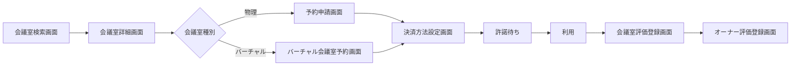
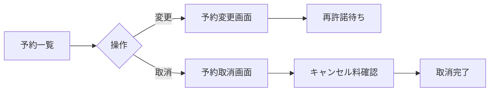
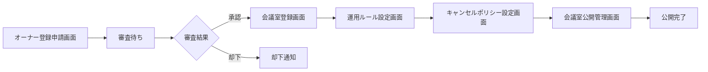
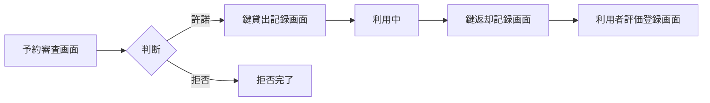
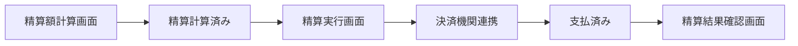
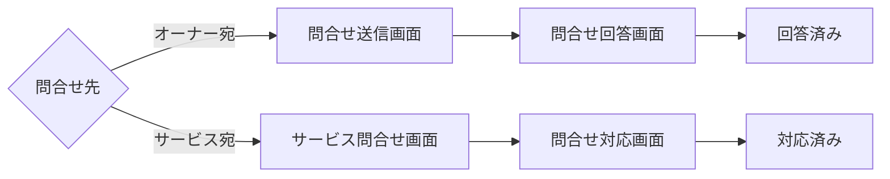

# UX デザイン仕様

## ユーザーフロー

### 会議室利用業務: 利用者の会議室予約フロー

**アクター**: 利用者
**ゴール**: 条件に合う会議室（物理・バーチャル）を見つけて予約し、利用後に評価する

**タッチポイント**:
| ステップ | 画面 | UC | 感情 | 改善機会 |
|---------|------|---|------|---------|
| 検索 | 会議室検索画面 | 会議室を検索する | ニュートラル | 検索条件の保存で再利用性向上 |
| 詳細確認 | 会議室詳細画面 | 会議室の詳細を確認する | ポジティブ | 評価スコアと写真で信頼感向上 |
| 予約申請 | 予約申請画面 | 予約を申請する | ニュートラル | カレンダーUIで空き状況を直感的に表示 |
| 決済設定 | 決済方法設定画面 | 決済方法を設定する | ネガティブ | 決済情報の保存で次回以降の入力省略 |
| 許諾待ち | - | 予約を許諾する | ネガティブ | プッシュ通知で待ち時間のストレス軽減 |
| 評価 | 会議室評価登録画面 | 会議室を評価する | ポジティブ | 星評価+コメントで手軽に投稿 |

### 会議室利用業務: 予約変更・取消フロー

**アクター**: 利用者
**ゴール**: 確定済みの予約内容を変更または取消する

### オーナー管理業務: オーナー登録フロー

**アクター**: 会議室オーナー
**ゴール**: サービスに登録し、会議室を貸し出せる状態にする

**タッチポイント**:
| ステップ | 画面 | UC | 感情 | 改善機会 |
|---------|------|---|------|---------|
| 登録申請 | オーナー登録申請画面 | オーナー登録申請を行う | ニュートラル | 必須項目を最小限にし段階的入力 |
| 審査待ち | - | オーナー登録を審査する | ネガティブ | 審査状況のリアルタイム通知 |
| 会議室登録 | 会議室登録画面 | 会議室を登録する | ポジティブ | 画像アップロードのドラッグ&ドロップ対応 |
| ルール設定 | 運用ルール設定画面 | 運用ルールを設定する | ニュートラル | テンプレートから選択可能に |

### 会議室貸出業務: オーナーの貸出管理フロー

**アクター**: 会議室オーナー
**ゴール**: 予約を審査し、鍵の受け渡しで利用を管理し、利用者を評価する

### 精算業務: 月末精算フロー

**アクター**: サービス運営担当者 → 会議室オーナー
**ゴール**: 月末に利用実績から精算額を計算し、決済機関経由でオーナーへ支払う

### サービス運営業務: 問合せ対応フロー

**アクター**: 利用者 → 会議室オーナー / サービス運営担当者
**ゴール**: 利用者からの問合せに対してオーナーまたは運営が回答・対応する

## 情報アーキテクチャ（IA）

### サイトマップ

```mermaid
graph TD
  Root[RoomConnect] --> User[利用者ポータル]
  Root --> Owner[オーナーポータル]
  Root --> Admin[管理者ポータル]

  User --> U1[会議室検索 /rooms]
  User --> U2[会議室詳細 /rooms/:id]
  User --> U3[予約申請 /rooms/:id/book]
  User --> U4[予約管理 /reservations]
  User --> U5[予約変更 /reservations/:id/edit]
  User --> U6[予約取消 /reservations/:id/cancel]
  User --> U7[評価登録 /reservations/:id/review]
  User --> U8[問合せ /inquiries]
  User --> U9[決済設定 /payment]
  User --> U10[マイページ /mypage]

  Owner --> O1[会議室管理 /owner/rooms]
  Owner --> O2[会議室登録 /owner/rooms/new]
  Owner --> O3[予約管理 /owner/reservations]
  Owner --> O4[鍵管理 /owner/rentals]
  Owner --> O5[評価確認 /owner/reviews]
  Owner --> O6[精算確認 /owner/settlements]
  Owner --> O7[問合せ /owner/inquiries]
  Owner --> O8[オーナー情報 /owner/profile]

  Admin --> A1[オーナー審査 /admin/owners]
  Admin --> A2[利用状況分析 /admin/analytics]
  Admin --> A3[手数料売上 /admin/revenue]
  Admin --> A4[精算管理 /admin/settlements]
  Admin --> A5[問合せ対応 /admin/inquiries]
  Admin --> A6[利用履歴 /admin/usage]
```

### ナビゲーション構造

| ポータル | プライマリナビ | セカンダリナビ |
|---------|-------------|-------------|
| 利用者 (user) | 会議室検索, 予約一覧, 問合せ, マイページ | 予約詳細, 評価登録, 決済設定 |
| オーナー (owner) | ダッシュボード, 会議室管理, 予約管理, 精算, 評価, 問合せ | 会議室登録, 運用ルール設定, 鍵管理, オーナー情報 |
| 管理者 (admin) | ダッシュボード, オーナー管理, 利用分析, 精算管理, 問合せ | オーナー審査詳細, 手数料売上分析, 利用履歴 |

### ページ間の遷移ルール

- 会議室検索 → 会議室詳細 → 予約申請: 順方向の自然な遷移。ブラウザバックで戻れる
- 予約申請 → 決済設定: 決済未登録時のみ遷移。登録済みの場合はスキップ
- 予約確定後の評価: 利用終了後にのみ評価導線を表示
- オーナー審査: 承認/却下後は一覧に戻る。取り消し不可
- 精算フロー: 計算 → 実行は不可逆。実行前に確認ダイアログ表示

## UX 心理学に基づくインタラクション設計原則

### 適用する原則

| 原則 | 適用場面 | 具体的な設計 |
|------|---------|-----------|
| 社会的証明 (Social Proof) | 会議室検索・詳細画面 | 評価スコア・レビュー件数・利用者数を会議室カードに表示。「先月120件利用」等 |
| 希少性効果 (Scarcity) | 会議室詳細・予約申請画面 | 「残り2枠」「本日のみ空き」等の空き状況をリアルタイム表示 |
| 段階的開示 (Progressive Disclosure) | 会議室登録・運用ルール設定 | ウィザード形式で段階的に入力。全項目を一度に見せない |
| 目標勾配効果 (Goal Gradient Effect) | オーナー登録・会議室登録フロー | プログレスバーで「あと2ステップ」を可視化 |
| 損失回避 (Loss Aversion) | 予約取消画面 | キャンセル料を明示し「取消すと3,000円のキャンセル料が発生します」と具体的に表示 |
| ピーク・エンドの法則 (Peak-End Rule) | 予約完了・評価完了画面 | 完了時にアニメーション演出。「ご予約ありがとうございます」の達成感 |
| デフォルト効果 (Default Bias) | 運用ルール設定・キャンセルポリシー設定 | 推奨設定をデフォルト値として事前入力。オーナーの設定負担を軽減 |
| 認知負荷 (Cognitive Load) | 全画面共通 | 一画面の表示情報を4-5項目に制限。ダッシュボードは階層化 |
| 意図的な壁 (Intentional Friction) | 精算実行・退会申請・予約取消 | 不可逆操作の前に確認ダイアログ。精算実行時は二段階確認 |
| ドハティの閾値 (Doherty Threshold) | 検索結果・一覧画面 | 0.4秒超えた場合は Skeleton UI を即座に表示。パーシーブドパフォーマンス改善 |

## アクセシビリティ方針

- **WCAG 準拠レベル**: AA
- **キーボード操作**: 全操作をキーボードのみで完結可能。フォーカスインジケーターを明示
- **スクリーンリーダー**: セマンティックHTML。aria-label で状態バッジの意味を伝達。ライブリージョンで通知
- **色覚多様性**: 色だけで情報を伝えない。ステータスバッジはラベルテキストを併記。コントラスト比 4.5:1 以上
