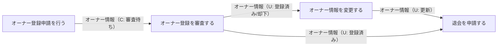
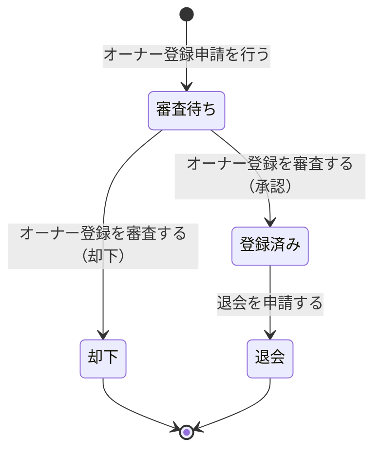

# オーナー登録管理フロー

## 概要

会議室オーナーの登録申請から審査・承認・情報管理・退会までのライフサイクルを管理するフロー。サービス運営担当者によるオーナー審査を経て、オーナーがサービスを利用できる状態に遷移する。

## 所属 UC 一覧

| UC名 | アクター | 主な操作 | 関連情報 |
|------|---------|---------|---------|
| [オーナー登録申請を行う](オーナー登録申請を行う/spec.md) | 会議室オーナー | 登録申請フォームを入力・送信する | オーナー情報 |
| [オーナー登録を審査する](オーナー登録を審査する/spec.md) | サービス運営担当者 | 申請内容を確認し承認または却下する | オーナー情報 |
| [オーナー情報を変更する](オーナー情報を変更する/spec.md) | 会議室オーナー | 氏名・連絡先・メールアドレス等を変更する | オーナー情報 |
| [退会を申請する](退会を申請する/spec.md) | 会議室オーナー | 退会申請を確定しサービスから離脱する | オーナー情報 |

## UC 横断データフロー

BUC 内の UC 間でオーナー情報がどう流れるかを示す。

### データフロー図

### 情報 CRUD マトリクス

| 情報名 | オーナー登録申請を行う | オーナー登録を審査する | オーナー情報を変更する | 退会を申請する |
|--------|:-------:|:-------:|:-------:|:-------:|
| オーナー情報 | C | R/U | R/U | R/U |

## 状態遷移全体図

オーナーのライフサイクル全遷移パスと、各遷移を担当する UC を示す。

### 状態遷移 UC マッピング

| 状態モデル | 遷移元 | 遷移先 | 担当 UC |
|-----------|--------|--------|--------|
| オーナー | （初期） | 審査待ち | [オーナー登録申請を行う](オーナー登録申請を行う/spec.md) |
| オーナー | 審査待ち | 登録済み | [オーナー登録を審査する](オーナー登録を審査する/spec.md) |
| オーナー | 審査待ち | 却下 | [オーナー登録を審査する](オーナー登録を審査する/spec.md) |
| オーナー | 登録済み | 退会 | [退会を申請する](退会を申請する/spec.md) |

## BUC 内共有条件一覧

| 条件名 | 条件の説明 | 適用 UC |
|--------|----------|--------|
| オーナー登録審査条件 | オーナー申請に対してサービス運営担当者が審査を行い、承認または却下を判定するルール。必須項目チェック・メールアドレス重複チェック・審査状態チェックを含む | オーナー登録申請を行う, オーナー登録を審査する, サービス運営業務/サービス運営管理フロー/オーナー登録審査一覧を確認する |

## BUC 内共有バリエーション一覧

このBUC内に複数UCで共有されるバリエーションはありません。各UCで参照するバリエーションは単一UCに閉じています。
