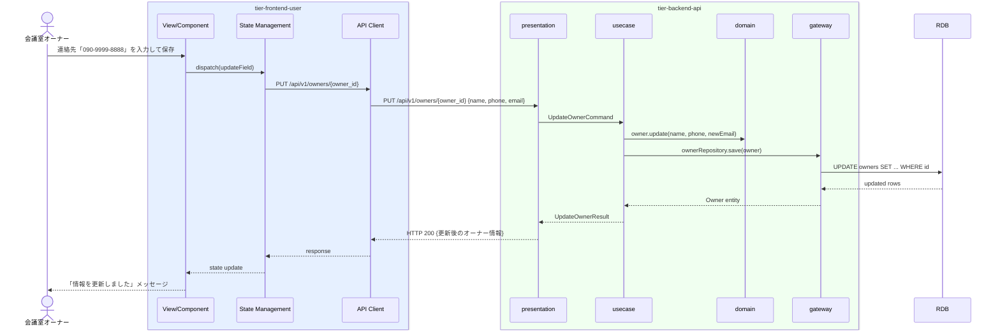

# オーナー情報を変更する

## 概要

登録済みの会議室オーナーが自身の氏名・連絡先・メールアドレス等の登録情報を変更する。変更後は即座に反映され、メールアドレス変更時はIdPのユーザー情報も同期更新される。

## データフロー

```mermaid
graph LR
  subgraph FE["tier-frontend-user"]
    subgraph FE_V["view"]
      OwnerProfileForm
    end
    subgraph FE_S["state"]
      OwnerProfileState
    end
    subgraph FE_A["api-client"]
      UpdateOwnerRequest
    end
  end
  subgraph BE["tier-backend-api"]
    subgraph BE_P["presentation"]
      UpdateOwnerRequestDTO
    end
    subgraph BE_U["usecase"]
      UpdateOwnerCommand
    end
    subgraph BE_D["domain"]
      Owner
    end
    subgraph BE_G["gateway"]
      OwnerRecord
    end
  end
  subgraph DB["tier-datastore-rdb"]
    owners[("owners")]
  end
  OwnerProfileForm --> OwnerProfileState --> UpdateOwnerRequest
  UpdateOwnerRequest -->|"PUT /api/v1/owners/{owner_id}"| UpdateOwnerRequestDTO
  UpdateOwnerRequestDTO --> UpdateOwnerCommand
  UpdateOwnerCommand --> Owner
  Owner --> OwnerRecord
  OwnerRecord -->|"UPDATE"| owners
  owners --> OwnerRecord
  OwnerRecord --> Owner
  Owner --> UpdateOwnerCommand --> UpdateOwnerRequestDTO
  UpdateOwnerRequestDTO -->|"HTTP 200"| UpdateOwnerRequest
  UpdateOwnerRequest --> OwnerProfileState --> OwnerProfileForm
```



| レイヤー | データモデル | 変換内容 |
|---------|------------|---------|
| FE view | OwnerProfileForm | フォーム入力値（名前・電話番号・メール） → State へ dispatch |
| FE state | OwnerProfileState | 編集中オーナー情報を管理。isDirty フラグ |
| FE api-client | UpdateOwnerRequest | camelCase → snake_case 変換 |
| BE presentation | UpdateOwnerRequestDTO | パスパラメータ owner_id + ボディ結合・バリデーション |
| BE usecase | UpdateOwnerCommand | 所有者チェック。メール変更時 IdP 同期指示 |
| BE domain | Owner | 状態バリデーション付きエンティティ。退会済みは変更不可 |
| BE gateway | OwnerRecord | Entity → DB カラム形式 DTO。UPDATE + IdP 同期 |
| DB | owners | UPDATE (name, phone, email, updated_at) |

## 処理フロー



## バリエーション一覧

| バリエーション名 | 値 | 処理内容 | 適用 tier | 適用箇所 |
|----------------|---|---------|----------|---------|
| - | - | 本UCにはバリエーションなし | - | - |

## 分岐条件一覧

| 条件名 | 判定ルール | 適用 tier | 適用箇所 | BDD Scenario |
|--------|----------|----------|---------|-------------|
| メールアドレス変更チェック | 新しいメールアドレスが既存の別オーナーと重複する場合はエラーを返す | tier-backend-api | PUT /api/v1/owners/{owner_id} | 既登録メールで変更しようとした場合にエラーが返る |
| オーナー状態チェック | 「登録済み」状態のオーナーのみが情報変更可能。退会済みオーナーは変更不可 | tier-backend-api | PUT /api/v1/owners/{owner_id} | 退会済みオーナーが情報変更を試みた場合にエラーが返る |

## 計算ルール一覧

| 計算名 | 入力情報 | 計算式/ロジック | 出力情報 | 適用 tier |
|--------|---------|---------------|---------|----------|
| - | - | 本UCには計算ルールなし | - | - |

## 状態遷移一覧

| 状態モデル | 遷移元 | 遷移先 | トリガー | 事前条件 | 事後処理 | 適用 tier |
|-----------|--------|--------|---------|---------|---------|----------|
| オーナー | 登録済み | 登録済み | オーナー情報を変更する（状態変化なし） | オーナーが「登録済み」状態 | メール変更時はIdP同期 | tier-backend-api |

## 関連 RDRA モデル

| モデル種別 | 要素名 | 関連 |
|-----------|--------|------|
| 業務 | オーナー管理業務 | このUCが属する業務 |
| BUC | オーナー登録管理フロー | このUCを含むBUC |
| アクター | 会議室オーナー | 操作するアクター（社外） |
| 情報 | オーナー情報 | 変更対象（氏名、連絡先、メールアドレス） |
| 状態 | オーナー | 状態変化なし（登録済み状態での操作） |
| 条件 | - | なし |
| 外部システム | - | IdP（メール変更時に同期） |

## E2E 完了条件（BDD）

### 正常系

```gherkin
Feature: オーナー情報を変更する

  Scenario: オーナーが連絡先を正常に変更できる
    Given 会議室オーナー「田中一郎」（owner_id: "abc-123"）がログイン済みでオーナー情報編集画面を開いている
    When 連絡先を「090-1234-5678」から「090-9999-8888」に変更して保存ボタンをクリックする
    Then 「情報を更新しました」のメッセージが表示され、連絡先が「090-9999-8888」に更新される

  Scenario: オーナーがメールアドレスを変更するとIdPにも反映される
    Given 会議室オーナー「田中一郎」がログイン済みでオーナー情報編集画面を開いている
    When メールアドレスを「tanaka@example.com」から「tanaka-new@example.com」に変更して保存する
    Then 「情報を更新しました」が表示され、IdPのユーザーメールも「tanaka-new@example.com」に更新される
```

### 異常系

```gherkin
  Scenario: 既登録メールで変更しようとした場合にエラーが返る
    Given メールアドレス「yamada@example.com」で別のオーナーが登録済みである
    When 「田中一郎」がメールアドレスを「yamada@example.com」に変更しようとする
    Then 「このメールアドレスは既に使用されています」のエラーメッセージが表示される
```

## ティア別仕様

- [利用者・オーナー向けフロントエンド](tier-frontend-user.md)
- [バックエンドAPI](tier-backend-api.md)

### 統合 API Spec

- [OpenAPI Spec](../../../_cross-cutting/api/openapi.yaml)（全 UC 統合、Contract First 開発用）
