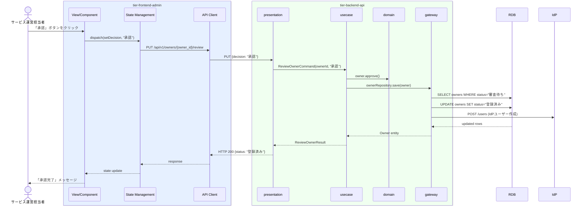

# オーナー登録を審査する

## 概要

サービス運営担当者が審査待ち状態のオーナー登録申請を確認し、承認または却下を判断する。承認時はオーナー状態が「登録済み」となりIdPユーザーが自動作成される。却下時は「却下」状態に遷移し、申請者へ通知が送られる。

## データフロー

```mermaid
graph LR
  subgraph FE["tier-frontend-admin"]
    subgraph FE_V["view"]
      OwnerReviewForm
    end
    subgraph FE_S["state"]
      ReviewState
    end
    subgraph FE_A["api-client"]
      ReviewOwnerRequest
    end
  end
  subgraph BE["tier-backend-api"]
    subgraph BE_P["presentation"]
      ReviewOwnerRequestDTO
    end
    subgraph BE_U["usecase"]
      ReviewOwnerCommand
    end
    subgraph BE_D["domain"]
      Owner
    end
    subgraph BE_G["gateway"]
      OwnerRecord
    end
  end
  subgraph DB["tier-datastore-rdb"]
    owners[("owners")]
  end
  OwnerReviewForm --> ReviewState --> ReviewOwnerRequest
  ReviewOwnerRequest -->|"PUT /api/v1/owners/{owner_id}/review"| ReviewOwnerRequestDTO
  ReviewOwnerRequestDTO --> ReviewOwnerCommand
  ReviewOwnerCommand --> Owner
  Owner --> OwnerRecord
  OwnerRecord -->|"UPDATE"| owners
  owners --> OwnerRecord
  OwnerRecord --> Owner
  Owner --> ReviewOwnerCommand --> ReviewOwnerRequestDTO
  ReviewOwnerRequestDTO -->|"HTTP 200"| ReviewOwnerRequest
  ReviewOwnerRequest --> ReviewState --> OwnerReviewForm
```



| レイヤー | データモデル | 変換内容 |
|---------|------------|---------|
| FE view | OwnerReviewForm | 承認/却下ボタン操作 → State へ dispatch |
| FE state | ReviewState | 選択中オーナー・審査判定を管理 |
| FE api-client | ReviewOwnerRequest | camelCase → snake_case 変換 |
| BE presentation | ReviewOwnerRequestDTO | パスパラメータ owner_id + decision バリデーション |
| BE usecase | ReviewOwnerCommand | 審査者 ID 注入。IdP ユーザー作成指示（承認時） |
| BE domain | Owner | 状態遷移: 審査待ち → 登録済み/却下 |
| BE gateway | OwnerRecord | Entity → DB カラム形式 DTO。UPDATE + IdP 呼び出し |
| DB | owners | UPDATE (status=登録済み/却下, reviewed_at) |

## 処理フロー



## バリエーション一覧

| バリエーション名 | 値 | 処理内容 | 適用 tier | 適用箇所 |
|----------------|---|---------|----------|---------|
| - | - | 本UCにはバリエーションなし | - | - |

## 分岐条件一覧

| 条件名 | 判定ルール | 適用 tier | 適用箇所 | BDD Scenario |
|--------|----------|----------|---------|-------------|
| オーナー登録審査条件（承認） | 審査担当者が申請情報を確認し「承認」を選択した場合、オーナー状態を「登録済み」に更新し、IdPへのユーザー作成を行う | tier-backend-api | PUT /api/v1/owners/{owner_id}/review | 審査担当者が承認した場合にオーナー状態が登録済みになる |
| オーナー登録審査条件（却下） | 審査担当者が申請情報を確認し「却下」を選択した場合、オーナー状態を「却下」に更新し申請者へ通知する | tier-backend-api | PUT /api/v1/owners/{owner_id}/review | 審査担当者が却下した場合にオーナー状態が却下になる |
| オーナー登録審査条件（審査対象） | 審査対象のオーナーが「審査待ち」状態でなければ処理を拒否する | tier-backend-api | PUT /api/v1/owners/{owner_id}/review | 審査待ち以外のオーナーを審査しようとした場合にエラーが返る |

## 計算ルール一覧

| 計算名 | 入力情報 | 計算式/ロジック | 出力情報 | 適用 tier |
|--------|---------|---------------|---------|----------|
| - | - | 本UCには計算ルールなし | - | - |

## 状態遷移一覧

| 状態モデル | 遷移元 | 遷移先 | トリガー | 事前条件 | 事後処理 | 適用 tier |
|-----------|--------|--------|---------|---------|---------|----------|
| オーナー | 審査待ち | 登録済み | 審査担当者が承認操作を行う | オーナーが「審査待ち」状態 | IdP ユーザー自動作成、承認通知メール送信 | tier-backend-api |
| オーナー | 審査待ち | 却下 | 審査担当者が却下操作を行う | オーナーが「審査待ち」状態 | 却下通知メール送信 | tier-backend-api |

## 関連 RDRA モデル

| モデル種別 | 要素名 | 関連 |
|-----------|--------|------|
| 業務 | オーナー管理業務 | このUCが属する業務 |
| BUC | オーナー登録管理フロー | このUCを含むBUC |
| アクター | サービス運営担当者 | 操作するアクター（社内） |
| 情報 | オーナー情報 | 審査対象の情報（オーナーID、氏名、連絡先、メールアドレス、審査状態） |
| 状態 | オーナー | 遷移元: 審査待ち → 遷移先: 登録済み または 却下 |
| 条件 | オーナー登録審査条件 | 承認・却下を判定するルール |
| 外部システム | - | IdP（承認時にユーザー自動作成） |

## E2E 完了条件（BDD）

### 正常系

```gherkin
Feature: オーナー登録を審査する

  Scenario: 審査担当者が申請を承認するとオーナー状態が登録済みになる
    Given サービス運営担当者「佐藤次郎」がログイン済みで、オーナー「田中一郎」（owner_id: "abc-123"）が審査待ち状態である
    When 審査担当者がオーナー審査画面で「承認」ボタンをクリックする
    Then オーナー「田中一郎」の審査状態が「登録済み」に更新され、承認完了メッセージが表示される

  Scenario: 審査担当者が申請を却下するとオーナー状態が却下になる
    Given サービス運営担当者「佐藤次郎」がログイン済みで、オーナー「山田花子」（owner_id: "def-456"）が審査待ち状態である
    When 審査担当者がオーナー審査画面で「却下」ボタンをクリックする
    Then オーナー「山田花子」の審査状態が「却下」に更新され、却下完了メッセージが表示される
```

### 異常系

```gherkin
  Scenario: 審査待ち以外のオーナーを審査しようとした場合にエラーが返る
    Given オーナー「田中一郎」が既に「登録済み」状態である
    When 審査担当者が PUT /api/v1/owners/abc-123/review を送信する
    Then HTTP 409 が返り、「すでに審査が完了しています」というエラーメッセージが表示される
```

## ティア別仕様

- [管理者向けフロントエンド](tier-frontend-admin.md)
- [バックエンドAPI](tier-backend-api.md)

### 統合 API Spec

- [OpenAPI Spec](../../../_cross-cutting/api/openapi.yaml)（全 UC 統合、Contract First 開発用）
