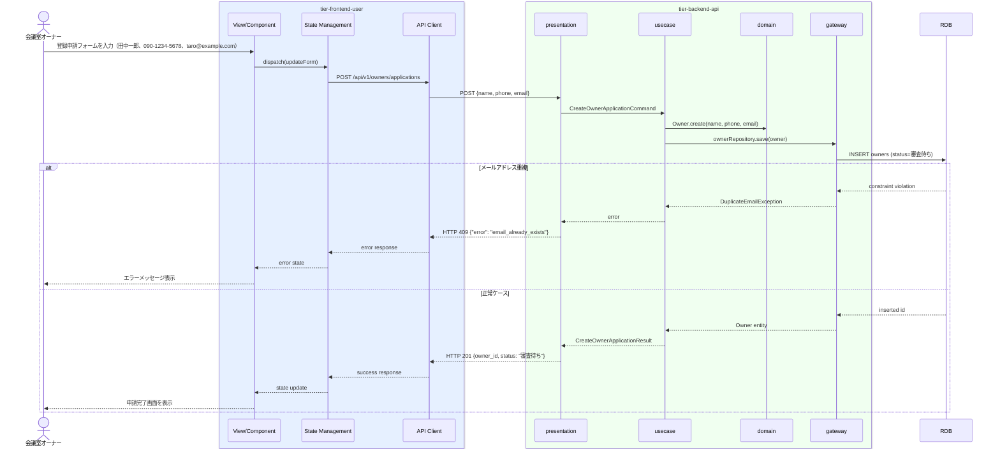

# オーナー登録申請を行う

## 概要

会議室オーナーがサービスへの登録申請情報（氏名・連絡先・メールアドレス等）を入力し、審査申請を送信する。申請後はオーナーの状態が「審査待ち」に遷移し、サービス運営担当者による審査が開始される。

## データフロー

```mermaid
graph LR
  subgraph FE["tier-frontend-user"]
    subgraph FE_V["view"]
      OwnerRegistrationForm
    end
    subgraph FE_S["state"]
      RegistrationState
    end
    subgraph FE_A["api-client"]
      CreateOwnerApplicationRequest
    end
  end
  subgraph BE["tier-backend-api"]
    subgraph BE_P["presentation"]
      CreateOwnerApplicationRequestDTO
    end
    subgraph BE_U["usecase"]
      CreateOwnerApplicationCommand
    end
    subgraph BE_D["domain"]
      Owner
    end
    subgraph BE_G["gateway"]
      OwnerRecord
    end
  end
  subgraph DB["tier-datastore-rdb"]
    owners[("owners")]
  end
  OwnerRegistrationForm --> RegistrationState --> CreateOwnerApplicationRequest
  CreateOwnerApplicationRequest -->|"POST /api/v1/owners/applications"| CreateOwnerApplicationRequestDTO
  CreateOwnerApplicationRequestDTO --> CreateOwnerApplicationCommand
  CreateOwnerApplicationCommand --> Owner
  Owner --> OwnerRecord
  OwnerRecord -->|"INSERT"| owners
  owners --> OwnerRecord
  OwnerRecord --> Owner
  Owner --> CreateOwnerApplicationCommand --> CreateOwnerApplicationRequestDTO
  CreateOwnerApplicationRequestDTO -->|"HTTP 201"| CreateOwnerApplicationRequest
  CreateOwnerApplicationRequest --> RegistrationState --> OwnerRegistrationForm
```



| レイヤー | データモデル | 変換内容 |
|---------|------------|---------|
| FE view | OwnerRegistrationForm | 申請フォーム入力（名前・電話番号・メール） → State へ dispatch |
| FE state | RegistrationState | フォームデータと送信状態を管理 |
| FE api-client | CreateOwnerApplicationRequest | camelCase → snake_case 変換 |
| BE presentation | CreateOwnerApplicationRequestDTO | 必須項目バリデーション、メール形式チェック |
| BE usecase | CreateOwnerApplicationCommand | メール重複チェック指示 |
| BE domain | Owner | 新規エンティティ作成。status=審査待ち 固定 |
| BE gateway | OwnerRecord | Entity → DB カラム形式 DTO |
| DB | owners | INSERT (name, phone, email, status=審査待ち) |

## 処理フロー



## バリエーション一覧

| バリエーション名 | 値 | 処理内容 | 適用 tier | 適用箇所 |
|----------------|---|---------|----------|---------|
| - | - | 本UCにはバリエーションなし | - | - |

## 分岐条件一覧

| 条件名 | 判定ルール | 適用 tier | 適用箇所 | BDD Scenario |
|--------|----------|----------|---------|-------------|
| オーナー登録審査条件 | 申請受付時はメールアドレスの重複チェックを行い、既登録の場合はエラーを返す | tier-backend-api | POST /api/v1/owners/applications | 同一メールアドレスで二重申請した場合にエラーが返る |
| オーナー登録審査条件 | 必須項目（氏名・連絡先・メールアドレス）が未入力の場合はバリデーションエラーを返す | tier-backend-api | POST /api/v1/owners/applications | 必須項目未入力で申請した場合にバリデーションエラーが返る |

## 計算ルール一覧

| 計算名 | 入力情報 | 計算式/ロジック | 出力情報 | 適用 tier |
|--------|---------|---------------|---------|----------|
| - | - | 本UCには計算ルールなし | - | - |

## 状態遷移一覧

| 状態モデル | 遷移元 | 遷移先 | トリガー | 事前条件 | 事後処理 | 適用 tier |
|-----------|--------|--------|---------|---------|---------|----------|
| オーナー | （初期状態） | 審査待ち | 申請フォームを送信する | メールアドレス未重複、必須項目入力済み | 審査担当者への通知メール送信 | tier-backend-api |

## 関連 RDRA モデル

| モデル種別 | 要素名 | 関連 |
|-----------|--------|------|
| 業務 | オーナー管理業務 | このUCが属する業務 |
| BUC | オーナー登録管理フロー | このUCを含むBUC |
| アクター | 会議室オーナー | 操作するアクター（社外） |
| 情報 | オーナー情報 | 登録する情報（オーナーID、氏名、連絡先、メールアドレス、登録日、審査状態） |
| 状態 | オーナー | 遷移先: 審査待ち |
| 条件 | オーナー登録審査条件 | 申請受付後に審査担当者が適用するルール |
| 外部システム | - | 連携なし |

## E2E 完了条件（BDD）

### 正常系

```gherkin
Feature: オーナー登録申請を行う

  Scenario: 新規オーナーが正常に登録申請を完了する
    Given 未登録の会議室オーナー「田中一郎」がオーナー登録申請画面を開いている
    When 氏名「田中一郎」、連絡先「090-1234-5678」、メールアドレス「tanaka@example.com」を入力して申請ボタンをクリックする
    Then 申請完了画面が表示され、「審査を受け付けました。結果はメールでお知らせします。」のメッセージが表示される

  Scenario: 申請完了後にオーナーの状態が審査待ちになる
    Given 会議室オーナー「山田花子」が申請フォームに有効な情報を入力済みである
    When 申請ボタンをクリックする
    Then データベース上のオーナーレコードの審査状態が「審査待ち」になる
```

### 異常系

```gherkin
  Scenario: 既登録メールアドレスで二重申請した場合にエラーが返る
    Given メールアドレス「tanaka@example.com」で既に登録申請済みのオーナーが存在する
    When 同じメールアドレス「tanaka@example.com」で再度申請フォームを送信する
    Then 「このメールアドレスは既に登録されています」というエラーメッセージが表示される

  Scenario: 必須項目未入力で申請した場合にバリデーションエラーが返る
    Given 会議室オーナーがオーナー登録申請画面を開いている
    When 氏名を空欄のまま申請ボタンをクリックする
    Then 「氏名は必須項目です」のバリデーションエラーが表示され、申請は送信されない
```

## ティア別仕様

- [利用者・オーナー向けフロントエンド](tier-frontend-user.md)
- [バックエンドAPI](tier-backend-api.md)

### 統合 API Spec

- [OpenAPI Spec](../../../_cross-cutting/api/openapi.yaml)（全 UC 統合、Contract First 開発用）
