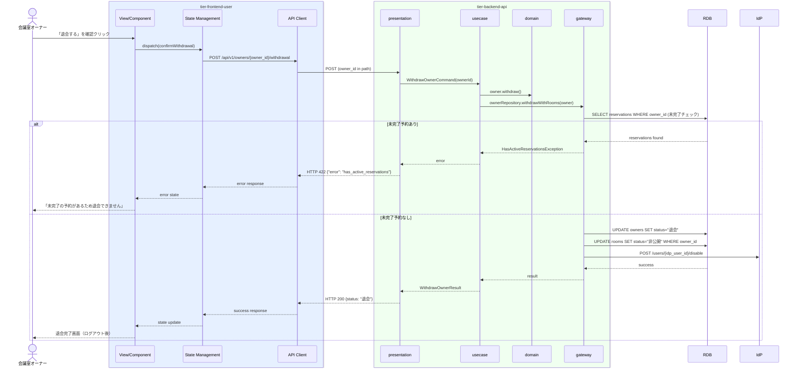

# 退会を申請する

## 概要

登録済みの会議室オーナーがサービスからの退会を申請する。退会操作によりオーナーの状態が「退会」に遷移し、IdPのユーザーが無効化され、所有する会議室が非公開状態に変更される。

## データフロー

```mermaid
graph LR
  subgraph FE["tier-frontend-user"]
    subgraph FE_V["view"]
      WithdrawalConfirmModal
    end
    subgraph FE_S["state"]
      WithdrawalState
    end
    subgraph FE_A["api-client"]
      WithdrawalRequest
    end
  end
  subgraph BE["tier-backend-api"]
    subgraph BE_P["presentation"]
      WithdrawalRequestDTO
    end
    subgraph BE_U["usecase"]
      WithdrawOwnerCommand
    end
    subgraph BE_D["domain"]
      Owner
    end
    subgraph BE_G["gateway"]
      OwnerRecord
    end
  end
  subgraph DB["tier-datastore-rdb"]
    owners[("owners")]
    rooms[("rooms")]
  end
  WithdrawalConfirmModal --> WithdrawalState --> WithdrawalRequest
  WithdrawalRequest -->|"POST /api/v1/owners/{owner_id}/withdrawal"| WithdrawalRequestDTO
  WithdrawalRequestDTO --> WithdrawOwnerCommand
  WithdrawOwnerCommand --> Owner
  Owner --> OwnerRecord
  OwnerRecord -->|"UPDATE"| owners
  OwnerRecord -->|"UPDATE"| rooms
  owners --> OwnerRecord
  OwnerRecord --> Owner
  Owner --> WithdrawOwnerCommand --> WithdrawalRequestDTO
  WithdrawalRequestDTO -->|"HTTP 200"| WithdrawalRequest
  WithdrawalRequest --> WithdrawalState --> WithdrawalConfirmModal
```



| レイヤー | データモデル | 変換内容 |
|---------|------------|---------|
| FE view | WithdrawalConfirmModal | 退会確認モーダル。確認テキスト入力 → State へ dispatch |
| FE state | WithdrawalState | 退会確認フラグ・処理中状態を管理 |
| FE api-client | WithdrawalRequest | owner_id をパスに付与 |
| BE presentation | WithdrawalRequestDTO | パスパラメータ owner_id 取り出し |
| BE usecase | WithdrawOwnerCommand | 未完了予約チェック。owners + rooms 複数更新指示 |
| BE domain | Owner | 状態遷移: 登録済み → 退会。退会可否バリデーション |
| BE gateway | OwnerRecord | Entity → DB カラム形式 DTO。owners + rooms 更新 + IdP 無効化 |
| DB | owners | UPDATE (status=退会, withdrawn_at) |
| DB | rooms | UPDATE (status=非公開) WHERE owner_id |

## 処理フロー



## バリエーション一覧

| バリエーション名 | 値 | 処理内容 | 適用 tier | 適用箇所 |
|----------------|---|---------|----------|---------|
| - | - | 本UCにはバリエーションなし | - | - |

## 分岐条件一覧

| 条件名 | 判定ルール | 適用 tier | 適用箇所 | BDD Scenario |
|--------|----------|----------|---------|-------------|
| 退会可否チェック | 未完了の予約（確定・利用中）が存在する場合は退会を禁止する | tier-backend-api | POST /api/v1/owners/{owner_id}/withdrawal | 未完了予約がある場合に退会が拒否される |
| オーナー状態チェック | 「登録済み」状態のオーナーのみが退会申請可能 | tier-backend-api | POST /api/v1/owners/{owner_id}/withdrawal | 既退会済みオーナーの退会申請でエラーが返る |

## 計算ルール一覧

| 計算名 | 入力情報 | 計算式/ロジック | 出力情報 | 適用 tier |
|--------|---------|---------------|---------|----------|
| - | - | 本UCには計算ルールなし | - | - |

## 状態遷移一覧

| 状態モデル | 遷移元 | 遷移先 | トリガー | 事前条件 | 事後処理 | 適用 tier |
|-----------|--------|--------|---------|---------|---------|----------|
| オーナー | 登録済み | 退会 | 退会申請を確定する | オーナーが「登録済み」状態かつ未完了予約なし | IdPユーザー無効化、所有会議室を非公開に変更 | tier-backend-api |
| 会議室 | 公開中/公開可能 | 非公開 | オーナー退会に連動 | オーナー退会状態への遷移 | 予約受付停止 | tier-backend-api |

## 関連 RDRA モデル

| モデル種別 | 要素名 | 関連 |
|-----------|--------|------|
| 業務 | オーナー管理業務 | このUCが属する業務 |
| BUC | オーナー登録管理フロー | このUCを含むBUC |
| アクター | 会議室オーナー | 操作するアクター（社外） |
| 情報 | オーナー情報 | 退会状態に遷移するオーナーの情報 |
| 状態 | オーナー | 遷移元: 登録済み → 遷移先: 退会 |
| 条件 | - | なし |
| 外部システム | - | IdP（退会時にユーザー無効化） |

## E2E 完了条件（BDD）

### 正常系

```gherkin
Feature: 退会を申請する

  Scenario: 未完了予約がないオーナーが退会を完了できる
    Given 会議室オーナー「田中一郎」がログイン済みで未完了の予約がない状態である
    When 退会申請画面で「退会する」ボタンをクリックし、確認モーダルで「退会を確定する」をクリックする
    Then 「退会が完了しました」画面が表示され、オーナー状態が「退会」に遷移し、自動的にログアウトされる

  Scenario: 退会後にオーナーが所有する会議室が非公開になる
    Given 会議室オーナー「田中一郎」が「東京会議室A」（公開中）と「東京会議室B」（公開可能）を所有している
    When 退会申請を完了する
    Then 「東京会議室A」と「東京会議室B」の公開状態が「非公開」に変更される
```

### 異常系

```gherkin
  Scenario: 未完了予約がある場合に退会が拒否される
    Given 会議室オーナー「田中一郎」に確定済みの予約「予約ID: rsv-001」が存在する
    When 退会申請画面で退会手続きを実行する
    Then 「未完了の予約があるため退会できません。全ての予約が完了後に再度お試しください。」のエラーメッセージが表示される
```

## ティア別仕様

- [利用者・オーナー向けフロントエンド](tier-frontend-user.md)
- [バックエンドAPI](tier-backend-api.md)

### 統合 API Spec

- [OpenAPI Spec](../../../_cross-cutting/api/openapi.yaml)（全 UC 統合、Contract First 開発用）
