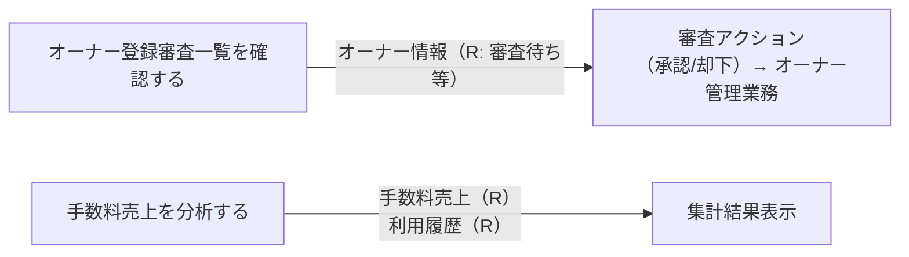
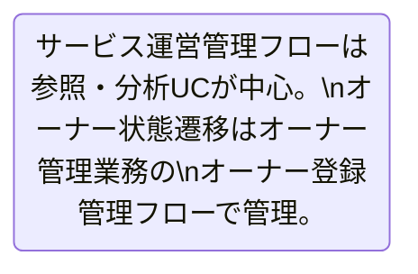

# サービス運営管理フロー

## 概要

サービス運営担当者がオーナー登録審査の管理と手数料売上の集計・分析を行うフロー。オーナー審査管理では審査状況の一覧確認と審査アクションを提供し、手数料売上分析では会議室別・貸出別・月別・オーナー別の多軸集計を支援する。

## 所属 UC 一覧

| UC名 | アクター | 主な操作 | 関連情報 |
|------|---------|---------|---------|
| [手数料売上を分析する](手数料売上を分析する/spec.md) | サービス運営担当者 | 手数料売上を会議室別・貸出別・月別・オーナー別に集計・分析する | 手数料売上, 利用履歴 |
| [オーナー登録審査一覧を確認する](オーナー登録審査一覧を確認する/spec.md) | サービス運営担当者 | オーナー登録申請の審査状況を一覧で確認・管理する | オーナー情報 |

## UC 横断データフロー

BUC 内の UC 間で情報がどう流れるかを示す。

### データフロー図

### 情報 CRUD マトリクス

| 情報名 | 手数料売上を分析する | オーナー登録審査一覧を確認する |
|--------|:-------:|:-------:|
| 手数料売上 | R | |
| 利用履歴 | R | |
| オーナー情報 | | R |

## 状態遷移全体図

このBUCで直接制御する状態遷移はありません。オーナー登録審査一覧からの承認/却下操作はオーナー管理業務のオーナー状態遷移に委譲します（本BUCは参照側）。

### 状態遷移 UC マッピング

| 状態モデル | 遷移元 | 遷移先 | 担当 UC |
|-----------|--------|--------|--------|
| オーナー（参照のみ） | 審査待ち | - | [オーナー登録審査一覧を確認する](オーナー登録審査一覧を確認する/spec.md)（審査アクションは別フロー） |

## BUC 内共有条件一覧

| 条件名 | 条件の説明 | 適用 UC |
|--------|----------|--------|
| オーナー登録審査条件 | オーナー申請に対してサービス運営担当者が審査を行い、承認または却下を判定するルール。審査状態フィルタリングを含む | 手数料売上を分析する（参照前提条件として間接参照）, オーナー登録審査一覧を確認する |

## BUC 内共有バリエーション一覧

| バリエーション名 | 値 | 適用 UC |
|----------------|---|--------|
| 売上分析区分 | 会議室別, 貸出別, 月別, オーナー別 | 手数料売上を分析する |
