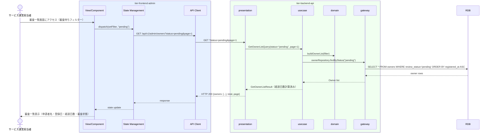

# オーナー登録審査一覧を確認する

## 概要

サービス運営担当者がオーナー登録申請の審査状況を一覧で確認・管理する。審査待ち・登録済み・却下など審査状態でフィルタリングし、個別の審査詳細画面へのナビゲーションを提供する。

## データフロー

```mermaid
graph LR
  subgraph FE["tier-frontend-admin"]
    subgraph FE_V["view"]
      OwnerReviewList
    end
    subgraph FE_S["state"]
      OwnerListState
    end
    subgraph FE_A["api-client"]
      GetOwnerListRequest
    end
  end
  subgraph BE["tier-backend-api"]
    subgraph BE_P["presentation"]
      GetOwnerListRequestDTO
    end
    subgraph BE_U["usecase"]
      GetOwnerListQuery
    end
    subgraph BE_D["domain"]
      OwnerList
    end
    subgraph BE_G["gateway"]
      OwnerRecord
    end
  end
  subgraph DB["tier-datastore-rdb"]
    owners[("owners")]
  end
  OwnerReviewList --> OwnerListState --> GetOwnerListRequest
  GetOwnerListRequest -->|"GET /api/v1/admin/owners?status=pending"| GetOwnerListRequestDTO
  GetOwnerListRequestDTO --> GetOwnerListQuery
  GetOwnerListQuery --> OwnerList
  OwnerList --> OwnerRecord
  OwnerRecord -->|"SELECT"| owners
  owners --> OwnerRecord
  OwnerRecord --> OwnerList
  OwnerList --> GetOwnerListQuery --> GetOwnerListRequestDTO
  GetOwnerListRequestDTO -->|"HTTP 200"| GetOwnerListRequest
  GetOwnerListRequest --> OwnerListState --> OwnerReviewList
```



| レイヤー | データモデル | 変換内容 |
|---------|------------|---------|
| FE view | OwnerReviewList | 審査状態フィルター UI。一覧表示 |
| FE state | OwnerListState | フィルター条件・一覧データ・ページングを管理 |
| FE api-client | GetOwnerListRequest | クエリパラメータ（status, keyword, page）生成 |
| BE presentation | GetOwnerListRequestDTO | クエリパラメータ取り出し・デフォルト値設定 |
| BE usecase | GetOwnerListQuery | 権限チェック・ページネーション適用 |
| BE domain | OwnerList | 経過日数計算付き一覧 |
| BE gateway | OwnerRecord | SELECT owners WHERE status ORDER BY applied_at |
| DB | owners | SELECT (status, keyword フィルタ付き) |

## 処理フロー



## バリエーション一覧

| バリエーション名 | 値 | 処理内容 | 適用 tier | 適用箇所 |
|----------------|---|---------|----------|---------|
| 審査状態フィルター | 審査待ち(pending) | 審査待ちオーナーのみ返す | tier-backend-api | GET /api/v1/admin/owners?status=pending |
| 審査状態フィルター | 登録済み(approved) | 承認済みオーナーのみ返す | tier-backend-api | GET /api/v1/admin/owners?status=approved |
| 審査状態フィルター | 却下(rejected) | 却下済みオーナーのみ返す | tier-backend-api | GET /api/v1/admin/owners?status=rejected |
| 審査状態フィルター | 退会(withdrawn) | 退会済みオーナーのみ返す | tier-backend-api | GET /api/v1/admin/owners?status=withdrawn |

## 分岐条件一覧

| 条件名 | 判定ルール | 適用 tier | 適用箇所 | BDD Scenario |
|--------|----------|----------|---------|-------------|
| オーナー登録審査条件 | 審査状態が「審査待ち」のオーナーのみ審査アクション（承認/却下）が実行可能 | tier-backend-api | GET /api/v1/admin/owners（statusフィルター） | 正常系: 審査待ち一覧を取得する |
| 審査状態フィルター | statusパラメータが pending/approved/rejected/withdrawn のいずれかの場合にフィルタリングを実施 | tier-backend-api | GET /api/v1/admin/owners | 正常系: 審査待ちのみ表示する |

## 計算ルール一覧

| 計算名 | 入力情報 | 計算式/ロジック | 出力情報 | 適用 tier |
|--------|---------|---------------|---------|----------|
| 申請経過日数計算 | オーナー情報.登録日 | DATEDIFF(現在日, 登録日) | 経過日数 | tier-backend-api |
| 審査待ち件数計算 | オーナー情報.審査状態 | COUNT(*) WHERE review_status = 'pending' | 審査待ち総数 | tier-backend-api |

## 状態遷移一覧

| 状態モデル | 遷移元 | 遷移先 | トリガー | 事前条件 | 事後処理 | 適用 tier |
|-----------|--------|--------|---------|---------|---------|----------|
| オーナー | - | 審査待ち | オーナー登録申請を行う | オーナー登録申請完了 | 審査一覧に表示される | tier-backend-api |
| オーナー | 審査待ち | 登録済み | オーナー登録を審査する（承認） | 審査担当者が判断 | IdPアカウント自動作成 | tier-backend-api |
| オーナー | 審査待ち | 却下 | オーナー登録を審査する（却下） | 審査担当者が判断 | 却下通知メール送信 | tier-backend-api |

## 関連 RDRA モデル

| モデル種別 | 要素名 | 関連 |
|-----------|--------|------|
| 業務 | サービス運営業務 | このUCが属する業務 |
| BUC | サービス運営管理フロー | このUCを含むBUC |
| アクター | サービス運営担当者 | 操作するアクター |
| 情報 | オーナー情報 | 参照する情報（オーナーID、氏名、連絡先、メールアドレス、登録日、審査状態） |
| 状態 | オーナー | 審査待ち/登録済み/却下/退会の状態遷移 |
| 条件 | オーナー登録審査条件 | 審査フローの判定ルール |
| 外部システム | - | 連携なし |

## E2E 完了条件（BDD）

### 正常系

```gherkin
Feature: オーナー登録審査一覧を確認する

  Scenario: 審査待ちオーナーの一覧を確認する
    Given サービス運営担当者「山田花子」が管理画面にログイン済みである
    When オーナー審査管理画面を開き、審査状態「審査待ち」でフィルターする
    Then 審査待ちオーナー「田中太郎（申請日: 2026-03-28、経過3日）」が一覧の先頭に表示される

  Scenario: 登録済みオーナーの一覧を確認する
    Given サービス運営担当者「山田花子」が管理画面にログイン済みである
    When オーナー審査管理画面で審査状態「登録済み」でフィルターする
    Then 登録済みオーナー「鈴木一郎（登録日: 2026-01-15）」が一覧に表示される

  Scenario: 申請者名でキーワード検索する
    Given サービス運営担当者「山田花子」が管理画面にログイン済みである
    When オーナー審査管理画面で検索ワード「田中」を入力して検索する
    Then 「田中」を含む申請者「田中太郎」「田中花子」が一覧に表示される
```

### 異常系

```gherkin
  Scenario: 権限のない利用者がアクセスすると403になる
    Given 利用者ロールの「佐藤次郎」がログイン済みである
    When オーナー審査管理APIに直接アクセスする
    Then HTTPステータス403「このページへのアクセス権限がありません」が返される
```

## ティア別仕様

- [管理者向けフロントエンド仕様](tier-frontend-admin.md)
- [バックエンドAPI仕様](tier-backend-api.md)

### 統合 API Spec

- [OpenAPI Spec](../../_cross-cutting/api/openapi.yaml)（全 UC 統合、Contract First 開発用）
