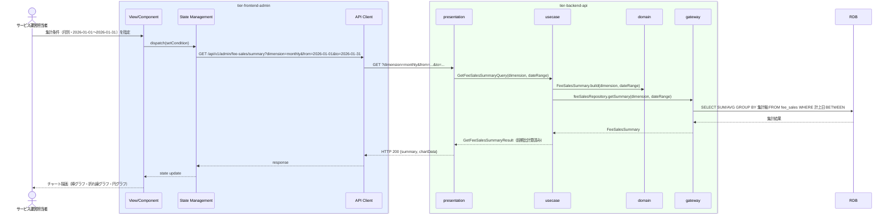

# 手数料売上を分析する

## 概要

サービス運営担当者が手数料売上を会議室別・貸出別・月別・オーナー別に集計・分析する。利用履歴と手数料売上データを多角的に可視化し、サービスの収益状況を把握する。

## データフロー

```mermaid
graph LR
  subgraph FE["tier-frontend-admin"]
    subgraph FE_V["view"]
      FeeSalesAnalytics
    end
    subgraph FE_S["state"]
      FeeSalesState
    end
    subgraph FE_A["api-client"]
      GetFeeSalesSummaryRequest
    end
  end
  subgraph BE["tier-backend-api"]
    subgraph BE_P["presentation"]
      GetFeeSalesSummaryRequestDTO
    end
    subgraph BE_U["usecase"]
      GetFeeSalesSummaryQuery
    end
    subgraph BE_D["domain"]
      FeeSalesSummary
    end
    subgraph BE_G["gateway"]
      FeeSalesRecord
    end
  end
  subgraph DB["tier-datastore-rdb"]
    fee_sales[("fee_sales")]
    usage_history[("usage_history")]
  end
  FeeSalesAnalytics --> FeeSalesState --> GetFeeSalesSummaryRequest
  GetFeeSalesSummaryRequest -->|"GET /api/v1/admin/fee-sales/summary?dimension=monthly"| GetFeeSalesSummaryRequestDTO
  GetFeeSalesSummaryRequestDTO --> GetFeeSalesSummaryQuery
  GetFeeSalesSummaryQuery --> FeeSalesSummary
  FeeSalesSummary --> FeeSalesRecord
  FeeSalesRecord -->|"SELECT GROUP BY"| fee_sales
  FeeSalesRecord -->|"SELECT"| usage_history
  fee_sales --> FeeSalesRecord
  usage_history --> FeeSalesRecord
  FeeSalesRecord --> FeeSalesSummary
  FeeSalesSummary --> GetFeeSalesSummaryQuery --> GetFeeSalesSummaryRequestDTO
  GetFeeSalesSummaryRequestDTO -->|"HTTP 200"| GetFeeSalesSummaryRequest
  GetFeeSalesSummaryRequest --> FeeSalesState --> FeeSalesAnalytics
```



| レイヤー | データモデル | 変換内容 |
|---------|------------|---------|
| FE view | FeeSalesAnalytics | 集計軸・期間・グラフ種別の選択 UI |
| FE state | FeeSalesState | チャートデータ・集計条件・期間を管理 |
| FE api-client | GetFeeSalesSummaryRequest | クエリパラメータ（dimension, from, to）生成 |
| BE presentation | GetFeeSalesSummaryRequestDTO | クエリパラメータ取り出し・日付範囲バリデーション |
| BE usecase | GetFeeSalesSummaryQuery | 集計軸による分岐ロジック |
| BE domain | FeeSalesSummary | 合計手数料・平均率・前期比計算 |
| BE gateway | FeeSalesRecord | SUM/AVG/GROUP BY fee_sales JOIN usage_history |
| DB | fee_sales | SELECT GROUP BY (dimension 軸) |
| DB | usage_history | JOIN で利用履歴結合 |

## 処理フロー



## バリエーション一覧

| バリエーション名 | 値 | 処理内容 | 適用 tier | 適用箇所 |
|----------------|---|---------|----------|---------|
| 売上分析区分 | 会議室別 | 会議室IDでグループ化しサマリーを返す | tier-backend-api | GET /api/v1/admin/fee-sales/summary |
| 売上分析区分 | 貸出別 | 貸出IDで個別明細を返す | tier-backend-api | GET /api/v1/admin/fee-sales/summary |
| 売上分析区分 | 月別 | 計上日の年月でグループ化しサマリーを返す | tier-backend-api | GET /api/v1/admin/fee-sales/summary |
| 売上分析区分 | オーナー別 | オーナーIDでグループ化しサマリーを返す | tier-backend-api | GET /api/v1/admin/fee-sales/summary |

## 分岐条件一覧

| 条件名 | 判定ルール | 適用 tier | 適用箇所 | BDD Scenario |
|--------|----------|----------|---------|-------------|
| 集計期間フィルター | 指定期間（開始日〜終了日）が有効な日付範囲かつ開始 ≤ 終了の場合にデータを返す | tier-backend-api | GET /api/v1/admin/fee-sales/summary | 正常系: 月別集計で2026年1月の手数料を取得する |
| 売上分析区分選択 | 集計軸が「会議室別」「貸出別」「月別」「オーナー別」のいずれかのみ | tier-backend-api | GET /api/v1/admin/fee-sales/summary | 正常系: 会議室別集計で手数料売上を取得する |

## 計算ルール一覧

| 計算名 | 入力情報 | 計算式/ロジック | 出力情報 | 適用 tier |
|--------|---------|---------------|---------|----------|
| 手数料合計計算 | 手数料売上.手数料金額、集計期間 | SUM(手数料金額) WHERE 計上日 BETWEEN 開始日 AND 終了日 GROUP BY 集計軸 | 集計期間合計手数料 | tier-backend-api |
| 手数料率平均計算 | 手数料売上.手数料率 | AVG(手数料率) GROUP BY 集計軸 | 平均手数料率 | tier-backend-api |
| 前期比計算 | 手数料売上.手数料金額、前期データ | (当期合計 - 前期合計) / 前期合計 × 100 | 前期比(%) | tier-backend-api |

## 状態遷移一覧

| 状態モデル | 遷移元 | 遷移先 | トリガー | 事前条件 | 事後処理 | 適用 tier |
|-----------|--------|--------|---------|---------|---------|----------|
| - | - | - | - | - | 参照系UCのため状態遷移なし | - |

## 関連 RDRA モデル

| モデル種別 | 要素名 | 関連 |
|-----------|--------|------|
| 業務 | サービス運営業務 | このUCが属する業務 |
| BUC | サービス運営管理フロー | このUCを含むBUC |
| アクター | サービス運営担当者 | 操作するアクター |
| 情報 | 手数料売上 | 参照・集計する情報（手数料ID、会議室ID、貸出ID、手数料率、手数料金額、計上日） |
| 情報 | 利用履歴 | 参照する情報（履歴ID、利用者ID、会議室ID、利用日時、利用時間、利用料金） |
| 状態 | - | 状態遷移なし（参照系UC） |
| 条件 | - | 直接適用される条件なし |
| 外部システム | - | 連携なし |

## E2E 完了条件（BDD）

### 正常系

```gherkin
Feature: 手数料売上を分析する

  Scenario: 月別集計で2026年1月の手数料売上を取得する
    Given サービス運営担当者「山田花子」が管理画面にログイン済みである
    When 売上分析区分「月別」、期間「2026-01-01〜2026-01-31」を指定して分析を実行する
    Then 2026年1月の手数料合計「¥480,000」が棒グラフで表示される

  Scenario: 会議室別集計で上位5件の手数料売上を確認する
    Given サービス運営担当者「山田花子」が管理画面にログイン済みである
    When 売上分析区分「会議室別」、期間「2026-01-01〜2026-03-31」を指定して分析を実行する
    Then 会議室「渋谷A会議室」の手数料合計「¥120,000」が集計結果の1位として表示される

  Scenario: オーナー別集計で前期比を確認する
    Given サービス運営担当者「山田花子」が管理画面にログイン済みである
    When 売上分析区分「オーナー別」、期間「2026-03-01〜2026-03-31」を指定して分析を実行する
    Then オーナー「田中太郎」の前期比「+12.5%」が表示される
```

### 異常系

```gherkin
  Scenario: 集計期間の開始日が終了日より後を指定した場合はエラーになる
    Given サービス運営担当者「山田花子」が管理画面にログイン済みである
    When 売上分析区分「月別」、開始日「2026-03-31」、終了日「2026-01-01」を指定して分析を実行する
    Then 「集計期間の開始日は終了日以前を指定してください」というバリデーションエラーが表示される

  Scenario: 権限のない利用者が管理画面にアクセスした場合は403エラーになる
    Given 利用者ロールの「佐藤次郎」がログイン済みである
    When 手数料売上分析APIに直接アクセスする
    Then HTTPステータス403「このページへのアクセス権限がありません」が返される
```

## ティア別仕様

- [管理者向けフロントエンド仕様](tier-frontend-admin.md)
- [バックエンドAPI仕様](tier-backend-api.md)

### 統合 API Spec

- [OpenAPI Spec](../../_cross-cutting/api/openapi.yaml)（全 UC 統合、Contract First 開発用）
