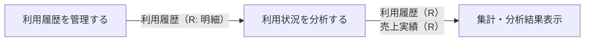

# 利用状況管理フロー

## 概要

サービス運営担当者が会員別・物件別の利用履歴を管理し、利用状況を多角的に集計・分析するフロー。利用履歴管理では明細レベルの確認・管理を行い、利用状況分析では売上実績も含めた傾向把握を支援する。

## 所属 UC 一覧

| UC名 | アクター | 主な操作 | 関連情報 |
|------|---------|---------|---------|
| [利用履歴を管理する](利用履歴を管理する/spec.md) | サービス運営担当者 | 会員別・物件別の利用履歴を確認・管理する | 利用履歴 |
| [利用状況を分析する](利用状況を分析する/spec.md) | サービス運営担当者 | 会議室利用状況を集計・分析し傾向を把握する | 利用履歴, 売上実績 |

## UC 横断データフロー

BUC 内の UC 間で情報がどう流れるかを示す。

### データフロー図

### 情報 CRUD マトリクス

| 情報名 | 利用履歴を管理する | 利用状況を分析する |
|--------|:-------:|:-------:|
| 利用履歴 | R | R |
| 売上実績 | | R |

## 状態遷移全体図

このBUCで管理する状態遷移はありません。両UCとも参照・集計専用であり、情報の状態を変更しません。

### 状態遷移 UC マッピング

| 状態モデル | 遷移元 | 遷移先 | 担当 UC |
|-----------|--------|--------|--------|
| （なし） | - | - | 両UCとも参照専用 |

## BUC 内共有条件一覧

| 条件名 | 条件の説明 | 適用 UC |
|--------|----------|--------|
| 利用履歴集計区分 | 利用履歴を集計・分析する際の集計軸の区分（会員別・物件別・期間別）。集計軸の有効値チェックを含む | 利用履歴を管理する, 利用状況を分析する |

## BUC 内共有バリエーション一覧

| バリエーション名 | 値 | 適用 UC |
|----------------|---|--------|
| 利用履歴集計区分 | 会員別, 物件別, 期間別 | 利用履歴を管理する, 利用状況を分析する |
