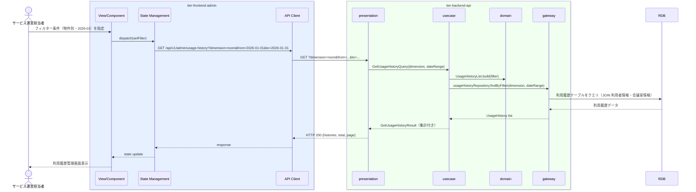

# 利用履歴を管理する

## 概要

サービス運営担当者が会員別・物件別の会議室利用履歴を確認・管理する。利用者・会議室・期間でフィルタリングし、利用状況の把握と問題発見を支援する。

## データフロー

```mermaid
graph LR
  subgraph FE["tier-frontend-admin"]
    subgraph FE_V["view"]
      UsageHistoryManagement
    end
    subgraph FE_S["state"]
      UsageHistoryState
    end
    subgraph FE_A["api-client"]
      GetUsageHistoryRequest
    end
  end
  subgraph BE["tier-backend-api"]
    subgraph BE_P["presentation"]
      GetUsageHistoryRequestDTO
    end
    subgraph BE_U["usecase"]
      GetUsageHistoryQuery
    end
    subgraph BE_D["domain"]
      UsageHistoryList
    end
    subgraph BE_G["gateway"]
      UsageHistoryRecord
    end
  end
  subgraph DB["tier-datastore-rdb"]
    usage_history[("usage_history")]
    users[("users")]
    rooms[("rooms")]
  end
  UsageHistoryManagement --> UsageHistoryState --> GetUsageHistoryRequest
  GetUsageHistoryRequest -->|"GET /api/v1/admin/usage-history?dimension=room"| GetUsageHistoryRequestDTO
  GetUsageHistoryRequestDTO --> GetUsageHistoryQuery
  GetUsageHistoryQuery --> UsageHistoryList
  UsageHistoryList --> UsageHistoryRecord
  UsageHistoryRecord -->|"SELECT"| usage_history
  UsageHistoryRecord -->|"JOIN"| users
  UsageHistoryRecord -->|"JOIN"| rooms
  usage_history --> UsageHistoryRecord
  users --> UsageHistoryRecord
  rooms --> UsageHistoryRecord
  UsageHistoryRecord --> UsageHistoryList
  UsageHistoryList --> GetUsageHistoryQuery --> GetUsageHistoryRequestDTO
  GetUsageHistoryRequestDTO -->|"HTTP 200"| GetUsageHistoryRequest
  GetUsageHistoryRequest --> UsageHistoryState --> UsageHistoryManagement
```



| レイヤー | データモデル | 変換内容 |
|---------|------------|---------|
| FE view | UsageHistoryManagement | フィルター UI（利用者・会議室・期間） + 一覧表示 |
| FE state | UsageHistoryState | 履歴一覧・フィルター条件・ページングを管理 |
| FE api-client | GetUsageHistoryRequest | クエリパラメータ（dimension, from, to, userId, roomId）生成 |
| BE presentation | GetUsageHistoryRequestDTO | クエリパラメータ取り出し・デフォルト値設定 |
| BE usecase | GetUsageHistoryQuery | フィルター条件組み立て・ページネーション適用 |
| BE domain | UsageHistoryList | 集計付き利用履歴一覧 |
| BE gateway | UsageHistoryRecord | SELECT usage_history JOIN users JOIN rooms WHERE |
| DB | usage_history | SELECT (フィルタ付き、ページネーション) |
| DB | users | JOIN で利用者情報結合 |
| DB | rooms | JOIN で会議室情報結合 |

## 処理フロー



## バリエーション一覧

| バリエーション名 | 値 | 処理内容 | 適用 tier | 適用箇所 |
|----------------|---|---------|----------|---------|
| 利用履歴集計区分 | 会員別 | 利用者IDでグループ化して件数・金額を集計 | tier-backend-api | GET /api/v1/admin/usage-history?dimension=user |
| 利用履歴集計区分 | 物件別 | 会議室IDでグループ化して件数・金額を集計 | tier-backend-api | GET /api/v1/admin/usage-history?dimension=room |
| 利用履歴集計区分 | 期間別 | 利用日の年月でグループ化して件数・金額を集計 | tier-backend-api | GET /api/v1/admin/usage-history?dimension=period |

## 分岐条件一覧

| 条件名 | 判定ルール | 適用 tier | 適用箇所 | BDD Scenario |
|--------|----------|----------|---------|-------------|
| 利用履歴集計区分 | 集計軸が「会員別」「物件別」「期間別」のいずれかを指定した場合に対応した集計を返す | tier-backend-api | GET /api/v1/admin/usage-history | 正常系: 会員別の利用履歴を取得する |
| 期間フィルター | 指定期間（開始日〜終了日）が有効な日付範囲 | tier-backend-api | GET /api/v1/admin/usage-history | 正常系: 2026年1月の利用履歴を取得する |

## 計算ルール一覧

| 計算名 | 入力情報 | 計算式/ロジック | 出力情報 | 適用 tier |
|--------|---------|---------------|---------|----------|
| 利用料金合計 | 利用履歴.利用料金 | SUM(利用料金) GROUP BY 集計軸 | 集計期間合計料金 | tier-backend-api |
| 利用時間合計 | 利用履歴.利用時間 | SUM(利用時間) GROUP BY 集計軸 | 総利用時間 | tier-backend-api |
| 平均利用時間 | 利用履歴.利用時間 | AVG(利用時間) GROUP BY 集計軸 | 平均利用時間 | tier-backend-api |

## 状態遷移一覧

| 状態モデル | 遷移元 | 遷移先 | トリガー | 事前条件 | 事後処理 | 適用 tier |
|-----------|--------|--------|---------|---------|---------|----------|
| - | - | - | - | - | 参照系UCのため状態遷移なし | - |

## 関連 RDRA モデル

| モデル種別 | 要素名 | 関連 |
|-----------|--------|------|
| 業務 | サービス運営業務 | このUCが属する業務 |
| BUC | 利用状況管理フロー | このUCを含むBUC |
| アクター | サービス運営担当者 | 操作するアクター |
| 情報 | 利用履歴 | 参照・管理する情報（履歴ID、利用者ID、会議室ID、利用日時、利用時間、利用料金） |
| 状態 | - | 状態遷移なし（参照系UC） |
| 条件 | - | 直接適用される条件なし |
| 外部システム | - | 連携なし |

## E2E 完了条件（BDD）

### 正常系

```gherkin
Feature: 利用履歴を管理する

  Scenario: 物件別の2026年1月の利用履歴を取得する
    Given サービス運営担当者「山田花子」が管理画面にログイン済みである
    When 利用履歴管理画面で集計軸「物件別」・期間「2026-01-01〜2026-01-31」を指定する
    Then 会議室「渋谷A会議室（利用回数: 24回、合計金額: ¥480,000）」が一覧に表示される

  Scenario: 会員「田中太郎」の利用履歴を検索する
    Given サービス運営担当者「山田花子」が管理画面にログイン済みである
    When 利用履歴管理画面で利用者名「田中太郎」を検索する
    Then 利用者「田中太郎（利用者ID: U-001）」の全利用履歴が一覧に表示される
```

### 異常系

```gherkin
  Scenario: 集計期間の開始日が終了日より後の場合はバリデーションエラーになる
    Given サービス運営担当者「山田花子」が管理画面にログイン済みである
    When 利用履歴管理画面で開始日「2026-03-31」・終了日「2026-01-01」を入力して検索する
    Then 「集計期間の開始日は終了日以前を指定してください」というエラーメッセージが表示される
```

## ティア別仕様

- [管理者向けフロントエンド仕様](tier-frontend-admin.md)
- [バックエンドAPI仕様](tier-backend-api.md)

### 統合 API Spec

- [OpenAPI Spec](../../_cross-cutting/api/openapi.yaml)（全 UC 統合、Contract First 開発用）
