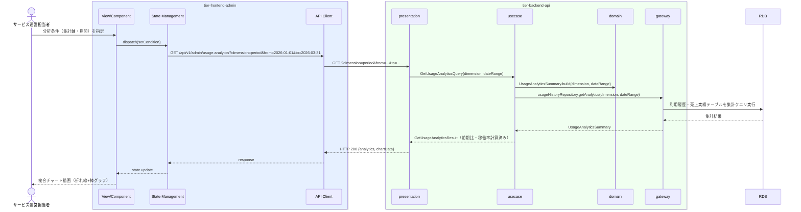

# 利用状況を分析する

## 概要

サービス運営担当者が会議室利用状況を集計・分析し傾向を把握する。利用履歴と売上実績データを多角的に可視化することで、サービス改善の意思決定を支援するデータ可視化画面。

## データフロー

```mermaid
graph LR
  subgraph FE["tier-frontend-admin"]
    subgraph FE_V["view"]
      UsageAnalyticsDashboard
    end
    subgraph FE_S["state"]
      UsageAnalyticsState
    end
    subgraph FE_A["api-client"]
      GetUsageAnalyticsRequest
    end
  end
  subgraph BE["tier-backend-api"]
    subgraph BE_P["presentation"]
      GetUsageAnalyticsRequestDTO
    end
    subgraph BE_U["usecase"]
      GetUsageAnalyticsQuery
    end
    subgraph BE_D["domain"]
      UsageAnalyticsSummary
    end
    subgraph BE_G["gateway"]
      UsageHistoryRecord
    end
  end
  subgraph DB["tier-datastore-rdb"]
    usage_history[("usage_history")]
    sales_results[("sales_results")]
  end
  UsageAnalyticsDashboard --> UsageAnalyticsState --> GetUsageAnalyticsRequest
  GetUsageAnalyticsRequest -->|"GET /api/v1/admin/usage-analytics?dimension=period"| GetUsageAnalyticsRequestDTO
  GetUsageAnalyticsRequestDTO --> GetUsageAnalyticsQuery
  GetUsageAnalyticsQuery --> UsageAnalyticsSummary
  UsageAnalyticsSummary --> UsageHistoryRecord
  UsageHistoryRecord -->|"SELECT GROUP BY"| usage_history
  UsageHistoryRecord -->|"SELECT"| sales_results
  usage_history --> UsageHistoryRecord
  sales_results --> UsageHistoryRecord
  UsageHistoryRecord --> UsageAnalyticsSummary
  UsageAnalyticsSummary --> GetUsageAnalyticsQuery --> GetUsageAnalyticsRequestDTO
  GetUsageAnalyticsRequestDTO -->|"HTTP 200"| GetUsageAnalyticsRequest
  GetUsageAnalyticsRequest --> UsageAnalyticsState --> UsageAnalyticsDashboard
```



| レイヤー | データモデル | 変換内容 |
|---------|------------|---------|
| FE view | UsageAnalyticsDashboard | 集計軸・期間・複合チャート選択 UI |
| FE state | UsageAnalyticsState | チャートデータ・分析条件・期間を管理 |
| FE api-client | GetUsageAnalyticsRequest | クエリパラメータ（dimension, from, to）生成 |
| BE presentation | GetUsageAnalyticsRequestDTO | クエリパラメータ取り出し・日付範囲検証 |
| BE usecase | GetUsageAnalyticsQuery | 集計軸による分岐ロジック |
| BE domain | UsageAnalyticsSummary | 利用回数・稼働率・売上・前期比計算 |
| BE gateway | UsageHistoryRecord | COUNT/SUM/AVG GROUP BY FROM usage_history JOIN sales_results |
| DB | usage_history | SELECT GROUP BY (dimension 軸) |
| DB | sales_results | JOIN で売上実績結合 |

## 処理フロー



## バリエーション一覧

| バリエーション名 | 値 | 処理内容 | 適用 tier | 適用箇所 |
|----------------|---|---------|----------|---------|
| 利用履歴集計区分 | 会員別 | 利用者IDでグループ化し利用回数・利用料金を集計 | tier-backend-api | GET /api/v1/admin/usage-analytics?dimension=user |
| 利用履歴集計区分 | 物件別 | 会議室IDでグループ化し利用回数・稼働率・売上金額を集計 | tier-backend-api | GET /api/v1/admin/usage-analytics?dimension=room |
| 利用履歴集計区分 | 期間別 | 利用日の年月でグループ化し月別推移を集計 | tier-backend-api | GET /api/v1/admin/usage-analytics?dimension=period |

## 分岐条件一覧

| 条件名 | 判定ルール | 適用 tier | 適用箇所 | BDD Scenario |
|--------|----------|----------|---------|-------------|
| 利用履歴集計区分 | 集計軸が「会員別」「物件別」「期間別」のいずれかのみ有効 | tier-backend-api | GET /api/v1/admin/usage-analytics | 正常系: 期間別の利用状況を取得する |
| 集計期間バリデーション | 開始日 ≤ 終了日かつ最大期間365日以内 | tier-backend-api | GET /api/v1/admin/usage-analytics | 異常系: 無効な期間でエラーになる |

## 計算ルール一覧

| 計算名 | 入力情報 | 計算式/ロジック | 出力情報 | 適用 tier |
|--------|---------|---------------|---------|----------|
| 利用回数集計 | 利用履歴.履歴ID | COUNT(*) GROUP BY 集計軸 | 利用回数 | tier-backend-api |
| 稼働率計算（物件別） | 利用履歴.利用時間、運用ルール.利用可能時間帯 | SUM(利用時間) / 集計期間内利用可能時間 × 100 | 稼働率(%) | tier-backend-api |
| 売上金額合計 | 売上実績.売上金額 | SUM(売上金額) GROUP BY 集計軸 | 集計期間合計売上 | tier-backend-api |
| 前期比計算 | 当期・前期データ | (当期合計 - 前期合計) / 前期合計 × 100 | 前期比(%) | tier-backend-api |

## 状態遷移一覧

| 状態モデル | 遷移元 | 遷移先 | トリガー | 事前条件 | 事後処理 | 適用 tier |
|-----------|--------|--------|---------|---------|---------|----------|
| - | - | - | - | - | 参照系UCのため状態遷移なし | - |

## 関連 RDRA モデル

| モデル種別 | 要素名 | 関連 |
|-----------|--------|------|
| 業務 | サービス運営業務 | このUCが属する業務 |
| BUC | 利用状況管理フロー | このUCを含むBUC |
| アクター | サービス運営担当者 | 操作するアクター |
| 情報 | 利用履歴 | 集計対象情報（履歴ID、利用者ID、会議室ID、利用日時、利用時間、利用料金） |
| 情報 | 売上実績 | 集計対象情報（実績ID、会議室ID、オーナーID、集計期間、利用回数、売上金額） |
| 状態 | - | 状態遷移なし（参照系UC） |
| 条件 | - | 直接適用される条件なし |
| 外部システム | - | 連携なし |

## E2E 完了条件（BDD）

### 正常系

```gherkin
Feature: 利用状況を分析する

  Scenario: 期間別で2026年第1四半期の利用状況を分析する
    Given サービス運営担当者「山田花子」が管理画面にログイン済みである
    When 利用状況分析画面で集計軸「期間別」・期間「2026-01-01〜2026-03-31」を指定して分析する
    Then 月別推移折れ線グラフで1月「120件」・2月「145件」・3月「168件」の利用回数が表示される

  Scenario: 物件別で稼働率ランキングを確認する
    Given サービス運営担当者「山田花子」が管理画面にログイン済みである
    When 利用状況分析画面で集計軸「物件別」・期間「2026-03-01〜2026-03-31」を指定して分析する
    Then 稼働率ランキングで「渋谷A会議室（稼働率: 78.5%）」が1位として棒グラフに表示される
```

### 異常系

```gherkin
  Scenario: 集計期間が1年を超える場合はバリデーションエラーになる
    Given サービス運営担当者「山田花子」が管理画面にログイン済みである
    When 利用状況分析画面で開始日「2025-01-01」・終了日「2026-12-31」（2年間）を指定する
    Then 「集計期間は最大1年（365日）以内を指定してください」というエラーメッセージが表示される
```

## ティア別仕様

- [管理者向けフロントエンド仕様](tier-frontend-admin.md)
- [バックエンドAPI仕様](tier-backend-api.md)

### 統合 API Spec

- [OpenAPI Spec](../../_cross-cutting/api/openapi.yaml)（全 UC 統合、Contract First 開発用）
