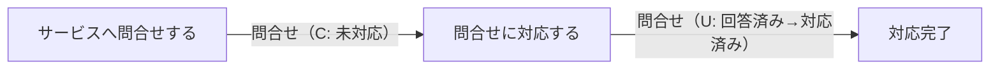
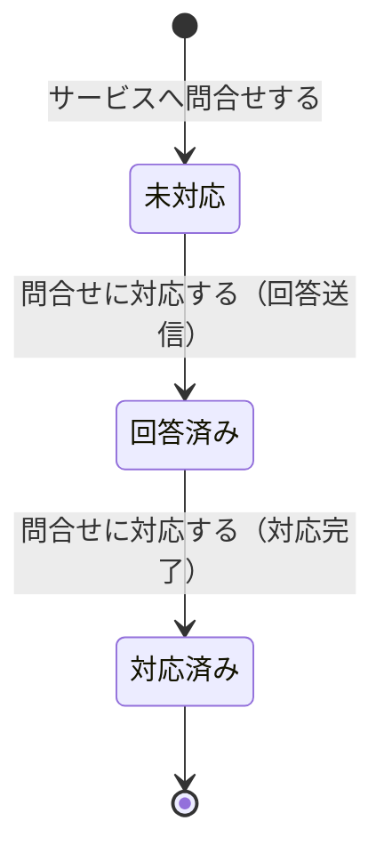

# 問合せ管理フロー

## 概要

利用者がサービスへ問合せを送信し、サービス運営担当者が対応・回答するフロー。問合せ種別によりサービス運営担当者への問合せを本フローで処理し、オーナーへの問合せは会議室貸出管理フローで処理する。問合せ状態が未対応→回答済み→対応済みと遷移する。

## 所属 UC 一覧

| UC名 | アクター | 主な操作 | 関連情報 |
|------|---------|---------|---------|
| [サービスへ問合せする](サービスへ問合せする/spec.md) | 利用者 | サービスに関する問合せを送信する | 問合せ |
| [問合せに対応する](問合せに対応する/spec.md) | サービス運営担当者 | 利用者からのサービス問合せに対応し回答する | 問合せ |

## UC 横断データフロー

BUC 内の UC 間で情報がどう流れるかを示す。

### データフロー図

### 情報 CRUD マトリクス

| 情報名 | サービスへ問合せする | 問合せに対応する |
|--------|:-------:|:-------:|
| 問合せ | C | R/U |

## 状態遷移全体図

問合せの対応状態の全遷移パスと担当 UC を示す。

### 状態遷移 UC マッピング

| 状態モデル | 遷移元 | 遷移先 | 担当 UC |
|-----------|--------|--------|--------|
| 問合せ | （初期） | 未対応 | [サービスへ問合せする](サービスへ問合せする/spec.md) |
| 問合せ | 未対応 | 回答済み | [問合せに対応する](問合せに対応する/spec.md) |
| 問合せ | 回答済み | 対応済み | [問合せに対応する](問合せに対応する/spec.md) |

## BUC 内共有条件一覧

| 条件名 | 条件の説明 | 適用 UC |
|--------|----------|--------|
| 問合せ種別区分 | 問合せ先区分が「サービス運営宛問合せ」の場合のみ本フローで処理する。「オーナー宛問合せ」は会議室貸出管理フローに委譲 | サービスへ問合せする, 問合せに対応する |

## BUC 内共有バリエーション一覧

| バリエーション名 | 値 | 適用 UC |
|----------------|---|--------|
| 問合せ種別 | オーナー宛問合せ, サービス運営宛問合せ | サービスへ問合せする, 問合せに対応する |
