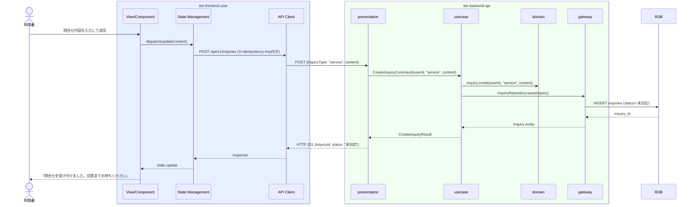

# サービスへ問合せする

## 概要

利用者がサービスに関する問合せ（使い方・トラブル・請求など）を送信する。送信後は問合せ状態が「未対応」になり、サービス運営担当者の対応を待つ。

## データフロー

```mermaid
graph LR
  subgraph FE["tier-frontend-user"]
    subgraph FE_V["view"]
      ServiceInquiryForm
    end
    subgraph FE_S["state"]
      InquiryState
    end
    subgraph FE_A["api-client"]
      CreateInquiryRequest
    end
  end
  subgraph BE["tier-backend-api"]
    subgraph BE_P["presentation"]
      CreateInquiryRequestDTO
    end
    subgraph BE_U["usecase"]
      CreateInquiryCommand
    end
    subgraph BE_D["domain"]
      Inquiry
    end
    subgraph BE_G["gateway"]
      InquiryRecord
    end
  end
  subgraph DB["tier-datastore-rdb"]
    inquiries[("inquiries")]
  end
  ServiceInquiryForm --> InquiryState --> CreateInquiryRequest
  CreateInquiryRequest -->|"POST /api/v1/inquiries"| CreateInquiryRequestDTO
  CreateInquiryRequestDTO --> CreateInquiryCommand
  CreateInquiryCommand --> Inquiry
  Inquiry --> InquiryRecord
  InquiryRecord -->|"INSERT"| inquiries
  inquiries --> InquiryRecord
  InquiryRecord --> Inquiry
  Inquiry --> CreateInquiryCommand --> CreateInquiryRequestDTO
  CreateInquiryRequestDTO -->|"HTTP 201"| CreateInquiryRequest
  CreateInquiryRequest --> InquiryState --> ServiceInquiryForm
```



| レイヤー | データモデル | 変換内容 |
|---------|------------|---------|
| FE view | ServiceInquiryForm | 問合せ種別・内容入力 → State へ dispatch |
| FE state | InquiryState | 問合せ内容・送信状態を管理 |
| FE api-client | CreateInquiryRequest | inquiryType="service" 固定。冪等キー付与 |
| BE presentation | CreateInquiryRequestDTO | 内容バリデーション・userId 注入 |
| BE usecase | CreateInquiryCommand | サービス問合せとして問合せ先区分設定 |
| BE domain | Inquiry | 新規エンティティ作成。status=未対応, type=service |
| BE gateway | InquiryRecord | Entity → DB カラム形式 DTO |
| DB | inquiries | INSERT (type=service, status=未対応) |

## 処理フロー



## バリエーション一覧

| バリエーション名 | 値 | 処理内容 | 適用 tier | 適用箇所 |
|----------------|---|---------|----------|---------|
| 問合せ種別 | サービス運営宛問合せ | 問合せ先IDをサービス運営担当者に設定 | tier-backend-api | POST /api/v1/inquiries |
| 問合せ種別 | オーナー宛問合せ | 別UC（オーナーへ問合せする）で処理 | tier-backend-api | - |

## 分岐条件一覧

| 条件名 | 判定ルール | 適用 tier | 適用箇所 | BDD Scenario |
|--------|----------|----------|---------|-------------|
| 問合せ種別 | 問合せ先区分が「サービス運営宛問合せ」の場合のみこのUCで処理する | tier-backend-api | POST /api/v1/inquiries | 正常系: サービスに問合せを送信する |
| 問合せ内容バリデーション | 問合せ内容が1文字以上1000文字以内の場合のみ受け付ける | tier-backend-api | POST /api/v1/inquiries | 異常系: 空の問合せ内容でエラーになる |

## 計算ルール一覧

| 計算名 | 入力情報 | 計算式/ロジック | 出力情報 | 適用 tier |
|--------|---------|---------------|---------|----------|
| 問合せID生成 | システム生成 | UUID v4 | 問合せID | tier-backend-api |

## 状態遷移一覧

| 状態モデル | 遷移元 | 遷移先 | トリガー | 事前条件 | 事後処理 | 適用 tier |
|-----------|--------|--------|---------|---------|---------|----------|
| 問合せ | - | 未対応 | サービスへ問合せする | 問合せ内容が入力済み | 問合せ一覧に未対応として表示 | tier-backend-api |

## 関連 RDRA モデル

| モデル種別 | 要素名 | 関連 |
|-----------|--------|------|
| 業務 | サービス運営業務 | このUCが属する業務 |
| BUC | 問合せ管理フロー | このUCを含むBUC |
| アクター | 利用者 | 操作するアクター（社外） |
| 情報 | 問合せ | 作成する情報（問合せID、利用者ID、問合せ先区分、問合せ内容、問合せ状態、問合せ日時） |
| 状態 | 問合せ | 「未対応」への遷移 |
| 条件 | - | 直接適用される条件なし |
| 外部システム | - | 連携なし |

## E2E 完了条件（BDD）

### 正常系

```gherkin
Feature: サービスへ問合せする

  Scenario: 利用者がサービスに問合せを送信する
    Given 利用者「田中太郎」がログイン済みである
    When サービス問合せ画面で問合せ内容「予約のキャンセル方法を教えてください」を入力して送信する
    Then 「お問合せを受け付けました。担当者が確認次第、ご登録のメールアドレスへ回答いたします」というメッセージが表示される

  Scenario: 送信した問合せが問合せ履歴に表示される
    Given 利用者「田中太郎」がサービスへの問合せを送信済みである
    When 問合せ履歴画面を確認する
    Then 「予約のキャンセル方法を教えてください（未対応）」が問合せ一覧に表示される
```

### 異常系

```gherkin
  Scenario: 問合せ内容が空の場合は送信できない
    Given 利用者「田中太郎」がログイン済みである
    When サービス問合せ画面で問合せ内容を空にしたまま送信する
    Then 「問合せ内容を入力してください」というバリデーションエラーが表示され送信されない

  Scenario: 問合せ内容が1001文字以上の場合は送信できない
    Given 利用者「田中太郎」がログイン済みである
    When サービス問合せ画面で1001文字の問合せ内容を入力して送信する
    Then 「問合せ内容は1000文字以内で入力してください」というバリデーションエラーが表示される
```

## ティア別仕様

- [利用者向けフロントエンド仕様](tier-frontend-user.md)
- [バックエンドAPI仕様](tier-backend-api.md)

### 統合 API Spec

- [OpenAPI Spec](../../_cross-cutting/api/openapi.yaml)（全 UC 統合、Contract First 開発用）
