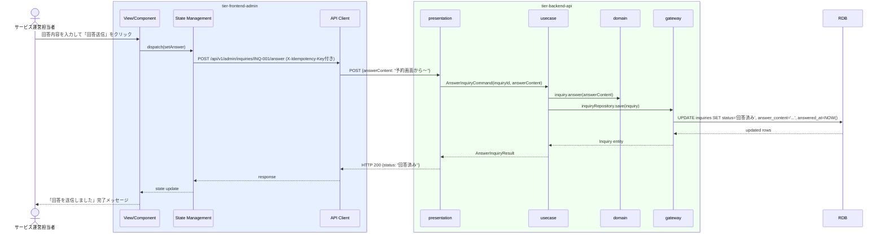

# 問合せに対応する

## 概要

サービス運営担当者が利用者からのサービス問合せに対応し回答する。問合せ状態を「回答済み」→「対応済み」に遷移させる。

## データフロー

```mermaid
graph LR
  subgraph FE["tier-frontend-admin"]
    subgraph FE_V["view"]
      InquiryResponseForm
    end
    subgraph FE_S["state"]
      InquiryDetailState
    end
    subgraph FE_A["api-client"]
      AnswerInquiryRequest
    end
  end
  subgraph BE["tier-backend-api"]
    subgraph BE_P["presentation"]
      AnswerInquiryRequestDTO
    end
    subgraph BE_U["usecase"]
      AnswerInquiryCommand
    end
    subgraph BE_D["domain"]
      Inquiry
    end
    subgraph BE_G["gateway"]
      InquiryRecord
    end
  end
  subgraph DB["tier-datastore-rdb"]
    inquiries[("inquiries")]
  end
  InquiryResponseForm --> InquiryDetailState --> AnswerInquiryRequest
  AnswerInquiryRequest -->|"POST /api/v1/admin/inquiries/{id}/answer"| AnswerInquiryRequestDTO
  AnswerInquiryRequestDTO --> AnswerInquiryCommand
  AnswerInquiryCommand --> Inquiry
  Inquiry --> InquiryRecord
  InquiryRecord -->|"UPDATE"| inquiries
  inquiries --> InquiryRecord
  InquiryRecord --> Inquiry
  Inquiry --> AnswerInquiryCommand --> AnswerInquiryRequestDTO
  AnswerInquiryRequestDTO -->|"HTTP 200"| AnswerInquiryRequest
  AnswerInquiryRequest --> InquiryDetailState --> InquiryResponseForm
```



| レイヤー | データモデル | 変換内容 |
|---------|------------|---------|
| FE view | InquiryResponseForm | 問合せ詳細表示・回答入力フォーム |
| FE state | InquiryDetailState | 問合せ詳細・回答内容を管理 |
| FE api-client | AnswerInquiryRequest | 冪等キー付与 |
| BE presentation | AnswerInquiryRequestDTO | パスパラメータ inquiryId + answerContent 結合 |
| BE usecase | AnswerInquiryCommand | 管理者 ID 注入・状態遷移制御 |
| BE domain | Inquiry | 状態遷移: 未対応 → 回答済み |
| BE gateway | InquiryRecord | Entity → DB カラム形式 DTO |
| DB | inquiries | UPDATE (status=回答済み, answer_content, answered_at) |

## 処理フロー



## バリエーション一覧

| バリエーション名 | 値 | 処理内容 | 適用 tier | 適用箇所 |
|----------------|---|---------|----------|---------|
| 問合せ種別 | サービス運営宛問合せ | 管理者が回答・対応済み更新を実施 | tier-backend-api | POST /api/v1/admin/inquiries/{id}/answer |
| 問合せ種別 | オーナー宛問合せ | 別UC（問合せに回答するUC）で処理 | tier-backend-api | - |

## 分岐条件一覧

| 条件名 | 判定ルール | 適用 tier | 適用箇所 | BDD Scenario |
|--------|----------|----------|---------|-------------|
| 問合せ状態チェック | 回答対象の問合せが「回答済み」状態の場合のみ「対応済み」への遷移が可能 | tier-backend-api | PUT /api/v1/admin/inquiries/{id}/status | 正常系: 対応済みに更新する |
| 問合せ先区分チェック | 問合せ先区分が「サービス運営宛問合せ」の場合のみ管理者が回答可能 | tier-backend-api | POST /api/v1/admin/inquiries/{id}/answer | 正常系: 問合せに回答する |

## 計算ルール一覧

| 計算名 | 入力情報 | 計算式/ロジック | 出力情報 | 適用 tier |
|--------|---------|---------------|---------|----------|
| 回答日時記録 | システム時刻 | NOW() | answered_at | tier-backend-api |
| 対応完了日時記録 | システム時刻 | NOW() | resolved_at | tier-backend-api |

## 状態遷移一覧

| 状態モデル | 遷移元 | 遷移先 | トリガー | 事前条件 | 事後処理 | 適用 tier |
|-----------|--------|--------|---------|---------|---------|----------|
| 問合せ | 未対応 | 回答済み | 問合せに対応する（回答送信） | 問合せが未対応状態 | 回答日時を記録 | tier-backend-api |
| 問合せ | 回答済み | 対応済み | 問合せに対応する（対応完了） | 問合せが回答済み状態 | 対応完了日時を記録 | tier-backend-api |

## 関連 RDRA モデル

| モデル種別 | 要素名 | 関連 |
|-----------|--------|------|
| 業務 | サービス運営業務 | このUCが属する業務 |
| BUC | 問合せ管理フロー | このUCを含むBUC |
| アクター | サービス運営担当者 | 操作するアクター（社内） |
| 情報 | 問合せ | 参照・更新する情報（問合せID、利用者ID、問合せ先区分、問合せ内容、回答内容、問合せ状態） |
| 状態 | 問合せ | 回答済み/対応済みへの遷移 |
| 条件 | - | 直接適用される条件なし |
| 外部システム | - | 連携なし |

## E2E 完了条件（BDD）

### 正常系

```gherkin
Feature: 問合せに対応する

  Scenario: 未対応の問合せに回答を送信する
    Given サービス運営担当者「山田花子」が管理画面にログイン済みである
    When 問合せ対応画面で未対応の問合せ「田中太郎：予約のキャンセル方法を教えてください」を開き、回答「予約詳細画面の『予約を取り消す』ボタンからキャンセルできます。キャンセル料についてはキャンセルポリシーをご確認ください」を入力して送信する
    Then 問合せ状態が「回答済み」に変わり、田中太郎のメールアドレス宛に回答が送信される

  Scenario: 回答済みの問合せを対応済みにする
    Given サービス運営担当者「山田花子」が「回答済み」の問合せを確認している
    When 問合せ詳細画面の「対応済みにする」ボタンをクリックする
    Then 問合せ状態が「対応済み」に変わり、問合せ一覧から「回答済み」タブで確認できる
```

### 異常系

```gherkin
  Scenario: 既に回答済みの問合せに再度回答しようとすると確認ダイアログが表示される
    Given サービス運営担当者「山田花子」が「回答済み」の問合せを開いている
    When 回答内容を変更して「回答送信」をクリックする
    Then 「すでに回答済みです。上書きしますか？」という確認ダイアログが表示される
```

## ティア別仕様

- [管理者向けフロントエンド仕様](tier-frontend-admin.md)
- [バックエンドAPI仕様](tier-backend-api.md)

### 統合 API Spec

- [OpenAPI Spec](../../_cross-cutting/api/openapi.yaml)（全 UC 統合、Contract First 開発用）
