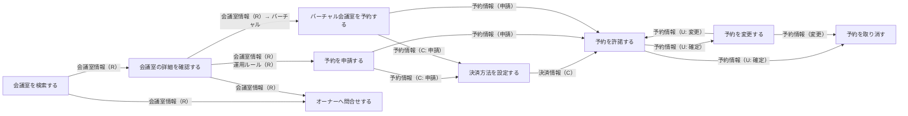
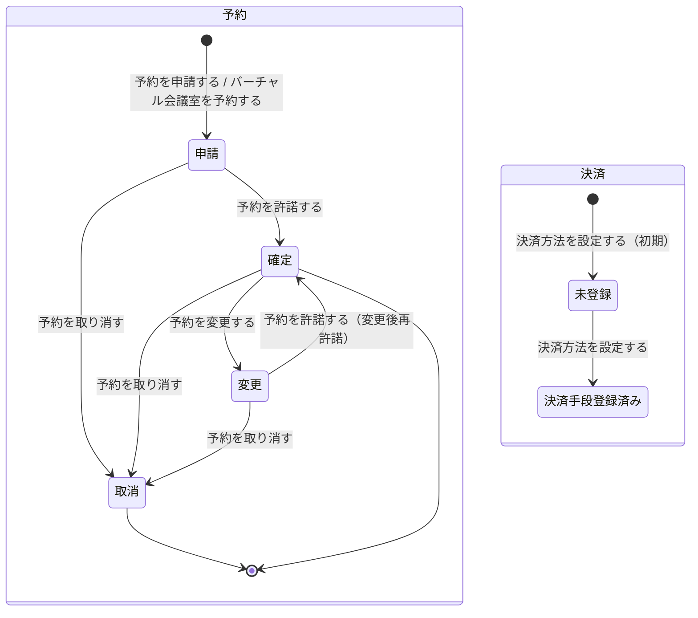

# 会議室予約フロー

## 概要

利用者が会議室を検索・照会し、予約申請から決済方法設定・オーナー許諾・予約変更・予約取消までの予約ライフサイクルを管理するフロー。物理・バーチャル両会議室の予約に対応し、キャンセルポリシーに基づくキャンセル料計算も含む。

## 所属 UC 一覧

| UC名 | アクター | 主な操作 | 関連情報 |
|------|---------|---------|---------|
| [会議室を検索する](会議室を検索する/spec.md) | 利用者 | 条件を指定して会議室を検索する | 会議室情報 |
| [会議室の詳細を確認する](会議室の詳細を確認する/spec.md) | 利用者 | 会議室の物件情報・運用ルール・評価を確認する | 会議室情報, 運用ルール, 会議室評価 |
| [予約を申請する](予約を申請する/spec.md) | 利用者 | 利用日時を指定して予約申請を行う | 予約情報 |
| [バーチャル会議室を予約する](バーチャル会議室を予約する/spec.md) | 利用者 | バーチャル会議室の利用日時を指定して予約申請を行う | 予約情報 |
| [決済方法を設定する](決済方法を設定する/spec.md) | 利用者 | クレジットカードまたは電子マネーの決済手段を登録する | 決済情報 |
| [予約を許諾する](予約を許諾する/spec.md) | 会議室オーナー | 利用者の予約申請を確認し予約確定状態に遷移させる | 予約情報 |
| [予約を変更する](予約を変更する/spec.md) | 利用者 | 確定済みの予約の日時等を変更する | 予約情報 |
| [予約を取り消す](予約を取り消す/spec.md) | 利用者 | 予約を取り消しキャンセルポリシーを適用する | 予約情報, キャンセルポリシー |
| [オーナーへ問合せする](オーナーへ問合せする/spec.md) | 利用者 | 予約に関して会議室オーナーへ問合せを行う | 問合せ |

## UC 横断データフロー

BUC 内の UC 間で情報がどう流れるかを示す。

### データフロー図

### 情報 CRUD マトリクス

| 情報名 | 会議室を検索する | 会議室の詳細を確認する | 予約を申請する | バーチャル会議室を予約する | 決済方法を設定する | 予約を許諾する | 予約を変更する | 予約を取り消す | オーナーへ問合せする |
|--------|:-------:|:-------:|:-------:|:-------:|:-------:|:-------:|:-------:|:-------:|:-------:|
| 会議室情報 | R | R | R | R | | R | R | | R |
| 運用ルール | | R | R | R | | | R | | |
| 会議室評価 | R | R | | | | | | | |
| 予約情報 | | | C | C | R | R/U | R/U | R/U | |
| 決済情報 | | | R | R | C | R | R/U | R/U | |
| キャンセルポリシー | | R | | | | | | R | |
| 問合せ | | | | | | | | | C |

## 状態遷移全体図

BUC 内で関連する全状態モデルの遷移パスと担当 UC を示す。

### 状態遷移 UC マッピング

| 状態モデル | 遷移元 | 遷移先 | 担当 UC |
|-----------|--------|--------|--------|
| 予約 | （初期） | 申請 | [予約を申請する](予約を申請する/spec.md) |
| 予約 | （初期） | 申請 | [バーチャル会議室を予約する](バーチャル会議室を予約する/spec.md) |
| 予約 | 申請 | 確定 | [予約を許諾する](予約を許諾する/spec.md) |
| 予約 | 申請 | 取消 | [予約を取り消す](予約を取り消す/spec.md) |
| 予約 | 確定 | 変更 | [予約を変更する](予約を変更する/spec.md) |
| 予約 | 確定 | 取消 | [予約を取り消す](予約を取り消す/spec.md) |
| 予約 | 変更 | 確定 | [予約を許諾する](予約を許諾する/spec.md) |
| 予約 | 変更 | 取消 | [予約を取り消す](予約を取り消す/spec.md) |
| 決済 | 未登録 | 決済手段登録済み | [決済方法を設定する](決済方法を設定する/spec.md) |

## BUC 内共有条件一覧

| 条件名 | 条件の説明 | 適用 UC |
|--------|----------|--------|
| 使用許諾条件 | 会議室予約申請に対してオーナーが利用者評価を確認し使用を許諾するかどうかを判定するルール | 予約を申請する, 予約を許諾する, 予約を変更する |
| 支払精算ポリシー | 予約時に決済手段を登録し、利用後にサービス運営者が利用料を引き落とすという一連の支払フローを定めるルール | 決済方法を設定する, 予約を申請する, バーチャル会議室を予約する, 予約を取り消す |
| キャンセルポリシー | 予約の取消時に適用されるルール。取消タイミングに応じたキャンセル料の発生有無や料率を定める | 予約を申請する, 予約を取り消す |
| バーチャル会議室利用ポリシー | バーチャル会議室の予約確定で会議URL自動通知を行うルール | 予約を許諾する, バーチャル会議室を予約する |

## BUC 内共有バリエーション一覧

| バリエーション名 | 値 | 適用 UC |
|----------------|---|--------|
| 決済方法 | クレジットカード, 電子マネー | 決済方法を設定する, 予約を申請する, バーチャル会議室を予約する, 予約を変更する, 予約を取り消す |
| 会議室検索条件 | エリア, 広さ, 収容人数, 価格帯, 設備・機能, 評価スコア, 利用可能日時, 会議室種別, 会議ツール種別, 同時接続数 | 会議室を検索する |
| 会議室種別 | 物理, バーチャル | 会議室を検索する, 会議室の詳細を確認する, 予約を申請する, バーチャル会議室を予約する, 予約を許諾する |
| 会議ツール種別 | Zoom, Teams, Google Meet | バーチャル会議室を予約する, 会議室の詳細を確認する |
