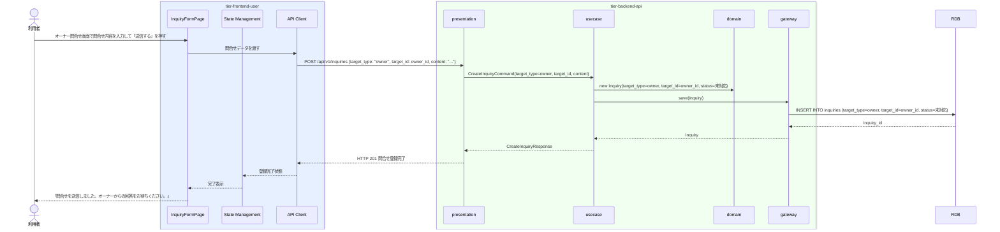

# オーナーへ問合せする

## 概要

利用者が予約に関して会議室オーナーへ問合せを行う。問合せは「未対応」状態で登録され、オーナーが回答することで「回答済み」に遷移する。問合せ種別は「オーナー宛問合せ」として分類される。

## データフロー

```mermaid
graph LR
  subgraph FE["tier-frontend-user"]
    subgraph FE_V["view"]
      InquiryFormPage
    end
    subgraph FE_S["state"]
      InquiryState
    end
    subgraph FE_A["api-client"]
      CreateInquiryRequest
    end
  end
  subgraph BE["tier-backend-api"]
    subgraph BE_P["presentation"]
      CreateInquiryRequestDTO
    end
    subgraph BE_U["usecase"]
      CreateInquiryCommand
    end
    subgraph BE_D["domain"]
      Inquiry
    end
    subgraph BE_G["gateway"]
      InquiryRecord
    end
  end
  subgraph DB["tier-datastore-rdb"]
    inquiries[("inquiries")]
  end

  InquiryFormPage --> InquiryState --> CreateInquiryRequest
  CreateInquiryRequest -->|"POST /api/v1/inquiries"| CreateInquiryRequestDTO
  CreateInquiryRequestDTO --> CreateInquiryCommand
  CreateInquiryCommand --> Inquiry
  Inquiry --> InquiryRecord
  InquiryRecord -->|"INSERT target_type=owner status=未対応"| inquiries
  inquiries --> InquiryRecord
  InquiryRecord --> Inquiry
  Inquiry --> CreateInquiryCommand --> CreateInquiryRequestDTO
  CreateInquiryRequestDTO -->|"HTTP 201"| CreateInquiryRequest
  CreateInquiryRequest --> InquiryState --> InquiryFormPage
```



| レイヤー | データモデル | 変換内容 |
|---------|------------|---------|
| FE view | InquiryFormPage | 問合せ内容入力・オーナー選択UI |
| FE state | InquiryState | 問合せ入力・送信状態管理 |
| FE api-client | CreateInquiryRequest | target_type=owner 付与・camelCase → snake_case |
| BE presentation | CreateInquiryRequestDTO | バリデーション + Command 変換 |
| BE usecase | CreateInquiryCommand | 問合せエンティティ生成・保存 |
| BE domain | Inquiry | status=未対応 でエンティティ初期化 |
| BE gateway | InquiryRecord | Entity → DB カラム形式の DTO |
| DB | inquiries | INSERT target_type=owner, status=未対応 |

## 処理フロー



## バリエーション一覧

| バリエーション名 | 値 | 処理内容 | 適用 tier | 適用箇所 |
|----------------|---|---------|----------|---------|
| 問合せ種別 | オーナー宛問合せ | 問合せ先区分=owner・問合せ先ID=オーナーID で登録 | tier-backend-api | POST /api/v1/inquiries |

## 分岐条件一覧

| 条件名 | 判定ルール | 適用 tier | 適用箇所 | BDD Scenario |
|--------|----------|----------|---------|-------------|
| 問合せ種別 | 問合せ先区分=オーナー宛問合せ の場合、問合せ先IDは会議室オーナーID | tier-backend-api | POST /api/v1/inquiries 問合せ先設定 | オーナー宛問合せが正しいオーナーIDに送信される |

## 計算ルール一覧

| 計算名 | 入力情報 | 計算式/ロジック | 出力情報 | 適用 tier |
|--------|---------|---------------|---------|----------|
| （なし） | - | - | - | - |

## 状態遷移一覧

| 状態モデル | 遷移元 | 遷移先 | トリガー | 事前条件 | 事後処理 | 適用 tier |
|-----------|--------|--------|---------|---------|---------|----------|
| 問合せ | （初期） | 未対応 | オーナーへ問合せする | 利用者がログイン済み | 問合せレコード作成・オーナーへ通知 | tier-backend-api |

## 関連 RDRA モデル

| モデル種別 | 要素名 | 関連 |
|-----------|--------|------|
| 業務 | 会議室利用業務 | このUCが属する業務 |
| BUC | 会議室予約フロー | このUCを含むBUC |
| アクター | 利用者 | 操作するアクター |
| 情報 | 問合せ | 問合せID・利用者ID・問合せ先区分・問合せ先ID・問合せ内容・回答内容・問合せ状態 |
| 状態 | 問合せ（→未対応） | 問合せ登録による状態遷移 |
| バリエーション | 問合せ種別 | オーナー宛問合せ |

## E2E 完了条件（BDD）

### 正常系

```gherkin
Feature: オーナーへ問合せする

  Scenario: 利用者が会議室オーナーに問合せを送信する
    Given 利用者「田中太郎」がログイン済みで、「渋谷区コワーキング会議室A」の詳細画面を開いている
    When オーナー問合せ画面で「駐車場はありますか？近隣に駐車場はありますか？」を入力して「送信する」をクリックする
    Then 問合せが「未対応」状態で登録され、「問合せを送信しました」というメッセージが表示される
```

### 異常系

```gherkin
  Scenario: 問合せ内容が空のまま送信しようとする
    Given 利用者「田中太郎」がオーナー問合せ画面を開いている
    When 問合せ内容を空のまま「送信する」をクリックする
    Then 「問合せ内容を入力してください」というバリデーションエラーが表示される
```

## ティア別仕様

- [利用者・オーナー向けフロントエンド](tier-frontend-user.md)
- [バックエンド API](tier-backend-api.md)

### 統合 API Spec

- [OpenAPI Spec](../../_cross-cutting/api/openapi.yaml)（全 UC 統合、Contract First 開発用）
