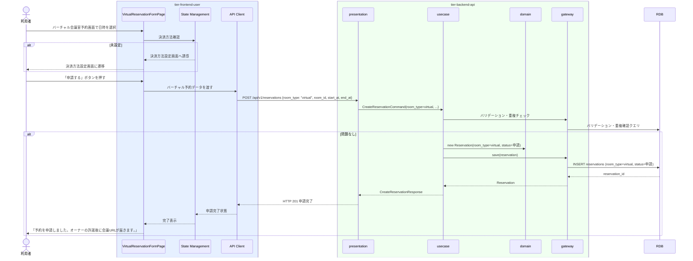

# バーチャル会議室を予約する

## 概要

利用者がバーチャル会議室の利用日時を指定して予約申請を行う。物理会議室と同様の決済フローを使用するが、確定後に会議URLが自動通知される点が異なる。会議室種別=バーチャルとして予約情報に記録される。

## データフロー

```mermaid
graph LR
  subgraph FE["tier-frontend-user"]
    subgraph FE_V["view"]
      VirtualReservationFormPage
    end
    subgraph FE_S["state"]
      BookingState
    end
    subgraph FE_A["api-client"]
      CreateReservationRequest
    end
  end

  subgraph BE["tier-backend-api"]
    subgraph BE_P["presentation"]
      CreateReservationRequestDTO
    end
    subgraph BE_U["usecase"]
      CreateReservationCommand
    end
    subgraph BE_D["domain"]
      Reservation
    end
    subgraph BE_G["gateway"]
      ReservationRecord
    end
  end

  subgraph DB["tier-datastore-rdb"]
    reservations[("reservations")]
  end

  VirtualReservationFormPage --> BookingState --> CreateReservationRequest
  CreateReservationRequest -->|"POST /api/v1/reservations"| CreateReservationRequestDTO
  CreateReservationRequestDTO --> CreateReservationCommand
  CreateReservationCommand --> Reservation
  Reservation --> ReservationRecord
  ReservationRecord -->|"INSERT"| reservations
  reservations --> ReservationRecord
  ReservationRecord --> Reservation
  Reservation --> CreateReservationCommand --> CreateReservationRequestDTO
  CreateReservationRequestDTO -->|"HTTP 201"| CreateReservationRequest
  CreateReservationRequest --> BookingState --> VirtualReservationFormPage
```



| レイヤー | データモデル | 変換内容 |
|---------|------------|---------|
| FE view | VirtualReservationFormPage | ユーザー入力（日時・会議ツール種別） → State へ dispatch |
| FE state | BookingState | フォーム状態管理。決済方法チェック |
| FE api-client | CreateReservationRequest | camelCase → snake_case。room_type=virtual 付与 |
| BE presentation | CreateReservationRequestDTO | 入力バリデーション（日時妥当性、room_type enum） |
| BE usecase | CreateReservationCommand | 認証済みuserId注入。公開状態・重複チェック |
| BE domain | Reservation | 状態遷移: (初期) → 申請。room_type=VIRTUAL |
| BE gateway | ReservationRecord | Entity → DB カラム形式の DTO |
| DB | reservations | INSERT (room_type=virtual, status=申請) |

## 処理フロー



## バリエーション一覧

| バリエーション名 | 値 | 処理内容 | 適用 tier | 適用箇所 |
|----------------|---|---------|----------|---------|
| 会議室種別 | バーチャル | room_type=virtual として予約を作成。許諾後に会議URL通知イベント発行 | tier-backend-api | POST /api/v1/reservations |
| 会議ツール種別 | Zoom/Teams/Google Meet | 予約詳細に会議ツール種別を記録して表示 | tier-frontend-user | バーチャル会議室予約画面 |

## 分岐条件一覧

| 条件名 | 判定ルール | 適用 tier | 適用箇所 | BDD Scenario |
|--------|----------|----------|---------|-------------|
| バーチャル会議室利用ポリシー | 会議室種別=バーチャルの場合: 鍵の貸出不要・予約確定で会議URL自動通知 | tier-backend-api | POST /api/v1/reservations room_type=virtual | バーチャル予約は許諾後に会議URL通知 |
| 支払精算ポリシー | 決済方法が未登録の場合は決済方法設定フローへ誘導 | tier-frontend-user | バーチャル会議室予約画面 | 決済未設定で申請しようとすると設定画面へ |

## 計算ルール一覧

| 計算名 | 入力情報 | 計算式/ロジック | 出力情報 | 適用 tier |
|--------|---------|---------------|---------|----------|
| 利用料金計算 | 時間単価・利用開始/終了日時 | fee = 時間単価 × CEIL((終了日時 - 開始日時) / 3600) | 利用料金（円） | tier-backend-api |

## 状態遷移一覧

| 状態モデル | 遷移元 | 遷移先 | トリガー | 事前条件 | 事後処理 | 適用 tier |
|-----------|--------|--------|---------|---------|---------|----------|
| 予約 | （初期） | 申請 | バーチャル会議室を予約する | 会議室が公開中・利用者がログイン済み・決済方法登録済み | 予約レコード作成（room_type=virtual） | tier-backend-api |

## 関連 RDRA モデル

| モデル種別 | 要素名 | 関連 |
|-----------|--------|------|
| 業務 | 会議室利用業務 | このUCが属する業務 |
| BUC | 会議室予約フロー | このUCを含むBUC |
| アクター | 利用者 | 操作するアクター |
| 情報 | 予約情報 | 予約ID・利用者ID・会議室ID・会議室種別=バーチャル・予約状態・決済方法 |
| 情報 | 会議URL | 会議URL・有効期限（許諾後に自動通知） |
| 状態 | 予約（→申請） | バーチャル予約申請による状態遷移 |
| バリエーション | 会議室種別 | バーチャル |

## E2E 完了条件（BDD）

### 正常系

```gherkin
Feature: バーチャル会議室を予約する

  Scenario: 利用者がZoomバーチャル会議室の予約を申請する
    Given 利用者「田中太郎」がログイン済みで、クレジットカードが決済方法として設定済み
    When 「Zoomオンライン会議室B」のバーチャル会議室予約画面で2026-04-18 15:00〜17:00を選択して「申請する」を押す
    Then 予約が「申請」状態で作成（room_type=virtual）され、「オーナーの許諾後に会議URLが届きます。」というメッセージが表示される
```

### 異常系

```gherkin
  Scenario: 同じ日時に既に確定済みのバーチャル予約が存在する
    Given 「Zoomオンライン会議室B」の2026-04-18 15:00〜17:00に確定済みの予約が存在する
    When 利用者「佐藤花子」が同日時でバーチャル会議室を予約しようとする
    Then 「選択した日時は予約済みです。別の日時を選択してください。」というエラーが表示される
```

## ティア別仕様

- [利用者・オーナー向けフロントエンド](tier-frontend-user.md)
- [バックエンド API](tier-backend-api.md)

### 統合 API Spec

- [OpenAPI Spec](../../_cross-cutting/api/openapi.yaml)（全 UC 統合、Contract First 開発用）
