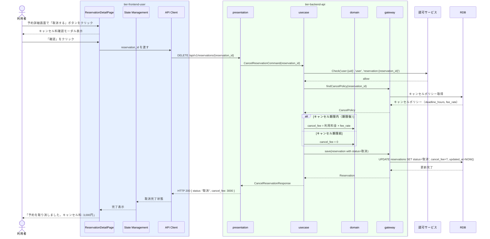

# 予約を取り消す

## 概要

利用者が予約を取り消す。キャンセルポリシーに基づいてキャンセル料が発生し、予約状態が「取消」に遷移する。キャンセル料率は取消タイミング（利用日時までの残り時間）によって異なる。

## データフロー

```mermaid
graph LR
  subgraph FE["tier-frontend-user"]
    subgraph FE_V["view"]
      ReservationDetailPage
    end
    subgraph FE_S["state"]
      CancelState
    end
    subgraph FE_A["api-client"]
      CancelReservationRequest
    end
  end
  subgraph BE["tier-backend-api"]
    subgraph BE_P["presentation"]
      CancelReservationRequestDTO
    end
    subgraph BE_U["usecase"]
      CancelReservationCommand
    end
    subgraph BE_D["domain"]
      Reservation
    end
    subgraph BE_G["gateway"]
      ReservationRecord
    end
  end
  subgraph DB["tier-datastore-rdb"]
    reservations[("reservations")]
    cancel_policies[("cancel_policies")]
  end

  ReservationDetailPage --> CancelState --> CancelReservationRequest
  CancelReservationRequest -->|"DELETE /api/v1/reservations/{reservation_id}"| CancelReservationRequestDTO
  CancelReservationRequestDTO --> CancelReservationCommand
  CancelReservationCommand --> Reservation
  Reservation --> ReservationRecord
  ReservationRecord -->|"SELECT WHERE room_id=?"| cancel_policies
  ReservationRecord -->|"UPDATE SET status=取消, cancel_fee=?"| reservations
  cancel_policies --> ReservationRecord
  reservations --> ReservationRecord
  ReservationRecord --> Reservation
  Reservation --> CancelReservationCommand --> CancelReservationRequestDTO
  CancelReservationRequestDTO -->|"HTTP 200"| CancelReservationRequest
  CancelReservationRequest --> CancelState --> ReservationDetailPage
```



| レイヤー | データモデル | 変換内容 |
|---------|------------|---------|
| FE view | ReservationDetailPage | 予約詳細・取消ボタン・キャンセル料確認モーダル |
| FE state | CancelState | キャンセル確認・料金表示状態管理 |
| FE api-client | CancelReservationRequest | パスパラメータ抽出 → DELETE リクエスト |
| BE presentation | CancelReservationRequestDTO | パスパラメータ抽出 + Command 変換 |
| BE usecase | CancelReservationCommand | 認可チェック → キャンセルポリシー取得 → キャンセル料計算 → 状態遷移 |
| BE domain | Reservation | 予約エンティティ（状態: 申請/確定/変更→取消） |
| BE gateway | ReservationRecord | Entity → DB カラム形式の DTO |
| DB | cancel_policies | SELECT WHERE room_id=? |
| DB | reservations | UPDATE SET status=取消, cancel_fee=計算済み額 |

## 処理フロー



## バリエーション一覧

| バリエーション名 | 値 | 処理内容 | 適用 tier | 適用箇所 |
|----------------|---|---------|----------|---------|
| 決済方法 | クレジットカード | キャンセル料相当額を引き落とし処理 | tier-backend-api | 取消処理 |
| 決済方法 | 電子マネー | キャンセル料相当額を引き落とし処理 | tier-backend-api | 取消処理 |

## 分岐条件一覧

| 条件名 | 判定ルール | 適用 tier | 適用箇所 | BDD Scenario |
|--------|----------|----------|---------|-------------|
| キャンセルポリシー | キャンセル期限内（利用時刻の cancel_policy.deadline_hours 時間前以降）の場合、キャンセル料 = 利用料金 × fee_rate を適用 | tier-backend-api | DELETE /api/v1/reservations/{id} キャンセル料計算 | キャンセル期限後の取消でキャンセル料が発生する |

## 計算ルール一覧

| 計算名 | 入力情報 | 計算式/ロジック | 出力情報 | 適用 tier |
|--------|---------|---------------|---------|----------|
| キャンセル料計算 | 利用料金・キャンセル料率・取消日時・利用開始日時 | 取消日時 < (利用開始日時 - deadline_hours × 時間) の場合: キャンセル料=0。それ以降: キャンセル料 = 利用料金 × fee_rate | キャンセル料（円） | tier-backend-api |

## 状態遷移一覧

| 状態モデル | 遷移元 | 遷移先 | トリガー | 事前条件 | 事後処理 | 適用 tier |
|-----------|--------|--------|---------|---------|---------|----------|
| 予約 | 申請 | 取消 | 予約を取り消す | 予約が申請状態・利用者が予約所有者 | キャンセル料=0で取消 | tier-backend-api |
| 予約 | 確定 | 取消 | 予約を取り消す | 予約が確定状態・利用者が予約所有者 | キャンセルポリシーに基づきキャンセル料計算・適用 | tier-backend-api |
| 予約 | 変更 | 取消 | 予約を取り消す | 予約が変更状態・利用者が予約所有者 | キャンセルポリシーに基づきキャンセル料計算・適用 | tier-backend-api |

## 関連 RDRA モデル

| モデル種別 | 要素名 | 関連 |
|-----------|--------|------|
| 業務 | 会議室利用業務 | このUCが属する業務 |
| BUC | 会議室予約フロー | このUCを含むBUC |
| アクター | 利用者 | 操作するアクター |
| 情報 | 予約情報 | 予約ID・予約状態・利用開始日時 |
| 情報 | キャンセルポリシー | キャンセル期限・キャンセル料率・返金ルール |
| 条件 | キャンセルポリシー | 取消タイミングに応じたキャンセル料発生条件 |
| 状態 | 予約（申請/確定/変更→取消） | 取消による状態遷移 |

## E2E 完了条件（BDD）

### 正常系

```gherkin
Feature: 予約を取り消す

  Scenario: 利用者がキャンセル期限前に予約を取り消す（キャンセル料なし）
    Given 利用者「田中太郎」がログイン済みで、予約 rsv-001（確定状態、利用日時 2026-04-20 10:00）が存在し、キャンセル期限は24時間前、現在日時は2026-04-18 09:00
    When 予約詳細画面で「取消する」ボタンを押し、確認モーダルで「確認」をクリックする
    Then 予約 rsv-001 の状態が「取消」になり、「キャンセル料: 0円」で取消完了メッセージが表示される

  Scenario: 利用者がキャンセル期限後に予約を取り消す（キャンセル料発生）
    Given 利用者「田中太郎」がログイン済みで、予約 rsv-001（確定状態、利用料金6000円）が存在し、キャンセル料率50%・現在日時が期限後
    When 予約詳細画面で「取消する」ボタンを押し、確認モーダルで「確認」をクリックする
    Then 予約 rsv-001 の状態が「取消」になり、「キャンセル料: 3,000円」の表示と共に取消完了メッセージが表示される
```

### 異常系

```gherkin
  Scenario: 既に取消済みの予約を再度取消しようとする
    Given 予約 rsv-001 が既に「取消」状態である
    When 利用者「田中太郎」が DELETE /api/v1/reservations/rsv-001 を送信する
    Then HTTP 409 と「この予約は既に取り消し済みです」というエラーが返る
```

## ティア別仕様

- [利用者・オーナー向けフロントエンド](tier-frontend-user.md)
- [バックエンド API](tier-backend-api.md)

### 統合 API Spec

- [OpenAPI Spec](../../_cross-cutting/api/openapi.yaml)（全 UC 統合、Contract First 開発用）
