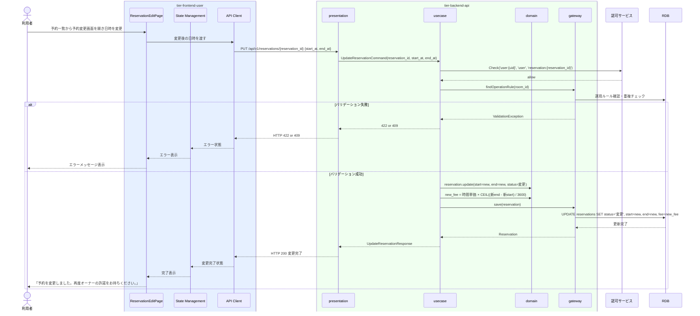

# 予約を変更する

## 概要

利用者が確定済みの予約の利用日時を変更する。変更後は予約状態が「変更」となり、再度オーナーの許諾が必要になる。変更時に運用ルール・重複チェックを実施する。

## データフロー

```mermaid
graph LR
  subgraph FE["tier-frontend-user"]
    subgraph FE_V["view"]
      ReservationEditPage
    end
    subgraph FE_S["state"]
      EditState
    end
    subgraph FE_A["api-client"]
      UpdateReservationRequest
    end
  end
  subgraph BE["tier-backend-api"]
    subgraph BE_P["presentation"]
      UpdateReservationRequestDTO
    end
    subgraph BE_U["usecase"]
      UpdateReservationCommand
    end
    subgraph BE_D["domain"]
      Reservation
    end
    subgraph BE_G["gateway"]
      ReservationRecord
    end
  end
  subgraph DB["tier-datastore-rdb"]
    reservations[("reservations")]
    operation_rules[("operation_rules")]
  end

  ReservationEditPage --> EditState --> UpdateReservationRequest
  UpdateReservationRequest -->|"PUT /api/v1/reservations/{reservation_id}"| UpdateReservationRequestDTO
  UpdateReservationRequestDTO --> UpdateReservationCommand
  UpdateReservationCommand --> Reservation
  Reservation --> ReservationRecord
  ReservationRecord -->|"SELECT WHERE room_id=?"| operation_rules
  ReservationRecord -->|"SELECT WHERE room_id=? AND status IN (申請,確定,変更)"| reservations
  ReservationRecord -->|"UPDATE SET status=変更, start=new, end=new, fee=new"| reservations
  operation_rules --> ReservationRecord
  reservations --> ReservationRecord
  ReservationRecord --> Reservation
  Reservation --> UpdateReservationCommand --> UpdateReservationRequestDTO
  UpdateReservationRequestDTO -->|"HTTP 200"| UpdateReservationRequest
  UpdateReservationRequest --> EditState --> ReservationEditPage
```



| レイヤー | データモデル | 変換内容 |
|---------|------------|---------|
| FE view | ReservationEditPage | 変更後日時選択・料金再計算表示UI |
| FE state | EditState | 変更後日時・料金再計算状態管理 |
| FE api-client | UpdateReservationRequest | 変更データ → PUT リクエスト |
| BE presentation | UpdateReservationRequestDTO | バリデーション + Command 変換 |
| BE usecase | UpdateReservationCommand | 認可チェック → 運用ルール確認 → 重複チェック → 料金再計算 → 状態遷移 |
| BE domain | Reservation | 予約エンティティ（状態: 確定→変更） |
| BE gateway | ReservationRecord | Entity → DB カラム形式の DTO |
| DB | operation_rules | SELECT WHERE room_id=? |
| DB | reservations | UPDATE SET status=変更, 新日時, 新料金 |

## 処理フロー



## バリエーション一覧

| バリエーション名 | 値 | 処理内容 | 適用 tier | 適用箇所 |
|----------------|---|---------|----------|---------|
| 決済方法 | クレジットカード | 変更後の利用料金を再計算・決済情報を更新 | tier-backend-api | PUT /api/v1/reservations/{id} |
| 決済方法 | 電子マネー | 変更後の利用料金を再計算・決済情報を更新 | tier-backend-api | PUT /api/v1/reservations/{id} |

## 分岐条件一覧

| 条件名 | 判定ルール | 適用 tier | 適用箇所 | BDD Scenario |
|--------|----------|----------|---------|-------------|
| 会議室利用ポリシー | 変更後の日時が運用ルールの利用可能時間帯・最低/最大利用時間に収まること | tier-backend-api | PUT /api/v1/reservations/{id} バリデーション | 運用ルール外の日時で変更するとエラー |
| 使用許諾条件 | 変更後の日時に他の確定予約が存在しないこと | tier-backend-api | PUT /api/v1/reservations/{id} 重複チェック | 同日時の確定予約がある場合エラー |

## 計算ルール一覧

| 計算名 | 入力情報 | 計算式/ロジック | 出力情報 | 適用 tier |
|--------|---------|---------------|---------|----------|
| 変更後利用料金計算 | 時間単価・変更後利用開始/終了日時 | fee = 時間単価 × CEIL((終了日時 - 開始日時) / 3600) | 変更後利用料金（円） | tier-backend-api |

## 状態遷移一覧

| 状態モデル | 遷移元 | 遷移先 | トリガー | 事前条件 | 事後処理 | 適用 tier |
|-----------|--------|--------|---------|---------|---------|----------|
| 予約 | 確定 | 変更 | 予約を変更する | 予約が確定状態・利用者が予約所有者 | オーナーへ変更通知 | tier-backend-api |

## 関連 RDRA モデル

| モデル種別 | 要素名 | 関連 |
|-----------|--------|------|
| 業務 | 会議室利用業務 | このUCが属する業務 |
| BUC | 会議室予約フロー | このUCを含むBUC |
| アクター | 利用者 | 操作するアクター |
| 情報 | 予約情報 | 予約ID・予約日時・利用開始/終了日時・予約状態 |
| 状態 | 予約（確定→変更） | 変更による状態遷移 |
| 画面 | 予約変更画面 | 操作画面 |

## E2E 完了条件（BDD）

### 正常系

```gherkin
Feature: 予約を変更する

  Scenario: 利用者が確定済み予約の日時を変更する
    Given 利用者「田中太郎」がログイン済みで、予約 rsv-001（確定状態、2026-04-15 10:00〜12:00）が存在する
    When 予約変更画面で利用日時を2026-04-20 14:00〜16:00に変更して「変更する」ボタンを押す
    Then 予約 rsv-001 の状態が「変更」になり、利用日時が2026-04-20 14:00〜16:00 に更新される
```

### 異常系

```gherkin
  Scenario: 変更後の日時に既に確定済みの予約が存在する
    Given 「渋谷区コワーキング会議室A」の2026-04-20 14:00〜16:00 に確定済みの予約が存在する
    When 利用者「田中太郎」が rsv-001 の日時を2026-04-20 14:00〜16:00 に変更しようとする
    Then 「選択した日時は予約済みです。別の日時を選択してください。」というエラーが表示される
```

## ティア別仕様

- [利用者・オーナー向けフロントエンド](tier-frontend-user.md)
- [バックエンド API](tier-backend-api.md)

### 統合 API Spec

- [OpenAPI Spec](../../_cross-cutting/api/openapi.yaml)（全 UC 統合、Contract First 開発用）
