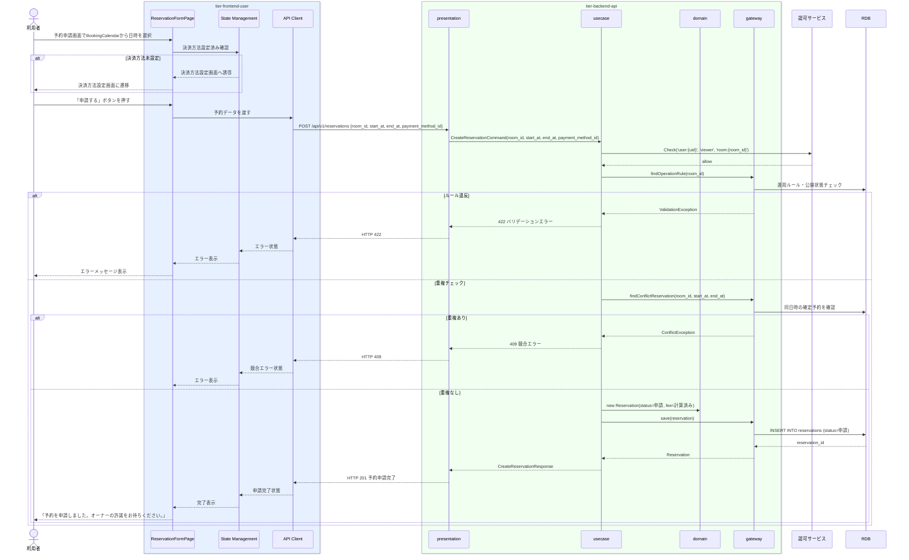

# 予約を申請する

## 概要

利用者が物理会議室の利用日時を指定して予約申請を行う。予約は「申請」状態で登録され、会議室オーナーの許諾を待つ。予約申請時に決済方法の設定が必要で、設定済みの場合はスキップできる。

## データフロー

```mermaid
graph LR
  subgraph FE["tier-frontend-user"]
    subgraph FE_V["view"]
      ReservationFormPage
    end
    subgraph FE_S["state"]
      BookingState
    end
    subgraph FE_A["api-client"]
      CreateReservationRequest
    end
  end
  subgraph BE["tier-backend-api"]
    subgraph BE_P["presentation"]
      CreateReservationRequestDTO
    end
    subgraph BE_U["usecase"]
      CreateReservationCommand
    end
    subgraph BE_D["domain"]
      Reservation
    end
    subgraph BE_G["gateway"]
      ReservationRecord
    end
  end
  subgraph DB["tier-datastore-rdb"]
    reservations[("reservations")]
    operation_rules[("operation_rules")]
  end

  ReservationFormPage --> BookingState --> CreateReservationRequest
  CreateReservationRequest -->|"POST /api/v1/reservations"| CreateReservationRequestDTO
  CreateReservationRequestDTO --> CreateReservationCommand
  CreateReservationCommand --> Reservation
  Reservation --> ReservationRecord
  ReservationRecord -->|"SELECT WHERE room_id=?"| operation_rules
  ReservationRecord -->|"SELECT WHERE room_id=? AND status IN (申請,確定,変更)"| reservations
  ReservationRecord -->|"INSERT status=申請"| reservations
  operation_rules --> ReservationRecord
  reservations --> ReservationRecord
  ReservationRecord --> Reservation
  Reservation --> CreateReservationCommand --> CreateReservationRequestDTO
  CreateReservationRequestDTO -->|"HTTP 201"| CreateReservationRequest
  CreateReservationRequest --> BookingState --> ReservationFormPage
```



| レイヤー | データモデル | 変換内容 |
|---------|------------|---------|
| FE view | ReservationFormPage | 予約日時選択・決済方法確認UI |
| FE state | BookingState | 予約日時・決済方法確認状態管理 |
| FE api-client | CreateReservationRequest | 予約データ → POST リクエスト |
| BE presentation | CreateReservationRequestDTO | バリデーション + Command 変換 |
| BE usecase | CreateReservationCommand | 認可チェック → 運用ルール確認 → 重複チェック → Reservation 生成 |
| BE domain | Reservation | 予約エンティティ（状態: 初期→申請） |
| BE gateway | ReservationRecord | Entity → DB カラム形式の DTO |
| DB | operation_rules | SELECT WHERE room_id=? |
| DB | reservations | INSERT status=申請 |

## 処理フロー



## バリエーション一覧

| バリエーション名 | 値 | 処理内容 | 適用 tier | 適用箇所 |
|----------------|---|---------|----------|---------|
| 決済方法 | クレジットカード | クレジットカード決済で処理 | tier-backend-api | 予約情報.決済方法フィールド |
| 決済方法 | 電子マネー | 電子マネー決済で処理 | tier-backend-api | 予約情報.決済方法フィールド |

## 分岐条件一覧

| 条件名 | 判定ルール | 適用 tier | 適用箇所 | BDD Scenario |
|--------|----------|----------|---------|-------------|
| 会議室利用ポリシー | 利用開始日時 ≥ 現在日時 + 1時間、かつ運用ルールの利用可能時間帯・最低/最大利用時間に収まること | tier-backend-api | POST /api/v1/reservations バリデーション | 運用ルール範囲外の日時で申請するとエラー |
| 使用許諾条件 | 同じ日時・会議室で「確定」状態の予約が存在しないこと（二重予約防止） | tier-backend-api | POST /api/v1/reservations 重複チェック | 同日時の二重申請はエラー |
| 支払精算ポリシー | 決済方法が未登録の場合は決済方法設定フローへ誘導 | tier-frontend-user | 予約申請画面 決済方法確認チェック | 決済未設定で申請するとセット画面へ遷移 |

## 計算ルール一覧

| 計算名 | 入力情報 | 計算式/ロジック | 出力情報 | 適用 tier |
|--------|---------|---------------|---------|----------|
| 利用料金計算 | 時間単価・利用開始日時・利用終了日時 | 料金 = 時間単価 × CEIL((終了日時 - 開始日時) / 60) | 利用料金（円） | tier-backend-api |

## 状態遷移一覧

| 状態モデル | 遷移元 | 遷移先 | トリガー | 事前条件 | 事後処理 | 適用 tier |
|-----------|--------|--------|---------|---------|---------|----------|
| 予約 | （初期） | 申請 | 予約を申請する | 会議室が公開中・利用者がログイン済み・決済方法登録済み | 予約レコード作成・オーナーへ通知 | tier-backend-api |
| 決済 | 未登録/決済手段登録済み | 決済手段登録済み | 決済方法を設定する | - | 決済情報を予約に紐付け | tier-backend-api |

## 関連 RDRA モデル

| モデル種別 | 要素名 | 関連 |
|-----------|--------|------|
| 業務 | 会議室利用業務 | このUCが属する業務 |
| BUC | 会議室予約フロー | このUCを含むBUC |
| アクター | 利用者 | 操作するアクター |
| 情報 | 予約情報 | 予約ID・利用者ID・会議室ID・予約日時・利用開始/終了日時・予約状態・決済方法 |
| 画面 | 予約申請画面 | 操作画面 |

## E2E 完了条件（BDD）

### 正常系

```gherkin
Feature: 予約を申請する

  Scenario: 利用者が物理会議室の予約を申請する
    Given 利用者「田中太郎」がログイン済みで、クレジットカードが決済方法として設定済み
    When 「渋谷区コワーキング会議室A」の予約申請画面で2026-04-15 10:00〜12:00 を選択して「申請する」ボタンを押す
    Then 予約が「申請」状態で作成され、「予約を申請しました。オーナーの許諾をお待ちください。」が表示される

  Scenario: 決済方法が未設定の状態で予約申請しようとする
    Given 利用者「佐藤花子」がログイン済みで、決済方法が未設定
    When 「渋谷区コワーキング会議室A」の予約申請画面で日時を選択して「申請する」ボタンを押す
    Then 決済方法設定画面に遷移する
```

### 異常系

```gherkin
  Scenario: 運用ルールの利用可能時間外の日時で申請する
    Given 利用者「田中太郎」がログイン済みで、「渋谷区コワーキング会議室A」の運用ルールが09:00-22:00
    When 予約申請画面で2026-04-15 23:00〜24:00 を選択して「申請する」ボタンを押す
    Then 「利用可能時間外です。09:00〜22:00の時間帯を選択してください。」というエラーメッセージが表示される

  Scenario: 同じ日時に既に確定済みの予約が存在する
    Given 「渋谷区コワーキング会議室A」の2026-04-15 10:00〜12:00 に確定済みの予約が存在する
    When 利用者「田中太郎」が同日時で予約申請を送信する
    Then 「選択した日時は予約済みです。別の日時を選択してください。」というエラーメッセージが表示される
```

## ティア別仕様

- [利用者・オーナー向けフロントエンド](tier-frontend-user.md)
- [バックエンド API](tier-backend-api.md)

### 統合 API Spec

- [OpenAPI Spec](../../_cross-cutting/api/openapi.yaml)（全 UC 統合、Contract First 開発用）
