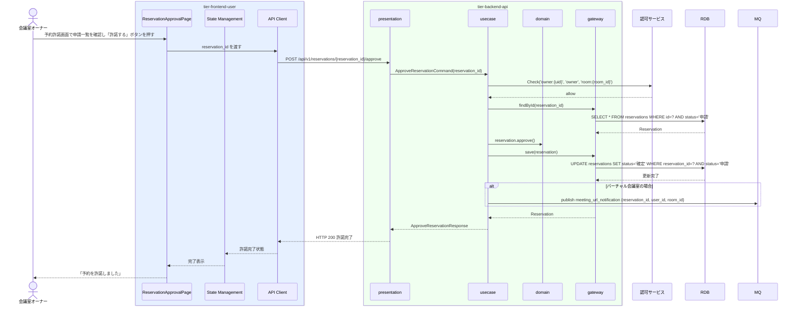

# 予約を許諾する

## 概要

会議室オーナーが利用者の予約申請を確認し、使用許諾条件（利用者の過去評価）に基づいて予約を確定させる。許諾により予約状態が「申請」から「確定」に遷移し、利用者に通知が届く。

## データフロー

```mermaid
graph LR
  subgraph FE["tier-frontend-user"]
    subgraph FE_V["view"]
      ReservationApprovalPage
    end
    subgraph FE_S["state"]
      ApprovalState
    end
    subgraph FE_A["api-client"]
      ApproveReservationRequest
    end
  end
  subgraph BE["tier-backend-api"]
    subgraph BE_P["presentation"]
      ApproveReservationRequestDTO
    end
    subgraph BE_U["usecase"]
      ApproveReservationCommand
    end
    subgraph BE_D["domain"]
      Reservation
    end
    subgraph BE_G["gateway"]
      ReservationRecord
    end
  end
  subgraph DB["tier-datastore-rdb"]
    reservations[("reservations")]
  end

  ReservationApprovalPage --> ApprovalState --> ApproveReservationRequest
  ApproveReservationRequest -->|"POST /api/v1/reservations/{reservation_id}/approve"| ApproveReservationRequestDTO
  ApproveReservationRequestDTO --> ApproveReservationCommand
  ApproveReservationCommand --> Reservation
  Reservation --> ReservationRecord
  ReservationRecord -->|"UPDATE SET status=確定 WHERE status=申請"| reservations
  reservations --> ReservationRecord
  ReservationRecord --> Reservation
  Reservation --> ApproveReservationCommand --> ApproveReservationRequestDTO
  ApproveReservationRequestDTO -->|"HTTP 200"| ApproveReservationRequest
  ApproveReservationRequest --> ApprovalState --> ReservationApprovalPage
```



| レイヤー | データモデル | 変換内容 |
|---------|------------|---------|
| FE view | ReservationApprovalPage | 申請一覧カード・許諾操作UI |
| FE state | ApprovalState | 申請一覧・許諾操作状態管理 |
| FE api-client | ApproveReservationRequest | パスパラメータ抽出 → POST リクエスト |
| BE presentation | ApproveReservationRequestDTO | パスパラメータ抽出 + Command 変換 |
| BE usecase | ApproveReservationCommand | 認可チェック → 申請状態確認 → 状態遷移 → バーチャル時 MQ publish |
| BE domain | Reservation | 予約エンティティ（状態: 申請→確定） |
| BE gateway | ReservationRecord | Entity → DB カラム形式の DTO |
| DB | reservations | UPDATE SET status=確定 WHERE reservation_id=? AND status=申請 |

## 処理フロー



## バリエーション一覧

| バリエーション名 | 値 | 処理内容 | 適用 tier | 適用箇所 |
|----------------|---|---------|----------|---------|
| 会議室種別 | バーチャル | 予約確定後に会議URL通知イベントを MQ に publish | tier-backend-api | POST /api/v1/reservations/{id}/approve |
| 会議室種別 | 物理 | 予約確定後に利用者へ通知（会議URL通知なし） | tier-backend-api | POST /api/v1/reservations/{id}/approve |

## 分岐条件一覧

| 条件名 | 判定ルール | 適用 tier | 適用箇所 | BDD Scenario |
|--------|----------|----------|---------|-------------|
| 使用許諾条件 | 予約状態が「申請」であること。オーナーが当該会議室のオーナーであること | tier-backend-api | POST /api/v1/reservations/{id}/approve 認可チェック | 他オーナーの会議室の予約は許諾不可 |
| バーチャル会議室利用ポリシー | バーチャル会議室の予約確定時に会議URL自動通知（FaaS ワーカー経由） | tier-backend-api | 予約確定後の非同期イベント発行 | バーチャル予約許諾後に会議URL通知が送信される |

## 計算ルール一覧

| 計算名 | 入力情報 | 計算式/ロジック | 出力情報 | 適用 tier |
|--------|---------|---------------|---------|----------|
| 許諾可否判定 | 利用者評価（評価スコア・評価種別=利用者評価） | AVG(評価スコア) ≥ オーナー設定の最低スコア（デフォルト: なし） | 許諾推奨/非推奨（参考情報、最終判断はオーナー） | tier-backend-api |

## 状態遷移一覧

| 状態モデル | 遷移元 | 遷移先 | トリガー | 事前条件 | 事後処理 | 適用 tier |
|-----------|--------|--------|---------|---------|---------|----------|
| 予約 | 申請 | 確定 | 予約を許諾する | 予約が申請状態・オーナーが会議室所有者 | 利用者へ通知・バーチャルの場合会議URL通知イベント発行 | tier-backend-api |

## 関連 RDRA モデル

| モデル種別 | 要素名 | 関連 |
|-----------|--------|------|
| 業務 | 会議室利用業務 | このUCが属する業務 |
| BUC | 会議室予約フロー | このUCを含むBUC |
| アクター | 会議室オーナー | 操作するアクター |
| 情報 | 予約情報 | 予約ID・利用者ID・会議室ID・予約状態 |
| 情報 | 利用者評価 | 利用者の過去の評価スコア・コメント（参照） |
| 条件 | 使用許諾条件 | 利用者の過去評価に基づく許諾判定ルール |
| 状態 | 予約（申請→確定） | 許諾による状態遷移 |
| 画面 | 予約許諾画面 | 操作画面 |

## E2E 完了条件（BDD）

### 正常系

```gherkin
Feature: 予約を許諾する

  Scenario: オーナーが物理会議室の予約を許諾する
    Given 会議室オーナー「山田健太」がログイン済みで、「渋谷区コワーキング会議室A」の予約申請（予約ID: rsv-001）が申請状態で存在する
    When 予約許諾画面でrsv-001の「許諾する」ボタンを押す
    Then 予約ID rsv-001 の状態が「確定」になり、利用者「田中太郎」に許諾通知が送信される

  Scenario: オーナーがバーチャル会議室の予約を許諾すると会議URL通知が送信される
    Given 会議室オーナー「山田健太」がログイン済みで、バーチャル会議室の予約申請（rsv-002）が申請状態で存在する
    When 予約許諾画面で rsv-002 の「許諾する」ボタンを押す
    Then 予約 rsv-002 の状態が「確定」になり、利用者に会議URL通知が送信される
```

### 異常系

```gherkin
  Scenario: 自分の会議室以外の予約を許諾しようとする
    Given 会議室オーナー「山田健太」がログイン済みで、別オーナーの会議室の予約 rsv-999 が存在する
    When POST /api/v1/reservations/rsv-999/approve を送信する
    Then HTTP 403 と「この予約を許諾する権限がありません」というエラーが返る
```

## ティア別仕様

- [利用者・オーナー向けフロントエンド](tier-frontend-user.md)
- [バックエンド API](tier-backend-api.md)

### 統合 API Spec

- [OpenAPI Spec](../../_cross-cutting/api/openapi.yaml)（全 UC 統合、Contract First 開発用）
