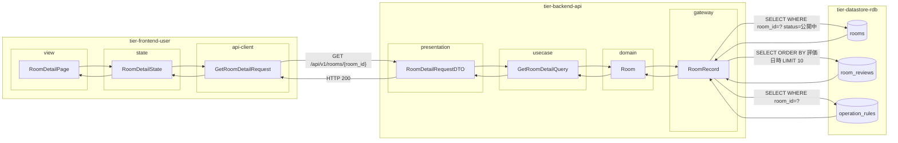
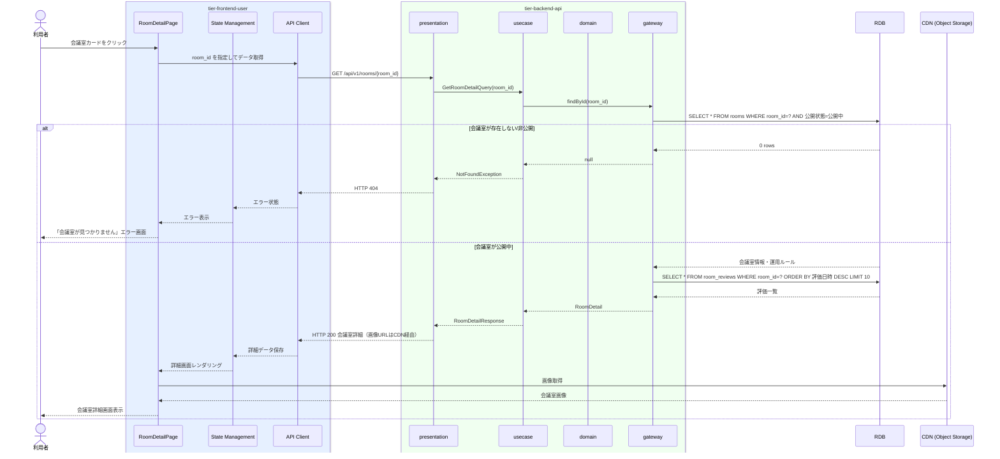

# 会議室の詳細を確認する

## 概要

利用者が会議室の物件情報（広さ・収容人数・設備・機能・画像）、運用ルール（利用可能時間帯・最低/最大利用時間）、評価（過去利用者のスコア・コメント）を確認する。物理会議室とバーチャル会議室で表示内容が異なる。

## データフロー



| レイヤー | データモデル | 変換内容 |
|---------|------------|---------|
| FE view | RoomDetailPage | 会議室詳細・評価一覧表示（物理/バーチャル切り替え） |
| FE state | RoomDetailState | 会議室詳細・評価一覧状態管理 |
| FE api-client | GetRoomDetailRequest | パスパラメータ抽出 → GET リクエスト |
| BE presentation | RoomDetailRequestDTO | パスパラメータ抽出 + Query 変換 |
| BE usecase | GetRoomDetailQuery | 公開状態確認 → 会議室情報・運用ルール・評価取得 |
| BE domain | Room | 会議室エンティティ（物理/バーチャル共通） |
| BE gateway | RoomRecord | Entity → DB カラム形式の DTO |
| DB | rooms | SELECT WHERE room_id=? AND status=公開中 |
| DB | operation_rules | SELECT WHERE room_id=? |
| DB | room_reviews | SELECT ORDER BY 評価日時 DESC LIMIT 10 |

## 処理フロー



## バリエーション一覧

| バリエーション名 | 値 | 処理内容 | 適用 tier | 適用箇所 |
|----------------|---|---------|----------|---------|
| 会議室種別 | 物理 | 所在地・広さ・収容人数・設備を表示。バーチャル情報は非表示 | tier-frontend-user | 会議室詳細画面 |
| 会議室種別 | バーチャル | 会議ツール種別・同時接続数・録画可否を表示。物理情報は非表示 | tier-frontend-user | 会議室詳細画面 |

## 分岐条件一覧

| 条件名 | 判定ルール | 適用 tier | 適用箇所 | BDD Scenario |
|--------|----------|----------|---------|-------------|
| 会議室公開条件 | 公開状態が「公開中」の会議室のみ詳細表示 | tier-backend-api | GET /api/v1/rooms/{room_id} | 非公開会議室への直接アクセスは404 |
| 会議室種別フィルタ | 会議室種別=バーチャルの場合、会議ツール種別・同時接続数・録画可否を表示 | tier-frontend-user | 会議室詳細画面 バーチャル情報セクション | バーチャル詳細でツール種別が表示される |

## 計算ルール一覧

| 計算名 | 入力情報 | 計算式/ロジック | 出力情報 | 適用 tier |
|--------|---------|---------------|---------|----------|
| 平均評価スコア | 会議室ID の会議室評価一覧（評価スコア） | AVG(評価スコア)、件数付き | 平均スコア（小数第1位）・レビュー件数 | tier-backend-api |

## 状態遷移一覧

| 状態モデル | 遷移元 | 遷移先 | トリガー | 事前条件 | 事後処理 | 適用 tier |
|-----------|--------|--------|---------|---------|---------|----------|
| 会議室 | 公開中 | 公開中 | 会議室の詳細を確認する | 会議室が公開中であること | 状態変更なし（読み取りのみ） | tier-backend-api |

## 関連 RDRA モデル

| モデル種別 | 要素名 | 関連 |
|-----------|--------|------|
| 業務 | 会議室利用業務 | このUCが属する業務 |
| BUC | 会議室予約フロー | このUCを含むBUC |
| アクター | 利用者 | 操作するアクター |
| 情報 | 会議室情報 | 物件情報・バーチャル情報（会議ツール種別・同時接続数・録画可否） |
| 情報 | 運用ルール | 利用可能時間帯・最低/最大利用時間・貸出可否 |
| 情報 | 会議室評価 | 評価スコア・コメント・評価日時 |
| バリエーション | 会議室種別 | 物理・バーチャルで表示項目を切り替え |

## E2E 完了条件（BDD）

### 正常系

```gherkin
Feature: 会議室の詳細を確認する

  Scenario: 利用者が物理会議室の詳細を確認する
    Given 利用者「田中太郎」がログイン済みで、「渋谷区コワーキング会議室A」（物理）が公開中である
    When 会議室検索結果から「渋谷区コワーキング会議室A」をクリックする
    Then 会議室詳細画面に、会議室名・所在地・広さ（20m²）・収容人数（10名）・設備（プロジェクター・Wi-Fi）・時間単価（3,000円）・平均評価スコア（4.5）・最新レビュー10件が表示される

  Scenario: 利用者がバーチャル会議室の詳細を確認する
    Given 利用者「佐藤花子」がログイン済みで、「Zoomオンライン会議室B」（バーチャル）が公開中である
    When 会議室検索結果から「Zoomオンライン会議室B」をクリックする
    Then 会議室詳細画面に、会議ツール種別（Zoom）・同時接続数（50）・録画可否（可）・時間単価（1,500円）・平均評価スコアが表示される
```

### 異常系

```gherkin
  Scenario: 非公開の会議室に直接URLでアクセスする
    Given 会議室ID「room-999」が非公開状態である
    When 利用者「田中太郎」が /rooms/room-999 に直接アクセスする
    Then 「会議室が見つかりません」というエラーメッセージが表示される
```

## ティア別仕様

- [利用者・オーナー向けフロントエンド](tier-frontend-user.md)
- [バックエンド API](tier-backend-api.md)

### 統合 API Spec

- [OpenAPI Spec](../../_cross-cutting/api/openapi.yaml)（全 UC 統合、Contract First 開発用）
