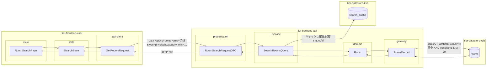
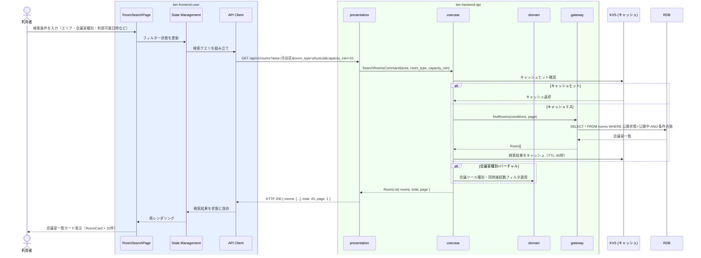

# 会議室を検索する

## 概要

利用者が会議室種別・エリア・収容人数・設備・価格帯・会議ツール種別・同時接続数などの条件を指定して、物理会議室およびバーチャル会議室を横断的に検索する。検索結果はカード形式で表示され、条件を絞り込むことで目的に合う会議室を効率的に発見できる。

## データフロー



| レイヤー | データモデル | 変換内容 |
|---------|------------|---------|
| FE view | RoomSearchPage | 検索条件入力・会議室カード一覧表示（物理/バーチャル切替） |
| FE state | SearchState | 検索フィルター・結果一覧状態管理 |
| FE api-client | GetRoomsRequest | クエリパラメータ組み立て → GET リクエスト |
| BE presentation | RoomSearchRequestDTO | バリデーション + Query 変換 |
| BE usecase | SearchRoomsQuery | キャッシュ確認 → RoomRecord 呼び出し → ページネーション |
| BE domain | Room | 会議室エンティティ（物理/バーチャル共通） |
| BE gateway | RoomRecord | Entity → DB カラム形式の DTO |
| KVS | search_cache | 検索結果キャッシュ（TTL: 60秒） |
| DB | rooms | SELECT WHERE status=公開中 AND 条件合致 LIMIT 20 OFFSET ? |

## 処理フロー



## バリエーション一覧

| バリエーション名 | 値 | 処理内容 | 適用 tier | 適用箇所 |
|----------------|---|---------|----------|---------|
| 会議室検索条件 | エリア | 所在地の部分一致フィルタ | tier-backend-api | GET /api/v1/rooms?area={value} |
| 会議室検索条件 | 広さ | 広さ（m²）の範囲フィルタ | tier-backend-api | GET /api/v1/rooms?area_min={value} |
| 会議室検索条件 | 収容人数 | 収容人数以上でフィルタ | tier-backend-api | GET /api/v1/rooms?capacity_min={value} |
| 会議室検索条件 | 価格帯 | 時間単価の範囲フィルタ | tier-backend-api | GET /api/v1/rooms?price_max={value} |
| 会議室検索条件 | 設備・機能 | 設備の AND フィルタ | tier-backend-api | GET /api/v1/rooms?facilities={value} |
| 会議室検索条件 | 評価スコア | 評価スコア以上でフィルタ | tier-backend-api | GET /api/v1/rooms?rating_min={value} |
| 会議室検索条件 | 利用可能日時 | 指定日時の予約空き状況でフィルタ | tier-backend-api | GET /api/v1/rooms?available_from={datetime} |
| 会議室検索条件 | 会議室種別 | 物理/バーチャルでフィルタ | tier-backend-api | GET /api/v1/rooms?room_type={value} |
| 会議室検索条件 | 会議ツール種別 | Zoom/Teams/Google Meet でフィルタ | tier-backend-api | GET /api/v1/rooms?tool_type={value} |
| 会議室検索条件 | 同時接続数 | 同時接続数以上でフィルタ | tier-backend-api | GET /api/v1/rooms?max_connections_min={value} |
| 会議室種別 | 物理 | 物理会議室情報（所在地・広さ・収容人数）を表示 | tier-frontend-user | RoomCard(variant=physical) |
| 会議室種別 | バーチャル | バーチャル会議室情報（会議ツール・同時接続数）を表示 | tier-frontend-user | RoomCard(variant=virtual) |

## 分岐条件一覧

| 条件名 | 判定ルール | 適用 tier | 適用箇所 | BDD Scenario |
|--------|----------|----------|---------|-------------|
| 会議室公開条件 | 公開状態が「公開中」の会議室のみ検索結果に含める | tier-backend-api | GET /api/v1/rooms 検索クエリフィルタ | 公開中の会議室のみ検索結果に返る |
| 会議室種別フィルタ | 会議室種別=バーチャルの場合、会議ツール種別・同時接続数の追加フィルタを有効化 | tier-backend-api | GET /api/v1/rooms フィルタロジック | バーチャル会議室の絞り込み検索 |

## 計算ルール一覧

| 計算名 | 入力情報 | 計算式/ロジック | 出力情報 | 適用 tier |
|--------|---------|---------------|---------|----------|
| 検索結果ページネーション | 総件数、ページ番号、ページサイズ(20件) | offset = (page-1) × 20 | 表示件数・次ページ有無 | tier-backend-api |
| 評価スコア表示 | 評価ID一覧の評価スコア | AVG(評価スコア) | 平均評価スコア（小数第1位） | tier-backend-api |

## 状態遷移一覧

| 状態モデル | 遷移元 | 遷移先 | トリガー | 事前条件 | 事後処理 | 適用 tier |
|-----------|--------|--------|---------|---------|---------|----------|
| 会議室 | 公開中 | 公開中 | 会議室を検索する | 会議室が公開状態であること | 検索結果に含める | tier-backend-api |

## 関連 RDRA モデル

| モデル種別 | 要素名 | 関連 |
|-----------|--------|------|
| 業務 | 会議室利用業務 | このUCが属する業務 |
| BUC | 会議室予約フロー | このUCを含むBUC |
| アクター | 利用者 | 操作するアクター |
| 情報 | 会議室情報 | 検索対象の会議室情報（会議室種別・所在地・広さ・収容人数・価格・設備・機能・画像・公開状態・会議ツール種別・同時接続数） |
| バリエーション | 会議室検索条件 | 検索条件の種別（エリア・広さ・収容人数・価格帯・設備・機能・評価スコア・利用可能日時・会議室種別・会議ツール種別・同時接続数） |
| バリエーション | 会議室種別 | 物理・バーチャルの区分 |
| バリエーション | 会議ツール種別 | Zoom・Teams・Google Meet |

## E2E 完了条件（BDD）

### 正常系

```gherkin
Feature: 会議室を検索する

  Scenario: 利用者がエリアと収容人数で物理会議室を検索する
    Given 利用者「田中太郎」がログイン済みで会議室検索画面を開いている
    When エリア「東京都渋谷区」・収容人数「10人以上」・会議室種別「物理」を選択して検索ボタンを押す
    Then 東京都渋谷区内の収容人数10人以上の公開中の物理会議室一覧が最大20件表示される

  Scenario: 利用者がバーチャル会議室をZoomで絞り込み検索する
    Given 利用者「佐藤花子」がログイン済みで会議室検索画面を開いている
    When 会議室種別「バーチャル」・会議ツール種別「Zoom」・同時接続数「20人以上」で検索する
    Then Zoomを使用した同時接続数20人以上のバーチャル会議室一覧が表示される

  Scenario: 利用者が条件なしで全件検索する
    Given 利用者「鈴木一郎」が未ログインで会議室検索画面を開いている
    When 検索条件を指定せずに検索ボタンを押す
    Then 公開中の全会議室（物理・バーチャル含む）が新着順で表示される

  Scenario: 検索結果が20件を超える場合にページネーションが機能する
    Given 利用者「田中太郎」がログイン済みで50件の検索結果がある
    When 会議室検索画面でページ2に遷移する
    Then 21件目から40件目の会議室が表示される
```

### 異常系

```gherkin
  Scenario: 利用可能日時を過去の日付で検索しようとする
    Given 利用者「田中太郎」がログイン済みで会議室検索画面を開いている
    When 利用可能日時に「2020-01-01 10:00」を指定して検索する
    Then 「利用可能日時は本日以降を指定してください」というバリデーションエラーが表示される

  Scenario: 検索条件に合致する会議室が存在しない
    Given 利用者「佐藤花子」がログイン済みで会議室検索画面を開いている
    When エリア「北海道礼文島」・収容人数「500人以上」で検索する
    Then 「該当する会議室が見つかりませんでした。条件を変えてお試しください。」というメッセージが表示される
```

## ティア別仕様

- [利用者・オーナー向けフロントエンド](tier-frontend-user.md)
- [バックエンド API](tier-backend-api.md)

### 統合 API Spec

- [OpenAPI Spec](../../_cross-cutting/api/openapi.yaml)（全 UC 統合、Contract First 開発用）
