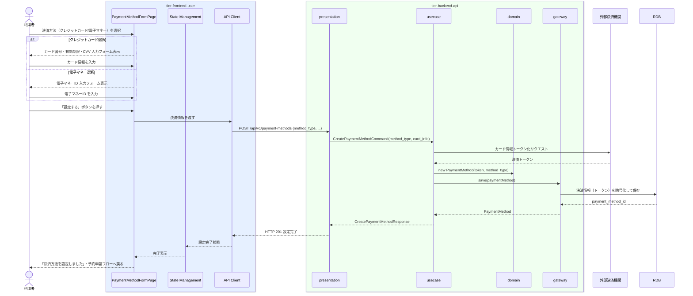

# 決済方法を設定する

## 概要

利用者が予約時にクレジットカードまたは電子マネーの決済手段を登録する。決済情報は暗号化して保管され、予約と紐付けて管理される。設定した決済方法は次回予約時も再利用可能。

## データフロー

```mermaid
graph LR
  subgraph FE["tier-frontend-user"]
    subgraph FE_V["view"]
      PaymentMethodFormPage
    end
    subgraph FE_S["state"]
      PaymentMethodState
    end
    subgraph FE_A["api-client"]
      CreatePaymentMethodRequest
    end
  end
  subgraph BE["tier-backend-api"]
    subgraph BE_P["presentation"]
      CreatePaymentMethodRequestDTO
    end
    subgraph BE_U["usecase"]
      CreatePaymentMethodCommand
    end
    subgraph BE_D["domain"]
      PaymentMethod
    end
    subgraph BE_G["gateway"]
      PaymentMethodRecord
    end
  end
  subgraph EXT["external-payment-gateway"]
    payment_api[/"決済機関トークン化API"/]
  end
  subgraph DB["tier-datastore-rdb"]
    payment_methods[("payment_methods")]
  end

  PaymentMethodFormPage --> PaymentMethodState --> CreatePaymentMethodRequest
  CreatePaymentMethodRequest -->|"POST /api/v1/payment-methods"| CreatePaymentMethodRequestDTO
  CreatePaymentMethodRequestDTO --> CreatePaymentMethodCommand
  CreatePaymentMethodCommand -->|"トークン化リクエスト"| payment_api
  payment_api -->|"決済トークン"| CreatePaymentMethodCommand
  CreatePaymentMethodCommand --> PaymentMethod
  PaymentMethod --> PaymentMethodRecord
  PaymentMethodRecord -->|"INSERT token=暗号化トークン"| payment_methods
  payment_methods --> PaymentMethodRecord
  PaymentMethodRecord --> PaymentMethod
  PaymentMethod --> CreatePaymentMethodCommand --> CreatePaymentMethodRequestDTO
  CreatePaymentMethodRequestDTO -->|"HTTP 201"| CreatePaymentMethodRequest
  CreatePaymentMethodRequest --> PaymentMethodState --> PaymentMethodFormPage
```



| レイヤー | データモデル | 変換内容 |
|---------|------------|---------|
| FE view | PaymentMethodFormPage | 決済方法選択・入力フォーム切替（クレジットカード/電子マネー） |
| FE state | PaymentMethodState | 決済方法選択・フォーム入力状態管理 |
| FE api-client | CreatePaymentMethodRequest | camelCase → snake_case → POST リクエスト |
| BE presentation | CreatePaymentMethodRequestDTO | バリデーション + Command 変換 |
| BE usecase | CreatePaymentMethodCommand | 決済機関APIでトークン化 → PaymentMethod 生成 |
| BE domain | PaymentMethod | 決済方法エンティティ（PCI DSS 準拠） |
| BE gateway | PaymentMethodRecord | Entity → DB カラム形式の DTO |
| DB | payment_methods | INSERT 暗号化トークンのみ保存（カード情報は保持しない） |

## 処理フロー



## バリエーション一覧

| バリエーション名 | 値 | 処理内容 | 適用 tier | 適用箇所 |
|----------------|---|---------|----------|---------|
| 決済方法 | クレジットカード | カード番号・有効期限・CVVを入力・外部決済機関に送信してトークン取得 | tier-backend-api | POST /api/v1/payment-methods |
| 決済方法 | 電子マネー | 電子マネーIDを入力・残高確認 | tier-backend-api | POST /api/v1/payment-methods |

## 分岐条件一覧

| 条件名 | 判定ルール | 適用 tier | 適用箇所 | BDD Scenario |
|--------|----------|----------|---------|-------------|
| 支払精算ポリシー（決済方法別） | クレジットカードの場合: カード番号・有効期限・セキュリティコードを入力。電子マネーの場合: 電子マネーIDを入力 | tier-frontend-user | 決済方法設定画面 入力フォーム切替 | クレジットカード選択時はカード情報フォームが表示される |

## 計算ルール一覧

| 計算名 | 入力情報 | 計算式/ロジック | 出力情報 | 適用 tier |
|--------|---------|---------------|---------|----------|
| 決済トークン化 | カード番号・有効期限・CVV | 外部決済機関 API 経由でトークン取得 | 決済トークン（PCI DSS 準拠） | tier-backend-api |

## 状態遷移一覧

| 状態モデル | 遷移元 | 遷移先 | トリガー | 事前条件 | 事後処理 | 適用 tier |
|-----------|--------|--------|---------|---------|---------|----------|
| 決済 | 未登録 | 決済手段登録済み | 決済方法を設定する | 利用者がログイン済み | 決済情報を予約に紐付け | tier-backend-api |

## 関連 RDRA モデル

| モデル種別 | 要素名 | 関連 |
|-----------|--------|------|
| 業務 | 会議室利用業務 | このUCが属する業務 |
| BUC | 会議室予約フロー | このUCを含むBUC |
| アクター | 利用者 | 操作するアクター |
| 情報 | 決済情報 | 決済ID・予約ID・決済方法・決済状態・決済金額・決済日時 |
| 条件 | 支払精算ポリシー | 決済方法ごとの処理手順 |
| 状態 | 決済（未登録→決済手段登録済み） | 決済状態遷移 |
| バリエーション | 決済方法 | クレジットカード・電子マネー |

## E2E 完了条件（BDD）

### 正常系

```gherkin
Feature: 決済方法を設定する

  Scenario: 利用者がクレジットカードを決済方法として設定する
    Given 利用者「田中太郎」がログイン済みで決済方法設定画面を開いている
    When 決済方法「クレジットカード」を選択し、カード番号「4111111111111111」・有効期限「12/28」・CVV「123」を入力して「設定する」ボタンを押す
    Then 「決済方法を設定しました」が表示され、決済状態が「決済手段登録済み」になる

  Scenario: 利用者が電子マネーを決済方法として設定する
    Given 利用者「佐藤花子」がログイン済みで決済方法設定画面を開いている
    When 決済方法「電子マネー」を選択し、電子マネーID「emoney-abc123」を入力して「設定する」ボタンを押す
    Then 「決済方法を設定しました」が表示される
```

### 異常系

```gherkin
  Scenario: 無効なカード番号で設定しようとする
    Given 利用者「田中太郎」がログイン済みで決済方法設定画面を開いている
    When クレジットカード番号「1234567890123456」（Luhn チェック失敗）を入力して「設定する」を押す
    Then 「正しいカード番号を入力してください」というバリデーションエラーが表示される
```

## ティア別仕様

- [利用者・オーナー向けフロントエンド](tier-frontend-user.md)
- [バックエンド API](tier-backend-api.md)

### 統合 API Spec

- [OpenAPI Spec](../../_cross-cutting/api/openapi.yaml)（全 UC 統合、Contract First 開発用）
