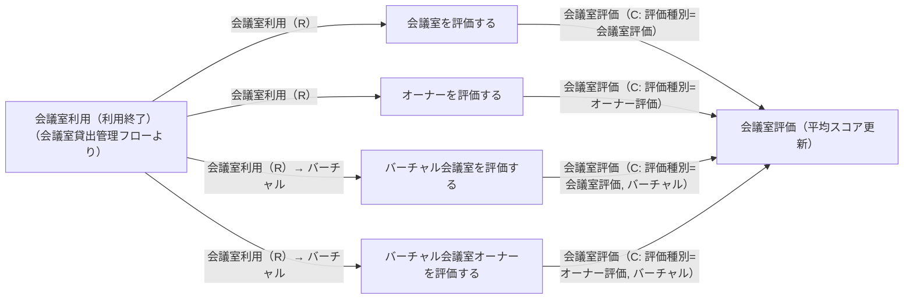
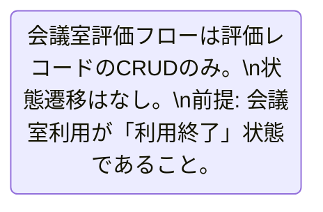

# 会議室評価フロー

## 概要

利用者が会議室利用後に物理・バーチャル会議室およびオーナーを評価登録するフロー。利用終了後に会議室評価・オーナー評価を登録することで、他の利用者の意思決定支援や会議室品質の可視化に貢献する。

## 所属 UC 一覧

| UC名 | アクター | 主な操作 | 関連情報 |
|------|---------|---------|---------|
| [会議室を評価する](会議室を評価する/spec.md) | 利用者 | 物理会議室の設備・清潔さ等を評価登録する | 会議室評価 |
| [オーナーを評価する](オーナーを評価する/spec.md) | 利用者 | 物理会議室オーナーの対応等を評価登録する | 会議室評価 |
| [バーチャル会議室を評価する](バーチャル会議室を評価する/spec.md) | 利用者 | バーチャル会議室の接続安定性・音質・操作性等を評価登録する | 会議室評価 |
| [バーチャル会議室オーナーを評価する](バーチャル会議室オーナーを評価する/spec.md) | 利用者 | バーチャル会議室オーナーの対応を評価登録する | 会議室評価 |

## UC 横断データフロー

BUC 内の UC 間で情報がどう流れるかを示す。全UCが会議室利用終了を前提とした評価登録であり、互いに独立して実行可能。

### データフロー図

### 情報 CRUD マトリクス

| 情報名 | 会議室を評価する | オーナーを評価する | バーチャル会議室を評価する | バーチャル会議室オーナーを評価する |
|--------|:-------:|:-------:|:-------:|:-------:|
| 会議室評価 | C | C | C | C |
| 会議室情報 | R | R | R | R |

## 状態遷移全体図

このBUCで直接管理する状態遷移はありません。全UCが「会議室利用（利用終了）」状態を事前条件として評価レコードを作成するのみで、状態遷移を伴いません。

### 状態遷移 UC マッピング

| 状態モデル | 遷移元 | 遷移先 | 担当 UC |
|-----------|--------|--------|--------|
| （なし） | - | - | 評価登録はレコード作成のみ。状態遷移なし |

## BUC 内共有条件一覧

| 条件名 | 条件の説明 | 適用 UC |
|--------|----------|--------|
| 評価登録可否 | 利用者が当該会議室を実際に利用済み（会議室利用=利用終了）であることを前提とし、同一利用IDに対して1件のみ評価登録可能（重複評価防止） | 会議室を評価する, オーナーを評価する, バーチャル会議室を評価する, バーチャル会議室オーナーを評価する |

## BUC 内共有バリエーション一覧

| バリエーション名 | 値 | 適用 UC |
|----------------|---|--------|
| 評価種別 | 会議室評価, オーナー評価, 利用者評価 | 会議室を評価する, オーナーを評価する, バーチャル会議室を評価する, バーチャル会議室オーナーを評価する |
| 会議室種別 | 物理, バーチャル | 会議室を評価する, オーナーを評価する, バーチャル会議室を評価する, バーチャル会議室オーナーを評価する |
