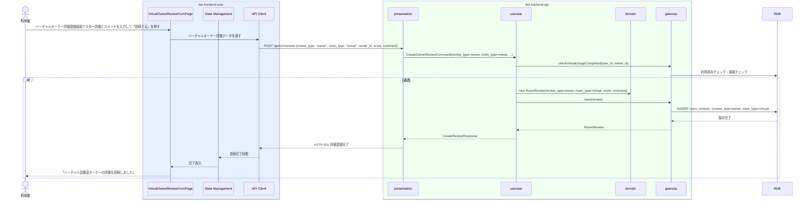

# バーチャル会議室オーナーを評価する

## 概要

利用者がバーチャル会議室オーナーの対応（会議URL の提供・サポート・問合せ対応など）を評価登録する。評価種別は「オーナー評価」、会議室種別はバーチャルとして記録される。バーチャル利用特有の観点（会議URL通知の迅速さ・テクニカルサポート対応など）が評価ポイントとなる。

## データフロー

```mermaid
graph LR
  subgraph FE["tier-frontend-user"]
    subgraph FE_V["view"]
      VirtualOwnerReviewFormPage
    end
    subgraph FE_S["state"]
      VirtualOwnerReviewState
    end
    subgraph FE_A["api-client"]
      CreateVirtualOwnerReviewRequest
    end
  end
  subgraph BE["tier-backend-api"]
    subgraph BE_P["presentation"]
      CreateReviewRequestDTO
    end
    subgraph BE_U["usecase"]
      CreateOwnerReviewCommand
    end
    subgraph BE_D["domain"]
      RoomReview
    end
    subgraph BE_G["gateway"]
      ReviewRecord
    end
  end
  subgraph DB["tier-datastore-rdb"]
    room_reviews[("room_reviews")]
  end

  VirtualOwnerReviewFormPage --> VirtualOwnerReviewState --> CreateVirtualOwnerReviewRequest
  CreateVirtualOwnerReviewRequest -->|"POST /api/v1/reviews"| CreateReviewRequestDTO
  CreateReviewRequestDTO --> CreateOwnerReviewCommand
  CreateOwnerReviewCommand --> RoomReview
  RoomReview --> ReviewRecord
  ReviewRecord -->|"INSERT review_type=owner room_type=virtual"| room_reviews
  room_reviews --> ReviewRecord
  ReviewRecord --> RoomReview
  RoomReview --> CreateOwnerReviewCommand --> CreateReviewRequestDTO
  CreateReviewRequestDTO -->|"HTTP 201"| CreateVirtualOwnerReviewRequest
  CreateVirtualOwnerReviewRequest --> VirtualOwnerReviewState --> VirtualOwnerReviewFormPage
```



| レイヤー | データモデル | 変換内容 |
|---------|------------|---------|
| FE view | VirtualOwnerReviewFormPage | バーチャル特有観点ガイダンス付き評価UI |
| FE state | VirtualOwnerReviewState | バーチャル評価入力・送信状態管理 |
| FE api-client | CreateVirtualOwnerReviewRequest | review_type=owner, room_type=virtual 付与 |
| BE presentation | CreateReviewRequestDTO | バリデーション + Command 変換 |
| BE usecase | CreateOwnerReviewCommand | バーチャル利用済みチェック → 重複チェック → OwnerReview 生成 |
| BE domain | RoomReview | review_type=owner, room_type=virtual でエンティティ生成 |
| BE gateway | ReviewRecord | Entity → DB カラム形式の DTO |
| DB | room_reviews | INSERT review_type=owner, room_type=virtual |

## 処理フロー



## バリエーション一覧

| バリエーション名 | 値 | 処理内容 | 適用 tier | 適用箇所 |
|----------------|---|---------|----------|---------|
| 評価種別 | オーナー評価 | review_type=owner として評価を登録 | tier-backend-api | POST /api/v1/reviews |
| 会議室種別 | バーチャル | room_type=virtual として記録。UIにバーチャル特有観点のガイダンス追加 | tier-frontend-user | オーナー評価登録画面 |

## 分岐条件一覧

| 条件名 | 判定ルール | 適用 tier | 適用箇所 | BDD Scenario |
|--------|----------|----------|---------|-------------|
| 評価登録可否 | 利用者がバーチャル会議室を実際に利用済みであること | tier-backend-api | POST /api/v1/reviews（review_type=owner, room_type=virtual） | バーチャル利用済みのみ評価可 |
| 重複評価防止 | 同一予約に対してオーナー評価が1件のみ | tier-backend-api | POST /api/v1/reviews 重複チェック | 同じ予約で2回オーナー評価はエラー |

## 計算ルール一覧

| 計算名 | 入力情報 | 計算式/ロジック | 出力情報 | 適用 tier |
|--------|---------|---------------|---------|----------|
| （なし） | - | - | - | - |

## 状態遷移一覧

| 状態モデル | 遷移元 | 遷移先 | トリガー | 事前条件 | 事後処理 | 適用 tier |
|-----------|--------|--------|---------|---------|---------|----------|
| 会議室利用 | 利用終了 | 利用終了 | バーチャル会議室オーナーを評価する | バーチャル会議室の利用状態=利用終了 | 評価レコード作成（review_type=owner, room_type=virtual） | tier-backend-api |

## 関連 RDRA モデル

| モデル種別 | 要素名 | 関連 |
|-----------|--------|------|
| 業務 | 会議室利用業務 | このUCが属する業務 |
| BUC | 会議室評価フロー | このUCを含むBUC |
| アクター | 利用者 | 操作するアクター |
| 情報 | 会議室評価 | 評価ID・利用者ID・会議室ID・オーナーID・会議室種別=バーチャル・評価スコア・コメント（評価種別=オーナー評価） |
| バリエーション | 評価種別 | オーナー評価 |
| バリエーション | 会議室種別 | バーチャル |
| 画面 | オーナー評価登録画面 | 操作画面 |

## E2E 完了条件（BDD）

### 正常系

```gherkin
Feature: バーチャル会議室オーナーを評価する

  Scenario: 利用者がバーチャル会議室オーナーのサポート対応を評価する
    Given 利用者「田中太郎」がログイン済みで、「Zoomオンライン会議室B」の利用（バーチャル）が完了し、バーチャル会議室評価を既に投稿済み
    When バーチャルオーナー評価登録画面でスコア「4」・コメント「会議URLの通知が迅速で助かりました」を入力して「投稿する」を押す
    Then オーナー評価が登録され、「バーチャル会議室オーナーの評価を投稿しました」というメッセージが表示される
```

### 異常系

```gherkin
  Scenario: バーチャル会議室を利用していない利用者がオーナーを評価しようとする
    Given 利用者「佐藤花子」がログイン済みで、「Zoomオンライン会議室B」を利用したことがない
    When POST /api/v1/reviews に review_type=owner の評価を送信する
    Then HTTP 403 と「利用した会議室のオーナーのみ評価できます」というエラーが返る
```

## ティア別仕様

- [利用者・オーナー向けフロントエンド](tier-frontend-user.md)
- [バックエンド API](tier-backend-api.md)

### 統合 API Spec

- [OpenAPI Spec](../../_cross-cutting/api/openapi.yaml)（全 UC 統合、Contract First 開発用）
