# 会議室を評価する

## 概要

利用者が利用した物理会議室の設備・清潔さ・利便性などを評価登録する。評価種別は「会議室評価」として記録され、他の利用者の意思決定支援や会議室品質の可視化に活用される。

## データフロー

```mermaid
graph LR
  subgraph FE["tier-frontend-user"]
    subgraph FE_V["view"]
      RoomReviewFormPage
    end
    subgraph FE_S["state"]
      RoomReviewState
    end
    subgraph FE_A["api-client"]
      CreateRoomReviewRequest
    end
  end
  subgraph BE["tier-backend-api"]
    subgraph BE_P["presentation"]
      CreateReviewRequestDTO
    end
    subgraph BE_U["usecase"]
      CreateRoomReviewCommand
    end
    subgraph BE_D["domain"]
      RoomReview
    end
    subgraph BE_G["gateway"]
      ReviewRecord
    end
  end
  subgraph DB["tier-datastore-rdb"]
    room_reviews[("room_reviews")]
    rooms[("rooms")]
  end

  RoomReviewFormPage --> RoomReviewState --> CreateRoomReviewRequest
  CreateRoomReviewRequest -->|"POST /api/v1/reviews"| CreateReviewRequestDTO
  CreateReviewRequestDTO --> CreateRoomReviewCommand
  CreateRoomReviewCommand --> RoomReview
  RoomReview --> ReviewRecord
  ReviewRecord -->|"INSERT review_type=room"| room_reviews
  ReviewRecord -->|"UPDATE avg_rating"| rooms
  room_reviews --> ReviewRecord
  rooms --> ReviewRecord
  ReviewRecord --> RoomReview
  RoomReview --> CreateRoomReviewCommand --> CreateReviewRequestDTO
  CreateReviewRequestDTO -->|"HTTP 201"| CreateRoomReviewRequest
  CreateRoomReviewRequest --> RoomReviewState --> RoomReviewFormPage
```



| レイヤー | データモデル | 変換内容 |
|---------|------------|---------|
| FE view | RoomReviewFormPage | スター評価・コメント入力（会議室評価用） |
| FE state | RoomReviewState | 評価入力・送信状態管理 |
| FE api-client | CreateRoomReviewRequest | review_type=room 付与・camelCase → snake_case |
| BE presentation | CreateReviewRequestDTO | バリデーション + Command 変換 |
| BE usecase | CreateRoomReviewCommand | 利用済みチェック → 重複チェック → RoomReview 生成 → avg_rating 更新 |
| BE domain | RoomReview | review_type=room でエンティティ生成 |
| BE gateway | ReviewRecord | Entity → DB カラム形式の DTO |
| DB | room_reviews | INSERT review_type=room |
| DB | rooms | UPDATE avg_rating=AVG(全スコア) |

## 処理フロー

```mermaid
sequenceDiagram
  actor User as 利用者
  box rgb(230,240,255) tier-frontend-user
    participant View as RoomReviewFormPage
    participant State as State Management
    participant APIClient as API Client
  end
  box rgb(240,255,240) tier-backend-api
    participant Pres as presentation
    participant UC as usecase
    participant Domain as domain
    participant GW as gateway
  end
  participant DB as RDB

  User->>View: 会議室評価登録画面でスター評価とコメントを入力して「投稿する」を押す
  View->>APIClient: 評価データを渡す
  APIClient->>Pres: POST /api/v1/reviews {review_type: "room", room_id, score, comment}
  Pres->>UC: CreateRoomReviewCommand(review_type=room, room_id, score, comment)
  UC->>GW: checkUsageCompleted(user_id, room_id)
  GW->>DB: 利用済みチェック（room_usages WHERE status=利用終了 AND user_id=? AND room_id=?）
  alt 未利用
    GW-->>UC: UnauthorizedException
    UC-->>Pres: 403 未利用の会議室
    Pres-->>APIClient: HTTP 403
    APIClient-->>State: エラー状態
    State-->>View: エラー表示
    View-->>User: 「利用した会議室のみ評価できます」
  else 利用済み
    UC->>GW: checkDuplicateReview(user_id, room_id, usage_id)
    GW->>DB: 重複評価チェック
    alt 重複あり
      GW-->>UC: ConflictException
      UC-->>Pres: 409 重複評価
      Pres-->>APIClient: HTTP 409
      APIClient-->>State: エラー状態
      State-->>View: エラー表示
    else 重複なし
      UC->>Domain: new RoomReview(review_type=room, score, comment)
      UC->>GW: save(review)
      GW->>DB: INSERT room_reviews（review_type=room）
      GW->>DB: UPDATE rooms SET avg_rating=新平均スコア
      DB-->>GW: 保存完了
      GW-->>UC: RoomReview
      UC-->>Pres: CreateReviewResponse
      Pres-->>APIClient: HTTP 201 評価登録完了
      APIClient-->>State: 投稿完了状態
      State-->>View: 完了表示
      View-->>User: 「評価を投稿しました」
    end
  end
```



## バリエーション一覧

| バリエーション名 | 値 | 処理内容 | 適用 tier | 適用箇所 |
|----------------|---|---------|----------|---------|
| 評価種別 | 会議室評価 | review_type=room として評価を登録 | tier-backend-api | POST /api/v1/reviews |

## 分岐条件一覧

| 条件名 | 判定ルール | 適用 tier | 適用箇所 | BDD Scenario |
|--------|----------|----------|---------|-------------|
| 評価登録可否 | 利用者が当該会議室を実際に利用済み（利用状態=利用終了）であること | tier-backend-api | POST /api/v1/reviews バリデーション | 利用していない会議室への評価は不可 |
| 重複評価防止 | 同一利用者・会議室の組み合わせで同一利用IDに対して評価が1件のみ登録可能 | tier-backend-api | POST /api/v1/reviews 重複チェック | 同じ利用に対して2回評価しようとするとエラー |

## 計算ルール一覧

| 計算名 | 入力情報 | 計算式/ロジック | 出力情報 | 適用 tier |
|--------|---------|---------------|---------|----------|
| 会議室平均スコア更新 | 新規評価スコア・既存評価一覧 | rooms.avg_rating = AVG(全評価スコア) で非正規化カラムを更新 | 更新後の平均スコア | tier-backend-api |

## 状態遷移一覧

| 状態モデル | 遷移元 | 遷移先 | トリガー | 事前条件 | 事後処理 | 適用 tier |
|-----------|--------|--------|---------|---------|---------|----------|
| 会議室利用 | 利用終了 | 利用終了 | 会議室を評価する | 利用状態=利用終了 | 評価レコード作成・rooms.avg_rating 更新 | tier-backend-api |

## 関連 RDRA モデル

| モデル種別 | 要素名 | 関連 |
|-----------|--------|------|
| 業務 | 会議室利用業務 | このUCが属する業務 |
| BUC | 会議室評価フロー | このUCを含むBUC |
| アクター | 利用者 | 操作するアクター |
| 情報 | 会議室評価 | 評価ID・利用者ID・会議室ID・オーナーID・会議室種別・評価スコア・コメント・評価日時 |
| バリエーション | 評価種別 | 会議室評価 |
| 画面 | 会議室評価登録画面 | 操作画面 |

## E2E 完了条件（BDD）

### 正常系

```gherkin
Feature: 会議室を評価する

  Scenario: 利用者が利用した会議室を5段階評価で評価する
    Given 利用者「田中太郎」がログイン済みで、「渋谷区コワーキング会議室A」の利用が完了している
    When 会議室評価登録画面で評価スコア「4」・コメント「設備が充実していて使いやすかった」を入力して「投稿する」を押す
    Then 評価が登録され、「評価を投稿しました」というメッセージが表示される

  Scenario: 評価投稿後に会議室の平均スコアが更新される
    Given 「渋谷区コワーキング会議室A」の現在の平均スコアが3.5（評価2件）
    When 利用者「田中太郎」が評価スコア「5」を投稿する
    Then 会議室詳細画面の平均スコアが「4.0」（3件平均）に更新される
```

### 異常系

```gherkin
  Scenario: 利用していない会議室を評価しようとする
    Given 利用者「佐藤花子」がログイン済みで、「池袋会議室B」を利用したことがない
    When POST /api/v1/reviews に room_id=room-B を含む評価を送信する
    Then HTTP 403 と「利用した会議室のみ評価できます」というエラーが返る
```

## ティア別仕様

- [利用者・オーナー向けフロントエンド](tier-frontend-user.md)
- [バックエンド API](tier-backend-api.md)

### 統合 API Spec

- [OpenAPI Spec](../../_cross-cutting/api/openapi.yaml)（全 UC 統合、Contract First 開発用）
