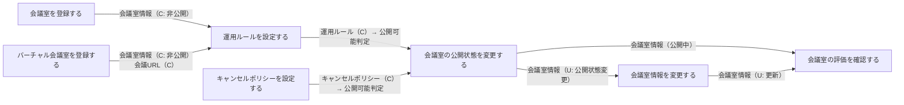
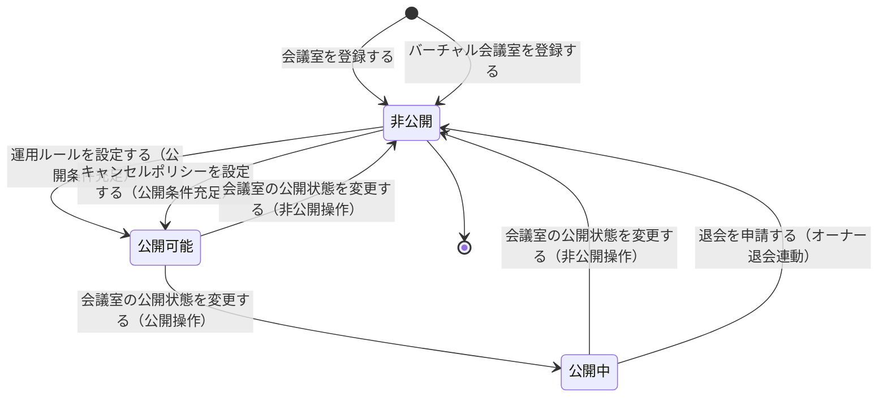

# 会議室管理フロー

## 概要

会議室オーナーが物理・バーチャル会議室を登録し、運用ルール・キャンセルポリシーの設定から公開管理・情報変更・評価確認までの会議室ライフサイクルを管理するフロー。会議室の公開条件を満たすことで利用者への検索・予約が可能となる。

## 所属 UC 一覧

| UC名 | アクター | 主な操作 | 関連情報 |
|------|---------|---------|---------|
| [会議室を登録する](会議室を登録する/spec.md) | 会議室オーナー | 物理会議室の物件情報を入力・登録する | 会議室情報 |
| [バーチャル会議室を登録する](バーチャル会議室を登録する/spec.md) | 会議室オーナー | バーチャル会議室の会議ツール種別・会議URLを登録する | 会議室情報, 会議URL |
| [運用ルールを設定する](運用ルールを設定する/spec.md) | 会議室オーナー | 利用可能時間帯・最低/最大利用時間・貸出可否を設定する | 運用ルール |
| [キャンセルポリシーを設定する](キャンセルポリシーを設定する/spec.md) | 会議室オーナー | キャンセル期限・キャンセル料率・返金ルールを設定する | キャンセルポリシー |
| [会議室の公開状態を変更する](会議室の公開状態を変更する/spec.md) | 会議室オーナー | 会議室を公開中・非公開に切り替える | 会議室情報 |
| [会議室情報を変更する](会議室情報を変更する/spec.md) | 会議室オーナー | 登録済みの会議室情報を修正・更新する | 会議室情報 |
| [会議室の評価を確認する](会議室の評価を確認する/spec.md) | 会議室オーナー | 利用者からの会議室評価を一覧で確認する | 会議室評価 |

## UC 横断データフロー

BUC 内の UC 間で情報がどう流れるかを示す。

### データフロー図

### 情報 CRUD マトリクス

| 情報名 | 会議室を登録する | バーチャル会議室を登録する | 運用ルールを設定する | キャンセルポリシーを設定する | 会議室の公開状態を変更する | 会議室情報を変更する | 会議室の評価を確認する |
|--------|:-------:|:-------:|:-------:|:-------:|:-------:|:-------:|:-------:|
| 会議室情報 | C | C | R | R | R/U | R/U | R |
| 運用ルール | | | C | R | R | | |
| キャンセルポリシー | | | R | C | R | | |
| 会議URL | | C | | | | | |
| 会議室評価 | | | | | | | R |

## 状態遷移全体図

会議室公開状態の全遷移パスと、各遷移を担当する UC を示す。

### 状態遷移 UC マッピング

| 状態モデル | 遷移元 | 遷移先 | 担当 UC |
|-----------|--------|--------|--------|
| 会議室 | （初期） | 非公開 | [会議室を登録する](会議室を登録する/spec.md) |
| 会議室 | （初期） | 非公開 | [バーチャル会議室を登録する](バーチャル会議室を登録する/spec.md) |
| 会議室 | 非公開 | 公開可能 | [運用ルールを設定する](運用ルールを設定する/spec.md)（公開条件充足時） |
| 会議室 | 非公開 | 公開可能 | [キャンセルポリシーを設定する](キャンセルポリシーを設定する/spec.md)（公開条件充足時） |
| 会議室 | 公開可能 | 公開中 | [会議室の公開状態を変更する](会議室の公開状態を変更する/spec.md) |
| 会議室 | 公開中 | 非公開 | [会議室の公開状態を変更する](会議室の公開状態を変更する/spec.md) |
| 会議室 | 公開可能 | 非公開 | [会議室の公開状態を変更する](会議室の公開状態を変更する/spec.md) |

## BUC 内共有条件一覧

| 条件名 | 条件の説明 | 適用 UC |
|--------|----------|--------|
| 会議室公開条件 | 会議室情報・運用ルール・キャンセルポリシーが全て登録完了した場合に会議室を公開可能とするルール | 運用ルールを設定する, キャンセルポリシーを設定する, 会議室の公開状態を変更する |
| 会議室種別別登録条件 | 会議室種別（物理・バーチャル）に応じて登録項目を切り替えるルール。物理は所在地・広さ・収容人数を、バーチャルは会議ツール種別・同時接続数・録画可否を必須入力とする | 会議室を登録する, バーチャル会議室を登録する, 会議室情報を変更する |

## BUC 内共有バリエーション一覧

| バリエーション名 | 値 | 適用 UC |
|----------------|---|--------|
| 会議室種別 | 物理, バーチャル | 会議室を登録する, バーチャル会議室を登録する, 会議室情報を変更する, 会議室の公開状態を変更する |
| 会議ツール種別 | Zoom, Teams, Google Meet | バーチャル会議室を登録する, 会議室情報を変更する |
