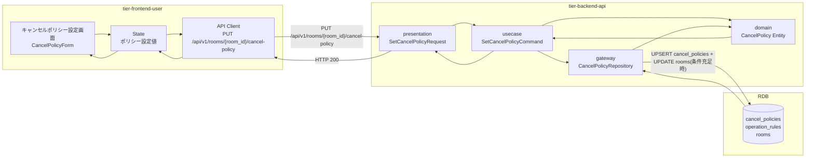
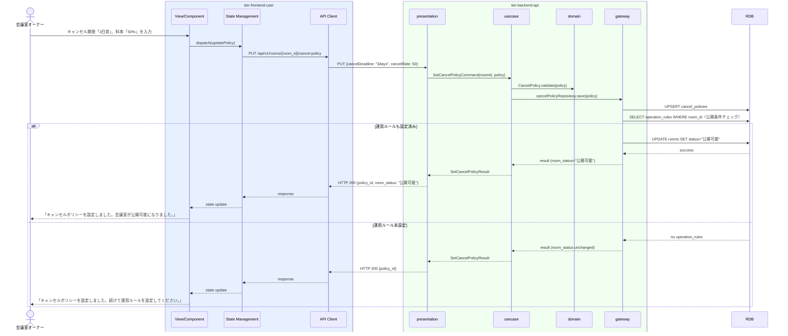

# キャンセルポリシーを設定する

## 概要

会議室オーナーがキャンセル料の発生条件や返金ルールを設定する。キャンセル期限・キャンセル料率・返金ルールを定義し、予約取消時の精算処理に適用される。設定完了後に運用ルールが設定済みであれば会議室が「公開可能」状態に遷移できる。

## データフロー



| レイヤー | モデル/型名 | 主要フィールド | 変換内容 |
|---------|-----------|-------------|---------|
| View/Component | CancelPolicyForm | cancelDeadline, cancelRate, refundRule | ポリシー入力フォーム |
| State Management | CancelPolicyState | policy, isSubmitting | 設定状態管理 |
| API Client | SetCancelPolicyRequest | roomId(path), cancelDeadline, cancelRate, refundRule | REST PUT ボディ |
| presentation | SetCancelPolicyRequest | roomId, cancelDeadline, cancelRate, refundRule | パスパラメータ + ボディ結合 |
| usecase | SetCancelPolicyCommand | roomId, policy | ドメインコマンド |
| domain | CancelPolicy | id, roomId, cancelDeadline, cancelRate, refundRule | ポリシーバリデーション |
| gateway | CancelPolicyRepository | UPSERT cancel_policies + SELECT operation_rules + UPDATE rooms | 公開条件チェック付き更新 |

## 処理フロー



## バリエーション一覧

| バリエーション名 | 値 | 処理内容 | 適用 tier | 適用箇所 |
|----------------|---|---------|----------|---------|
| - | - | 本UCにはバリエーションなし | - | - |

## 分岐条件一覧

| 条件名 | 判定ルール | 適用 tier | 適用箇所 | BDD Scenario |
|--------|----------|----------|---------|-------------|
| 会議室公開条件（キャンセルポリシー） | キャンセルポリシーが設定済みかつ運用ルールが設定済みの場合、会議室状態を「公開可能」に更新する | tier-backend-api | PUT /api/v1/rooms/{room_id}/cancel-policy | 両方設定済みで公開可能になる |
| キャンセル料率バリデーション | キャンセル料率は0〜100（%）の範囲内でなければならない | tier-backend-api | PUT /api/v1/rooms/{room_id}/cancel-policy | 料率101%でエラーが返る |

## 計算ルール一覧

| 計算名 | 入力情報 | 計算式/ロジック | 出力情報 | 適用 tier |
|--------|---------|---------------|---------|----------|
| - | - | 本UCには計算ルールなし（適用は予約取消時） | - | - |

## 状態遷移一覧

| 状態モデル | 遷移元 | 遷移先 | トリガー | 事前条件 | 事後処理 | 適用 tier |
|-----------|--------|--------|---------|---------|---------|----------|
| 会議室 | 非公開 | 公開可能 | キャンセルポリシーと運用ルールが両方設定済み | 会議室公開条件を満たす | なし | tier-backend-api |

## 関連 RDRA モデル

| モデル種別 | 要素名 | 関連 |
|-----------|--------|------|
| 業務 | 会議室管理業務 | このUCが属する業務 |
| BUC | 会議室管理フロー | このUCを含むBUC |
| アクター | 会議室オーナー | 操作するアクター（社外） |
| 情報 | キャンセルポリシー | 設定対象（ポリシーID、会議室ID、キャンセル期限、キャンセル料率、返金ルール） |
| 情報 | 運用ルール | キャンセルポリシーの関連情報 |
| 状態 | 会議室 | 公開可能への遷移前提条件 |
| 条件 | 会議室公開条件 | 運用ルールとキャンセルポリシー両方の設定完了が条件 |
| 条件 | キャンセルポリシー | 予約取消時に適用されるルール |

## E2E 完了条件（BDD）

### 正常系

```gherkin
Feature: キャンセルポリシーを設定する

  Scenario: キャンセルポリシーの設定が正常に完了する
    Given 会議室オーナー「田中一郎」がログイン済みで会議室「渋谷会議室A」のキャンセルポリシー設定画面を開いている
    When キャンセル期限「3日前」、キャンセル料率「50%」、返金ルール「期限超過後は返金なし」を入力して設定ボタンをクリックする
    Then 「キャンセルポリシーを設定しました」のメッセージが表示される

  Scenario: 運用ルールとキャンセルポリシーが両方設定済みで会議室が公開可能になる
    Given 会議室「渋谷会議室A」の運用ルールが設定済みで、キャンセルポリシーが未設定である
    When オーナー「田中一郎」がキャンセルポリシーを設定する
    Then 「会議室が公開可能になりました」のメッセージが表示され、会議室の状態が「公開可能」になる
```

### 異常系

```gherkin
  Scenario: キャンセル料率に100%超の値を入力するとエラーが返る
    Given オーナー「田中一郎」がキャンセルポリシー設定画面を開いている
    When キャンセル料率に「120」を入力して設定する
    Then 「キャンセル料率は0〜100%の範囲で入力してください」のエラーメッセージが表示される
```

## ティア別仕様

- [利用者・オーナー向けフロントエンド](tier-frontend-user.md)
- [バックエンドAPI](tier-backend-api.md)

### 統合 API Spec

- [OpenAPI Spec](../../../_cross-cutting/api/openapi.yaml)（全 UC 統合、Contract First 開発用）
