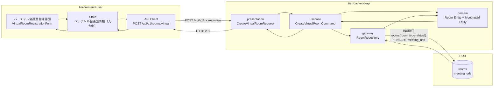
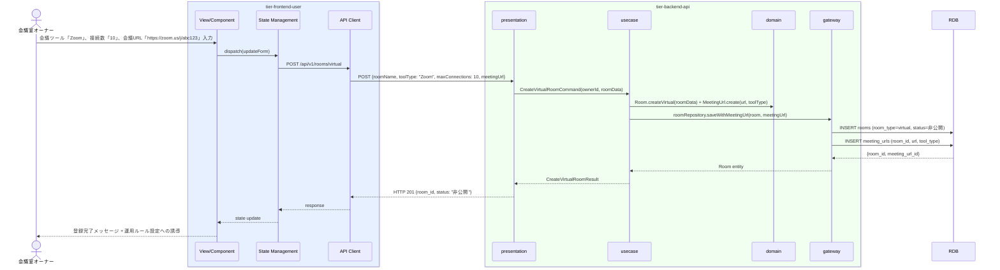

# バーチャル会議室を登録する

## 概要

会議室オーナーがバーチャル会議室の会議ツール種別（Zoom/Teams/Google Meet）・同時接続数・録画可否・価格と会議URLを登録する。会議室種別別登録条件に従い、バーチャル用の入力項目のみを表示する。登録直後は「非公開」状態となる。

## データフロー



| レイヤー | モデル/型名 | 主要フィールド | 変換内容 |
|---------|-----------|-------------|---------|
| View/Component | VirtualRoomRegistrationForm | roomName, toolType, maxConnections, recording, price, meetingUrl | バーチャル専用フォーム |
| State Management | VirtualRoomState | formData, isSubmitting | フォーム送信状態管理 |
| API Client | CreateVirtualRoomRequest | roomName, toolType, maxConnections, recordingEnabled, price, meetingUrl | REST POST ボディ |
| presentation | CreateVirtualRoomRequest | 全フィールド + バリデーション | リクエストバリデーション |
| usecase | CreateVirtualRoomCommand | ownerId, roomData, meetingUrl | ドメインコマンド |
| domain | Room + MeetingUrl | room_type=virtual, status=非公開, url, toolType, expiredAt | 2エンティティ生成 |
| gateway | RoomRepository | INSERT rooms (room_type=virtual) + INSERT meeting_urls | トランザクション INSERT |

## 処理フロー



## バリエーション一覧

| バリエーション名 | 値 | 処理内容 | 適用 tier | 適用箇所 |
|----------------|---|---------|----------|---------|
| 会議ツール種別 | Zoom | Zoomの会議URLパターンを受け付ける | tier-backend-api | POST /api/v1/rooms/virtual |
| 会議ツール種別 | Teams | Teamsの会議URLパターンを受け付ける | tier-backend-api | POST /api/v1/rooms/virtual |
| 会議ツール種別 | Google Meet | Google Meetの会議URLパターンを受け付ける | tier-backend-api | POST /api/v1/rooms/virtual |

## 分岐条件一覧

| 条件名 | 判定ルール | 適用 tier | 適用箇所 | BDD Scenario |
|--------|----------|----------|---------|-------------|
| 会議室種別別登録条件（バーチャル必須項目） | 会議ツール種別・同時接続数・録画可否・会議URLが全て入力済みでなければ登録不可 | tier-backend-api | POST /api/v1/rooms/virtual | バーチャル会議室の必須項目を満たして正常に登録できる |
| 会議URL有効性チェック | 会議URLがURL形式（https://）で有効期限が現在時刻より未来であること | tier-backend-api | POST /api/v1/rooms/virtual | 無効なURLでエラーが返る |

## 計算ルール一覧

| 計算名 | 入力情報 | 計算式/ロジック | 出力情報 | 適用 tier |
|--------|---------|---------------|---------|----------|
| - | - | 本UCには計算ルールなし | - | - |

## 状態遷移一覧

| 状態モデル | 遷移元 | 遷移先 | トリガー | 事前条件 | 事後処理 | 適用 tier |
|-----------|--------|--------|---------|---------|---------|----------|
| 会議室 | （初期状態） | 非公開 | バーチャル会議室を登録する | オーナーが「登録済み」状態 | なし（運用ルール設定を案内） | tier-backend-api |

## 関連 RDRA モデル

| モデル種別 | 要素名 | 関連 |
|-----------|--------|------|
| 業務 | 会議室管理業務 | このUCが属する業務 |
| BUC | 会議室管理フロー | このUCを含むBUC |
| アクター | 会議室オーナー | 操作するアクター（社外） |
| 情報 | 会議室情報 | 登録する情報（会議室名、会議室種別=バーチャル、会議ツール種別、同時接続数、録画可否、価格） |
| 情報 | 会議URL | 登録する会議URL情報（会議ツール種別、会議URL、有効期限） |
| 状態 | 会議室 | 遷移先: 非公開（初期状態） |
| 条件 | 会議室種別別登録条件 | バーチャル: 会議ツール種別・同時接続数・録画可否が必須 |
| バリエーション | 会議室種別 | バーチャル（本UCは常にバーチャル） |
| バリエーション | 会議ツール種別 | Zoom / Teams / Google Meet |

## E2E 完了条件（BDD）

### 正常系

```gherkin
Feature: バーチャル会議室を登録する

  Scenario: バーチャル会議室の登録が正常に完了する
    Given 会議室オーナー「田中一郎」がログイン済みでバーチャル会議室登録画面を開いている
    When 会議室名「オンライン会議室A」、会議ツール種別「Zoom」、同時接続数「10」、録画可否「可」、価格「800」、会議URL「https://zoom.us/j/abc123456」を入力して登録ボタンをクリックする
    Then バーチャル会議室「オンライン会議室A」が「非公開」状態で登録され、「登録が完了しました。運用ルールを設定して公開準備を進めてください。」のメッセージが表示される

  Scenario: 会議ツール種別「Teams」を選択してバーチャル会議室を登録できる
    Given 会議室オーナー「田中一郎」がバーチャル会議室登録画面を開いている
    When 会議ツール種別「Teams」、接続数「20」、会議URL「https://teams.microsoft.com/l/meetup-join/abc」を入力して登録する
    Then バーチャル会議室が「非公開」状態で登録される
```

### 異常系

```gherkin
  Scenario: 会議URLが無効な形式でエラーが返る
    Given 会議室オーナー「田中一郎」がバーチャル会議室登録画面を開いている
    When 会議URLに「not-a-url」を入力して登録ボタンをクリックする
    Then 「有効な会議URLを入力してください（https://で始まるURL）」のエラーメッセージが表示される

  Scenario: 会議ツール種別未選択でエラーが返る
    Given 会議室オーナー「田中一郎」がバーチャル会議室登録画面で会議ツール種別を選択していない
    When 登録ボタンをクリックする
    Then 「会議ツール種別を選択してください」のバリデーションエラーが表示される
```

## ティア別仕様

- [利用者・オーナー向けフロントエンド](tier-frontend-user.md)
- [バックエンドAPI](tier-backend-api.md)

### 統合 API Spec

- [OpenAPI Spec](../../../_cross-cutting/api/openapi.yaml)（全 UC 統合、Contract First 開発用）
