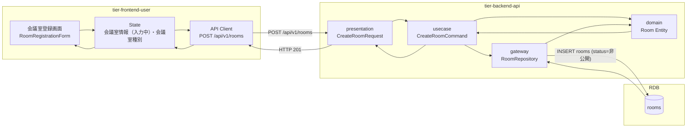
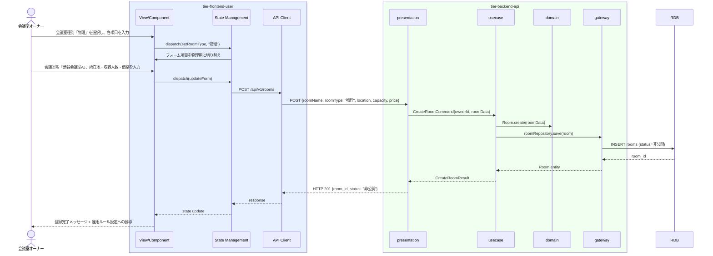

# 会議室を登録する

## 概要

会議室オーナーが会議室の物件情報（会議室名・所在地・広さ・収容人数・価格・設備・画像）を登録する。登録直後は「非公開」状態となり、公開前に運用ルール・キャンセルポリシーの設定が必要となる。

## データフロー



| レイヤー | モデル/型名 | 主要フィールド | 変換内容 |
|---------|-----------|-------------|---------|
| View/Component | RoomRegistrationForm | roomName, roomType, location, capacity, price, facilities | 種別切替付きフォーム |
| State Management | RoomFormState | formData, roomType, isSubmitting | フォーム状態管理 |
| API Client | CreateRoomRequest | roomName, roomType, location/toolType, capacity, price | REST POST ボディ |
| presentation | CreateRoomRequest | 全フィールド + ownerId | リクエストバリデーション |
| usecase | CreateRoomCommand | ownerId, roomData | ドメインコマンド |
| domain | Room | id, roomName, roomType, location/toolType, capacity, price, status=非公開 | エンティティ生成 |
| gateway | RoomRepository | INSERT rooms SET status='非公開' | SQL INSERT |

## 処理フロー



## バリエーション一覧

| バリエーション名 | 値 | 処理内容 | 適用 tier | 適用箇所 |
|----------------|---|---------|----------|---------|
| 会議室種別 | 物理 | 所在地・広さ・収容人数フォームを表示 | tier-frontend-user | 会議室登録画面 |
| 会議室種別 | バーチャル | 会議ツール種別・同時接続数・録画可否フォームを表示 | tier-frontend-user | 会議室登録画面 |

## 分岐条件一覧

| 条件名 | 判定ルール | 適用 tier | 適用箇所 | BDD Scenario |
|--------|----------|----------|---------|-------------|
| 会議室種別別登録条件（物理） | 会議室種別が「物理」の場合、所在地・広さ・収容人数を必須入力とし、会議ツール種別・同時接続数・録画可否は非表示 | tier-frontend-user | 会議室登録画面 | 物理会議室で所在地を入力して正常に登録できる |
| 会議室種別別登録条件（バーチャル） | 会議室種別が「バーチャル」の場合、会議ツール種別・同時接続数・録画可否を必須入力とし、所在地・広さ・収容人数は非表示 | tier-frontend-user | 会議室登録画面 | バーチャルへの切り替えで入力項目が変わる |
| オーナー状態チェック | 「登録済み」状態のオーナーのみが会議室を登録可能 | tier-backend-api | POST /api/v1/rooms | 未認証オーナーの登録試みでエラーが返る |

## 計算ルール一覧

| 計算名 | 入力情報 | 計算式/ロジック | 出力情報 | 適用 tier |
|--------|---------|---------------|---------|----------|
| - | - | 本UCには計算ルールなし | - | - |

## 状態遷移一覧

| 状態モデル | 遷移元 | 遷移先 | トリガー | 事前条件 | 事後処理 | 適用 tier |
|-----------|--------|--------|---------|---------|---------|----------|
| 会議室 | （初期状態） | 非公開 | 会議室を登録する | オーナーが「登録済み」状態 | なし（運用ルール設定を案内） | tier-backend-api |

## 関連 RDRA モデル

| モデル種別 | 要素名 | 関連 |
|-----------|--------|------|
| 業務 | 会議室管理業務 | このUCが属する業務 |
| BUC | 会議室管理フロー | このUCを含むBUC |
| アクター | 会議室オーナー | 操作するアクター（社外） |
| 情報 | 会議室情報 | 登録する情報（会議室ID、会議室名、会議室種別、所在地、広さ、収容人数、価格、設備・機能、画像、公開状態） |
| 状態 | 会議室 | 遷移先: 非公開（初期状態） |
| 条件 | 会議室種別別登録条件 | 物理/バーチャルで入力項目が異なる |
| バリエーション | 会議室種別 | 物理 / バーチャル |

## E2E 完了条件（BDD）

### 正常系

```gherkin
Feature: 会議室を登録する

  Scenario: 物理会議室の登録が正常に完了する
    Given 会議室オーナー「田中一郎」がログイン済みで会議室登録画面を開いている
    When 会議室種別「物理」を選択し、会議室名「渋谷会議室A」、所在地「東京都渋谷区神南1-1-1」、収容人数「10」、価格「1000」を入力して登録ボタンをクリックする
    Then 会議室「渋谷会議室A」が「非公開」状態で登録され、「登録が完了しました。運用ルールを設定して公開準備を進めてください。」のメッセージが表示される

  Scenario: バーチャル会議室種別選択時に入力項目が切り替わる
    Given 会議室オーナー「田中一郎」が会議室登録画面を開いている
    When 会議室種別「バーチャル」を選択する
    Then 所在地・広さ・収容人数フィールドが非表示になり、会議ツール種別・同時接続数・録画可否フィールドが表示される
```

### 異常系

```gherkin
  Scenario: 必須項目未入力で登録しようとした場合にエラーが返る
    Given 会議室オーナー「田中一郎」が会議室登録画面で物理会議室を選択している
    When 会議室名を入力せずに登録ボタンをクリックする
    Then 「会議室名は必須項目です」のバリデーションエラーが表示され、登録は実行されない
```

## ティア別仕様

- [利用者・オーナー向けフロントエンド](tier-frontend-user.md)
- [バックエンドAPI](tier-backend-api.md)

### 統合 API Spec

- [OpenAPI Spec](../../../_cross-cutting/api/openapi.yaml)（全 UC 統合、Contract First 開発用）
