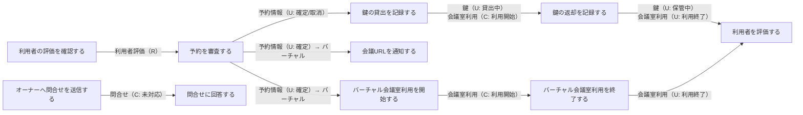
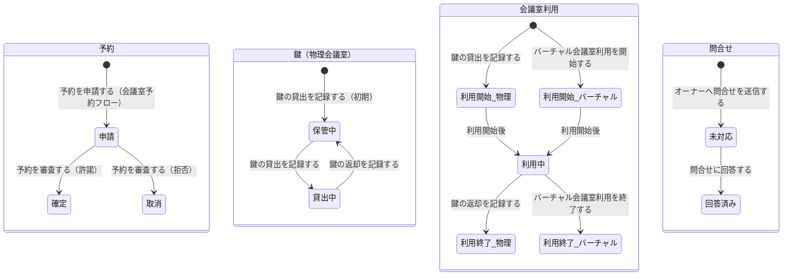

# 会議室貸出管理フロー

## 概要

会議室オーナーが予約審査・鍵の貸出/返却・利用者評価登録・問合せ対応を行うフロー。物理会議室は鍵の受け渡しで利用開始/終了を制御し、バーチャル会議室は時刻ベースの自動遷移で処理する。利用者からオーナーへの問合せも本フローで管理する。

## 所属 UC 一覧

| UC名 | アクター | 主な操作 | 関連情報 |
|------|---------|---------|---------|
| [利用者の評価を確認する](利用者の評価を確認する/spec.md) | 会議室オーナー | 予約審査前に利用者の過去評価を確認する | 利用者評価 |
| [予約を審査する](予約を審査する/spec.md) | 会議室オーナー | 予約申請を確認し許諾または拒否を判断する | 予約情報, 利用者評価 |
| [鍵の貸出を記録する](鍵の貸出を記録する/spec.md) | 会議室オーナー | 利用者に鍵を渡し利用開始状態に遷移させる | 鍵, 会議室利用 |
| [鍵の返却を記録する](鍵の返却を記録する/spec.md) | 会議室オーナー | 利用者から鍵を返却され利用終了状態に遷移させる | 鍵, 会議室利用 |
| [利用者を評価する](利用者を評価する/spec.md) | 会議室オーナー | 利用者のマナー等を評価登録する | 利用者評価 |
| [オーナーへ問合せを送信する](オーナーへ問合せを送信する/spec.md) | 利用者 | 会議室オーナーへ問合せを送信する | 問合せ |
| [問合せに回答する](問合せに回答する/spec.md) | 会議室オーナー | 利用者からの問合せに回答する | 問合せ |
| [会議URLを通知する](会議URLを通知する/spec.md) | システム（自動） | バーチャル会議室の予約確定時に会議URLを利用者へ通知する | 会議URL, 予約情報 |
| [バーチャル会議室利用を開始する](バーチャル会議室利用を開始する/spec.md) | システム（タイマー） | 利用開始時刻到来でバーチャル会議室利用を自動開始する | 会議室利用 |
| [バーチャル会議室利用を終了する](バーチャル会議室利用を終了する/spec.md) | システム（タイマー） | 利用終了時刻到来でバーチャル会議室利用を自動終了する | 会議室利用 |

## UC 横断データフロー

BUC 内の UC 間で情報がどう流れるかを示す。

### データフロー図

### 情報 CRUD マトリクス

| 情報名 | 利用者の評価を確認する | 予約を審査する | 鍵の貸出を記録する | 鍵の返却を記録する | 利用者を評価する | オーナーへ問合せを送信する | 問合せに回答する | 会議URLを通知する | バーチャル会議室利用を開始する | バーチャル会議室利用を終了する |
|--------|:-------:|:-------:|:-------:|:-------:|:-------:|:-------:|:-------:|:-------:|:-------:|:-------:|
| 予約情報 | | R/U | R | R | | | | R | R | R |
| 利用者評価 | R | R | | | C | | | | | |
| 鍵 | | | R/U | R/U | | | | | | |
| 会議室利用 | | | C | U | R | | | | C | U |
| 問合せ | | | | | | C | R/U | | | |
| 会議URL | | | | | | | | R | | |

## 状態遷移全体図

BUC 内で関連する全状態モデルの遷移パスと担当 UC を示す。

### 状態遷移 UC マッピング

| 状態モデル | 遷移元 | 遷移先 | 担当 UC |
|-----------|--------|--------|--------|
| 予約 | 申請 | 確定 | [予約を審査する](予約を審査する/spec.md) |
| 予約 | 申請 | 取消 | [予約を審査する](予約を審査する/spec.md) |
| 鍵 | 保管中 | 貸出中 | [鍵の貸出を記録する](鍵の貸出を記録する/spec.md) |
| 鍵 | 貸出中 | 保管中 | [鍵の返却を記録する](鍵の返却を記録する/spec.md) |
| 会議室利用 | （初期） | 利用開始 | [鍵の貸出を記録する](鍵の貸出を記録する/spec.md) |
| 会議室利用 | 利用開始 | 利用中 | 自動遷移 |
| 会議室利用 | 利用中 | 利用終了 | [鍵の返却を記録する](鍵の返却を記録する/spec.md) |
| 会議室利用 | （初期） | 利用開始 | [バーチャル会議室利用を開始する](バーチャル会議室利用を開始する/spec.md) |
| 会議室利用 | 利用中 | 利用終了 | [バーチャル会議室利用を終了する](バーチャル会議室利用を終了する/spec.md) |
| 問合せ | （初期） | 未対応 | [オーナーへ問合せを送信する](オーナーへ問合せを送信する/spec.md) |
| 問合せ | 未対応 | 回答済み | [問合せに回答する](問合せに回答する/spec.md) |

## BUC 内共有条件一覧

| 条件名 | 条件の説明 | 適用 UC |
|--------|----------|--------|
| 使用許諾条件 | 会議室予約申請に対してオーナーが利用者評価を確認し使用を許諾するかどうかを判定するルール | 利用者の評価を確認する, 予約を審査する |
| 会議室利用ポリシー | 鍵の受け渡しをトリガーとして会議室利用の開始・終了を定義するルール。物理会議室専用。バーチャル会議室の場合は鍵貸出/返却操作を拒否 | 鍵の貸出を記録する, 鍵の返却を記録する |
| バーチャル会議室利用ポリシー | バーチャル会議室の利用開始・終了を定義するルール。鍵の貸出・返却は不要とし、利用開始/終了時刻の到来で自動遷移。会議URL自動通知を含む | 会議URLを通知する, バーチャル会議室利用を開始する, バーチャル会議室利用を終了する, 予約を審査する |

## BUC 内共有バリエーション一覧

| バリエーション名 | 値 | 適用 UC |
|----------------|---|--------|
| 会議室種別 | 物理, バーチャル | 鍵の貸出を記録する, 鍵の返却を記録する, 会議URLを通知する, バーチャル会議室利用を開始する, バーチャル会議室利用を終了する |
| 評価種別 | 利用者評価, 会議室評価, オーナー評価 | 利用者の評価を確認する, 予約を審査する, 利用者を評価する |
| 問合せ種別 | オーナー宛問合せ, サービス運営宛問合せ | オーナーへ問合せを送信する, 問合せに回答する |
