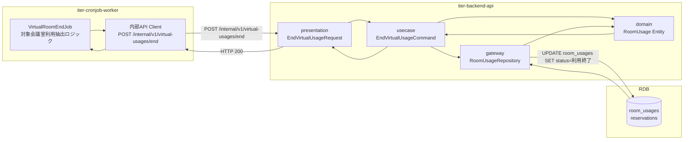
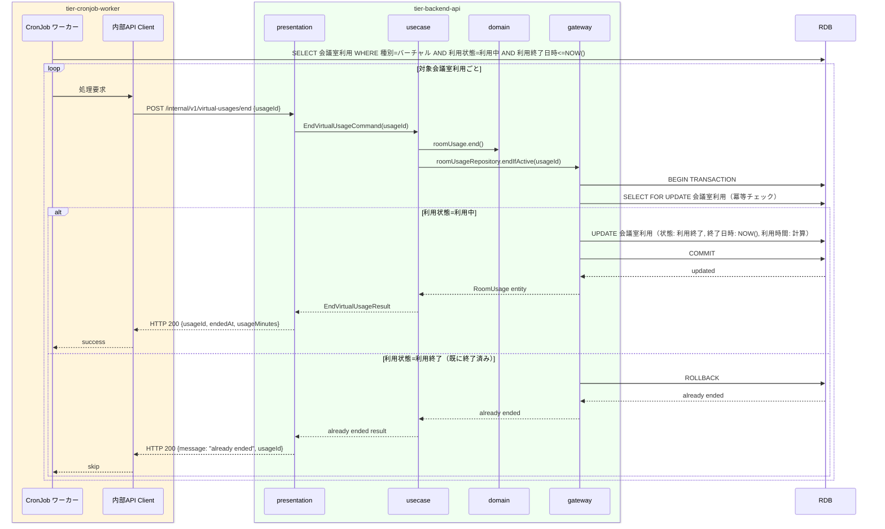

# バーチャル会議室利用を終了する

## 概要

バーチャル会議室の利用終了時刻到来を契機に自動的に会議室利用状態を「利用中」→「利用終了」に遷移させるUC。CronJobワーカーが定期的に利用中の予約を確認し、終了時刻を過ぎたバーチャル会議室の会議室利用レコードを「利用終了」状態に更新する。画面操作なし。

## データフロー



| レイヤー | モデル/型名 | 主要フィールド | 変換内容 |
|---------|-----------|-------------|---------|
| CronJob | VirtualRoomEndJob | 対象会議室利用一覧クエリ | 利用終了日時 <= NOW() AND 利用状態="利用中" AND 種別="バーチャル" |
| API Client(内部) | EndVirtualUsageRequest | usageId | 内部REST POST |
| presentation | EndVirtualUsageRequest | usageId | サービスアカウント認証済みリクエスト |
| usecase | EndVirtualUsageCommand | usageId | ドメインコマンド |
| domain | RoomUsage | id, status(利用中→利用終了), endedAt, usageMinutes | 利用時間計算付きエンティティ |
| gateway | RoomUsageRepository | SELECT FOR UPDATE (冪等チェック) + UPDATE room_usages | トランザクション UPDATE |

## 処理フロー



## バリエーション一覧

| バリエーション名 | 値 | 処理内容 | 適用 tier | 適用箇所 |
|----------------|---|---------|----------|---------|
| 会議室種別 | バーチャル | 利用終了時刻到来で自動的に利用終了状態に遷移 | tier-cronjob-worker | VirtualRoomEndJob |
| 会議室種別 | 物理 | 本UCでは処理対象外（物理会議室は鍵返却で利用終了） | - | - |

## 分岐条件一覧

| 条件名 | 判定ルール | 適用 tier | 適用箇所 | BDD Scenario |
|--------|----------|----------|---------|-------------|
| バーチャル会議室利用ポリシー | 会議室種別が「バーチャル」かつ会議室利用状態が「利用中」かつ予約の利用終了日時が現在時刻以前であることを条件に会議室利用を「利用終了」状態に更新する | tier-cronjob-worker | VirtualRoomEndJob | 利用終了時刻到来で会議室利用が終了する |
| バーチャル会議室利用ポリシー | すでに「利用終了」の会議室利用レコードが存在する場合は二重処理をスキップする | tier-cronjob-worker | VirtualRoomEndJob | 重複処理スキップ |

## 計算ルール一覧

| 計算名 | 入力情報 | 計算式/ロジック | 出力情報 | 適用 tier |
|--------|---------|---------------|---------|----------|
| 利用終了対象の抽出 | 予約情報.利用終了日時, 現在日時, 会議室利用.利用状態, 会議室種別 | 利用終了日時 <= NOW() AND 利用状態="利用中" AND 種別="バーチャル" | 処理対象会議室利用一覧 | tier-cronjob-worker |
| 実際の利用時間 | 会議室利用.利用開始日時, 終了日時 | 終了日時 - 利用開始日時（分単位、小数点以下切り捨て） | 利用時間（分） | tier-backend-api |

## 状態遷移一覧

| 状態モデル | 遷移元 | 遷移先 | トリガー | 事前条件 | 事後処理 | 適用 tier |
|-----------|--------|--------|---------|---------|---------|----------|
| 会議室利用 | 利用中 | 利用終了 | 利用終了時刻到来（CronJobタイマー） | 会議室利用状態が「利用中」、会議室種別が「バーチャル」、利用終了日時が現在時刻以前 | 利用終了日時・実利用時間を記録 | tier-cronjob-worker / tier-backend-api |

## 関連 RDRA モデル

| モデル種別 | 要素名 | 関連 |
|-----------|--------|------|
| 業務 | 会議室貸出業務 | このUCが属する業務 |
| BUC | 会議室貸出管理フロー | このUCを含むBUC |
| 情報 | 会議室利用 | 利用終了状態に更新する情報 |
| 状態 | 会議室利用（利用中 → 利用終了） | CronJobによる自動遷移 |
| 条件 | バーチャル会議室利用ポリシー | バーチャル会議室の利用終了を自動処理で定義 |
| タイマー | 利用終了時刻到来 | CronJobのトリガー |

## E2E 完了条件（BDD）

### 正常系

```gherkin
Feature: バーチャル会議室利用を終了する

  Scenario: 利用終了時刻を過ぎたバーチャル会議室の会議室利用U-002が自動終了される
    Given バーチャル会議室の会議室利用U-002（利用状態: 利用中、利用終了日時: 2026-04-01 16:00）が存在し、現在時刻が「2026-04-01 16:01」である
    When CronJobワーカーが定期実行（毎分起動）される
    Then 会議室利用U-002の状態が「利用終了」に更新され、終了日時「2026-04-01 16:01」と実利用時間「121分」が記録される
```

### 異常系

```gherkin
  Scenario: すでに利用終了済みの会議室利用が再度CronJobで処理された場合にスキップされる
    Given バーチャル会議室の会議室利用U-002がすでに「利用終了」状態である
    When CronJobワーカーが同じ会議室利用を再度処理しようとする
    Then 二重処理がスキップされ、既存の会議室利用レコードはそのまま維持される
```

## ティア別仕様

- [CronJob ワーカー](tier-cronjob-worker.md)
- [バックエンド API](tier-backend-api.md)

### 統合 API Spec

- [OpenAPI Spec](../../_cross-cutting/api/openapi.yaml)（全 UC 統合、Contract First 開発用）
