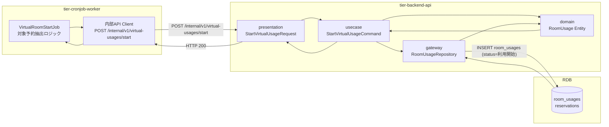
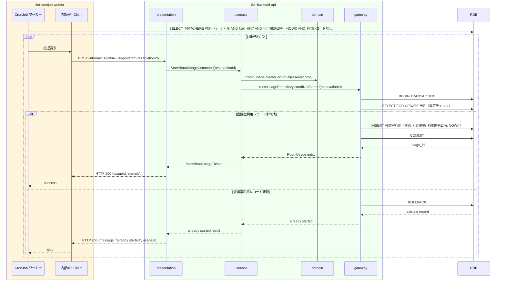

# バーチャル会議室利用を開始する

## 概要

バーチャル会議室の予約確定後、利用開始時刻到来を契機に自動的に会議室利用状態を「利用開始」に遷移させるUC。CronJobワーカーが定期的に確定済み予約を確認し、開始時刻を過ぎたバーチャル会議室の会議室利用レコードを作成する。画面操作なし。

## データフロー



| レイヤー | モデル/型名 | 主要フィールド | 変換内容 |
|---------|-----------|-------------|---------|
| CronJob | VirtualRoomStartJob | 対象予約一覧クエリ | 利用開始日時 <= NOW() AND 状態="確定" AND 種別="バーチャル" |
| API Client(内部) | StartVirtualUsageRequest | reservationId | 内部REST POST |
| presentation | StartVirtualUsageRequest | reservationId | サービスアカウント認証済みリクエスト |
| usecase | StartVirtualUsageCommand | reservationId | ドメインコマンド |
| domain | RoomUsage | id, reservationId, status=利用開始, startedAt | 新規エンティティ作成（冪等チェック付き） |
| gateway | RoomUsageRepository | SELECT FOR UPDATE (冪等チェック) + INSERT room_usages | トランザクション INSERT |

## 処理フロー



## バリエーション一覧

| バリエーション名 | 値 | 処理内容 | 適用 tier | 適用箇所 |
|----------------|---|---------|----------|---------|
| 会議室種別 | バーチャル | 利用開始時刻到来で自動的に利用開始状態に遷移 | tier-cronjob-worker | VirtualRoomStartJob |
| 会議室種別 | 物理 | 本UCでは処理対象外（物理会議室は鍵貸出で利用開始） | - | - |

## 分岐条件一覧

| 条件名 | 判定ルール | 適用 tier | 適用箇所 | BDD Scenario |
|--------|----------|----------|---------|-------------|
| バーチャル会議室利用ポリシー | 会議室種別が「バーチャル」かつ予約状態が「確定」かつ利用開始日時が現在時刻以前であることを条件に会議室利用を「利用開始」状態で作成する | tier-cronjob-worker | VirtualRoomStartJob | 利用開始時刻到来で会議室利用が開始される |
| バーチャル会議室利用ポリシー | すでに「利用開始」または「利用中」の会議室利用レコードが存在する場合は二重処理をスキップする | tier-cronjob-worker | VirtualRoomStartJob | 重複処理スキップ |

## 計算ルール一覧

| 計算名 | 入力情報 | 計算式/ロジック | 出力情報 | 適用 tier |
|--------|---------|---------------|---------|----------|
| 利用開始対象予約の抽出 | 予約情報.利用開始日時, 現在日時, 予約状態, 会議室種別 | 利用開始日時 <= NOW() AND 状態="確定" AND 種別="バーチャル" AND 既存利用レコードなし | 処理対象予約一覧 | tier-cronjob-worker |

## 状態遷移一覧

| 状態モデル | 遷移元 | 遷移先 | トリガー | 事前条件 | 事後処理 | 適用 tier |
|-----------|--------|--------|---------|---------|---------|----------|
| 会議室利用 | （新規作成） | 利用開始 | 利用開始時刻到来（CronJobタイマー） | 予約状態が「確定」、会議室種別が「バーチャル」、利用開始日時が現在時刻以前 | 会議室利用レコード作成・利用開始日時記録 | tier-cronjob-worker / tier-backend-api |

## 関連 RDRA モデル

| モデル種別 | 要素名 | 関連 |
|-----------|--------|------|
| 業務 | 会議室貸出業務 | このUCが属する業務 |
| BUC | 会議室貸出管理フロー | このUCを含むBUC |
| 情報 | 会議室利用 | 利用開始状態で作成する情報 |
| 状態 | 会議室利用（→ 利用開始） | CronJobによる自動遷移 |
| 条件 | バーチャル会議室利用ポリシー | バーチャル会議室の利用開始を自動処理で定義 |
| タイマー | 利用開始時刻到来 | CronJobのトリガー |

## E2E 完了条件（BDD）

### 正常系

```gherkin
Feature: バーチャル会議室利用を開始する

  Scenario: 利用開始時刻を過ぎたバーチャル会議室予約R-002の利用が自動開始される
    Given バーチャル会議室予約R-002（状態: 確定、利用開始日時: 2026-04-01 14:00）が存在し、現在時刻が「2026-04-01 14:01」である
    When CronJobワーカーが定期実行（毎分起動）される
    Then 予約R-002に紐づく会議室利用レコードが「利用開始」状態で作成される
```

### 異常系

```gherkin
  Scenario: すでに利用開始済みの予約が再度CronJobで処理された場合にスキップされる
    Given バーチャル会議室予約R-002の会議室利用レコードがすでに「利用開始」状態で存在する
    When CronJobワーカーが同じ予約を再度処理しようとする
    Then 二重処理がスキップされ、既存の会議室利用レコードはそのまま維持される
```

## ティア別仕様

- [CronJob ワーカー](tier-cronjob-worker.md)
- [バックエンド API](tier-backend-api.md)

### 統合 API Spec

- [OpenAPI Spec](../../_cross-cutting/api/openapi.yaml)（全 UC 統合、Contract First 開発用）
