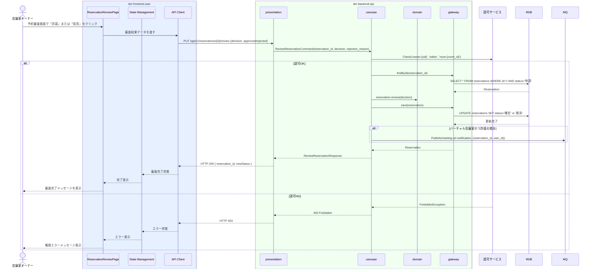

# 予約を審査する

## 概要

会議室オーナーが利用者の予約申請を確認し、許諾または拒否を判断するUC。利用者の評価情報と使用許諾条件に基づいて審査し、予約の状態を「申請」から「確定」または「取消（拒否）」に遷移させる。

## データフロー

```mermaid
graph LR
  subgraph FE["tier-frontend-user"]
    subgraph FE_V["view"]
      ReservationReviewPage
    end
    subgraph FE_S["state"]
      ReviewState
    end
    subgraph FE_A["api-client"]
      ReviewReservationRequest
    end
  end
  subgraph BE["tier-backend-api"]
    subgraph BE_P["presentation"]
      ReviewReservationRequestDTO
    end
    subgraph BE_U["usecase"]
      ReviewReservationCommand
    end
    subgraph BE_D["domain"]
      Reservation
    end
    subgraph BE_G["gateway"]
      ReservationRecord
    end
  end
  subgraph DB["tier-datastore-rdb"]
    reservations[("reservations")]
  end

  ReservationReviewPage --> ReviewState --> ReviewReservationRequest
  ReviewReservationRequest -->|"PUT /api/v1/reservations/{id}/review"| ReviewReservationRequestDTO
  ReviewReservationRequestDTO --> ReviewReservationCommand
  ReviewReservationCommand --> Reservation
  Reservation --> ReservationRecord
  ReservationRecord -->|"UPDATE status=確定/取消"| reservations
  reservations --> ReservationRecord
  ReservationRecord --> Reservation
  Reservation --> ReviewReservationCommand --> ReviewReservationRequestDTO
  ReviewReservationRequestDTO -->|"HTTP 200"| ReviewReservationRequest
  ReviewReservationRequest --> ReviewState --> ReservationReviewPage
```



| レイヤー | データモデル | 変換内容 |
|---------|------------|---------|
| FE view | ReservationReviewPage | 申請一覧・利用者評価スコア表示・許諾/拒否操作 |
| FE state | ReviewState | 審査結果・操作状態管理 |
| FE api-client | ReviewReservationRequest | 審査結果データ → API リクエスト変換 |
| BE presentation | ReviewReservationRequestDTO | バリデーション + Command 変換 |
| BE usecase | ReviewReservationCommand | 認可チェック → 申請状態確認 → 状態遷移（確定/取消） → バーチャル時 MQ publish |
| BE domain | Reservation | 状態遷移: 申請 → 確定 / 取消 |
| BE gateway | ReservationRecord | Entity → DB カラム形式の DTO |
| DB | reservations | UPDATE status=確定 or 取消 |

## 処理フロー



## バリエーション一覧

| バリエーション名 | 値 | 処理内容 | 適用 tier | 適用箇所 |
|----------------|---|---------|----------|---------|
| 評価種別 | 利用者評価 | 利用者の過去評価スコア・コメントを審査画面に表示 | tier-frontend-user | 予約審査画面 |

## 分岐条件一覧

| 条件名 | 判定ルール | 適用 tier | 適用箇所 | BDD Scenario |
|--------|----------|----------|---------|-------------|
| 使用許諾条件 | オーナーが利用者評価（評価スコアおよびコメント）を確認し、許諾または拒否を選択する。拒否の場合は拒否理由テキストを入力する | tier-backend-api | PUT /api/v1/reservations/{id}/review | 予約許諾後に予約が確定状態になる |
| 使用許諾条件（評価種別） | 評価種別「利用者評価」のスコアが基準値未満（例: 2.0以下）の場合は拒否推奨ガイダンスを表示する | tier-frontend-user | 予約審査画面 | 低評価利用者へのガイダンス表示 |

## 計算ルール一覧

| 計算名 | 入力情報 | 計算式/ロジック | 出力情報 | 適用 tier |
|--------|---------|---------------|---------|----------|
| 利用者平均評価スコア | 利用者評価.評価スコア（複数件） | 算術平均（小数第1位切捨て） | 表示用平均スコア | tier-backend-api |

## 状態遷移一覧

| 状態モデル | 遷移元 | 遷移先 | トリガー | 事前条件 | 事後処理 | 適用 tier |
|-----------|--------|--------|---------|---------|---------|----------|
| 予約 | 申請 | 確定 | オーナーが許諾ボタンをクリック | 予約状態が「申請」であること、オーナーが該当会議室の所有者であること | バーチャル会議室の場合は会議URL通知イベントを発行 | tier-backend-api |
| 予約 | 申請 | 取消 | オーナーが拒否ボタンをクリック | 予約状態が「申請」であること | 利用者に拒否通知（非同期） | tier-backend-api |

## 関連 RDRA モデル

| モデル種別 | 要素名 | 関連 |
|-----------|--------|------|
| 業務 | 会議室貸出業務 | このUCが属する業務 |
| BUC | 会議室貸出管理フロー | このUCを含むBUC |
| アクター | 会議室オーナー | 操作するアクター |
| 情報 | 予約情報 | 審査対象の情報 |
| 情報 | 利用者評価 | 審査判断の参考情報 |
| 状態 | 予約（申請 → 確定 / 取消） | 審査で遷移する状態 |
| 条件 | 使用許諾条件 | 評価種別ごとに許諾基準が異なる |

## E2E 完了条件（BDD）

### 正常系

```gherkin
Feature: 予約を審査する

  Scenario: オーナー「山田花子」が利用者「田中太郎」の予約申請を許諾する
    Given 会議室オーナー「山田花子」がログイン済みで、予約ID「R-001」（利用者: 田中太郎、状態: 申請）が存在する
    When オーナーが予約審査画面で「許諾する」ボタンをクリックする
    Then 予約R-001の状態が「確定」に更新され、「予約を許諾しました」メッセージが表示される

  Scenario: オーナー「山田花子」が利用者「鈴木次郎」の予約申請を拒否する
    Given 会議室オーナー「山田花子」がログイン済みで、予約ID「R-002」（利用者: 鈴木次郎、評価スコア: 1.5）が存在する
    When オーナーが予約審査画面で拒否理由「過去に無断キャンセルがあったため」を入力し「拒否する」ボタンをクリックする
    Then 予約R-002の状態が「取消」に更新され、利用者に拒否通知が送信される
```

### 異常系

```gherkin
  Scenario: 既に確定済みの予約に対して審査操作を試みる
    Given 会議室オーナー「山田花子」がログイン済みで、予約ID「R-003」がすでに「確定」状態である
    When オーナーが予約審査APIに PUT /api/v1/reservations/R-003/review (decision: approved) をリクエストする
    Then 409 Conflict が返され、「この予約はすでに審査済みです」エラーが表示される
```

## ティア別仕様

- [利用者・オーナー向けフロントエンド](tier-frontend-user.md)
- [バックエンド API](tier-backend-api.md)

### 統合 API Spec

- [OpenAPI Spec](../../_cross-cutting/api/openapi.yaml)（全 UC 統合、Contract First 開発用）
