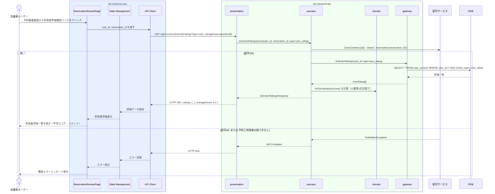

# 利用者の評価を確認する

## 概要

会議室オーナーが予約申請した利用者の過去の利用評価を確認するUC。予約審査の判断材料として、利用者の評価スコア・コメントを閲覧し、使用許諾判断の前提情報を得る。

## データフロー

```mermaid
graph LR
  subgraph FE["tier-frontend-user"]
    subgraph FE_V["view"]
      UserRatingPage
    end
    subgraph FE_S["state"]
      UserRatingState
    end
    subgraph FE_A["api-client"]
      GetUserRatingsRequest
    end
  end
  subgraph BE["tier-backend-api"]
    subgraph BE_P["presentation"]
      GetUserRatingsRequestDTO
    end
    subgraph BE_U["usecase"]
      GetUserRatingsQuery
    end
    subgraph BE_D["domain"]
      UserRating
    end
    subgraph BE_G["gateway"]
      UserRatingRecord
    end
  end
  subgraph DB["tier-datastore-rdb"]
    user_reviews[("user_reviews")]
  end

  UserRatingPage --> UserRatingState --> GetUserRatingsRequest
  GetUserRatingsRequest -->|"GET /api/v1/users/{userId}/ratings"| GetUserRatingsRequestDTO
  GetUserRatingsRequestDTO --> GetUserRatingsQuery
  GetUserRatingsQuery --> UserRating
  UserRating --> UserRatingRecord
  UserRatingRecord -->|"SELECT review_type=user_rating"| user_reviews
  user_reviews --> UserRatingRecord
  UserRatingRecord --> UserRating
  UserRating --> GetUserRatingsQuery --> GetUserRatingsRequestDTO
  GetUserRatingsRequestDTO -->|"HTTP 200"| GetUserRatingsRequest
  GetUserRatingsRequest --> UserRatingState --> UserRatingPage
```



| レイヤー | データモデル | 変換内容 |
|---------|------------|---------|
| FE view | UserRatingPage | 利用者評価一覧・平均スコア表示 |
| FE state | UserRatingState | 評価データ・平均スコア状態管理 |
| FE api-client | GetUserRatingsRequest | クエリパラメータ組み立て（type=user_rating） |
| BE presentation | GetUserRatingsRequestDTO | バリデーション + Query 変換 |
| BE usecase | GetUserRatingsQuery | 認可チェック(owner→reservation) → 利用者評価取得・平均スコア計算 |
| BE domain | UserRating | 評価スコア・コメントの値オブジェクト |
| BE gateway | UserRatingRecord | Entity → DB カラム形式の DTO |
| DB | user_reviews | SELECT WHERE user_id=? AND review_type='user_rating' |

## 処理フロー



## バリエーション一覧

| バリエーション名 | 値 | 処理内容 | 適用 tier | 適用箇所 |
|----------------|---|---------|----------|---------|
| 評価種別 | 利用者評価 | 評価種別=利用者評価でフィルタリングして一覧表示 | tier-backend-api | GET /api/v1/users/{userId}/ratings |
| 評価種別 | 会議室評価、オーナー評価 | 本UCでは表示対象外（予約審査画面への遷移で参照） | tier-frontend-user | 利用者評価確認画面 |

## 分岐条件一覧

| 条件名 | 判定ルール | 適用 tier | 適用箇所 | BDD Scenario |
|--------|----------|----------|---------|-------------|
| 使用許諾条件 | 利用者の評価スコアおよびコメントを確認し、過去の悪質利用履歴があれば予約審査で拒否判断の参考とする | tier-backend-api | GET /api/v1/users/{userId}/ratings | 利用者評価を確認して予約審査に進む |
| 評価種別: 利用者評価 | 評価対象が「利用者評価」のレコードのみ抽出する（会議室評価・オーナー評価は除外） | tier-backend-api | GET /api/v1/users/{userId}/ratings?type=user_rating | 利用者評価一覧が正しく絞り込まれる |

## 計算ルール一覧

| 計算名 | 入力情報 | 計算式/ロジック | 出力情報 | 適用 tier |
|--------|---------|---------------|---------|----------|
| 利用者平均評価スコア | 利用者評価.評価スコア（複数件） | 評価スコアの算術平均（小数第1位切捨て） | 利用者平均スコア | tier-backend-api |

## 状態遷移一覧

| 状態モデル | 遷移元 | 遷移先 | トリガー | 事前条件 | 事後処理 | 適用 tier |
|-----------|--------|--------|---------|---------|---------|----------|
| 予約 | 申請 | - | 利用者評価確認（遷移なし。審査判断の前段情報収集） | 予約が申請状態であること | オーナーが評価内容を確認後、予約審査UCに遷移 | tier-frontend-user |

## 関連 RDRA モデル

| モデル種別 | 要素名 | 関連 |
|-----------|--------|------|
| 業務 | 会議室貸出業務 | このUCが属する業務 |
| BUC | 会議室貸出管理フロー | このUCを含むBUC |
| アクター | 会議室オーナー | 操作するアクター |
| 情報 | 利用者評価 | 参照する情報 |
| 状態 | 予約（申請） | 関連する状態（予約審査前に参照） |
| 条件 | 使用許諾条件 | 評価スコアを使用許諾判断に適用 |
| バリエーション | 評価種別（利用者評価） | 評価対象の区分 |

## E2E 完了条件（BDD）

### 正常系

```gherkin
Feature: 利用者の評価を確認する

  Scenario: 予約申請した利用者「田中太郎」の評価を確認する
    Given 会議室オーナー「山田花子」がログイン済みで、利用者「田中太郎」から予約申請（予約ID: R-001）が届いている
    When オーナーが予約審査画面の「利用者評価を確認」ボタンをクリックする
    Then 利用者「田中太郎」の利用者評価一覧（評価スコア: 4.5、コメント: 「清潔に利用してくれた」等）と平均スコアが表示される

  Scenario: 評価履歴がない利用者「新田一郎」の場合に適切なメッセージを表示する
    Given 会議室オーナー「山田花子」がログイン済みで、利用者「新田一郎」から予約申請（予約ID: R-002）が届いている
    When オーナーが予約審査画面の「利用者評価を確認」ボタンをクリックする
    Then 「評価履歴なし（初回利用者）」のメッセージが表示される
```

### 異常系

```gherkin
  Scenario: 別のオーナーの予約に紐づく利用者評価を参照しようとした場合
    Given 会議室オーナー「山田花子」がログイン済みで、自分と無関係な予約ID「R-999」のURLに直接アクセスする
    When GET /api/v1/users/user-123/ratings?reservationId=R-999 リクエストを送信する
    Then 403 Forbidden が返され、「アクセス権限がありません」エラーが表示される
```

## ティア別仕様

- [利用者・オーナー向けフロントエンド](tier-frontend-user.md)
- [バックエンド API](tier-backend-api.md)

### 統合 API Spec

- [OpenAPI Spec](../../_cross-cutting/api/openapi.yaml)（全 UC 統合、Contract First 開発用）
