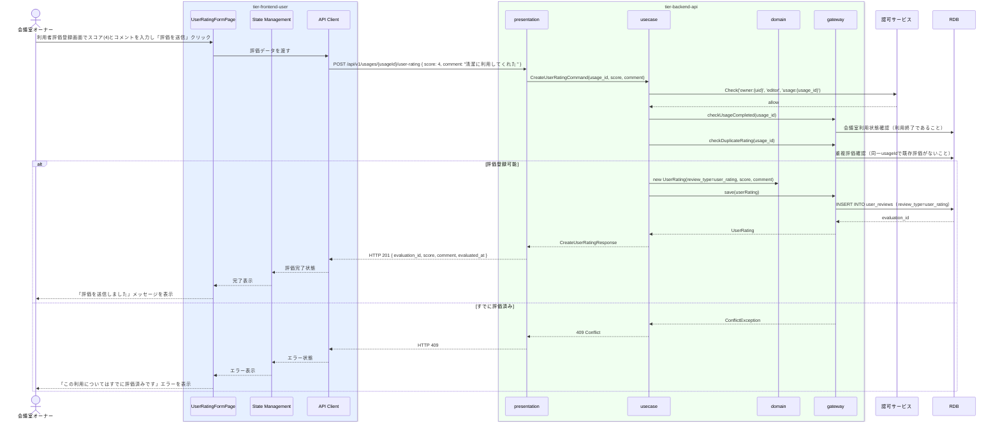

# 利用者を評価する

## 概要

会議室オーナーが利用終了後に利用者の利用マナーなどを評価登録するUC。評価スコア（1-5）とコメントを登録し、次回以降の使用許諾判断の参考情報として利用者評価データを蓄積する。

## データフロー

```mermaid
graph LR
  subgraph FE["tier-frontend-user"]
    subgraph FE_V["view"]
      UserRatingFormPage
    end
    subgraph FE_S["state"]
      UserRatingFormState
    end
    subgraph FE_A["api-client"]
      CreateUserRatingRequest
    end
  end
  subgraph BE["tier-backend-api"]
    subgraph BE_P["presentation"]
      CreateUserRatingRequestDTO
    end
    subgraph BE_U["usecase"]
      CreateUserRatingCommand
    end
    subgraph BE_D["domain"]
      UserRatingEntity
    end
    subgraph BE_G["gateway"]
      UserRatingRecord
    end
  end
  subgraph DB["tier-datastore-rdb"]
    user_reviews[("user_reviews")]
  end

  UserRatingFormPage --> UserRatingFormState --> CreateUserRatingRequest
  CreateUserRatingRequest -->|"POST /api/v1/usages/{id}/user-rating"| CreateUserRatingRequestDTO
  CreateUserRatingRequestDTO --> CreateUserRatingCommand
  CreateUserRatingCommand --> UserRatingEntity
  UserRatingEntity --> UserRatingRecord
  UserRatingRecord -->|"INSERT review_type=user_rating"| user_reviews
  user_reviews --> UserRatingRecord
  UserRatingRecord --> UserRatingEntity
  UserRatingEntity --> CreateUserRatingCommand --> CreateUserRatingRequestDTO
  CreateUserRatingRequestDTO -->|"HTTP 201"| CreateUserRatingRequest
  CreateUserRatingRequest --> UserRatingFormState --> UserRatingFormPage
```



| レイヤー | データモデル | 変換内容 |
|---------|------------|---------|
| FE view | UserRatingFormPage | スコア・コメント入力UI |
| FE state | UserRatingFormState | 評価入力・送信状態管理 |
| FE api-client | CreateUserRatingRequest | camelCase → snake_case 変換 |
| BE presentation | CreateUserRatingRequestDTO | バリデーション + Command 変換 |
| BE usecase | CreateUserRatingCommand | 認可チェック(owner→usage) → 利用終了状態確認 → 重複チェック → UserRating 生成 |
| BE domain | UserRatingEntity | review_type=user_rating でレコード生成 |
| BE gateway | UserRatingRecord | Entity → DB カラム形式の DTO |
| DB | user_reviews | INSERT review_type=user_rating |

## 処理フロー



## バリエーション一覧

| バリエーション名 | 値 | 処理内容 | 適用 tier | 適用箇所 |
|----------------|---|---------|----------|---------|
| 評価種別 | 利用者評価 | 評価種別=利用者評価でレコード登録 | tier-backend-api | POST /api/v1/usages/{id}/user-rating |

## 分岐条件一覧

| 条件名 | 判定ルール | 適用 tier | 適用箇所 | BDD Scenario |
|--------|----------|----------|---------|-------------|
| 評価登録可否 | 会議室利用状態が「利用終了」であること、かつ同一予約に対して未評価（重複登録防止）であることを確認してから評価を登録する | tier-backend-api | POST /api/v1/usages/{id}/user-rating | 利用者評価が正常に登録される |

## 計算ルール一覧

| 計算名 | 入力情報 | 計算式/ロジック | 出力情報 | 適用 tier |
|--------|---------|---------------|---------|----------|
| 利用者累積平均スコア更新 | 利用者評価.評価スコア（既存件数 + 新規1件） | (既存合計スコア + 新規スコア) / (既存件数 + 1)（小数第1位切捨て） | 利用者の最新平均スコア | tier-backend-api |

## 状態遷移一覧

| 状態モデル | 遷移元 | 遷移先 | トリガー | 事前条件 | 事後処理 | 適用 tier |
|-----------|--------|--------|---------|---------|---------|----------|
| 会議室利用 | 利用終了 | - | 利用者評価登録（状態遷移なし。利用終了後に評価登録） | 会議室利用状態が「利用終了」 | 利用者評価レコードを作成 | tier-backend-api |

## 関連 RDRA モデル

| モデル種別 | 要素名 | 関連 |
|-----------|--------|------|
| 業務 | 会議室貸出業務 | このUCが属する業務 |
| BUC | 会議室貸出管理フロー | このUCを含むBUC |
| アクター | 会議室オーナー | 操作するアクター |
| 情報 | 利用者評価 | 登録する情報 |
| 状態 | 会議室利用（利用終了） | 評価登録の前提状態 |
| バリエーション | 評価種別（利用者評価） | 評価の区分 |

## E2E 完了条件（BDD）

### 正常系

```gherkin
Feature: 利用者を評価する

  Scenario: オーナー「山田花子」が利用者「田中太郎」にスコア4の評価を登録する
    Given 会議室オーナー「山田花子」がログイン済みで、会議室利用ID「U-001」（利用者: 田中太郎、状態: 利用終了）が存在し未評価である
    When オーナーが利用者評価登録画面でスコア「4」、コメント「清潔に利用してくれました。また貸し出したいです」を入力し「評価を送信」ボタンをクリックする
    Then 利用者評価レコードが作成され、「評価を送信しました」メッセージが表示される
```

### 異常系

```gherkin
  Scenario: 同一利用に対して重複して評価を登録しようとする
    Given 会議室オーナー「山田花子」がログイン済みで、会議室利用ID「U-001」に対してすでに評価登録済みである
    When POST /api/v1/usages/U-001/user-rating { score: 3, comment: "普通でした" } をリクエストする
    Then 409 Conflict が返され、「この利用についてはすでに評価済みです」エラーが表示される
```

## ティア別仕様

- [利用者・オーナー向けフロントエンド](tier-frontend-user.md)
- [バックエンド API](tier-backend-api.md)

### 統合 API Spec

- [OpenAPI Spec](../../_cross-cutting/api/openapi.yaml)（全 UC 統合、Contract First 開発用）
