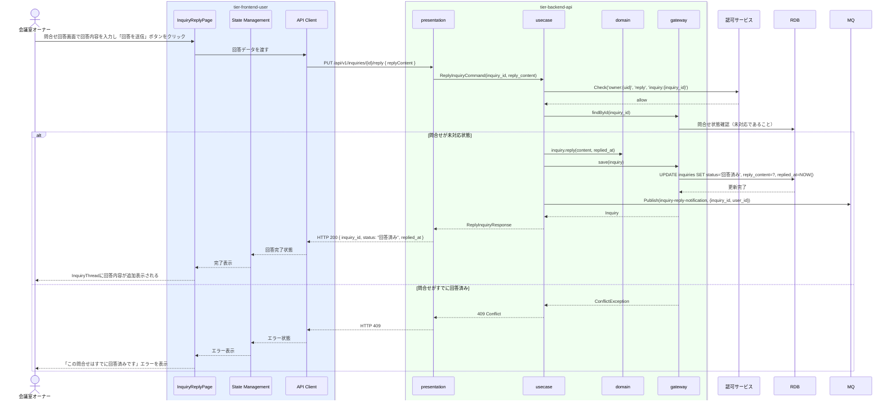

# 問合せに回答する

## 概要

会議室オーナーが利用者からの問合せに回答するUC。問合せ状態を「未対応」→「回答済み」に遷移させ、回答内容を記録する。

## データフロー

```mermaid
graph LR
  subgraph FE["tier-frontend-user"]
    subgraph FE_V["view"]
      InquiryReplyPage
    end
    subgraph FE_S["state"]
      ReplyState
    end
    subgraph FE_A["api-client"]
      ReplyInquiryRequest
    end
  end
  subgraph BE["tier-backend-api"]
    subgraph BE_P["presentation"]
      ReplyInquiryRequestDTO
    end
    subgraph BE_U["usecase"]
      ReplyInquiryCommand
    end
    subgraph BE_D["domain"]
      Inquiry
    end
    subgraph BE_G["gateway"]
      InquiryRecord
    end
  end
  subgraph DB["tier-datastore-rdb"]
    inquiries[("inquiries")]
  end

  InquiryReplyPage --> ReplyState --> ReplyInquiryRequest
  ReplyInquiryRequest -->|"PUT /api/v1/inquiries/{id}/reply"| ReplyInquiryRequestDTO
  ReplyInquiryRequestDTO --> ReplyInquiryCommand
  ReplyInquiryCommand --> Inquiry
  Inquiry --> InquiryRecord
  InquiryRecord -->|"UPDATE status=回答済み"| inquiries
  inquiries --> InquiryRecord
  InquiryRecord --> Inquiry
  Inquiry --> ReplyInquiryCommand --> ReplyInquiryRequestDTO
  ReplyInquiryRequestDTO -->|"HTTP 200"| ReplyInquiryRequest
  ReplyInquiryRequest --> ReplyState --> InquiryReplyPage
```



| レイヤー | データモデル | 変換内容 |
|---------|------------|---------|
| FE view | InquiryReplyPage | 回答内容入力 → State へ dispatch |
| FE state | ReplyState | 回答内容・送信状態管理 |
| FE api-client | ReplyInquiryRequest | camelCase → snake_case 変換 |
| BE presentation | ReplyInquiryRequestDTO | バリデーション + Command 変換 |
| BE usecase | ReplyInquiryCommand | 認可チェック(owner→inquiry) → 未対応状態確認 → 状態遷移 → MQ publish |
| BE domain | Inquiry | 状態遷移: 未対応 → 回答済み |
| BE gateway | InquiryRecord | Entity → DB カラム形式の DTO |
| DB | inquiries | UPDATE status=回答済み, reply_content, replied_at |

## 処理フロー



## バリエーション一覧

| バリエーション名 | 値 | 処理内容 | 適用 tier | 適用箇所 |
|----------------|---|---------|----------|---------|
| 問合せ種別 | オーナー宛問合せ | オーナーが回答する（本UC対象） | tier-frontend-user | 問合せ回答画面 |
| 問合せ種別 | サービス運営宛問合せ | サービス運営担当者が対応する（問合せに対応するUC対象） | - | - |

## 分岐条件一覧

| 条件名 | 判定ルール | 適用 tier | 適用箇所 | BDD Scenario |
|--------|----------|----------|---------|-------------|
| 回答可否 | 問合せ状態が「未対応」であることを確認してから回答処理を実行する。「回答済み」または「対応済み」の問合せへの重複回答は拒否する | tier-backend-api | PUT /api/v1/inquiries/{id}/reply | 問合せに回答すると回答済みに遷移する |

## 計算ルール一覧

| 計算名 | 入力情報 | 計算式/ロジック | 出力情報 | 適用 tier |
|--------|---------|---------------|---------|----------|
| 回答日時の記録 | システム現在日時 | サーバータイムスタンプをそのまま記録 | 問合せ.回答日時 | tier-backend-api |

## 状態遷移一覧

| 状態モデル | 遷移元 | 遷移先 | トリガー | 事前条件 | 事後処理 | 適用 tier |
|-----------|--------|--------|---------|---------|---------|----------|
| 問合せ | 未対応 | 回答済み | オーナーが回答送信ボタンをクリック | 問合せ状態が「未対応」であること | 利用者に回答通知（非同期） | tier-backend-api |

## 関連 RDRA モデル

| モデル種別 | 要素名 | 関連 |
|-----------|--------|------|
| 業務 | 会議室貸出業務 | このUCが属する業務 |
| BUC | 会議室貸出管理フロー | このUCを含むBUC |
| アクター | 会議室オーナー | 操作するアクター |
| 情報 | 問合せ | 回答対象の情報 |
| 状態 | 問合せ（未対応 → 回答済み） | 回答後の状態遷移 |

## E2E 完了条件（BDD）

### 正常系

```gherkin
Feature: 問合せに回答する

  Scenario: オーナー「山田花子」が利用者「田中太郎」の問合せに回答する
    Given 会議室オーナー「山田花子」がログイン済みで、問合せID「I-001」（利用者: 田中太郎、内容: 「駐車場はありますか？」、状態: 未対応）が存在する
    When オーナーが問合せ回答画面で回答内容「会議室から徒歩2分のところにコインパーキングがあります（◯◯パーキング）」を入力し「回答を送信」ボタンをクリックする
    Then 問合せI-001の状態が「回答済み」に更新され、InquiryThreadに回答内容が追加表示される
```

### 異常系

```gherkin
  Scenario: すでに回答済みの問合せに重複回答しようとする
    Given 会議室オーナー「山田花子」がログイン済みで、問合せID「I-001」がすでに「回答済み」状態である
    When PUT /api/v1/inquiries/I-001/reply { replyContent: "再回答です" } をリクエストする
    Then 409 Conflict が返され、「この問合せはすでに回答済みです」エラーが表示される
```

## ティア別仕様

- [利用者・オーナー向けフロントエンド](tier-frontend-user.md)
- [バックエンド API](tier-backend-api.md)

### 統合 API Spec

- [OpenAPI Spec](../../_cross-cutting/api/openapi.yaml)（全 UC 統合、Contract First 開発用）
- [AsyncAPI Spec](../../_cross-cutting/api/asyncapi.yaml)（inquiry-reply-notification イベント）
