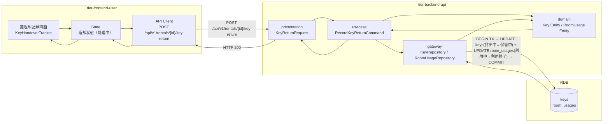
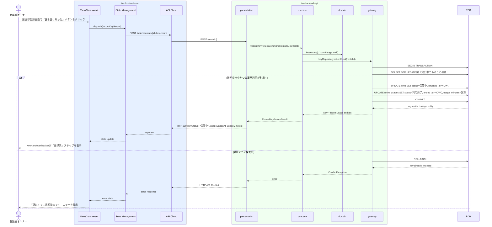

# 鍵の返却を記録する

## 概要

会議室オーナーが利用者から鍵の返却を受け、鍵の状態を「貸出中」→「保管中」に遷移させ、会議室利用を「利用中」→「利用終了」状態にするUC。会議室利用ポリシーに基づき、鍵の返却をトリガーとして物理会議室の利用終了を制御する。

## データフロー



| レイヤー | モデル/型名 | 主要フィールド | 変換内容 |
|---------|-----------|-------------|---------|
| View/Component | KeyHandoverTracker | rentalId, keyStatus | 鍵返却進捗表示UI |
| State Management | KeyReturnState | rentalId, keyStatus, isSubmitting | 返却状態管理 |
| API Client | KeyReturnRequest | rentalId(path) | REST POST |
| presentation | KeyReturnRequest | rentalId, ownerId | パスパラメータ + 認証情報 |
| usecase | RecordKeyReturnCommand | rentalId, ownerId | ドメインコマンド |
| domain | Key | id, status(貸出中→保管中), returnedAt | 鍵エンティティ状態遷移 |
| domain | RoomUsage | id, status(利用中→利用終了), endedAt, usageMinutes | 利用時間計算付きエンティティ |
| gateway | KeyRepository + RoomUsageRepository | SELECT FOR UPDATE + UPDATE keys + UPDATE room_usages | トランザクション更新 |

## 処理フロー



## バリエーション一覧

| バリエーション名 | 値 | 処理内容 | 適用 tier | 適用箇所 |
|----------------|---|---------|----------|---------|
| 会議室種別 | 物理 | 鍵返却操作を許可する | tier-backend-api | POST /api/v1/rentals/{id}/key-return |
| 会議室種別 | バーチャル | 鍵返却操作を拒否（バーチャルはタイマー自動遷移のため） | tier-backend-api | POST /api/v1/rentals/{id}/key-return |

## 分岐条件一覧

| 条件名 | 判定ルール | 適用 tier | 適用箇所 | BDD Scenario |
|--------|----------|----------|---------|-------------|
| 会議室利用ポリシー | 鍵の状態が「貸出中」であること、かつ会議室利用状態が「利用中」であることを確認してから返却処理を実行する | tier-backend-api | POST /api/v1/rentals/{id}/key-return | 鍵返却後に利用終了状態になる |
| 会議室利用ポリシー | バーチャル会議室の予約に対して鍵返却操作を試みた場合はエラーを返す | tier-backend-api | POST /api/v1/rentals/{id}/key-return | バーチャル会議室への鍵返却は不可 |

## 計算ルール一覧

| 計算名 | 入力情報 | 計算式/ロジック | 出力情報 | 適用 tier |
|--------|---------|---------------|---------|----------|
| 返却日時の記録 | システム現在日時 | 操作実行時のサーバータイムスタンプをそのまま記録 | 鍵.返却日時、会議室利用.利用終了日時 | tier-backend-api |
| 実際の利用時間 | 会議室利用.利用開始日時、会議室利用.利用終了日時 | 利用終了日時 - 利用開始日時（分単位、小数点以下切り捨て） | 利用時間（分） | tier-backend-api |

## 状態遷移一覧

| 状態モデル | 遷移元 | 遷移先 | トリガー | 事前条件 | 事後処理 | 適用 tier |
|-----------|--------|--------|---------|---------|---------|----------|
| 鍵 | 貸出中 | 保管中 | オーナーが鍵返却記録ボタンをクリック | 鍵状態が「貸出中」 | 返却日時を記録 | tier-backend-api |
| 会議室利用 | 利用中 | 利用終了 | 鍵返却記録と同時 | 会議室利用状態が「利用中」 | 利用終了日時・実利用時間を記録 | tier-backend-api |

## 関連 RDRA モデル

| モデル種別 | 要素名 | 関連 |
|-----------|--------|------|
| 業務 | 会議室貸出業務 | このUCが属する業務 |
| BUC | 会議室貸出管理フロー | このUCを含むBUC |
| アクター | 会議室オーナー | 操作するアクター |
| 情報 | 鍵 | 返却対象の情報 |
| 情報 | 会議室利用 | 利用終了状態に遷移させる情報 |
| 状態 | 鍵（貸出中 → 保管中） | 鍵の状態遷移 |
| 状態 | 会議室利用（利用中 → 利用終了） | 会議室利用状態の遷移 |
| 条件 | 会議室利用ポリシー | 鍵返却で利用終了を定義 |

## E2E 完了条件（BDD）

### 正常系

```gherkin
Feature: 鍵の返却を記録する

  Scenario: オーナー「山田花子」が利用者「田中太郎」から会議室001の鍵を返却される
    Given 会議室オーナー「山田花子」がログイン済みで、予約ID「R-001」（物理会議室: 渋谷会議室001、貸出開始: 10:00）の鍵が「貸出中」状態である
    When オーナーが鍵返却記録画面で「鍵を受け取った」ボタンをクリックする
    Then 鍵の状態が「保管中」に更新され、会議室利用が「利用終了」状態になり、返却日時「2026-03-29 12:00」と実利用時間「120分」が記録される
```

### 異常系

```gherkin
  Scenario: バーチャル会議室の予約に対して鍵返却を試みる
    Given 会議室オーナー「山田花子」がログイン済みで、予約ID「R-010」がバーチャル会議室の予約である
    When POST /api/v1/rentals/R-010/key-return をリクエストする
    Then 400 Bad Request が返され、「バーチャル会議室は鍵返却が不要です」エラーが表示される
```

## ティア別仕様

- [利用者・オーナー向けフロントエンド](tier-frontend-user.md)
- [バックエンド API](tier-backend-api.md)

### 統合 API Spec

- [OpenAPI Spec](../../_cross-cutting/api/openapi.yaml)（全 UC 統合、Contract First 開発用）
