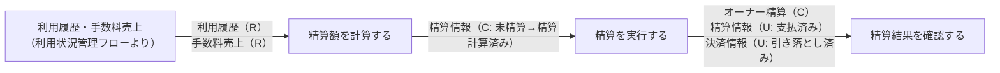
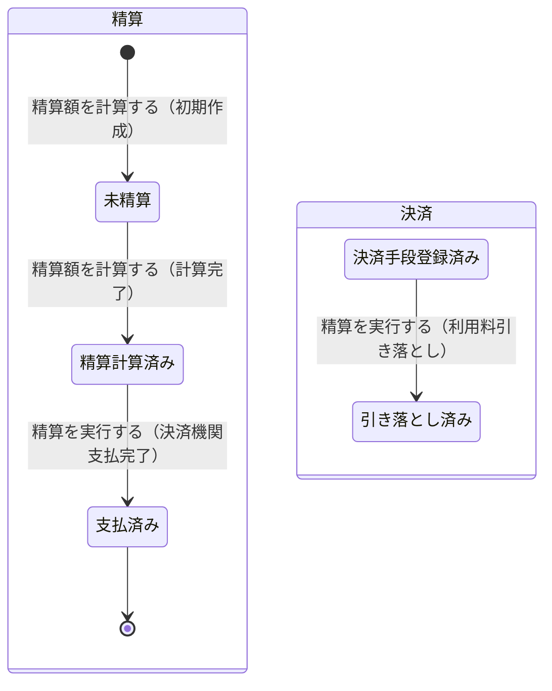

# オーナー精算フロー

## 概要

サービス運営担当者が月末に会議室別の利用履歴から手数料を差し引いたオーナーへの精算額を計算し、決済機関を通じて支払うフロー。精算額計算→精算実行→精算結果確認の順に処理が進み、精算ルールおよび支払精算ポリシーに基づく。

## 所属 UC 一覧

| UC名 | アクター | 主な操作 | 関連情報 |
|------|---------|---------|---------|
| [精算額を計算する](精算額を計算する/spec.md) | サービス運営担当者 | 月末に会議室別の利用履歴から手数料を差し引いた精算額を計算する | 精算情報, 利用履歴, 手数料売上 |
| [精算を実行する](精算を実行する/spec.md) | サービス運営担当者 | 決済機関を通じてオーナーへ精算額を支払う | オーナー精算, 精算情報 |
| [精算結果を確認する](精算結果を確認する/spec.md) | 会議室オーナー | 精算額や支払状況を確認する | オーナー精算, 精算情報 |

## UC 横断データフロー

BUC 内の UC 間で情報がどう流れるかを示す。

### データフロー図

### 情報 CRUD マトリクス

| 情報名 | 精算額を計算する | 精算を実行する | 精算結果を確認する |
|--------|:-------:|:-------:|:-------:|
| 精算情報 | C | R/U | R |
| 利用履歴 | R | | |
| 手数料売上 | R | R | |
| オーナー精算 | | C | R |
| 決済情報 | | R/U | |

## 状態遷移全体図

精算情報と決済の全遷移パスと担当 UC を示す。

### 状態遷移 UC マッピング

| 状態モデル | 遷移元 | 遷移先 | 担当 UC |
|-----------|--------|--------|--------|
| 精算 | （初期） | 未精算 | [精算額を計算する](精算額を計算する/spec.md) |
| 精算 | 未精算 | 精算計算済み | [精算額を計算する](精算額を計算する/spec.md) |
| 精算 | 精算計算済み | 支払済み | [精算を実行する](精算を実行する/spec.md) |
| 決済 | 決済手段登録済み | 引き落とし済み | [精算を実行する](精算を実行する/spec.md) |

## BUC 内共有条件一覧

| 条件名 | 条件の説明 | 適用 UC |
|--------|----------|--------|
| 精算ルール | 会議室利用料からサービス手数料を差し引いた金額をオーナーへ支払うルール。月末締めで精算額を計算する | 精算額を計算する, 精算を実行する |
| 支払精算ポリシー | 予約時に決済手段を登録し、利用後にサービス運営者が利用料を引き落とし、月末にオーナーへ支払うという一連の支払フローを定めるルール | 精算額を計算する, 精算を実行する |

## BUC 内共有バリエーション一覧

| バリエーション名 | 値 | 適用 UC |
|----------------|---|--------|
| 売上分析区分 | 会議室別, 貸出別, 月別, オーナー別 | 精算額を計算する |
| 支払精算ポリシー（決済方法） | クレジットカード, 電子マネー | 精算を実行する |
