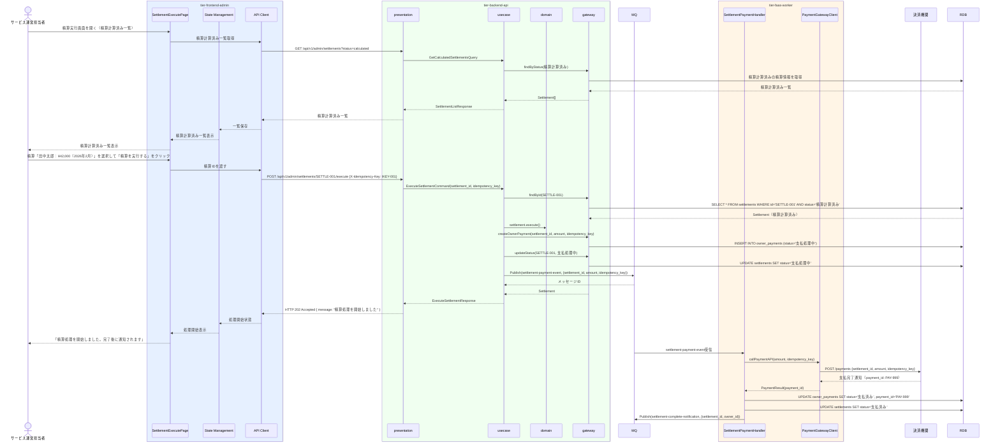

# 精算を実行する

## 概要

サービス運営担当者が決済機関を通じてオーナーへ精算額を支払う。「精算計算済み」の精算情報に対して精算実行を指示し、決済機関との連携（外部システム）を経て精算状態を「支払済み」に遷移させる。冪等性保証と二重支払防止が重要な要件。

## データフロー

```mermaid
graph LR
  subgraph FE["tier-frontend-admin"]
    subgraph FE_V["view"]
      SettlementExecutePage
    end
    subgraph FE_S["state"]
      SettlementExecuteState
    end
    subgraph FE_A["api-client"]
      ExecuteSettlementRequest
    end
  end
  subgraph BE["tier-backend-api"]
    subgraph BE_P["presentation"]
      ExecuteSettlementRequestDTO
    end
    subgraph BE_U["usecase"]
      ExecuteSettlementCommand
    end
    subgraph BE_D["domain"]
      Settlement
    end
    subgraph BE_G["gateway"]
      SettlementRecord
    end
  end
  subgraph FAAS["tier-faas-worker"]
    subgraph FAAS_H["handler"]
      SettlementPaymentHandler
    end
    subgraph FAAS_G["gateway"]
      PaymentGatewayClient
    end
  end
  subgraph EXT["external-payment-gateway"]
    payment_api[/"決済機関 Payment API"/]
  end
  subgraph DB["tier-datastore-rdb"]
    settlements[("settlements")]
    owner_payments[("owner_payments")]
  end

  SettlementExecutePage --> SettlementExecuteState --> ExecuteSettlementRequest
  ExecuteSettlementRequest -->|"POST /api/v1/admin/settlements/{id}/execute"| ExecuteSettlementRequestDTO
  ExecuteSettlementRequestDTO --> ExecuteSettlementCommand
  ExecuteSettlementCommand --> Settlement
  Settlement --> SettlementRecord
  SettlementRecord -->|"SELECT WHERE id=? AND status=精算計算済み"| settlements
  SettlementRecord -->|"INSERT status=支払処理中"| owner_payments
  SettlementRecord -->|"UPDATE SET status=支払処理中"| settlements
  settlements --> SettlementRecord
  owner_payments --> SettlementRecord
  SettlementRecord --> Settlement
  Settlement --> ExecuteSettlementCommand --> ExecuteSettlementRequestDTO
  ExecuteSettlementRequestDTO -->|"HTTP 202 Accepted"| ExecuteSettlementRequest
  ExecuteSettlementRequest --> SettlementExecuteState --> SettlementExecutePage
  ExecuteSettlementCommand -->|"Publish settlement-payment-event"| SettlementPaymentHandler
  SettlementPaymentHandler --> PaymentGatewayClient
  PaymentGatewayClient -->|"POST /payments"| payment_api
  payment_api -->|"支払完了通知"| PaymentGatewayClient
  PaymentGatewayClient -->|"UPDATE SET status=支払済み"| settlements
  PaymentGatewayClient -->|"UPDATE SET status=支払済み, payment_id"| owner_payments
```



| レイヤー | データモデル | 変換内容 |
|---------|------------|---------|
| FE view | SettlementExecutePage | 精算計算済み一覧・精算実行ボタンUI（MFA認証後） |
| FE state | SettlementExecuteState | 精算計算済み一覧・実行指示状態管理 |
| FE api-client | ExecuteSettlementRequest | 精算ID + 冪等キー → POST リクエスト |
| BE presentation | ExecuteSettlementRequestDTO | バリデーション + Command 変換 |
| BE usecase | ExecuteSettlementCommand | 精算計算済み確認 → owner_payments 作成 → 状態遷移 → MQ publish |
| BE domain | Settlement | 精算エンティティ（状態: 精算計算済み→支払処理中） |
| BE gateway | SettlementRecord | Entity → DB カラム形式の DTO |
| FaaS handler | SettlementPaymentHandler | MQ イベント受信 → 決済機関API呼び出し → DB更新 |
| FaaS gateway | PaymentGatewayClient | 外部決済機関 API 連携 |
| DB | settlements | UPDATE SET status=支払処理中/支払済み |
| DB | owner_payments | INSERT/UPDATE 支払処理開始・完了記録 |

## 処理フロー



## バリエーション一覧

| バリエーション名 | 値 | 処理内容 | 適用 tier | 適用箇所 |
|----------------|---|---------|----------|---------|
| 支払精算ポリシー（決済方法） | クレジットカード | 決済機関にカード払い処理要求を送信 | tier-faas-worker | 精算支払連携イベント処理 |
| 支払精算ポリシー（決済方法） | 電子マネー | 決済機関に電子マネー払い処理要求を送信 | tier-faas-worker | 精算支払連携イベント処理 |

## 分岐条件一覧

| 条件名 | 判定ルール | 適用 tier | 適用箇所 | BDD Scenario |
|--------|----------|----------|---------|-------------|
| 支払精算ポリシー | 精算状態が「精算計算済み」のもののみ精算実行が可能 | tier-backend-api | POST /api/v1/admin/settlements/{id}/execute | 正常系: 精算計算済みの精算を実行する |
| 冪等性チェック | 同一冪等キーで既に精算実行済みの場合は前回の結果を返す | tier-backend-api, tier-faas-worker | POST /api/v1/admin/settlements/{id}/execute | 正常系: 二重実行を防止する |
| 決済機関応答 | 決済機関からの支払完了通知受信時のみ精算を「支払済み」に遷移 | tier-faas-worker | settlement-payment-event 処理 | 正常系: 決済機関から支払完了を受信する |

## 計算ルール一覧

| 計算名 | 入力情報 | 計算式/ロジック | 出力情報 | 適用 tier |
|--------|---------|---------------|---------|----------|
| 支払金額確定 | 精算情報.精算額 | 精算額をそのまま支払金額とする | owner_payments.支払金額 | tier-backend-api |
| 冪等キー生成 | UUID | UUID v4 生成 | 決済機関への支払リクエストに付与する冪等キー | tier-backend-api |

## 状態遷移一覧

| 状態モデル | 遷移元 | 遷移先 | トリガー | 事前条件 | 事後処理 | 適用 tier |
|-----------|--------|--------|---------|---------|---------|----------|
| 精算 | 精算計算済み | 支払処理中 | 精算を実行する（管理者が実行ボタンクリック） | 精算状態が「精算計算済み」であること | MQ に精算支払連携イベントを発行 | tier-backend-api |
| 精算 | 支払処理中 | 支払済み | 決済機関から支払完了通知受信 | FaaS が決済機関 API 呼び出し完了 | オーナーに精算完了通知メール送信 | tier-faas-worker |
| 決済 | 決済手段登録済み | 引き落とし済み | 精算を実行する（利用料の引き落とし） | 精算実行時に利用者からの引き落とし処理 | 引き落とし済みに遷移 | tier-backend-api |

## 関連 RDRA モデル

| モデル種別 | 要素名 | 関連 |
|-----------|--------|------|
| 業務 | 精算業務 | このUCが属する業務 |
| BUC | オーナー精算フロー | このUCを含むBUC |
| アクター | サービス運営担当者 | 操作するアクター（社内） |
| 情報 | オーナー精算 | 作成する情報（精算実行ID、精算ID、決済機関連携ID、支払金額、支払日、支払状態） |
| 情報 | 精算情報 | 参照・更新する情報（精算状態: 精算計算済み→支払済み） |
| 状態 | 精算 | 精算計算済み→支払済みへの遷移 |
| 状態 | 決済 | 決済手段登録済み→引き落とし済みへの遷移 |
| 条件 | 支払精算ポリシー | 一連の支払フローを定めるルール |
| 外部システム | 決済機関 | 精算支払連携の相手方 |

## E2E 完了条件（BDD）

### 正常系

```gherkin
Feature: 精算を実行する

  Scenario: 精算計算済みの精算を実行して支払済みになる
    Given サービス運営担当者「山田花子」が管理画面にMFAでログイン済みであり、精算「田中太郎：¥42,000（2026年2月）」が「精算計算済み」状態である
    When 精算実行画面で精算「田中太郎：¥42,000」を選択して「精算を実行する」をクリックする
    Then 「精算処理を開始しました」というメッセージが表示され、決済機関への支払処理が非同期で開始される

  Scenario: 決済機関から支払完了通知を受信して支払済みになる
    Given 精算「SETTLE-001」が「支払処理中」状態であり、FaaSワーカーが決済機関に支払リクエストを送信済みである
    When 決済機関から支払完了通知（決済機関連携ID: PAY-999）を受信する
    Then 精算「SETTLE-001」の状態が「支払済み」に遷移し、オーナー「田中太郎」に精算完了メールが送信される
```

### 異常系

```gherkin
  Scenario: 未精算状態の精算に対して精算実行しようとすると400エラーになる
    Given 精算「SETTLE-002」が「未精算」状態である
    When POST /api/v1/admin/settlements/SETTLE-002/execute にリクエストする
    Then HTTPステータス400で「精算計算済み状態の精算のみ実行できます」というエラーが返される

  Scenario: 同一冪等キーで二重実行しても重複支払が発生しない
    Given 精算「SETTLE-001」が「支払処理中」状態であり、X-Idempotency-Key「IKEY-001」で既に実行済みである
    When POST /api/v1/admin/settlements/SETTLE-001/execute に同一X-Idempotency-Key「IKEY-001」で再送する
    Then HTTPステータス202で前回と同じレスポンスが返され、決済機関への二重リクエストは発生しない
```

## ティア別仕様

- [管理者向けフロントエンド仕様](tier-frontend-admin.md)
- [バックエンドAPI仕様](tier-backend-api.md)
- [FaaSワーカー仕様](tier-faas-worker.md)

### 統合 API Spec

- [OpenAPI Spec](../../_cross-cutting/api/openapi.yaml)（全 UC 統合、Contract First 開発用）
- [AsyncAPI Spec](../../_cross-cutting/api/asyncapi.yaml)（全 UC 統合、非同期イベント仕様）
