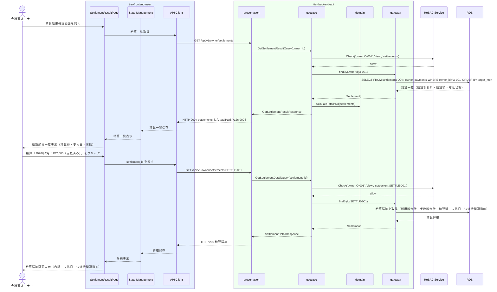

# 精算結果を確認する

## 概要

会議室オーナーが自身への精算額や支払状況を確認する。支払済みの精算履歴と支払明細を参照し、収益状況を把握する。

## データフロー

```mermaid
graph LR
  subgraph FE["tier-frontend-user"]
    subgraph FE_V["view"]
      SettlementResultPage
    end
    subgraph FE_S["state"]
      SettlementResultState
    end
    subgraph FE_A["api-client"]
      GetSettlementResultRequest
    end
  end
  subgraph BE["tier-backend-api"]
    subgraph BE_P["presentation"]
      GetSettlementResultRequestDTO
    end
    subgraph BE_U["usecase"]
      GetSettlementResultQuery
    end
    subgraph BE_D["domain"]
      SettlementResult
    end
    subgraph BE_G["gateway"]
      SettlementRecord
    end
  end
  subgraph DB["tier-datastore-rdb"]
    settlements[("settlements")]
    owner_payments[("owner_payments")]
  end

  SettlementResultPage --> SettlementResultState --> GetSettlementResultRequest
  GetSettlementResultRequest -->|"GET /api/v1/owner/settlements"| GetSettlementResultRequestDTO
  GetSettlementResultRequestDTO --> GetSettlementResultQuery
  GetSettlementResultQuery --> SettlementResult
  SettlementResult --> SettlementRecord
  SettlementRecord -->|"SELECT JOIN owner_payments WHERE owner_id=? ORDER BY target_month DESC"| settlements
  SettlementRecord -->|"SELECT WHERE owner_id=?"| owner_payments
  settlements --> SettlementRecord
  owner_payments --> SettlementRecord
  SettlementRecord --> SettlementResult
  SettlementResult --> GetSettlementResultQuery --> GetSettlementResultRequestDTO
  GetSettlementResultRequestDTO -->|"HTTP 200"| GetSettlementResultRequest
  GetSettlementResultRequest --> SettlementResultState --> SettlementResultPage
```



| レイヤー | データモデル | 変換内容 |
|---------|------------|---------|
| FE view | SettlementResultPage | 精算状態フィルター・精算一覧カード表示 |
| FE state | SettlementResultState | 精算一覧・精算詳細状態管理 |
| FE api-client | GetSettlementResultRequest | クエリパラメータ組み立て → GET リクエスト |
| BE presentation | GetSettlementResultRequestDTO | バリデーション + Query 変換 |
| BE usecase | GetSettlementResultQuery | 認可チェック → 精算情報取得 → 累計受取金額計算 |
| BE domain | SettlementResult | 精算集計値オブジェクト |
| BE gateway | SettlementRecord | Entity → DB カラム形式の DTO |
| DB | settlements | SELECT JOIN owner_payments WHERE owner_id=? ORDER BY target_month DESC |
| DB | owner_payments | SELECT WHERE owner_id=? |

## 処理フロー



## バリエーション一覧

| バリエーション名 | 値 | 処理内容 | 適用 tier | 適用箇所 |
|----------------|---|---------|----------|---------|
| 精算状態フィルター | 支払済み | 支払済みの精算のみ返す | tier-backend-api | GET /api/v1/owner/settlements?status=paid |
| 精算状態フィルター | 精算計算済み | 精算額確定済みだが未払いの精算を返す | tier-backend-api | GET /api/v1/owner/settlements?status=calculated |
| 精算状態フィルター | 支払処理中 | 処理中の精算を返す | tier-backend-api | GET /api/v1/owner/settlements?status=processing |

## 分岐条件一覧

| 条件名 | 判定ルール | 適用 tier | 適用箇所 | BDD Scenario |
|--------|----------|----------|---------|-------------|
| 所有権チェック | 認証中のオーナーIDに紐づく精算情報のみ参照可能（ReBAC: owner→settlement） | tier-backend-api | GET /api/v1/owner/settlements | 正常系: 自身の精算結果を確認する |
| 精算状態フィルター | 精算計算済み/支払処理中/支払済みの状態でフィルタリング | tier-backend-api | GET /api/v1/owner/settlements | 正常系: 支払済みの精算のみ確認する |

## 計算ルール一覧

| 計算名 | 入力情報 | 計算式/ロジック | 出力情報 | 適用 tier |
|--------|---------|---------------|---------|----------|
| 累計受取金額 | owner_payments.支払金額 | SUM(支払金額) WHERE 支払状態='支払済み' | 累計受取金額 | tier-backend-api |

## 状態遷移一覧

| 状態モデル | 遷移元 | 遷移先 | トリガー | 事前条件 | 事後処理 | 適用 tier |
|-----------|--------|--------|---------|---------|---------|----------|
| 精算 | - | 支払済み | 精算を実行する（FaaSワーカーが更新） | 決済機関から支払完了通知受信 | オーナーが精算結果確認可能になる | tier-faas-worker |

## 関連 RDRA モデル

| モデル種別 | 要素名 | 関連 |
|-----------|--------|------|
| 業務 | 精算業務 | このUCが属する業務 |
| BUC | オーナー精算フロー | このUCを含むBUC |
| アクター | 会議室オーナー | 操作するアクター（社外） |
| 情報 | オーナー精算 | 参照する情報（精算実行ID、精算ID、決済機関連携ID、支払金額、支払日、支払状態） |
| 情報 | 精算情報 | 参照する情報（精算ID、精算対象月、利用料合計、手数料合計、精算額、精算状態） |
| 状態 | 精算 | 支払済み状態の確認 |
| 条件 | - | 直接適用される条件なし |
| 外部システム | - | 連携なし |

## E2E 完了条件（BDD）

### 正常系

```gherkin
Feature: 精算結果を確認する

  Scenario: 支払済みの精算結果を確認する
    Given 会議室オーナー「田中太郎」がオーナーポータルにログイン済みであり、2026年2月の精算が「支払済み」状態である
    When 精算結果確認画面を開く
    Then 精算「2026年2月：精算額¥42,000、支払日: 2026-03-05、決済機関連携ID: PAY-999」が一覧に表示される

  Scenario: 精算詳細で利用料と手数料の内訳を確認する
    Given 会議室オーナー「田中太郎」が精算結果一覧画面を開いている
    When 精算「2026年2月」の詳細をクリックする
    Then 「利用料合計: ¥48,000、手数料合計: ¥6,000、精算額: ¥42,000」という内訳が表示される
```

### 異常系

```gherkin
  Scenario: 他のオーナーの精算情報にアクセスすると403になる
    Given 会議室オーナー「田中太郎」（owner_id: O-001）がログイン済みである
    When GET /api/v1/owner/settlements/SETTLE-999（owner_id: O-999の精算）にリクエストする
    Then HTTPステータス403が返される
```

## ティア別仕様

- [利用者・オーナー向けフロントエンド仕様](tier-frontend-user.md)
- [バックエンドAPI仕様](tier-backend-api.md)

### 統合 API Spec

- [OpenAPI Spec](../../_cross-cutting/api/openapi.yaml)（全 UC 統合、Contract First 開発用）
