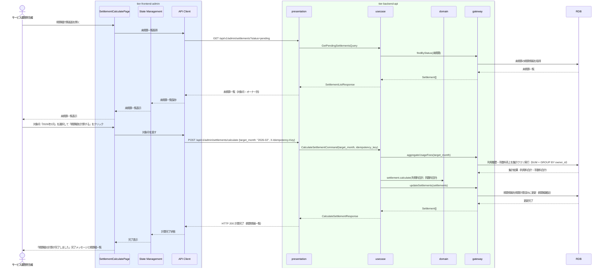

# 精算額を計算する

## 概要

サービス運営担当者が月末に会議室別の利用履歴から手数料を差し引いたオーナーへの精算額を計算する。精算ルールに基づき精算状態を「未精算」から「精算計算済み」に遷移させる。

## データフロー

```mermaid
graph LR
  subgraph FE["tier-frontend-admin"]
    subgraph FE_V["view"]
      SettlementCalculatePage
    end
    subgraph FE_S["state"]
      SettlementCalculateState
    end
    subgraph FE_A["api-client"]
      CalculateSettlementRequest
    end
  end
  subgraph BE["tier-backend-api"]
    subgraph BE_P["presentation"]
      CalculateSettlementRequestDTO
    end
    subgraph BE_U["usecase"]
      CalculateSettlementCommand
    end
    subgraph BE_D["domain"]
      Settlement
    end
    subgraph BE_G["gateway"]
      SettlementRecord
    end
  end
  subgraph DB["tier-datastore-rdb"]
    usages[("usages")]
    fee_sales[("fee_sales")]
    settlements[("settlements")]
  end

  SettlementCalculatePage --> SettlementCalculateState --> CalculateSettlementRequest
  CalculateSettlementRequest -->|"POST /api/v1/admin/settlements/calculate"| CalculateSettlementRequestDTO
  CalculateSettlementRequestDTO --> CalculateSettlementCommand
  CalculateSettlementCommand --> Settlement
  Settlement --> SettlementRecord
  SettlementRecord -->|"SELECT SUM(fee) GROUP BY owner_id WHERE month=?"| usages
  SettlementRecord -->|"SELECT SUM(fee_amount) GROUP BY owner_id WHERE month=?"| fee_sales
  SettlementRecord -->|"UPDATE SET status=精算計算済み, amount=精算額"| settlements
  usages --> SettlementRecord
  fee_sales --> SettlementRecord
  settlements --> SettlementRecord
  SettlementRecord --> Settlement
  Settlement --> CalculateSettlementCommand --> CalculateSettlementRequestDTO
  CalculateSettlementRequestDTO -->|"HTTP 200"| CalculateSettlementRequest
  CalculateSettlementRequest --> SettlementCalculateState --> SettlementCalculatePage
```



| レイヤー | データモデル | 変換内容 |
|---------|------------|---------|
| FE view | SettlementCalculatePage | 対象月選択・精算額計算ボタンUI（MFA認証後） |
| FE state | SettlementCalculateState | 未精算一覧・対象月選択状態管理 |
| FE api-client | CalculateSettlementRequest | 対象月 + 冪等キー → POST リクエスト |
| BE presentation | CalculateSettlementRequestDTO | バリデーション + Command 変換 |
| BE usecase | CalculateSettlementCommand | 精算ルール確認 → 利用料/手数料集計 → 精算額計算 → 状態遷移 |
| BE domain | Settlement | 精算エンティティ（状態: 未精算→精算計算済み） |
| BE gateway | SettlementRecord | Entity → DB カラム形式の DTO |
| DB | usages | SELECT SUM(fee) GROUP BY owner_id WHERE month=? |
| DB | fee_sales | SELECT SUM(fee_amount) GROUP BY owner_id WHERE month=? |
| DB | settlements | UPDATE SET status=精算計算済み, amount=精算額 |

## 処理フロー



## バリエーション一覧

| バリエーション名 | 値 | 処理内容 | 適用 tier | 適用箇所 |
|----------------|---|---------|----------|---------|
| 売上分析区分（精算計算の集計軸） | 会議室別 | 会議室IDでGROUP BY して利用料合計・手数料合計を集計 | tier-backend-api | POST /api/v1/admin/settlements/calculate |
| 売上分析区分（精算計算の集計軸） | オーナー別 | オーナーIDでGROUP BY して精算額を集計 | tier-backend-api | POST /api/v1/admin/settlements/calculate |

## 分岐条件一覧

| 条件名 | 判定ルール | 適用 tier | 適用箇所 | BDD Scenario |
|--------|----------|----------|---------|-------------|
| 精算ルール | 対象月の利用履歴が全件確定済み（会議室利用の利用終了状態）の場合のみ精算計算を実行できる | tier-backend-api | POST /api/v1/admin/settlements/calculate | 正常系: 2026年2月の精算額を計算する |
| 重複計算防止 | 同一対象月で既に「精算計算済み」の精算情報が存在する場合は上書き確認を要求する | tier-backend-api | POST /api/v1/admin/settlements/calculate | 異常系: 計算済みの月を再計算しようとする |

## 計算ルール一覧

| 計算名 | 入力情報 | 計算式/ロジック | 出力情報 | 適用 tier |
|--------|---------|---------------|---------|----------|
| 利用料合計計算 | 利用履歴.利用料金 | SUM(利用料金) WHERE 利用日 IN 精算対象月 GROUP BY オーナーID | 利用料合計 | tier-backend-api |
| 手数料合計計算 | 手数料売上.手数料金額 | SUM(手数料金額) WHERE 計上日 IN 精算対象月 GROUP BY オーナーID | 手数料合計 | tier-backend-api |
| 精算額計算 | 利用料合計、手数料合計 | 利用料合計 - 手数料合計 | 精算額 | tier-backend-api |

## 状態遷移一覧

| 状態モデル | 遷移元 | 遷移先 | トリガー | 事前条件 | 事後処理 | 適用 tier |
|-----------|--------|--------|---------|---------|---------|----------|
| 精算 | 未精算 | 精算計算済み | 精算額を計算する | 対象月の利用履歴が確定済み | 精算額が確定し精算実行UCが利用可能になる | tier-backend-api |
| 精算 | - | 未精算 | 月次バッチが精算情報を初期生成 | 月末到来 | 未精算状態で精算情報が作成される | tier-backend-api |

## 関連 RDRA モデル

| モデル種別 | 要素名 | 関連 |
|-----------|--------|------|
| 業務 | 精算業務 | このUCが属する業務 |
| BUC | オーナー精算フロー | このUCを含むBUC |
| アクター | サービス運営担当者 | 操作するアクター（社内） |
| 情報 | 精算情報 | 作成・更新する情報（精算ID、オーナーID、精算対象月、利用料合計、手数料合計、精算額、精算状態） |
| 情報 | 利用履歴 | 参照する情報（利用料金の集計元） |
| 情報 | 手数料売上 | 参照する情報（手数料金額の集計元） |
| 状態 | 精算 | 未精算→精算計算済みへの遷移 |
| 条件 | 精算ルール | 月末締め精算の計算ルール |

## E2E 完了条件（BDD）

### 正常系

```gherkin
Feature: 精算額を計算する

  Scenario: 2026年2月の精算額を計算する
    Given サービス運営担当者「山田花子」が管理画面にMFAでログイン済みである
    When 精算額計算画面で対象月「2026年2月」を選択して「精算額を計算する」をクリックする
    Then オーナー「田中太郎」の精算額「¥42,000（利用料合計: ¥48,000 - 手数料合計: ¥6,000）」が計算され、精算状態が「精算計算済み」になる

  Scenario: 複数オーナーの精算額が一括計算される
    Given サービス運営担当者「山田花子」が管理画面にログイン済みであり、2026年3月に5名のオーナーの利用履歴が確定済みである
    When 精算額計算画面で対象月「2026年3月」を選択して「精算額を計算する」をクリックする
    Then 5名すべてのオーナーの精算額が計算され、精算状態が「精算計算済み」になる
```

### 異常系

```gherkin
  Scenario: 既に計算済みの月を再計算しようとすると確認ダイアログが表示される
    Given 対象月「2026年2月」の精算情報が「精算計算済み」状態である
    When 精算額計算画面で「2026年2月」を選択して再計算しようとする
    Then 「2026年2月の精算額は既に計算済みです。再計算すると現在の計算結果が上書きされます。続けますか？」という確認ダイアログが表示される
```

## ティア別仕様

- [管理者向けフロントエンド仕様](tier-frontend-admin.md)
- [バックエンドAPI仕様](tier-backend-api.md)

### 統合 API Spec

- [OpenAPI Spec](../../_cross-cutting/api/openapi.yaml)（全 UC 統合、Contract First 開発用）
