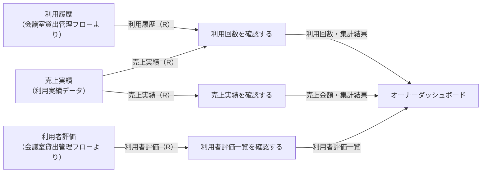
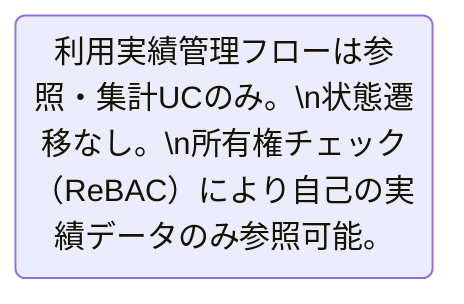

# 利用実績管理フロー

## 概要

会議室オーナーが自身の会議室の利用回数・売上実績・利用者評価一覧を確認するフロー。物件別・期間別の集計軸で実績を把握し、オーナーの運営改善やサービス品質向上に活用される。全UCが参照・集計専用であり、状態遷移を伴わない。

## 所属 UC 一覧

| UC名 | アクター | 主な操作 | 関連情報 |
|------|---------|---------|---------|
| [利用回数を確認する](利用回数を確認する/spec.md) | 会議室オーナー | 自身の会議室の利用回数実績を確認する | 売上実績, 利用履歴 |
| [売上実績を確認する](売上実績を確認する/spec.md) | 会議室オーナー | 自身の会議室の売上実績を確認する | 売上実績 |
| [利用者評価一覧を確認する](利用者評価一覧を確認する/spec.md) | 会議室オーナー | 利用者からの評価を一覧で確認し運営改善に活用する | 利用者評価 |

## UC 横断データフロー

BUC 内の UC 間で情報がどう流れるかを示す。各UCは独立して実行可能だが、同一オーナーの実績データを参照するという共通性を持つ。

### データフロー図

### 情報 CRUD マトリクス

| 情報名 | 利用回数を確認する | 売上実績を確認する | 利用者評価一覧を確認する |
|--------|:-------:|:-------:|:-------:|
| 売上実績 | R | R | |
| 利用履歴 | R | | |
| 利用者評価 | | | R |

## 状態遷移全体図

このBUCで管理する状態遷移はありません。全UCが参照・集計専用であり、情報の状態を変更しません。

### 状態遷移 UC マッピング

| 状態モデル | 遷移元 | 遷移先 | 担当 UC |
|-----------|--------|--------|--------|
| （なし） | - | - | 全UCとも参照専用 |

## BUC 内共有条件一覧

| 条件名 | 条件の説明 | 適用 UC |
|--------|----------|--------|
| 所有権チェック（ReBAC） | 認証中のオーナーIDに紐づく実績データのみ参照可能。他オーナーの実績へのアクセスは禁止 | 利用回数を確認する, 売上実績を確認する, 利用者評価一覧を確認する |

## BUC 内共有バリエーション一覧

| バリエーション名 | 値 | 適用 UC |
|----------------|---|--------|
| 利用履歴集計区分 | 会員別, 物件別, 期間別 | 利用回数を確認する, 売上実績を確認する |
