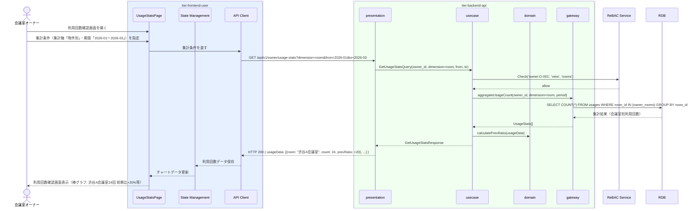

# 利用回数を確認する

## 概要

会議室オーナーが自身の会議室の利用回数実績を確認する。期間・会議室ごとの利用回数を把握し、運営改善に活用する。

## データフロー

```mermaid
graph LR
  subgraph FE["tier-frontend-user"]
    subgraph FE_V["view"]
      UsageStatsPage
    end
    subgraph FE_S["state"]
      UsageStatsState
    end
    subgraph FE_A["api-client"]
      GetUsageStatsRequest
    end
  end
  subgraph BE["tier-backend-api"]
    subgraph BE_P["presentation"]
      GetUsageStatsRequestDTO
    end
    subgraph BE_U["usecase"]
      GetUsageStatsQuery
    end
    subgraph BE_D["domain"]
      UsageStats
    end
    subgraph BE_G["gateway"]
      UsageRecord
    end
  end
  subgraph DB["tier-datastore-rdb"]
    usages[("usages")]
    sales_records[("sales_records")]
  end

  UsageStatsPage --> UsageStatsState --> GetUsageStatsRequest
  GetUsageStatsRequest -->|"GET /api/v1/owner/usage-stats?dimension=room&from=2026-01&to=2026-03"| GetUsageStatsRequestDTO
  GetUsageStatsRequestDTO --> GetUsageStatsQuery
  GetUsageStatsQuery --> UsageStats
  UsageStats --> UsageRecord
  UsageRecord -->|"SELECT COUNT(*) WHERE room_id IN (owner_rooms) GROUP BY room_id"| usages
  UsageRecord -->|"SELECT COUNT(*) WHERE owner_id=? GROUP BY period"| sales_records
  usages --> UsageRecord
  sales_records --> UsageRecord
  UsageRecord --> UsageStats
  UsageStats --> GetUsageStatsQuery --> GetUsageStatsRequestDTO
  GetUsageStatsRequestDTO -->|"HTTP 200"| GetUsageStatsRequest
  GetUsageStatsRequest --> UsageStatsState --> UsageStatsPage
```



| レイヤー | データモデル | 変換内容 |
|---------|------------|---------|
| FE view | UsageStatsPage | 集計軸セレクター・期間ピッカー・チャート表示 |
| FE state | UsageStatsState | 集計条件・利用回数データ状態管理 |
| FE api-client | GetUsageStatsRequest | クエリパラメータ組み立て → GET リクエスト |
| BE presentation | GetUsageStatsRequestDTO | バリデーション + Query 変換 |
| BE usecase | GetUsageStatsQuery | 認可チェック → 利用回数集計 → 前期比計算 |
| BE domain | UsageStats | 利用回数集計値オブジェクト |
| BE gateway | UsageRecord | Entity → DB カラム形式の DTO |
| DB | usages | SELECT COUNT(*) WHERE room_id IN (owner_rooms) GROUP BY 集計軸 |
| DB | sales_records | SELECT COUNT(*) WHERE owner_id=? GROUP BY period（期間別集計時） |

## 処理フロー



## バリエーション一覧

| バリエーション名 | 値 | 処理内容 | 適用 tier | 適用箇所 |
|----------------|---|---------|----------|---------|
| 利用履歴集計区分 | 物件別 | 会議室IDでGROUP BY して利用回数を集計 | tier-backend-api | GET /api/v1/owner/usage-stats?dimension=room |
| 利用履歴集計区分 | 期間別 | 利用日の年月でGROUP BY して月別推移を集計 | tier-backend-api | GET /api/v1/owner/usage-stats?dimension=period |

## 分岐条件一覧

| 条件名 | 判定ルール | 適用 tier | 適用箇所 | BDD Scenario |
|--------|----------|----------|---------|-------------|
| 所有権チェック | 認証中のオーナーIDに紐づく売上実績のみ参照可能 | tier-backend-api | GET /api/v1/owner/usage-stats | 正常系: 自身の会議室の利用回数を確認する |

## 計算ルール一覧

| 計算名 | 入力情報 | 計算式/ロジック | 出力情報 | 適用 tier |
|--------|---------|---------------|---------|----------|
| 利用回数集計 | usages.usage_id | COUNT(*) GROUP BY 集計軸 | 利用回数 | tier-backend-api |
| 前期比計算 | 当期・前期の利用回数 | (当期回数 - 前期回数) / 前期回数 × 100 | 前期比(%) | tier-backend-api |

## 状態遷移一覧

| 状態モデル | 遷移元 | 遷移先 | トリガー | 事前条件 | 事後処理 | 適用 tier |
|-----------|--------|--------|---------|---------|---------|----------|
| - | - | - | - | - | 参照系UCのため状態遷移なし | - |

## 関連 RDRA モデル

| モデル種別 | 要素名 | 関連 |
|-----------|--------|------|
| 業務 | 精算業務 | このUCが属する業務 |
| BUC | 利用実績管理フロー | このUCを含むBUC |
| アクター | 会議室オーナー | 操作するアクター（社外） |
| 情報 | 売上実績 | 参照する情報（実績ID、会議室ID、オーナーID、集計期間、利用回数） |
| 情報 | 利用履歴 | 参照する情報（履歴ID、利用日時、利用時間） |
| 状態 | - | 状態遷移なし（参照系UC） |
| 条件 | - | 直接適用される条件なし |
| 外部システム | - | 連携なし |

## E2E 完了条件（BDD）

### 正常系

```gherkin
Feature: 利用回数を確認する

  Scenario: 物件別の2026年第1四半期の利用回数を確認する
    Given 会議室オーナー「田中太郎」がオーナーポータルにログイン済みである
    When 利用回数確認画面で集計軸「物件別」・期間「2026-01〜2026-03」を指定する
    Then 会議室「渋谷A会議室：24回（前期比: +20%）」と「新宿B会議室：18回（前期比: -5%）」が棒グラフで表示される

  Scenario: 月別の利用回数推移を確認する
    Given 会議室オーナー「田中太郎」がオーナーポータルにログイン済みである
    When 利用回数確認画面で集計軸「期間別」・期間「2026-01〜2026-03」を指定する
    Then 月別利用回数「1月: 14回、2月: 16回、3月: 12回」が折れ線グラフで表示される
```

### 異常系

```gherkin
  Scenario: 他のオーナーの会議室データにアクセスしても自身のデータのみ返される
    Given 会議室オーナー「田中太郎」（owner_id: O-001）がログイン済みである
    When 利用回数確認APIに対してリクエストする
    Then owner_id=O-001の会議室の利用回数のみが返され、他のオーナーのデータは含まれない
```

## ティア別仕様

- [利用者・オーナー向けフロントエンド仕様](tier-frontend-user.md)
- [バックエンドAPI仕様](tier-backend-api.md)

### 統合 API Spec

- [OpenAPI Spec](../../_cross-cutting/api/openapi.yaml)（全 UC 統合、Contract First 開発用）
